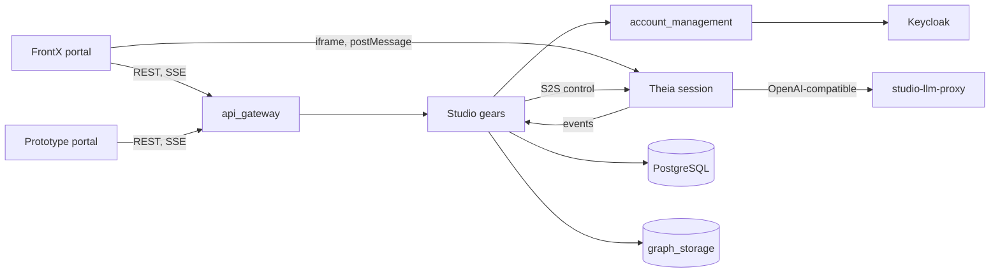
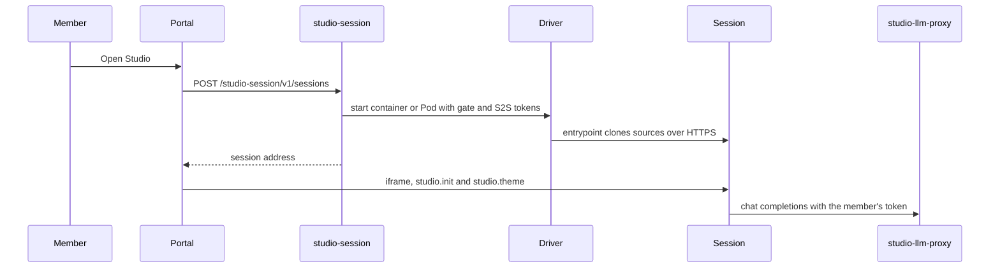
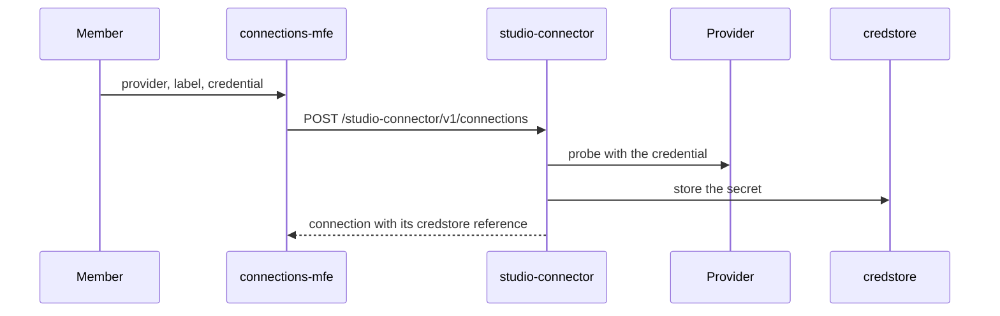
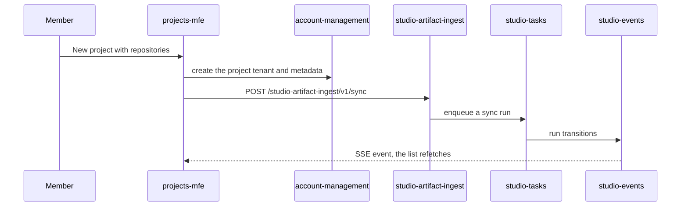
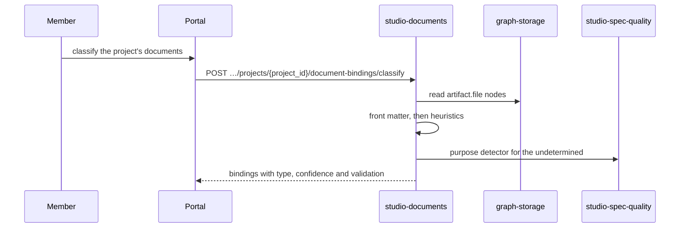
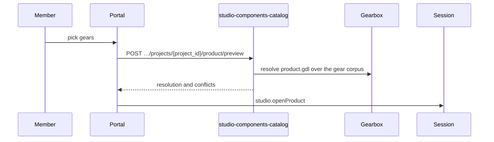

# Technical Design — Constructor Studio

## Table of Contents

<!-- toc -->

- [1. Architecture Overview](#1-architecture-overview)
  - [1.1 Architectural Vision](#11-architectural-vision)
  - [1.2 Architecture Drivers](#12-architecture-drivers)
  - [1.3 Architecture Layers](#13-architecture-layers)
- [2. Principles & Constraints](#2-principles--constraints)
  - [2.1 Design Principles](#21-design-principles)
  - [2.2 Constraints](#22-constraints)
- [3. Technical Architecture](#3-technical-architecture)
  - [3.1 Domain Model](#31-domain-model)
  - [3.2 Component Model](#32-component-model)
  - [3.3 API Contracts](#33-api-contracts)
  - [3.4 Internal Dependencies](#34-internal-dependencies)
  - [3.5 External Dependencies](#35-external-dependencies)
  - [3.6 Interactions & Sequences](#36-interactions--sequences)
  - [3.7 Database schemas & tables](#37-database-schemas--tables)
  - [3.8 Deployment Topology](#38-deployment-topology)
- [4. Additional context](#4-additional-context)
- [5. Traceability](#5-traceability)

<!-- /toc -->

## 1. Architecture Overview

### 1.1 Architectural Vision

Constructor Studio Web is one backend binary, two portals and one IDE session
image. The backend, `studio-backend`, is a modular monolith assembled from
CF/Gears: platform gears come from gears-rust by Git dependency, Studio's own
gears live in `studio-backend/src/`, and every gear is registered at link time
through `inventory` (`studio-backend/src/registered_gears.rs`). Gears call one
another in-process through the ClientHub; the outside world reaches them only
through the platform API gateway under `/cf/`, authenticated by an authn plugin,
authorized by the Studio PDP and scoped to the caller's tenant.

The FrontX portal (`studio-frontend/`) is a host shell plus microfrontends, one
per area of a navigation level (ADR-0006, ADR-0008). The prototype portal
(`studio-frontend-prototype/`) is the earlier single-page application, kept on
port 8081 with the screens the FrontX portal does not have yet. The IDE is an
Eclipse Theia 1.74.0 image (`theia/Dockerfile`) extended by Studio's Theia
packages and launched per workspace by the `studio-session` gear (ADR-0003).

Credentials stay in the backend: model providers are reached through
`studio-llm-proxy`, Git tokens reach a session as credstore references, and
external services are reached through one gear each. Durable state is in one
PostgreSQL instance holding every gear's database and the knowledge graph.

### 1.2 Architecture Drivers

Requirements that significantly influence architecture decisions.

#### Functional Drivers

| Requirement | Design Response |
|-------------|------------------|
| `cpt-studio-fr-ide-session` | `cpt-studio-component-session` runs sessions through `driver::SessionDriver` with a Docker and a Kubernetes implementation behind one REST contract. |
| `cpt-studio-fr-workspace-project-tenants` | Workspaces and projects are account-management tenants (`cpt-studio-component-account-management`); no Studio gear stores them. |
| `cpt-studio-fr-connections` | `cpt-studio-component-connector` owns the connection catalogue; each provider is a plugin gear implementing the driver contract. |
| `cpt-studio-fr-repository-documents` | `cpt-studio-component-documents` stores a binding to the graph node `cpt-studio-component-artifact-ingest` wrote, never a copy of the file. |
| `cpt-studio-fr-push-channel` | `cpt-studio-component-events` is the one push channel; producers publish through the ClientHub. |
| `cpt-studio-fr-background-runs` | `cpt-studio-component-tasks` writes a run and its queue entry in one transaction; `cpt-studio-component-scheduler` only enqueues. |
| `cpt-studio-fr-gearbox-product` | The backend preview (`cpt-studio-component-components-catalog`) and the IDE (`cpt-studio-component-theia-gearbox-studio`) run the Gearbox engine at the same pinned commit. |
| `cpt-studio-fr-api-contract` | `cpt-studio-component-api-contract` scans the `OperationBuilder` declarations and ratchets them against a committed baseline. |

#### NFR Allocation

This table maps non-functional requirements from PRD to specific design/architecture responses, demonstrating how quality attributes are realized.

| NFR ID | NFR Summary | Allocated To | Design Response | Verification Approach |
|--------|-------------|--------------|-----------------|----------------------|
| `cpt-studio-nfr-credential-isolation` | No secret in a session, a browser or a response | `cpt-studio-component-llm-proxy`, `cpt-studio-component-connector`, `cpt-studio-component-session` | The proxy attaches the provider key server-side; connections return the credstore reference; the session receives Git credentials through an inline credential helper | `test-theia-session-gate` job (`theia/docker/git-credentials.test.mjs`) and `test-backend` in `studio-delivery.yml` |
| `cpt-studio-nfr-tenant-isolation` | Every allow stays in the caller's tenant subtree | `cpt-studio-component-authz-plugin` | The tenant clamp is AND-ed with every role-path allow | Unit tests in `studio-backend/src/studio_authz_plugin.rs` |
| `cpt-studio-nfr-durable-work` | Runs, schedules, events and credentials survive a restart | `cpt-studio-component-tasks`, `cpt-studio-component-scheduler`, `cpt-studio-component-events`, `cpt-studio-component-credstore-pg` | Each keeps its state in its own PostgreSQL database | Store tests against the shared test PostgreSQL (`test_pg.rs`), e.g. `credstore_pg/store_tests.rs`, `studio_events/store_tests.rs` |
| `cpt-studio-nfr-session-bounds` | Four-hour lifetime, bounded ports | `cpt-studio-component-session` | `reap_task.rs` collects expired sessions; the Docker driver allocates from the configured port range | `test-backend` job |
| `cpt-studio-nfr-list-pagination` | One paging contract | `cpt-studio-component-api-contract` | `pagination.rs` parses `offset`/`limit` for every list | `api_contract` drift test |

#### Key ADRs

| ADR ID | Decision Summary |
|--------|-----------------|
| `cpt-studio-adr-identity-mapping` | Identity mapping for external systems is a Studio domain gear, not an IdP plugin (ADR-0001). |
| `cpt-studio-adr-projects-as-resource-groups` | Projects were Resource Group groups in v0.1 (ADR-0002, superseded). |
| `cpt-studio-adr-theia-sessions` | Per-workspace Theia IDE sessions in containers (ADR-0003). |
| `cpt-studio-adr-users-onboarding-roles` | User onboarding, provisioning through the IdP contract, and roles (ADR-0004). |
| `cpt-studio-adr-projects-domain-gear` | Projects as a domain gear (ADR-0005, retired by ADR-0010). |
| `cpt-studio-adr-frontend-rebuild-on-frontx` | The portal is rebuilt on FrontX (ADR-0006). |
| `cpt-studio-adr-shell-tokens-as-whole-colours` | Shell theme tokens hold whole colours (ADR-0007). |
| `cpt-studio-adr-simplified-navigation-shell` | Top bar, overlay drawer and context slot (ADR-0008). |
| `cpt-studio-adr-roles-over-tenant` | Roles are layered over the tenant model (ADR-0009). |
| `cpt-studiofrontend-adr-projects-as-am-tenants` | A project is an account-management tenant (ADR-0010). |
| `cpt-studio-adr-authentication-does-not-grant-organization-membership` | Authentication does not grant membership (ADR-0011). |
| `cpt-studio-adr-self-service-identity-resolution` | Attribution is self-service and only a proof of control binds (ADR-0012). |
| `cpt-studio-adr-types-registry-catalogs-meaning-graph-storage-contracts-storage` | The types-registry catalogs meaning, graph-storage contracts storage (ADR-0013). |
| `cpt-studio-adr-document-types-are-components` | A document type is a component, not a GTS type (ADR-0014). |
| `cpt-studio-adr-a-brokered-login-is-a-proof-of-control` | A brokered login is a proof of control (ADR-0015). |
| `cpt-studio-adr-membership-is-recorded-where-assignment-happens` | Membership is recorded where assignment happens (ADR-0016). |
| `cpt-studio-adr-an-identity-proves-it-is-you-and-decides-nothing-else` | An identity proves who you are and decides nothing else (ADR-0018). |
| `cpt-studio-adr-a-role-narrows-what-a-member-may-do` | A role narrows what a member may do (ADR-0019). |
| `cpt-studio-adr-one-contract-with-the-frontend` | One contract with the frontend, enforced by a ratchet (ADR-0020). |
| `cpt-studio-adr-an-mfe-entry-may-be-a-frame` | An MFE entry may be an iframe (ADR-0021). |
| `cpt-studio-adr-theia-backend-bridge` | Backend-to-backend bridge to the Theia node (ADR-0022). |
| `cpt-studio-adr-canonical-user-and-identity-mapper` | A canonical Studio user and its identity mapper (ADR-0023). |
| `cpt-studio-adr-domain-model-in-graph-storage` | The domain model lives in graph storage (ADR-0024). |
| `cpt-studio-adr-the-person-is-the-key-not-the-login` | The person is the key on the request path (ADR-0025). |
| `cpt-studio-adr-studio-events-push-channel` | One push channel to the portal (ADR-0026). |
| `cpt-studio-adr-a-desktop-session-keeps-the-secrets-on-the-server` | A desktop Studio is a session on the member's machine; Git and the LLM are proxied, secrets stay on the server (ADR-0027). |
| `cpt-studio-adr-a-shared-session-is-many-people-each-as-themselves` | One IDE session per workspace, one identity per connection; nothing personal in the container (ADR-0030, proposed). |

### 1.3 Architecture Layers

```text
 Browser ── FrontX portal (8080) / prototype portal (8081) ──┐
    │  iframe + postMessage                                  │ REST /cf/<gear>/v1, SSE
    ▼                                                        ▼
 Theia session (container or Pod) ◄── S2S control ── studio-backend (api_gateway → gears)
    │  git over HTTPS, LLM via studio-llm-proxy              │
    ▼                                                        ▼
 Source hosts, model providers                PostgreSQL (graph-postgres), Keycloak, S3
```

- [x] `p3` - **ID**: `cpt-studio-tech-stack`

| Layer | Responsibility | Technology |
|-------|---------------|------------|
| Presentation | Portal shell, microfrontends, prototype screens, IDE surfaces | React, FrontX with Module Federation, `@gears-frontx/ui-kit`, Tailwind; Eclipse Theia 1.74.0 extensions in TypeScript and JavaScript |
| Application | REST operations, background runs, push channel, session lifecycle | Rust (edition 2024), CF/Gears toolkit, axum, `OperationBuilder`, tokio |
| Domain | Documents, identity, connections, catalogue, domain model | Studio gears in `studio-backend/src/`, GTS types |
| Infrastructure | Relational and graph storage, identity, sessions | PostgreSQL 19 with pgvector, graph-storage, Keycloak, Docker (`bollard`) or the Kubernetes API |

## 2. Principles & Constraints

### 2.1 Design Principles

#### The project is the unit

- [x] `p2` - **ID**: `cpt-studio-principle-project-is-unit`

Sources, people, secrets, connections and the IDE session belong to a project and are reached from it; no surface requires picking a container first (`PRODUCT.md`, Product Principle 1).

**ADRs**: `cpt-studiofrontend-adr-projects-as-am-tenants`

#### Say only what the backend can prove

- [x] `p2` - **ID**: `cpt-studio-principle-prove-before-show`

Derived state is labelled derived, local overlays are labelled local, and a control that cannot enforce anything is not presented as one (`PRODUCT.md`, Product Principle 2).

**ADRs**: none; the rule is `PRODUCT.md`, Product Principle 2.

#### Credentials travel by reference

- [x] `p2` - **ID**: `cpt-studio-principle-credentials-by-reference`

Keys and tokens stay in credstore and reach a session or an upstream by reference; nothing surfaces, stores or echoes a secret in a client (`PRODUCT.md`, Product Principle 3).

**ADRs**: none; the rule is `PRODUCT.md`, Product Principle 3.

#### The seams stay visible

- [x] `p2` - **ID**: `cpt-studio-principle-visible-seams`

Where the UI noun and the platform noun disagree (project versus `workspace`), the wire keeps the platform noun and the documents say so (`PRODUCT.md`, Product Principle 4).

**ADRs**: `cpt-studiofrontend-adr-projects-as-am-tenants`

#### Reserved is not empty

- [x] `p2` - **ID**: `cpt-studio-principle-reserved-not-empty`

A surface the model anticipates but does not have shows as reserved, never as fake data (`PRODUCT.md`, Product Principle 5).

**ADRs**: none; the rule is `PRODUCT.md`, Product Principle 5.

#### One binary, assembled at link time

- [x] `p2` - **ID**: `cpt-studio-principle-link-time-assembly`

Every gear is linked into `studio-backend` and discovered through `inventory`; optional parts are Cargo features (`llm`, `graph`, `theia-bridge`, `theia-event-broker`), not runtime plugins loaded from disk.

**ADRs**: none; the assembly is fixed in `studio-backend/src/registered_gears.rs`.

#### One push channel, no producer's protocol

- [x] `p2` - **ID**: `cpt-studio-principle-one-push-channel`

Every producer states `kind` and `subject` on `studio-events`; no producer's vocabulary, the Theia bridge's included, becomes the contract.

**ADRs**: `cpt-studio-adr-studio-events-push-channel`

#### The tenant clamp is the outer bound

- [x] `p2` - **ID**: `cpt-studio-principle-tenant-clamp-first`

Authorization always enforces tenant isolation; roles can only narrow it, and administrative authority is answered in the gear from the access config.

**ADRs**: `cpt-studio-adr-roles-over-tenant`, `cpt-studio-adr-a-role-narrows-what-a-member-may-do`

### 2.2 Constraints

#### Cloning is HTTPS-only

- [x] `p2` - **ID**: `cpt-studio-constraint-https-only-cloning`

The session container has no SSH key or agent, so sources are cloned over HTTPS even when a workspace manifest lists `git@…` remotes.

**ADRs**: none; stated in `PRODUCT.md`, Capabilities and Constraints.

#### Graph storage needs PostgreSQL 19 with pgvector

- [x] `p2` - **ID**: `cpt-studio-constraint-graph-postgres`

The `graph` feature links a gear that runs only on PostgreSQL 19 with pgvector and migrates at boot; a deployment that links it provisions that server first (`studio-backend/Cargo.toml`).

**ADRs**: none; stated in `studio-backend/Cargo.toml`.

#### No LLM chain in the Kubernetes release

- [x] `p2` - **ID**: `cpt-studio-constraint-llm-off-in-release`

The release image is built `--no-default-features --features graph,theia-bridge`: with `api_egress` linked, a fresh database deadlocks on the root tenant, so `llm` stays out until that is resolved (`studio-backend/Cargo.toml`).

**ADRs**: none; stated in `studio-backend/Cargo.toml` and `studio-backend/src/registered_gears.rs`.

#### One backend replica while sessions are on

- [x] `p2` - **ID**: `cpt-studio-constraint-single-replica-sessions`

The Helm chart refuses to render more than one backend replica with `backend.sessions.enabled`, because two replicas have not been run against a real cluster (`deploy/helm/studio-web/values.yaml`).

**ADRs**: none; stated in `deploy/helm/studio-web/values.yaml`.

#### Extend Theia, do not patch it

- [x] `p2` - **ID**: `cpt-studio-constraint-extension-not-patch`

Every IDE capability is hung on a published Theia contribution point so Theia can be upgraded (`theia/studio/README.md`).

**ADRs**: `cpt-studio-adr-theia-backend-bridge`

#### The Gearbox port awaits a licence

- [x] `p2` - **ID**: `cpt-studio-constraint-gearbox-licence`

`theia/gearbox-studio` is ported from a repository with no licence yet and cannot ship beyond evaluation until its owner grants permission (`theia/gearbox-studio/README.md`).

**ADRs**: none; stated in `theia/gearbox-studio/README.md`.

## 3. Technical Architecture

### 3.1 Domain Model

**Technology**: GTS types registered in the types-registry and graph-storage ontology; Rust structs with SeaORM entities per gear.

**Location**: [`domain-model/`](../../domain-model/), [`studio-backend/src/domain_model/ontology.core.json`](../../studio-backend/src/domain_model/ontology.core.json), [`studio-backend/docs/gts-types.json`](../../studio-backend/docs/gts-types.json)

**Core Entities**:

- [x] `p2` - **ID**: `cpt-studio-entity-core`

| Entity | Description | Schema |
|--------|-------------|--------|
| Tenant | Organization, workspace (`tenant_type: workspace`) or project, owned by account-management | platform `account_management` |
| Access config | The organization's access model (`tenant` or `roles`) and grants, tenant metadata `cf.studio.access.config.v1` | [`access_config.rs`](../../studio-backend/src/access_config.rs) |
| User, Login, Membership, Alias, Invitation | The canonical person and what binds to it | [`user_profile/migrations.rs`](../../studio-backend/src/user_profile/migrations.rs) |
| Connection | A provider, label, base URL, scope and owner tenant with a credstore reference | [`connectors/`](../../studio-backend/src/connectors/) |
| Document type, Stage, Capability | The document catalogue | [`documents/migrations.rs`](../../studio-backend/src/documents/migrations.rs) |
| Document, Analysis, Binding | Authored documents, their quality verdicts, and repository files bound to types | [`documents/migrations.rs`](../../studio-backend/src/documents/migrations.rs) |
| Artifact node | Issue, pull request, commit, comment, file or author as `gts.cf.studio.artifact.*` | [`studio-backend/gts/artifact/`](../../studio-backend/gts/artifact/) |
| Gear, Crate version | Catalogue nodes joined by `has_version` | [`components_catalog/gts.rs`](../../studio-backend/src/components_catalog/gts.rs) |
| Model, Object type | The domain model in the graph | [`domain_model/`](../../studio-backend/src/domain_model/) |
| Kit installation | A project's desired kit and its materializations | [`kit_registry/`](../../studio-backend/src/kit_registry/) |
| Run, Schedule, Event | Background work, its timing and its announcements | [`tasks/`](../../studio-backend/src/tasks/), [`scheduler/`](../../studio-backend/src/scheduler/), [`studio_events/`](../../studio-backend/src/studio_events/) |
| Session | A running IDE container or Pod, tracked by labels | [`studio_session/`](../../studio-backend/src/studio_session/) |

**Relationships**:
- Organization → Workspace → Project: tenant parent links in account-management.
- User → Login, Membership, Alias: one person, many sign-in methods, one membership per organization, many attributed identifiers.
- Binding → Artifact node: a binding names the graph node that holds the file's bytes.
- Document → Workspace tenant: `project_id` `NULL` means inherited by every project of the workspace.
- Run ← Schedule: a schedule enqueues runs; the run is the record of what happened.
- Session → Workspace: at most one live session per workspace.

### 3.2 Component Model



The components below are every gear the backend links, the shared backend
modules, the portal packages, the IDE packages and the infrastructure images.

#### studio-session

- [x] `p2` - **ID**: `cpt-studio-component-session`

##### Why this component exists

The IDE is a running container with a checkout, credentials and an agent runtime, and something decides when one starts, who may reach it and when it stops.

##### Responsibility scope

`studio-backend/src/studio_session/`: launch, list, reach and stop sessions (`/studio-session/v1/sessions`), proxy the IDE for the Kubernetes driver (`/studio-session/v1/ide/{id}/…`), reap after four hours, adopt sessions by label after a restart, mint the gate token and the S2S token. Drivers `docker.rs` and `k8s.rs`.

##### Responsibility boundaries

Does not talk to the Theia node's control API (`cpt-studio-component-theia-bridge` does) and does not store sessions in a table.

##### Related components (by ID)

- `cpt-studio-component-session-image` — launches it
- `cpt-studio-component-connector` — depends on, for source credentials
- `cpt-studio-component-theia-bridge` — serves endpoint discovery to

#### studio-theia

- [x] `p2` - **ID**: `cpt-studio-component-theia-bridge`

##### Why this component exists

The portal needs a session's repositories, operations and status from outside the IDE without a browser holding a token that reaches it (ADR-0022).

##### Responsibility scope

`studio-backend/src/studio_theia/`: `TheiaControlClientV1` on the ClientHub, portal REST under `/studio-theia/v1/workspaces/{workspace_id}/…`, the event ingress at `/studio-theia/v1/events`, and session discovery through `StudioSessionResolver`. Built with the `theia-bridge` feature; `theia-event-broker` swaps its logging sink for the event-broker sink.

##### Responsibility boundaries

Does not manage session lifecycle and does not define event vocabulary for the portal.

##### Related components (by ID)

- `cpt-studio-component-session` — depends on, for endpoint and token
- `cpt-studio-component-theia-studio` — calls its control API
- `cpt-studio-component-kits` — is called by, to install kits

#### studio-llm-proxy

- [x] `p2` - **ID**: `cpt-studio-component-llm-proxy`

##### Why this component exists

Theia AI speaks the OpenAI protocol to any base URL; pointing it at a provider directly would put the key in the container.

##### Responsibility scope

`studio-backend/src/llm_proxy/`: `/studio-llm/v1/chat/completions`, `/studio-llm/v1/models`, `/studio-llm/v1/client-config`; forwards verbatim to the configured OpenAI-compatible upstream with the server-held key, streaming through. Built with the `llm` feature.

##### Responsibility boundaries

Picks no default provider and stores no conversations.

##### Related components (by ID)

- `cpt-studio-component-theia-studio` — is called by its portal bridge configuration
- `cpt-studio-component-platform-feature-gears` — reads the key from credstore

#### studio-connector

- [x] `p2` - **ID**: `cpt-studio-component-connector`

##### Why this component exists

One connection per provider replaces a clone URL and token per repository per workspace.

##### Responsibility scope

`studio-backend/src/connectors/`: `/studio-connector/v1/{providers,connections,probe,graph-sync}`, repositories, targets, files and messages through a connection, and the eleven plugin gears in `plugin.rs`: `github-connector-plugin`, `gitlab-connector-plugin`, `bitbucket-connector-plugin`, `anthropic-connector-plugin`, `openai-connector-plugin`, `slack-connector-plugin`, `slack-webhook-connector-plugin`, `zulip-connector-plugin`, `zulip-webhook-connector-plugin`, `discord-connector-plugin`, `discord-webhook-connector-plugin`. `url_guard.rs` checks base URLs.

##### Responsibility boundaries

Returns credstore references, never tokens; does not queue notifications (`cpt-studio-component-notify` does).

##### Related components (by ID)

- `cpt-studio-component-platform-feature-gears` — stores credentials in credstore
- `cpt-studio-component-artifact-ingest` — is read by, for repository content
- `cpt-studio-component-tasks` — runs graph sync as a run

#### studio-credstore-pg

- [x] `p2` - **ID**: `cpt-studio-component-credstore-pg`

##### Why this component exists

The only value store gears-rust ships is in memory, so every restart lost the tokens people had entered (issue #66).

##### Responsibility scope

`studio-backend/src/credstore_pg/`: a credstore value-store plugin at priority 50 that encrypts values into `studio_credstore_values` with `STUDIO_CREDSTORE_KEY`.

##### Responsibility boundaries

Stores values only; the secret metadata stays in credstore's own database.

##### Related components (by ID)

- `cpt-studio-component-platform-feature-gears` — is the value backend of credstore
- `cpt-studio-component-postgres` — owns data in

#### studio-secrets-bootstrap

- [x] `p2` - **ID**: `cpt-studio-component-secrets-bootstrap`

##### Why this component exists

A restart left config-seeded references such as `openai-key` fence-poisoned until somebody rewrote them by hand.

##### Responsibility scope

`studio-backend/src/secrets_bootstrap/`: once at start, checks each configured `(reference, environment variable)` pair and rewrites a broken or missing secret.

##### Responsibility boundaries

Never fails boot; a problem is a warning.

##### Related components (by ID)

- `cpt-studio-component-platform-feature-gears` — writes to credstore

#### studio-documents

- [x] `p2` - **ID**: `cpt-studio-component-documents`

##### Why this component exists

An organization's opinion of what a document contains, and whether it is complete, becomes data.

##### Responsibility scope

`studio-backend/src/documents/`: document types, stages and capabilities per organization and workspace; documents with validation and questionnaire composition (`intake.rs`); repository document bindings with classification (`classify.rs`) and validation (`validate.rs`) against the built-in templates; spec rows and the spec pipeline; stage status. Routes under `/studio-documents/v1`.

##### Responsibility boundaries

Does not copy repository file content; the bytes stay on the graph node. Deeper text analysis is `cpt-studio-component-spec-quality`.

##### Related components (by ID)

- `cpt-studio-component-artifact-ingest` — shares model with (graph file nodes)
- `cpt-studio-component-spec-quality` — calls, for the `purpose` detector
- `cpt-studio-component-account-management` — authorizes tenant access through

#### studio-spec-quality

- [x] `p2` - **ID**: `cpt-studio-component-spec-quality`

##### Why this component exists

The external detectors authenticate with a shared secret that must not reach callers.

##### Responsibility scope

`studio-backend/src/spec_quality/`: the passthrough at `/spec-quality/v1` (analyze, analyze-batch, tasks, health, status, capabilities) and interpreted verdicts at `/studio-spec-quality/v1/verdicts`; the wait for a result is a `studio-tasks` run.

##### Responsibility boundaries

Judges nothing itself; the service does.

##### Related components (by ID)

- `cpt-studio-component-tasks` — runs its waits
- `cpt-studio-component-documents` — records analyses from

#### studio-artifact-ingest

- [x] `p2` - **ID**: `cpt-studio-component-artifact-ingest`

##### Why this component exists

A repository's meaning is spread over the provider API and the checkout; one typed graph answers questions about both.

##### Responsibility scope

`studio-backend/src/artifact_ingest/`: sync issues, pull requests and files into `gts.cf.studio.artifact.*` nodes with deterministic ids; serve `/studio-artifact-ingest/v1/{nodes,edges,files,repo-files,activity,source-activity,quality,search,sync,tasks}`. Files come from the session checkout, an opt-in shallow clone, or the connector tree API, in that order.

##### Responsibility boundaries

Does not classify documents; `cpt-studio-component-documents` binds its file nodes.

##### Related components (by ID)

- `cpt-studio-component-connector` — depends on
- `cpt-studio-component-graph-storage` — owns data in
- `cpt-studio-component-tasks` — runs sync as a run

#### studio-domain-model

- [x] `p2` - **ID**: `cpt-studio-component-domain-model`

##### Why this component exists

The Studio domain model is authored data that the frontend is regenerated from (ADR-0024).

##### Responsibility scope

`studio-backend/src/domain_model/`: `/studio-domain-model/v1/{model,types,objects,relations}`; seeds from `ontology.core.json` (11 buckets, 140 entities), stores the model in graph storage, records edits as RFC-6902 patches for revert.

##### Responsibility boundaries

The source of truth outside this repository is `studio-internal/domain-model-ui`; this gear embeds it as its seed.

##### Related components (by ID)

- `cpt-studio-component-graph-storage` — owns data in
- `cpt-studio-component-platform-system` — registers types in the types-registry

#### studio-components-catalog

- [x] `p2` - **ID**: `cpt-studio-component-components-catalog`

##### Why this component exists

"What gears are there, at what versions" lived on crates.io; the catalogue makes it data and lets Studio scaffold new gears and compose products.

##### Responsibility scope

`studio-backend/src/components_catalog/`: crates.io sync (`cratesio.rs`, `sync_task.rs`), components, versions, types, field schemas, profiles and activity; gear repository, repository creation and scaffolding (`scaffold.rs`, `skeleton.rs`); product compose, store and preview with the Gearbox engine (`compose.rs`, `gearbox.rs`, off unless `STUDIO_GEARBOX_WORKDIR` is set). Routes under `/studio-components-catalog/v1`.

##### Responsibility boundaries

Does not run the IDE's Gearbox views; `cpt-studio-component-theia-gearbox-studio` does, on the same engine commit.

##### Related components (by ID)

- `cpt-studio-component-graph-storage` — owns data in
- `cpt-studio-component-connector` — creates repositories through
- `cpt-studio-component-insight` — shares the component page with

#### studio-kits

- [x] `p2` - **ID**: `cpt-studio-component-kits`

##### Why this component exists

Git answers what a kit contains; Studio needs to know which kits a project wants.

##### Responsibility scope

`studio-backend/src/kit_registry/`: `/studio-kits/v1/catalog` and `/studio-kits/v1/projects/{project_id}/{installations,repositories}`, with materialize and reconcile asking the session to run `cfs kit install`.

##### Responsibility boundaries

Stores no kit bytes; `cfs` is the only component that writes kit files into a checkout.

##### Related components (by ID)

- `cpt-studio-component-theia-bridge` — calls, to install into a session
- `cpt-studio-component-theia-studio` — its `kit-installer.ts` runs the install

#### studio-user

- [x] `p2` - **ID**: `cpt-studio-component-user`

##### Why this component exists

Keycloak authenticates but does not say that two logins are the same person.

##### Responsibility scope

`studio-backend/src/user_profile/`: the `identity_*` tables, `PersonResolver`, `/studio-user/v1/{me,resolve,merge,users,organizations}` including logins, aliases, memberships, invitations and UI preferences.

##### Responsibility boundaries

Holds no roles on the person; a role belongs to a membership.

##### Related components (by ID)

- `cpt-studio-component-account-management` — records assignment alongside
- `cpt-studio-component-identity-directory` — is the canonical record behind

#### studio-identity-directory

- [x] `p2` - **ID**: `cpt-studio-component-identity-directory`

##### Why this component exists

A person who signed in but belongs to no organization is in no tenant, so no tenant-scoped list shows them (ADR-0011).

##### Responsibility scope

`studio-backend/src/identity_directory/`: `/studio-identity/v1/users`, assignment, and `/studio-identity/v1/memberships/backfill`, through the Keycloak Admin API held server-side.

##### Responsibility boundaries

A read-only projection, not a second user store.

##### Related components (by ID)

- `cpt-studio-component-keycloak` — reads from
- `cpt-studio-component-user` — writes memberships through

#### studio-organizations

- [x] `p2` - **ID**: `cpt-studio-component-organizations`

##### Why this component exists

An organization needs a tenant and an owner written together (ADR-0018).

##### Responsibility scope

`studio-backend/src/organizations/`: `/studio-organizations/v1/{organizations,rollups,capabilities,access-catalogue}`; creates the tenant, the owner membership and the access grant in a resumable order.

##### Responsibility boundaries

Owns no storage.

##### Related components (by ID)

- `cpt-studio-component-account-management` — writes the tenant in
- `cpt-studio-component-user` — writes the membership in
- `cpt-studio-component-access-config` — writes the grant through

#### studio-authz-plugin

- [x] `p2` - **ID**: `cpt-studio-component-authz-plugin`

##### Why this component exists

The Studio PDP layers roles over the tenant model (ADR-0009).

##### Responsibility scope

`studio-backend/src/studio_authz_plugin.rs`: an AuthZ resolver plugin that returns the tenant clamp for every request and, for a role-mapped resource type, AND-s role grants with it. `privilege_for` maps no resource type today.

##### Responsibility boundaries

Does not answer administrative authority; gears ask `access_config` for that (ADR-0019 §3).

##### Related components (by ID)

- `cpt-studio-component-access-config` — reads through
- `cpt-studio-component-platform-system` — is a plugin of `authz_resolver`

#### studio-presence

- [x] `p2` - **ID**: `cpt-studio-component-presence`

##### Why this component exists

Administrators asked who is working now and how to reach them.

##### Responsibility scope

`studio-backend/src/presence/`: `/studio-presence/v1/{me,online,messages}`; heartbeats in a per-process registry; a message is published as an event to the recipient.

##### Responsibility boundaries

Stores nothing; state resets on restart.

##### Related components (by ID)

- `cpt-studio-component-events` — publishes to

#### studio-events

- [x] `p2` - **ID**: `cpt-studio-component-events`

##### Why this component exists

Consumers polled for state changes; one push channel replaces the polling (ADR-0026).

##### Responsibility scope

`studio-backend/src/studio_events/`: `GET /studio-events/v1/stream` (SSE) and `GET /studio-events/v1/events?after_seq=` (replay); `StudioEventPublisher` on the ClientHub; sequence and replay window in `studio_events_log` and `studio_events_cursor`.

##### Responsibility boundaries

Knows nothing about tasks, repositories or sessions; producers bring their own payload.

##### Related components (by ID)

- `cpt-studio-component-tasks` — subscribes to its announcements
- `cpt-studio-component-presence` — carries its messages
- `cpt-studio-component-portal-shell` — is consumed by

#### studio-tasks

- [x] `p2` - **ID**: `cpt-studio-component-tasks`

##### Why this component exists

Three gears had each kept an in-memory task map that lost everything on restart.

##### Responsibility scope

`studio-backend/src/tasks/`: `studio_tasks_runs`, dispatch, sweep and the registry of task types; `/studio-tasks/v1/{runs,task-types}` with cancel and retry.

##### Responsibility boundaries

Knows nothing about time; `cpt-studio-component-scheduler` does.

##### Related components (by ID)

- `cpt-studio-component-events` — publishes to
- `cpt-studio-component-notify` — runs deliveries for

#### studio-scheduler

- [x] `p2` - **ID**: `cpt-studio-component-scheduler`

##### Why this component exists

Nothing in gears-rust schedules anything.

##### Responsibility scope

`studio-backend/src/scheduler/`: `studio_scheduler_schedules`, the ticker and cron arithmetic, `/studio-scheduler/v1/schedules` with run-now.

##### Responsibility boundaries

Executes no work; it only enqueues runs.

##### Related components (by ID)

- `cpt-studio-component-tasks` — enqueues into

#### studio-notify

- [x] `p2` - **ID**: `cpt-studio-component-notify`

##### Why this component exists

A notification sent from a request handler is lost when the platform is down.

##### Responsibility scope

`studio-backend/src/notify/`: `POST /studio-notify/v1/messages` validates and queues a `notify.deliver` run; delivery retries and dead-letters.

##### Responsibility boundaries

Owns no database; the run is the record.

##### Related components (by ID)

- `cpt-studio-component-tasks` — depends on
- `cpt-studio-component-connector` — delivers through

#### studio-insight

- [x] `p2` - **ID**: `cpt-studio-component-insight`

##### Why this component exists

Constructor Insight is a separate product; one gear is the assembly's only place of contact.

##### Responsibility scope

`studio-backend/src/insight/`: `/studio-insight/v1/{health,query,pull,push,components}` over Insight's `POST /api/sql/query`.

##### Responsibility boundaries

Read-only; holds Insight's instance token server-side.

##### Related components (by ID)

- `cpt-studio-component-components-catalog` — enriches its component page

#### Access config module

- [x] `p2` - **ID**: `cpt-studio-component-access-config`

##### Why this component exists

Three places carried their own copy of the access-config shape.

##### Responsibility scope

`studio-backend/src/access_config.rs`: the shape, read and write of `cf.studio.access.config.v1~`, including `is_org_owner`.

##### Responsibility boundaries

Not a gear; a module shared by gears.

##### Related components (by ID)

- `cpt-studio-component-authz-plugin` — is read by
- `cpt-studio-component-organizations` — is written by

#### API contract module

- [x] `p2` - **ID**: `cpt-studio-component-api-contract`

##### Why this component exists

The REST contract is enforced mechanically (ADR-0020).

##### Responsibility scope

`studio-backend/src/api_contract.rs` scans `OperationBuilder` declarations, backs the `api-contract` command and the drift test against `studio-backend/docs/api-contract.json` and `api-contract-baseline.txt`; `studio-backend/src/pagination.rs` is the one list-paging contract.

##### Responsibility boundaries

Checks declarations, not behaviour; the OpenAPI document is served at `/cf/docs` by a booted assembly.

##### Related components (by ID)

- `cpt-studio-component-platform-system` — shares routes with `api_gateway`

#### GTS inventory and audit

- [x] `p2` - **ID**: `cpt-studio-component-gts-inventory`

##### Why this component exists

A malformed GTS type surfaced only as a crash at boot (ADR-0013 §6).

##### Responsibility scope

`studio-backend/src/gts_inventory.rs` builds every registered GTS document offline (`gts-types`, drift-checked against `studio-backend/docs/gts-types.json`); `studio-backend/src/gts_audit.rs` diffs a live deployment's registries against it (`gts-audit`).

##### Responsibility boundaries

Registers nothing itself.

##### Related components (by ID)

- `cpt-studio-component-platform-system` — reads the types-registry
- `cpt-studio-component-graph-storage` — reads the ontology

#### Database bootstrap

- [x] `p2` - **ID**: `cpt-studio-component-database-bootstrap`

##### Why this component exists

Database names should not be copied into Helm or initdb scripts.

##### Responsibility scope

`studio-backend/src/database_bootstrap.rs`: the `bootstrap` (plan, then `--apply`) and `migrate` commands; the Compose `backend-bootstrap` service seeds the root tenant with a `--no-default-features` build.

##### Responsibility boundaries

Creates only missing databases.

##### Related components (by ID)

- `cpt-studio-component-postgres` — provisions databases in

#### Platform system gears

- [x] `p2` - **ID**: `cpt-studio-component-platform-system`

##### Why this component exists

The gear runtime and its shared services come from gears-rust.

##### Responsibility scope

`api_gateway` (the `/cf/` prefix and `/cf/docs`), `authn_resolver`, `authz_resolver`, `gear_orchestrator`, `grpc_hub`, `nodes_registry`, `resource_group`, `tenant_resolver`, `types_registry`.

##### Responsibility boundaries

Studio does not modify them; it configures them in `studio-backend/config/*.yaml`.

##### Related components (by ID)

- `cpt-studio-component-authz-plugin` — plugs into `authz_resolver`
- `cpt-studio-component-platform-auth-plugins` — plugs into `authn_resolver`

#### Platform authentication and IdP plugins

- [x] `p2` - **ID**: `cpt-studio-component-platform-auth-plugins`

##### Why this component exists

People sign in with OIDC; scripts use static tokens; account-management provisions users through an IdP plugin.

##### Responsibility scope

`oidc_authn_plugin` (real login, `config/oidc.yaml` profile), `static_authn_plugin` and `static_authz_plugin` (static dev tokens), `keycloak_idp_plugin` (vendor `keycloak`, real provisioning), `static_idp_plugin` (vendor `cf`, Keycloak-less profiles).

##### Responsibility boundaries

Authenticate and provision; decide nothing about access (ADR-0018).

##### Related components (by ID)

- `cpt-studio-component-keycloak` — depends on
- `cpt-studio-component-account-management` — are plugins of

#### account-management

- [x] `p2` - **ID**: `cpt-studio-component-account-management`

##### Why this component exists

The tenant tree and user lifecycle are platform services.

##### Responsibility scope

Platform gear `account_management` with its co-located tenant-resolver plugin: organizations, workspaces and projects as tenants, tenant metadata, users per tenant; `/cf/account-management/v1`.

##### Responsibility boundaries

Owns no identity data of its own; the person is `cpt-studio-component-user`.

##### Related components (by ID)

- `cpt-studio-component-platform-auth-plugins` — provisions through
- `cpt-studio-component-organizations` — is written by

#### Platform feature gears

- [x] `p2` - **ID**: `cpt-studio-component-platform-feature-gears`

##### Why this component exists

Credentials, files and per-user settings are platform services.

##### Responsibility scope

`credstore` with `static_credstore_plugin` (displaced by `cpt-studio-component-credstore-pg` at a lower priority value), `file_storage` (with the S3 data-plane sidecar on Kubernetes), `simple_user_settings`.

##### Responsibility boundaries

Studio configures them; it does not extend their REST.

##### Related components (by ID)

- `cpt-studio-component-credstore-pg` — is the value store of credstore

#### LLM chain

- [x] `p2` - **ID**: `cpt-studio-component-llm-chain`

##### Why this component exists

Workspace AI chat and LLM egress are platform gears.

##### Responsibility scope

`mini_chat` (with its static model-policy and audit plugins) and `api_egress` (oagw), linked with the `llm` feature.

##### Responsibility boundaries

Not in the Kubernetes release (`cpt-studio-constraint-llm-off-in-release`).

##### Related components (by ID)

- `cpt-studio-component-prototype-portal` — is used by the hidden `chats` view

#### graph-storage

- [x] `p2` - **ID**: `cpt-studio-component-graph-storage`

##### Why this component exists

Typed multi-tenant nodes and edges with bounded traversal and hybrid retrieval.

##### Responsibility scope

Platform gear `graph_storage` (`cf-gears-graph-storage`), linked with the `graph` feature, with the `onnx` and `remote` embedding providers; one is selected by `graph-storage.config.embedding_provider`.

##### Responsibility boundaries

Holds nodes, not documents' authored content; switching providers over a populated graph blocks the vector arm until re-embedding.

##### Related components (by ID)

- `cpt-studio-component-postgres` — owns data in `graph_storage`

#### Portal shell

- [x] `p2` - **ID**: `cpt-studio-component-portal-shell`

##### Why this component exists

The FrontX host that mounts microfrontends and owns navigation (ADR-0006, ADR-0008).

##### Responsibility scope

`studio-frontend/src-app/app/`: OIDC sign-in, the levels and rail, the overlay domain, the organization and workspace in scope, the `studio-events` subscription, the Module Federation and iframe entry handlers (`mfe/MfeHandlerIframe.ts`, ADR-0021); `studio-frontend/packages/` holds the FrontX solution packages. `_iframe-fixture` is the frame-entry fixture package (Frame fixture, `/fixture/frame`, organization level), `_blank-mfe` the template, `shared` the code MFEs share.

##### Responsibility boundaries

Never names an MFE package; the shell scans `src-app/mfe_packages/`.

##### Related components (by ID)

- `cpt-studio-component-organization-mfe` — mounts
- `cpt-studio-component-projects-mfe` — mounts
- `cpt-studio-component-connections-mfe` — mounts
- `cpt-studio-component-reserved-mfes` — mounts
- `cpt-studio-component-events` — subscribes to

#### organization-mfe

- [x] `p2` - **ID**: `cpt-studio-component-organization-mfe`

##### Why this component exists

The organization level's screens.

##### Responsibility scope

Screens Overview (`/organization/overview`), Workspaces (`/organization/workspaces`) and Organization settings (`/organization/settings`, reserved).

##### Responsibility boundaries

Reads workspaces from account-management; no aggregate endpoint exists for the overview's other tiles.

##### Related components (by ID)

- `cpt-studio-component-account-management` — reads from

#### projects-mfe

- [x] `p2` - **ID**: `cpt-studio-component-projects-mfe`

##### Why this component exists

The workspace and project level's screens.

##### Responsibility scope

Screens Projects (`/projects`, workspace level) and the project level's sections: Artifacts (`/projects/artifacts`), and Overview (`/projects/overview`), Findings (`/projects/findings`), Activity (`/projects/activity`), Timeline (`/projects/timeline`), Team (`/projects/team`) and Project settings (`/projects/settings`), which render `PlaceholderSection` until a source exists. Overlays New project (`/projects/new`) and New workspace (`/workspaces/new`).

##### Responsibility boundaries

Writes tenants through account-management; reads artifacts and documents from their gears.

##### Related components (by ID)

- `cpt-studio-component-account-management` — writes to
- `cpt-studio-component-artifact-ingest` — reads from
- `cpt-studio-component-documents` — reads from
- `cpt-studio-component-connector` — reads repositories from

#### connections-mfe

- [x] `p2` - **ID**: `cpt-studio-component-connections-mfe`

##### Why this component exists

The screen where a member adds and checks connections.

##### Responsibility scope

Screen Connections (`/connections`) and overlay Connect source (`/connections/new`).

##### Responsibility boundaries

Never receives a token back.

##### Related components (by ID)

- `cpt-studio-component-connector` — calls

#### Reserved microfrontends

- [x] `p2` - **ID**: `cpt-studio-component-reserved-mfes`

##### Why this component exists

Areas the navigation reserves before their backing exists (`cpt-studio-principle-reserved-not-empty`).

##### Responsibility scope

`people-mfe` (People, `/people`), `kits-mfe` (Kits, `/kits`) and `search-mfe` (the Search Constructor Studio overlay, `/search`); each shows "This area is under construction."

##### Responsibility boundaries

Make no backend calls.

##### Related components (by ID)

- `cpt-studio-component-portal-shell` — is mounted by

#### Prototype portal

- [x] `p2` - **ID**: `cpt-studio-component-prototype-portal`

##### Why this component exists

The pre-FrontX portal, kept as a playground with the screens FrontX does not have yet.

##### Responsibility scope

`studio-frontend-prototype/src/`, served on port 8081. Screens, by `App.tsx` key:

| Level | Key | Label | Backed by |
|---|---|---|---|
| Top | `home` | Home | account-management, `/studio-session/v1` |
| Organization | `projects` | Workspaces | account-management |
| Organization | `people` | People | `/studio-user/v1`, account-management |
| Organization | `connectors` | Connections | `/studio-connector/v1` |
| Hidden | `chats` | Chats | `/mini-chat/v1` |
| Hidden | `files` | Files | `/file-storage/v1` |
| Platform | `gears` | Components | `/studio-components-catalog/v1`, `/studio-insight/v1` |
| Platform | `objects` | Objects | `/studio-domain-model/v1` |
| Platform | `tasks` | Background work | `/studio-tasks/v1`, `/studio-scheduler/v1` |
| Platform | `system` | System | `/types-registry/v1`, `/oagw/v1`, `/studio-notify/v1` |
| Top | `profile` | Profile | `/studio-user/v1`, `/simple-user-settings/v1` |
| Admin | `tenants` | Organizations | `/studio-organizations/v1` |
| Admin | `access` | Access | `/studio-organizations/v1/access-catalogue`, access config |
| Admin | `secrets` | Secrets | `/credstore/v1` |
| Platform admin | `identities` | All identities | `/studio-identity/v1` |
| Platform admin | `workspaces` | Project tenants | account-management |
| Workspace | `types` | Document types | `/studio-documents/v1` |
| Workspace | `process` | Process | `/studio-documents/v1` |
| Project | `overview` | Overview | `/studio-documents/v1`, `/studio-organizations/v1/rollups` |
| Project | `specs` | Specs | `/studio-documents/v1`, `/studio-spec-quality/v1` |
| Project | `components` | Components | `/studio-components-catalog/v1`, `/studio-kits/v1` |
| Project | `artifacts` | Artifacts | `/studio-artifact-ingest/v1` |
| Project | `sources` | Sources | `/studio-connector/v1`, `/studio-artifact-ingest/v1` |
| Project | `activity` | Activity | `/studio-artifact-ingest/v1` |
| Project | `timeline` | Timeline | reserved (`NotBuiltYet`) |
| Project | `people` | Team | account-management |
| Project | `automation` | Automation | workspace settings in account-management |

It also carries the "Open Studio" launcher (`/studio-session/v1`) and the presence notes (`/studio-presence/v1`).

##### Responsibility boundaries

Not the product surface going forward; screens move into FrontX MFEs.

##### Related components (by ID)

- `cpt-studio-component-platform-system` — calls through `api_gateway`

#### Session image

- [x] `p2` - **ID**: `cpt-studio-component-session-image`

##### Why this component exists

The IDE a session runs.

##### Responsibility scope

`theia/Dockerfile` builds Eclipse Theia 1.74.0 from `theia/browser-app/` with the Studio extensions, the built-in VS Code plugins under `theia/plugins/` and the Gearbox engine at `STUDIO_GEARBOX_REF`; `theia/docker/entrypoint.sh` clones sources and starts the IDE. Published to GHCR; built locally as `cf-studio-theia:local` by the Compose `session-image` service.

##### Responsibility boundaries

`theia/electron-app/` is a desktop assembly that is not built into this image.

##### Related components (by ID)

- `cpt-studio-component-theia-studio` — bundles
- `cpt-studio-component-theia-product-ext` — bundles
- `cpt-studio-component-theia-gearbox-studio` — bundles
- `cpt-studio-component-theia-drawio-editor` — bundles

#### theia/studio

- [x] `p2` - **ID**: `cpt-studio-component-theia-studio`

##### Why this component exists

Everything the IDE session does beyond being an editor.

##### Responsibility scope

`theia/studio/`: the portal bridge (`portal-bridge-contribution.ts`), the node control API (`studio-control-api.ts`) and event forwarder, repositories and workspace sources, Git operations, Analyze and Audit panels, workspace and artifact graphs, the Orca agents panel, and the kit installer.

##### Responsibility boundaries

An extension, not a patched Theia.

##### Related components (by ID)

- `cpt-studio-component-theia-bridge` — is called by
- `cpt-studio-component-llm-proxy` — configures Theia AI against

#### theia/product-ext

- [x] `p2` - **ID**: `cpt-studio-component-theia-product-ext`

##### Why this component exists

The product surface over Theia.

##### Responsibility scope

`theia/product-ext/`: the markdown editor, quality rail, flow rail and log, figure and table editors, search, repositories and project views, comments, tracked changes and co-presence; hand-written JavaScript under `src/`, with the flow MCP server under `src/flow-mcp/`.

##### Responsibility boundaries

Its source lives here; it is not vendored from another repository (`TASKS.md`, 2026-09-17).

##### Related components (by ID)

- `cpt-studio-component-documents` — edits documents of

#### theia/gearbox-studio

- [x] `p2` - **ID**: `cpt-studio-component-theia-gearbox-studio`

##### Why this component exists

Gearbox's catalogue, products, resolution, lock, conflicts and generation inside Studio's IDE.

##### Responsibility scope

`theia/gearbox-studio/`: Gearbox views, the Gearbox perspective, the native `.gdl` language, `studio.openProduct` and `studio.openGear`, and the `@Gearbox` chat agent, over the engine process `gearbox rpc`.

##### Responsibility boundaries

Does not hide Studio's views; phases P4 and P6b are not done.

##### Related components (by ID)

- `cpt-studio-component-components-catalog` — shares the engine commit with

#### theia/drawio-editor

- [x] `p2` - **ID**: `cpt-studio-component-theia-drawio-editor`

##### Why this component exists

Diagrams in the repository are edited in the IDE.

##### Responsibility scope

`theia/drawio-editor/`: a Theia extension with the draw.io runtime under `runtime/` and phased test specs under `tests/`.

##### Responsibility boundaries

Edits `.drawio` files only.

##### Related components (by ID)

- `cpt-studio-component-session-image` — is bundled by

#### theia/gdl-language

- [x] `p2` - **ID**: `cpt-studio-component-theia-gdl-language`

##### Why this component exists

A plain VS Code client for `gear.gdl` and `product.gdl` where there is no Theia.

##### Responsibility scope

`theia/gdl-language/`: starts `gearbox rpc --stdio` as the language server for highlighting, diagnostics, completion and hover.

##### Responsibility boundaries

Not built into the session image; `cpt-studio-component-theia-gearbox-studio` provides the language there.

##### Related components (by ID)

- `cpt-studio-component-theia-gearbox-studio` — is superseded in the image by

#### Keycloak image

- [x] `p2` - **ID**: `cpt-studio-component-keycloak`

##### Why this component exists

Real sign-in and GitHub brokering.

##### Responsibility scope

`keycloak/`: an optimized Keycloak build with `/auth`, native social login, and a realm mounted per environment; Compose imports the dev realm.

##### Responsibility boundaries

The public image carries no realm or credentials.

##### Related components (by ID)

- `cpt-studio-component-platform-auth-plugins` — is used by

#### PostgreSQL

- [x] `p2` - **ID**: `cpt-studio-component-postgres`

##### Why this component exists

One server for every gear database and the knowledge graph.

##### Responsibility scope

The `graph-postgres` Compose service (host port 5433) and, on Kubernetes, the CloudNativePG cluster in `deploy/k8s/cloudnative-pg/`; PostgreSQL 19 with pgvector.

##### Responsibility boundaries

CloudNativePG does not support PostgreSQL 19 yet; the profile is experimental (`deploy/k8s/cloudnative-pg/README.md`).

##### Related components (by ID)

- `cpt-studio-component-graph-storage` — hosts

#### Deployment definitions

- [x] `p2` - **ID**: `cpt-studio-component-deployment`

##### Why this component exists

The same logical stack runs on one machine and in the shared environments.

##### Responsibility scope

`docker-compose.yml` and `docker-compose.published.yml` (local stack from source or from published images); `deploy/helm/studio-web` (the chart for `studio-dev` and `studio-test`); `deploy/k8s/cloudnative-pg` (graph PostgreSQL); `deploy/observability` (VictoriaMetrics, Alloy, kube-state-metrics, Grafana); `.github/workflows/studio-delivery.yml` (test, build, publish and deploy).

##### Responsibility boundaries

Holds no secret values; the Secret contract is in `deploy/README.md`. The kustomize files directly under `deploy/k8s/` are not maintained as a target.

##### Related components (by ID)

- `cpt-studio-component-session-image` — builds and publishes
- `cpt-studio-component-keycloak` — deploys
- `cpt-studio-component-postgres` — deploys

### 3.3 API Contracts

- [x] `p2` - **ID**: `cpt-studio-interface-rest-api`

- **Contracts**: `cpt-studio-contract-keycloak-oidc`
- **Technology**: REST/OpenAPI through `api_gateway`, rules in [`docs/api-conventions.md`](../api-conventions.md), errors in [`docs/errors-catalog.md`](../errors-catalog.md)
- **Location**: [`studio-backend/docs/api-contract.json`](../../studio-backend/docs/api-contract.json); OpenAPI UI at `/cf/docs`

**Endpoints Overview**:

| Method | Path | Description | Stability |
|--------|------|-------------|-----------|
| `GET POST DELETE` | `/studio-session/v1/sessions`, `/studio-session/v1/ide/{id}/…` | IDE sessions and the IDE proxy | unstable |
| `GET POST` | `/studio-theia/v1/workspaces/{workspace_id}/…`, `/studio-theia/v1/events` | Session control and event ingress | unstable |
| `GET POST` | `/studio-llm/v1/{chat/completions,models,client-config}` | OpenAI-compatible LLM proxy | unstable |
| `GET POST PATCH DELETE` | `/studio-connector/v1/…` | Providers, connections, probe, graph sync | unstable |
| `GET POST PUT DELETE` | `/studio-documents/v1/…` | Types, stages, capabilities, documents, bindings, spec rows | unstable |
| `GET POST` | `/spec-quality/v1/…`, `/studio-spec-quality/v1/verdicts` | Detector passthrough and verdicts | unstable |
| `GET POST` | `/studio-artifact-ingest/v1/…` | Graph nodes, edges, files, activity, search, sync | unstable |
| `GET POST PATCH DELETE` | `/studio-domain-model/v1/…` | Model, types, objects, relations | unstable |
| `GET POST PUT DELETE` | `/studio-components-catalog/v1/…` | Catalogue, scaffolding, products, Gearbox | unstable |
| `GET POST DELETE` | `/studio-kits/v1/…` | Kit catalogue and installations | unstable |
| `GET POST PUT DELETE` | `/studio-user/v1/…` | Me, users, logins, aliases, memberships, invitations | unstable |
| `GET POST PUT` | `/studio-identity/v1/…` | Identity directory and membership backfill | unstable |
| `GET POST` | `/studio-organizations/v1/…` | Organizations, rollups, capabilities, access catalogue | unstable |
| `GET POST` | `/studio-presence/v1/{me,online,messages}` | Presence and direct messages | unstable |
| `GET` | `/studio-events/v1/{stream,events}` | Push channel and replay | stable |
| `GET POST` | `/studio-tasks/v1/{runs,task-types}` | Runs with cancel and retry | unstable |
| `GET POST PATCH DELETE` | `/studio-scheduler/v1/schedules` | Schedules and run-now | unstable |
| `POST` | `/studio-notify/v1/messages` | Queue a notification | unstable |
| `GET POST` | `/studio-insight/v1/…` | Constructor Insight query and component metrics | unstable |

Stability is `unstable` except where an ADR fixes the contract (`studio-events`, ADR-0026). Exact methods per path are in `api-contract.json`.

- [x] `p2` - **ID**: `cpt-studio-interface-push-channel`

- **Contracts**: none external
- **Technology**: Server-sent events, tenant-scoped, at-least-once with `after_seq` replay
- **Location**: [`docs/events-catalog.md`](../events-catalog.md), [`studio-frontend/docs/studio-events.md`](../../studio-frontend/docs/studio-events.md)

- [x] `p2` - **ID**: `cpt-studio-interface-portal-ide-bridge`

- **Contracts**: none external
- **Technology**: `window.postMessage` between the portal and the embedded IDE, accepted only from `window.parent`. Portal → IDE: `studio.init`, `studio.theme`, `studio.openInEditor`, `studio.openGraph`, `studio.openDocument`, `studio.openProduct`, `studio.openGear`. IDE → portal: `studio.status`, `studio.documentSaved`.
- **Location**: [`theia/studio/src/browser/portal-bridge-contribution.ts`](../../theia/studio/src/browser/portal-bridge-contribution.ts)

- [x] `p2` - **ID**: `cpt-studio-interface-session-control`

- **Contracts**: none external
- **Technology**: HTTP + JSON, `POST /internal/theia/v1/{method}` on the session, events posted to `/studio-theia/v1/events`, both with `X-CFS-Theia-Token`
- **Location**: [`docs/theia-bridge-contract-v1.md`](../theia-bridge-contract-v1.md)

### 3.4 Internal Dependencies

All inter-gear communication goes through SDK clients on the ClientHub or plugin interfaces.

| Dependency Gear | Interface Used | Purpose |
|-------------------|----------------|----------|
| `account_management` | `account-management-sdk` | Tenants, tenant metadata and users for every gear that authorizes tenant access |
| `types_registry` | `types-registry-sdk` | GTS type registration for documents, artifacts, catalogue, domain model and connectors |
| `credstore` | `credstore-sdk` | Credentials for connections, the LLM proxy and sessions |
| `graph_storage` | `graph_storage_sdk` | Nodes and edges for artifact ingest, catalogue and domain model |
| `studio-tasks` | ClientHub client | Runs for sync, spec-quality waits and notification delivery |
| `studio-events` | `StudioEventPublisher` | Announcements from every producer |
| `studio-session` | `StudioSessionDiscoveryClientV1` | Endpoint and token discovery for the Theia bridge |
| `studio-theia` | `TheiaControlClientV1` | Control calls into a session, including kit installs |
| `event-broker` | `event-broker-sdk` | Forwarded Theia events, only with the `theia-event-broker` feature |

**Dependency Rules** (per project conventions):
- No circular dependencies
- Always use sdk modules for inter-gear communication
- No cross-category sideways deps except through contracts
- Only integration/adapter gears talk to external systems
- `SecurityContext` must be propagated across all in-process calls

### 3.5 External Dependencies

#### Keycloak

- **Contract**: `cpt-studio-contract-keycloak-oidc`

| Dependency Gear | Interface Used | Purpose |
|-------------------|---------------|---------|
| `oidc_authn_plugin`, `keycloak_idp_plugin`, `studio-identity-directory` | OIDC discovery and JWKS; Keycloak Admin API | Sign-in, provisioning, identity directory |

#### Source hosts, model providers and chat platforms

- **Contract**: `cpt-studio-contract-provider-apis`

| Dependency Gear | Interface Used | Purpose |
|-------------------|---------------|---------|
| `studio-connector` plugins, `studio-llm-proxy` | Each provider's REST API; OpenAI-compatible chat completions | Repositories, credential probes, models, message delivery |

#### Spec-quality service

- **Contract**: `cpt-studio-contract-spec-quality-service`

| Dependency Gear | Interface Used | Purpose |
|-------------------|---------------|---------|
| `studio-spec-quality` | The service's asynchronous detector API with its shared secret | `bloat`, `purpose`, `leak`, `traceability` |

#### Constructor Insight

- **Contract**: `cpt-studio-contract-insight-sql`

| Dependency Gear | Interface Used | Purpose |
|-------------------|---------------|---------|
| `studio-insight` | `POST {base_url}/api/sql/query` with an instance token | Delivery metrics per component |

#### crates.io

- **Contract**: `cpt-studio-contract-crates-io`

| Dependency Gear | Interface Used | Purpose |
|-------------------|---------------|---------|
| `studio-components-catalog` | The public crates.io API | Crates under the `constructorfabric` keyword and their versions |

#### Gearbox engine

- **Contract**: `cpt-studio-contract-gearbox-engine`

| Dependency Gear | Interface Used | Purpose |
|-------------------|---------------|---------|
| `studio-components-catalog`, `theia/gearbox-studio` | The `gearbox` CLI and `gearbox rpc` at `STUDIO_GEARBOX_REF` | Product composition, resolution and the `.gdl` language |

#### S3 object storage

- **Contract**: `cpt-studio-contract-s3`

| Dependency Gear | Interface Used | Purpose |
|-------------------|---------------|---------|
| `file_storage` sidecar | S3 API on Virtuozzo, per-environment bucket and Ed25519 signing pair | File data plane on Kubernetes |

**Dependency Rules** (per project conventions):
- No circular dependencies
- Always use SDK modules for inter-gear communication
- No cross-category sideways deps except through contracts
- Only integration/adapter gears talk to external systems
- `SecurityContext` must be propagated across all in-process calls

### 3.6 Interactions & Sequences

#### Open an IDE session

**ID**: `cpt-studio-seq-open-ide-session`

**Use cases**: `cpt-studio-usecase-open-ide-session` (ID from PRD)

**Actors**: `cpt-studio-actor-member`, `cpt-studio-actor-session` (ID from PRD)



**Description**: The session is launched per workspace; credentials reach it by reference and the model is reached through the proxy.

#### Connect a source

**ID**: `cpt-studio-seq-connect-source`

**Use cases**: `cpt-studio-usecase-connect-source` (ID from PRD)

**Actors**: `cpt-studio-actor-member`, `cpt-studio-actor-provider` (ID from PRD)



**Description**: The write verifies the credential once; the token never comes back.

#### Create a project and import its repositories

**ID**: `cpt-studio-seq-create-project`

**Use cases**: `cpt-studio-usecase-create-project` (ID from PRD)

**Actors**: `cpt-studio-actor-member`, `cpt-studio-actor-mfe` (ID from PRD)



**Description**: Creation is two writes and is not atomic; the import is a run announced on the push channel.

#### Classify a repository's documents

**ID**: `cpt-studio-seq-classify-documents`

**Use cases**: `cpt-studio-usecase-classify-documents` (ID from PRD)

**Actors**: `cpt-studio-actor-member` (ID from PRD)



**Description**: The binding records the verdict; the content stays on the graph node.

#### Compose a product

**ID**: `cpt-studio-seq-compose-product`

**Use cases**: `cpt-studio-usecase-compose-product` (ID from PRD)

**Actors**: `cpt-studio-actor-member` (ID from PRD)



**Description**: The portal and the IDE resolve with the same engine commit.

### 3.7 Database schemas & tables

Each Studio gear with state has its own database on the one PostgreSQL server; columns are as declared in the gear's `migrations.rs`.

- [x] `p3` - **ID**: `cpt-studio-db-documents`
- [x] `p3` - **ID**: `cpt-studio-db-users`
- [x] `p3` - **ID**: `cpt-studio-db-tasks`
- [x] `p3` - **ID**: `cpt-studio-db-scheduler`
- [x] `p3` - **ID**: `cpt-studio-db-events`
- [x] `p3` - **ID**: `cpt-studio-db-credstore-values`
- [x] `p3` - **ID**: `cpt-studio-db-artifact-index`

`cpt-studio-db-documents` is `studio_documents`, `cpt-studio-db-users` is `studio_users`, `cpt-studio-db-tasks` is `studio_tasks`, `cpt-studio-db-scheduler` is `studio_scheduler`, `cpt-studio-db-events` is `studio_events`, `cpt-studio-db-credstore-values` is `studio_credstore_values` and `cpt-studio-db-artifact-index` is `studio_artifact_index` (`studio-backend/config/docker.yaml`). Platform gears keep their own databases (`studio_account_management`, `studio_types_registry`, `studio_resource_group`, `studio_nodes_registry`, `studio_credstore`, `studio_file_storage`, `studio_settings`, `studio_mini_chat`, `graph_storage`).

#### Table: studio_document_bindings

**ID**: `cpt-studio-dbtable-document-bindings`

**Schema**:

| Column | Type | Description |
|--------|------|-------------|
| `id` | UUID | uuid5 of tenant, project and node; re-classifying is an upsert |
| `tenant_id` | UUID | the workspace tenant |
| `project_id` | UUID | the project, or `NULL` at workspace level |
| `node_id` | TEXT | the `artifact.file` graph node holding the bytes |
| `path` | TEXT | repository path |
| `type_key` | TEXT | the bound type, `NULL` while undetermined |
| `state` | TEXT | `detected`, `confirmed`, `manual`, `unknown` or `not_a_document` |
| `confidence` | REAL | 0.0–1.0 |
| `source` | TEXT | `front_matter`, `heuristic`, `spec_quality` or `manual` |
| `candidates` | TEXT | other types it might be, with reasons |
| `conforms` | BOOLEAN | the validation verdict |
| `validation` | TEXT | the full validation report |
| `content_sha` | TEXT | digest, so a stale verdict is distinguishable |
| `created_at`, `updated_at` | TIMESTAMPTZ | |

**PK**: `id`

**Constraints**: `CHECK` on `state` and on `source`.

**Additional info**: See [`docs/documents-from-a-repository.md`](../documents-from-a-repository.md).

**Example**:

| path | state | source |
|--------|--------|--------|
| `docs/prd/constructor-studio.md` | `detected` | `front_matter` |

#### Table: studio_document_types

**ID**: `cpt-studio-dbtable-document-types`

**Schema**:

| Column | Type | Description |
|--------|------|-------------|
| `id` | UUID | |
| `tenant_id` | UUID | organization or workspace that defines it |
| `key`, `name`, `description` | TEXT | |
| `gts_type_id` | TEXT | |
| `template` | TEXT | the template specification |
| `created_at`, `updated_at` | TIMESTAMPTZ | |

**PK**: `id`

**Constraints**: `UNIQUE (tenant_id, key)`.

**Additional info**: `studio_process_stages` and `studio_process_capabilities` have the same tenant-and-key shape; `studio_documents` and `studio_document_analyses` hold documents and their per-detector verdicts (`UNIQUE (document_id, detector)`).

**Example**:

| key | name |
|--------|--------|
| `prd` | Product Requirements (PRD) |

#### Table: identity_user

**ID**: `cpt-studio-dbtable-identity-user`

**Schema**:

| Column | Type | Description |
|--------|------|-------------|
| `id` | UUID | the person |
| `tenant_id` | UUID | |
| `display_name`, `email`, `avatar_url`, `locale` | TEXT | profile |
| `merged_into` | UUID | set when merged into another user |
| `created_at`, `updated_at` | TIMESTAMPTZ | |

**PK**: `id`

**Constraints**: none beyond the key.

**Additional info**: `identity_login` (provider, subject, `user_id`, verified), `identity_membership` (`user_id`, `org_id`, role, source), `identity_alias` (kind, `external_id`, `user_id`, confidence) and `identity_invitation` (`org_id`, email, role, `token_digest` with a unique index) bind to it.

**Example**:

| display_name | merged_into |
|--------|--------|
| demo | `NULL` |

#### Table: studio_tasks_runs

**ID**: `cpt-studio-dbtable-tasks-runs`

**Schema**:

| Column | Type | Description |
|--------|------|-------------|
| `id` | UUID | |
| `tenant_id` | UUID | |
| `task_type`, `partition_key` | TEXT | |
| `payload`, `result` | JSONB | |
| `state` | TEXT | `queued`, `running`, `succeeded`, `failed`, `cancelled` |
| `attempts` | SMALLINT | |
| `progress`, `summary`, `last_error` | TEXT | |
| `cancel_requested` | BOOLEAN | |
| `idempotency_key` | TEXT | unique index `uq_studio_tasks_runs_idempotency` |
| `requested_by` | UUID | |
| `created_at`, `updated_at`, `started_at`, `finished_at` | TIMESTAMPTZ | |

**PK**: `id`

**Constraints**: `CHECK` on `state`.

**Additional info**: `studio_scheduler_schedules` holds `expression_kind`, `expression`, `timezone`, `concurrency` and `missed_policy` with `CHECK` constraints and a unique name index.

**Example**:

| task_type | state |
|--------|--------|
| `notify.deliver` | `succeeded` |

#### Table: studio_events_log

**ID**: `cpt-studio-dbtable-events-log`

**Schema**:

| Column | Type | Description |
|--------|------|-------------|
| `tenant_id` | UUID | |
| `seq` | BIGINT | per-tenant sequence |
| `at_ms` | BIGINT | |
| `kind`, `subject_type`, `subject_id`, `source` | TEXT | |
| `payload` | JSONB | |

**PK**: `(tenant_id, seq)`

**Constraints**: none beyond the key.

**Additional info**: `studio_events_cursor` keeps `latest_seq` per tenant.

**Example**:

| kind | subject_type |
|--------|--------|
| see [`docs/events-catalog.md`](../events-catalog.md) | |

#### Table: studio_artifact_index

**ID**: `cpt-studio-dbtable-artifact-index`

**Schema**:

| Column | Type | Description |
|--------|------|-------------|
| `tenant_id` | UUID | the graph's tenant |
| `instance_id` | TEXT (`COLLATE "C"`) | the node key |
| `type_id` | TEXT | `gts.cf.studio.artifact.*` |
| `workspace_id`, `project_id`, `repo`, `path` | TEXT | payload fields, `''` when absent |
| `is_dir` | BOOLEAN | |
| `updated_at` | TEXT (`COLLATE "C"`) | the artifact's own, ISO-8601 |
| `search_text` | TEXT | what `/nodes?q=` matches |
| `payload` | JSONB | as the graph stores it |

**PK**: `(tenant_id, instance_id)`

**Constraints**: none beyond the key.

**Additional info**: A mirror of the artifact graph for the listings graph-storage cannot narrow (payload filters, `docs/graph-storage-requests.md` §5); rebuilt from the graph whenever it cannot be trusted. `studio_artifact_index_fill` marks the tenants it is complete for. See `studio-backend/src/artifact_ingest/index.rs`.

**Example**:

| type_id | project_id | repo |
|--------|--------|--------|
| `gts.cf.studio.artifact.issue.v1~` | a project id | `acme/web` |

#### Table: studio_credstore_values

**ID**: `cpt-studio-dbtable-credstore-values`

**Schema**:

| Column | Type | Description |
|--------|------|-------------|
| `id` | UUID | |
| `tenant_id`, `owner_id` | UUID | |
| `reference` | TEXT | the credstore reference |
| `nonce`, `ciphertext` | BYTEA | the encrypted value |
| `created_at`, `updated_at` | TIMESTAMPTZ | |

**PK**: `id`

**Constraints**: none beyond the key.

**Additional info**: Encrypted with `STUDIO_CREDSTORE_KEY`; changing the key makes stored values unreadable (`README.md`).

**Example**:

| reference |
|--------|
| `studio-connection-…` |

### 3.8 Deployment Topology

- [x] `p3` - **ID**: `cpt-studio-topology-compose`

Docker Compose (`docker-compose.yml`): `keycloak` (8443), `graph-postgres` (5433), `backend-bootstrap`, `backend` (8090, `/cf/docs`), `embedding-model` (fetches the embedding model into a volume), `frontend` (8080), `frontend-prototype` (8081) and `session-image`. `docker-compose.published.yml` swaps builds for published images. The backend mounts the Docker socket and `/srv/cf-studio-workspaces`.

- [x] `p3` - **ID**: `cpt-studio-topology-kubernetes`

Kubernetes: the Helm chart `deploy/helm/studio-web` in namespaces `studio-dev` and `studio-test` (values examples in `deploy/helm/values-*.example.yaml`), graph PostgreSQL on CloudNativePG (`deploy/k8s/cloudnative-pg/`), the Keycloak image, the file-storage S3 sidecar, and metrics in `studio-monitoring` (`deploy/observability/`). Delivery is the Studio Delivery workflow (`.github/workflows/studio-delivery.yml`, `deploy/PIPELINES.md`) with a namespace-scoped `studio-deployer` kubeconfig. The kustomize files directly under `deploy/k8s/` belong to the earlier proposal in `docs/deploy-k8s-cicd.md` and are not the supported path.

## 4. Additional context

Where `PRODUCT.md` and the code disagree, this design follows the code; the disagreements are recorded once, in the [PRD's Risks](../prd/constructor-studio.md#12-risks). Source comments in code still cite the pre-unification ADR numbers; [the ADR index](../adr/README.md) maps them.

## 5. Traceability

- **PRD**: [PRD](../prd/constructor-studio.md)
- **ADRs**: [ADR index](../adr/README.md)
- **Features**: [DECOMPOSITION](../decomposition/constructor-studio.md) and [`docs/feature/`](../feature/)
