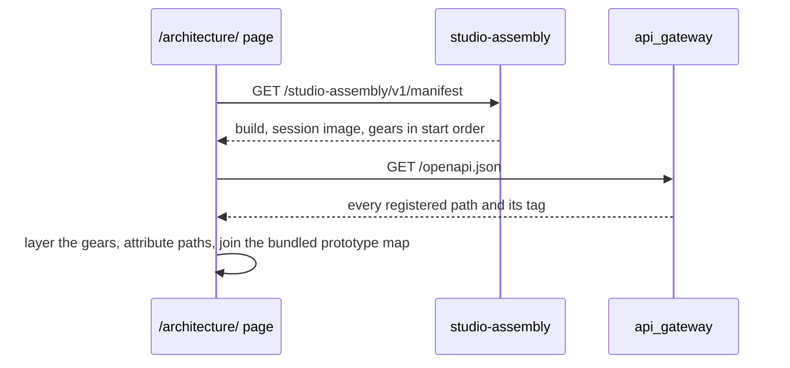

# Technical Design — studio-assembly

- [x] `p3` - **ID**: `cpt-studio-design-assembly`

The gear-level design of `cpt-studio-component-assembly`. The product-level
view, and how this gear sits among the others, is in
[Constructor Studio's design](constructor-studio.md). The code is
[`studio-backend/src/assembly/`](../../studio-backend/src/assembly/).

## Table of Contents

- [1. Architecture Overview](#1-architecture-overview)
- [2. Principles & Constraints](#2-principles--constraints)
- [3. Technical Architecture](#3-technical-architecture)
- [4. Additional context](#4-additional-context)
- [5. Traceability](#5-traceability)

## 1. Architecture Overview

### 1.1 Architectural Vision

The backend says what it is made of: every gear running in this process, what
each one needs, whether it is Studio's own or the platform's, and the commit it
was built from. A diagram drawn by hand is out of date the week after it is
drawn; this answer comes from the running binary, so it cannot be.

The question it answers is the one a new member, a manager or a reviewer asks
first — "what is in there, and how does it fit together?" — and the prototype's
`/architecture/` page draws the answer: the gears in layers by what they depend
on, a gear's purpose and design, its REST paths and which prototype screens call
it.

### 1.2 Architecture Drivers

#### Functional Drivers

| Requirement | Design Response |
|-------------|------------------|
| Explain the running system to people who did not build it | `GET /manifest` lists the linked gears in start order with dependencies, origin, role and purpose; the portal draws it |
| Say which build is deployed | The commit CI built the binary from, compiled in; the cargo features; the IDE session image the backend starts |

### 1.3 Architecture Layers

| Layer | Responsibility | Technology |
|-------|---------------|------------|
| REST | The one read | `OperationBuilder` route in `rest.rs` |
| Manifest | Classify the gears, find a plugin's extension point, attach purposes | `manifest.rs`, pure functions |
| Build facts | The commit and the design purposes, fixed at compile time | `studio-backend/build.rs` |

## 2. Principles & Constraints

### 2.1 Design Principles

#### Read it from the process, never from a list

- [x] `p2` - **ID**: `cpt-studio-principle-assembly-read-from-process`

The gears come from `GearRegistry::discover_and_build()`, the same inventory
walk and topological sort the runtime ran when it started; the session image
comes from `studio-session`'s own config section, parsed with that gear's
config type. Nothing in this gear names a gear. A gear linked tomorrow appears
without an edit here, and one removed disappears.

#### What ships with the binary is compiled into it

- [x] `p2` - **ID**: `cpt-studio-principle-assembly-compiled-in`

A Studio gear's purpose is the first paragraph of section 1.1 of
`docs/design/<gear>.md`, read by `build.rs` into a table. The commit is the
`STUDIO_BUILD_COMMIT` CI sets when it builds the release binary. Both are fixed
at compile time, so the answer a deployment gives is the answer of the commit
it was built from — the design text, too, is that commit's. A local build has no
commit and says `null` rather than guessing from `.git`: an incremental build
would keep whichever commit last ran the build script.

#### Which Studio gear uses which is read from the code

- [x] `p2` - **ID**: `cpt-studio-principle-assembly-uses-from-code`

The toolkit's `deps` name crates (`deps = [account_management]` expands to a
`pub use ::account_management`), and every Studio gear lives in the one
`studio-backend` crate, so no Studio gear can declare that it needs another and
`depends_on` shows them all as independent. `build.rs` reads it from the code
instead: every `crate::<gear module>::<item>` outside test code, classified as
`port` (the other gear's `port` or `sdk` module), `surface` (an item its
`mod.rs` exports) or `internal` (one of its other modules). Each Studio gear's
`uses` lists the gears it names and the worst of those ways.

`internal` is a boundary crossed below any contract, and a test fails on any.
What one gear offers the others is declared in two places: `port`, the clients
it publishes on the ClientHub (state and behaviour, resolved per use so the
start order of Studio gears does not matter), and `sdk`, the types and pure
functions another gear may name. Items its `mod.rs` exports are allowed too
(`surface`); everything else is private to it, and only an `internal` use fails
the test.

### 2.2 Constraints

#### Names are the only link from a plugin to its host

- [x] `p2` - **ID**: `cpt-studio-constraint-assembly-plugin-by-name`

A plugin registers a GTS instance of its host's plugin spec in the types
registry, and that instance does not name the gear that selects it. So the
extension point is read off the plugin's name, `<implementation>-<point>-plugin`
matched against the gear that carries `<point>` as a word of its own name, in
three tiers (exact, `<point>-…`, `…-<point>`), and a tier with two candidates
answers nothing. The IdP plugins of account-management carry `idp` and so name
no host; they answer `extends: null` rather than a guess.

#### Which REST paths a gear serves is the gateway's to say

- [x] `p2` - **ID**: `cpt-studio-constraint-assembly-paths-from-openapi`

The OpenAPI document is built by `api_gateway` from what each gear registered,
and the gateway's registry is not reachable from another gear. The manifest
therefore does not list paths. The page joins the manifest with
`/cf/openapi.json` of the same deployment, attributing a path to the gear named
by its first segment (rule A1), or to the one gear whose name starts with it
(`studio-identity` → `studio-identity-directory`).

## 3. Technical Architecture

### 3.1 Domain Model

- [x] `p2` - **ID**: `cpt-studio-entity-assembly-gear`

A **gear** in the manifest has a `name`; an `origin` — `studio` when the name
starts with `studio-` or it is a plugin of a Studio gear (the connector drivers
are written here and named after their provider), `platform` otherwise; a
`role` — `system` when the registry gives it the system capability, `plugin`
when its name ends in `-plugin`, `gear` otherwise; `extends` for a plugin; the
`depends_on` it declares; for a Studio gear, the Studio gears it `uses`
(`gear`, `via`, `items`); the registry's capability labels; its `order` in the
start sequence; and, for a Studio gear with a design, its `purpose` and
`design_doc` path.

### 3.2 Component Model

The gear is one component. Its state is the snapshot built at `init` and never
changed afterwards: two calls to one process always agree.

### 3.3 API Contracts

- [x] `p2` - **ID**: `cpt-studio-interface-assembly-rest`

- **Contracts**: `cpt-studio-interface-rest-api`
- **Technology**: REST/OpenAPI through `api_gateway`
- **Location**: [`studio-backend/docs/api-contract.json`](../../studio-backend/docs/api-contract.json)

**Endpoints Overview**:

| Method | Path | Description | Stability |
|--------|------|-------------|-----------|
| `GET` | `/studio-assembly/v1/manifest` | The build (`commit`, `features`), `sessions_enabled`, `session_image`, and every linked gear in start order | unstable |

The route needs an authenticated caller and nothing more: it carries no tenant
data, no secret and no config value but the session image reference.

### 3.4 Internal Dependencies

None declared. It uses `studio_session::sdk::StudioSessionConfig` to parse the
session image, and reads the toolkit's gear registry and the config provider.

### 3.5 External Dependencies

None.

### 3.6 Interactions & Sequences

#### Draw the architecture page

**ID**: `cpt-studio-seq-assembly-page`

**Actors**: `cpt-studio-actor-member`

**Description**: The prototype map — which prototype screen calls which path —
is extracted from the prototype's sources when its image is built, so it
belongs to the prototype's commit as the manifest belongs to the backend's. The
page shows both commits and warns when they differ.

### 3.7 Database schemas & tables

None. The gear stores nothing.

### 3.8 Deployment Topology

In-process in the one `studio-backend` binary: gear `studio-assembly`,
capabilities `[rest]`, no dependencies, no config. The release build gets its
commit from the `Build (release)` step of `.github/workflows/studio-delivery.yml`;
`studio-backend/Dockerfile.src` copies `docs/design/` into its build stage so a
compose build has the purposes too.

## 4. Additional context

`studio-backend/docs/architecture/` keeps a drawn diagram (draw.io) of the same
assembly, with the context outside the backend that this gear cannot see. Where
the two disagree about which gears are linked, this one is right.

## 5. Traceability

- **PRD**: [Constructor Studio](../prd/constructor-studio.md)
- **Design**: [Constructor Studio](constructor-studio.md)
- **ADRs**: [ADR index](../adr/README.md)
- **Code**: [`studio-backend/src/assembly/`](../../studio-backend/src/assembly/)
