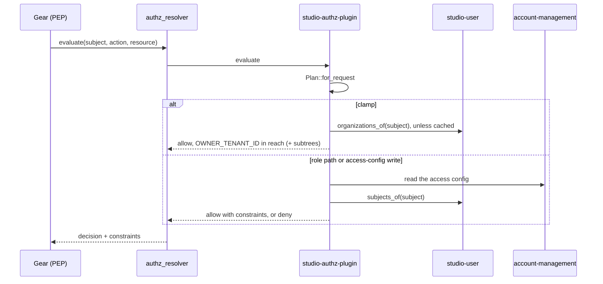

# Technical Design — studio-authz-plugin

- [x] `p3` - **ID**: `cpt-studio-design-authz-plugin`

The gear-level design of `cpt-studio-component-authz-plugin`, the Studio PDP.
The product-level view, and how this gear sits among the others, is in
[Constructor Studio's design](constructor-studio.md). The code is one file,
[`studio-backend/src/studio_authz_plugin.rs`](../../studio-backend/src/studio_authz_plugin.rs).

## Table of Contents

- [1. Architecture Overview](#1-architecture-overview)
- [2. Principles & Constraints](#2-principles--constraints)
- [3. Technical Architecture](#3-technical-architecture)
- [4. Additional context](#4-additional-context)
- [5. Traceability](#5-traceability)

## 1. Architecture Overview

### 1.1 Architectural Vision

An AuthZ resolver plugin: every authorization request through the platform's
`authz_resolver` ends here, and the answer is a decision plus the constraints a
PEP applies to the rows it reads.

The answer is the **tenant clamp** — the caller may reach rows owned by the
tenants they may reach, and those tenants' subtrees. An organization's access
config (`cf.studio.access.config.v1`, tenant metadata) chooses a model:
`tenant`, where the clamp is the whole answer, or `roles`, where a grant can
only narrow the clamp further. Roles sit on top of the tenant model and never
replace it, so a mis-entered grant can deny and can never reach across tenants.

Two things are not the clamp. The tenants a caller may reach are the token's
tenant *plus* every organization the caller's person is an active member of, so
a person reaches an organization they belong to whichever login they used. And a
write to the access config itself — the document that names an organization's
owners — is answered by ownership, because the clamp would answer it with "you
are a member", which is how a member would appoint themselves owner.

### 1.2 Architecture Drivers

#### Functional Drivers

| Requirement | Design Response |
|-------------|------------------|
| `cpt-studio-fr-authz-tenant-clamp` | Every request that is not denied outright is answered with the clamp over the caller's reachable tenants; the role path only narrows it. |
| `cpt-studio-fr-authz-row-roles` | The role path is built and tested; `privilege_for` maps no resource type yet, so nothing reaches it. |

#### NFR Allocation

| NFR ID | NFR Summary | Allocated To | Design Response | Verification Approach |
|--------|-------------|--------------|-----------------|----------------------|
| `cpt-studio-nfr-tenant-isolation` | Every allow stays in the caller's tenant subtree | `cpt-studio-component-authz-plugin` | Every allow carries the clamp's constraints; a project-scoped grant AND-s its scope ids into the clamp of the grant's own tenant, so a scope outside the subtree drops out at evaluation | Unit tests in `studio_authz_plugin.rs` |

#### Key ADRs

| ADR ID | Decision Summary |
|--------|------------------|
| `cpt-studio-adr-roles-over-tenant` | Roles are AND-ed with the tenant clamp, never a replacement for it. |
| `cpt-studio-adr-a-role-narrows-what-a-member-may-do` | The PDP answers row access; administrative authority is answered in the gear. An unreadable config denies; an owner's authority is definitional. |
| `cpt-studio-adr-authentication-does-not-grant-organization-membership` | Reach follows recorded membership, not the token alone. |
| `cpt-studio-adr-an-identity-proves-it-is-you-and-decides-nothing-else` | A platform administrator is a member of the platform root; the token's tenant stays in the clamp until what depends on it is gone. |
| `cpt-studio-adr-the-person-is-the-key-not-the-login` | A grant is matched against every sign-in subject of the caller's person. |

### 1.3 Architecture Layers

| Layer | Responsibility | Technology |
|-------|---------------|------------|
| Plugin | Register with the types-registry and the ClientHub | `AuthZResolverPluginClient`, `PluginV1` registration |
| Plan | Decide from the request alone what kind of answer it needs | `Plan::for_request`, no I/O |
| Decision | The role path and the access-config-write gate | `decide`, `decide_access_config_write` |
| Reach | Token tenant plus member organizations, cached | `reachable_tenants` over `OrganizationReader` |
| Shape | Turn tenants and scopes into constraints | `tenant_constraints` |

## 2. Principles & Constraints

### 2.1 Design Principles

#### Decide the shape before reading anything

- [x] `p2` - **ID**: `cpt-studio-principle-authz-plugin-plan-first`

`Plan::for_request` classifies a request with no I/O. No tenant, or the nil
tenant: deny. An unrestricted token (`token_scopes` contains `*`): the clamp,
never role-gated, as an anti-lockout backstop. A write or delete of the access
config: the ownership gate. A request on an account-management tenant, tenant
metadata or tenant type: the clamp — authorizing a read of the access config
must not read the access config, which would recurse. A resource type
`privilege_for` maps: the role path. Anything else: the clamp. Only the role
path and the ownership gate read the config, so a request that cannot reach
them never pays for an account-management call. The recursion guard compares
the GTS family (everything before the first `~`), not a substring, so another
vendor's type that merely contains the words is not exempted.

**ADRs**: `cpt-studio-adr-roles-over-tenant`

#### Not knowing is not "tenant"

- [x] `p2` - **ID**: `cpt-studio-principle-authz-plugin-unreadable-denies`

A config read has three outcomes. Absent: the organization never opted into
roles, and tenant behaviour is correct. Found: decide from it. Unreadable — the
read failed or the document did not parse: deny, because answering an outage
with tenant behaviour would hand every privilege to anybody who reaches the
organization for as long as account-management is unwell.

**ADRs**: `cpt-studio-adr-a-role-narrows-what-a-member-may-do`

#### The owner's authority is definitional

- [x] `p2` - **ID**: `cpt-studio-principle-authz-plugin-owner-definitional`

A grant with role `owner` carries every privilege whatever the document's role
ladder says. A document written before the ladder was seeded defines no `owner`
role, and resolving authority through it would strip its owner of
`access.manage` and leave nobody able to repair it.

#### Reach may widen; it never narrows on failure

- [x] `p2` - **ID**: `cpt-studio-principle-authz-plugin-reach`

The reachable tenants always include the token's tenant, which is what the clamp
always was — service accounts have a tenant and no memberships. Member
organizations are added from `OrganizationReader`, which counts active
memberships only. A failed membership read keeps the token's tenant alone rather
than denying: a database hiccup must not look like a revoked membership.

### 2.2 Constraints

#### Membership is cached for ten seconds

- [x] `p2` - **ID**: `cpt-studio-constraint-authz-plugin-membership-cache`

The plugin runs on every request, and a membership read per request would put a
query in front of every call through the gateway. A subject's organizations are
cached for 10 seconds and dropped as soon as `studio-user`'s membership
generation moves, which every membership write bumps. The age is only a
backstop; the generation is what makes a write visible at once.

#### Nothing is role-gated yet

- [x] `p2` - **ID**: `cpt-studio-constraint-authz-plugin-no-mapping`

`privilege_for` returns `None` for every resource type: `studio-project` was
retired when projects became tenants, and no gear asks for row-level access
yet. Every request is answered by the clamp or the ownership gate, and the role
evaluation is reachable only from its tests. Team grants are matched against an
empty team list until teams are resolved.

## 3. Technical Architecture

### 3.1 Domain Model

- [x] `p2` - **ID**: `cpt-studio-entity-authz-plugin-grant`

The plugin reads the access config's `model`, its `roles` (a key and its
privileges) and its `grants` (`subjectType` `member` or `team`, `subjectId`,
`roleKey`, `scopeType` `org` or `project`, `scopeId`). The shape and its writer
are `cpt-studio-component-access-config`'s. A role decision is one of: the
clamp; deny; or narrow to a set of project scopes.

### 3.2 Component Model

The plugin is one component; the access-config write gate is part of it.

`decide_access_config_write` answers a write or delete of
`gts.cf.core.am.tenant_metadata.v1~cf.studio.access.config.v1~`. The
organization is the tenant that *owns the document*, read from the resource's
`OWNER_TENANT_ID` property — not the token's tenant, which on this request is
the person's home tenant and would read the platform root's config, find none,
and allow. Without that property the write is denied. A platform administrator
is allowed. Otherwise the organization's config decides: no document allows (an
organization being created has no owner yet); an unreadable one denies; a found
one allows its owner, anybody when it has no owner (so an ownerless organization
can be repaired), and on the `roles` model whoever holds `access.manage`
organization-wide. An allow is the clamp.

### 3.3 API Contracts

- [x] `p2` - **ID**: `cpt-studio-interface-authz-plugin`

- **Technology**: `authz_resolver_sdk::AuthZResolverPluginClient`, in process
- **Location**: [`studio-backend/src/studio_authz_plugin.rs`](../../studio-backend/src/studio_authz_plugin.rs)

Registered with the types-registry as instance
`cf.studio.authz_resolver.plugin.v1` (vendor `constructorfabric`, priority 40)
and on the ClientHub under that instance id. The resolver picks one plugin per
vendor and the lower priority wins, so it takes precedence over
`static-authz-plugin` (priority 100 in the shipped profiles).

The response is a decision and constraints. Constraints are OR-ed and the
predicates inside one are AND-ed: `OWNER_TENANT_ID IN` the reachable tenants,
plus, when the PEP declares the tenant-hierarchy capability, one
`InTenantSubtree` constraint per tenant for each of `OWNER_TENANT_ID` and
`RESOURCE_ID` the PEP supports. A project-scoped narrowing starts from the
clamp of the request's own tenant and adds `OWNER_TENANT_ID IN` the scope ids to
every constraint.

### 3.4 Internal Dependencies

| Dependency Gear | Interface Used | Purpose |
|-------------------|----------------|----------|
| `types_registry` | SDK client | Register the plugin instance |
| `cpt-studio-component-account-management` | SDK client, `resolve_metadata` as the caller | Read an organization's access config |
| `cpt-studio-component-user` | `OrganizationReader`, looked up on first use | Member organizations, the person's subjects, the platform-admin test, the membership generation |

`studio-user` is not a declared dependency, so init order guarantees nothing;
the reader is resolved once, on first use. Without it the clamp stays on the
token's tenant and grants match the bare subject.

### 3.5 External Dependencies

None.

### 3.6 Interactions & Sequences

#### Evaluate a request

**ID**: `cpt-studio-seq-authz-plugin-evaluate`

**Actors**: `cpt-studio-actor-member`

**Description**: Today every request takes the clamp branch except a write to
an access config.

### 3.7 Database schemas & tables

None. The plugin stores nothing; the membership cache is in memory.

### 3.8 Deployment Topology

In-process in the one `studio-backend` binary: gear `studio-authz-plugin`, deps
`types_registry`, `account_management`, config section
`gears.studio-authz-plugin` (`vendor`, `priority`; unknown fields are refused).
No shipped profile sets the section, so the defaults apply.

## 4. Additional context

Administrative authority — who may change memberships, invite, delete an
organization — is not asked of this plugin. `cpt-studio-component-user` and
`cpt-studio-component-organizations` read the access config themselves, because
for a `tenant`-model organization the clamp admits every member.
`cpt-studio-principle-tenant-clamp-first` is the product-level statement of the
same rule.

## 5. Traceability

- **PRD**: [Constructor Studio](../prd/constructor-studio.md)
- **Design**: [Constructor Studio](constructor-studio.md)
- **ADRs**: [ADR index](../adr/README.md)
- **Code**: [`studio-backend/src/studio_authz_plugin.rs`](../../studio-backend/src/studio_authz_plugin.rs)
