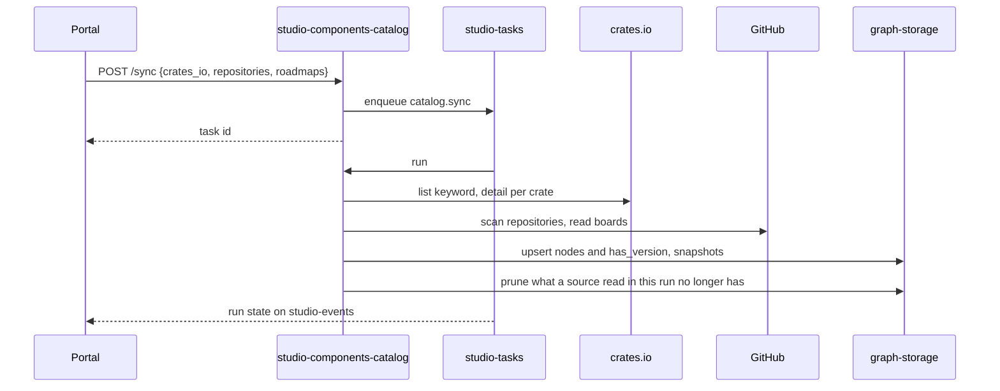

# Technical Design — studio-components-catalog

- [x] `p3` - **ID**: `cpt-studio-design-components-catalog`

The gear-level design of `cpt-studio-component-components-catalog`. The
product-level view, and how this gear sits among the others, is in
[Constructor Studio's design](constructor-studio.md). The code is
[`studio-backend/src/components_catalog/`](../../studio-backend/src/components_catalog/).

## Table of Contents

- [1. Architecture Overview](#1-architecture-overview)
- [2. Principles & Constraints](#2-principles--constraints)
- [3. Technical Architecture](#3-technical-architecture)
- [4. Additional context](#4-additional-context)
- [5. Traceability](#5-traceability)

## 1. Architecture Overview

### 1.1 Architectural Vision

Catalogues our own gears — every crate published under the `constructorfabric`
keyword on crates.io, and the gears, FrontX packages and kits its repository
scans find — in the knowledge graph, and says how ready each one is and how
good.
It does not decide which components a specification needs: that is
`cpt-studio-component-spec-mapping`, which reads the catalogue through
`port::ComponentCatalog`. It does not compose products or scaffold gears: that
is `cpt-studio-component-product` ([studio-product](studio-product.md)), whose
port this gear reads the Gearbox engine and a project's gear repository
through.

The platform is a set of gears, and "what gears are there, at what versions"
had no answer inside Studio: it lived on crates.io and in people's heads. This
gear makes it data. It lists every crate under the keyword, pulls each crate's
detail and version history from the public crates.io API, reads the gears'
repositories for what each gear actually is, reads the roadmap board for what
is planned, and stores the result as typed graph nodes the portal reads back.
Cataloguing led to a second half — once Studio knows what a gear looks like,
it can create one, and once it knows the gears, it can put a product together
from them — which grew here and became `studio-product`.

Most of the rules here used to run in the portal, per row, on every render —
the precedence of a field's sources, the kind of a component, the join with
the engine's catalogue, the activity per gear. They moved here because they are
rules, not rendering, and a second portal would have grown its own copy.

### 1.2 Architecture Drivers

#### Functional Drivers

| Requirement | Design Response |
|-------------|------------------|
| `cpt-studio-fr-gear-catalogue` | A `catalog.sync` run reads crates.io, repository sources and roadmap boards into `gear`, `crate_version`, `gear_profile`, `frontx`, `kit` and `roadmap_item` nodes; the read routes serve components, versions, values, history, the reference and activity. |

#### NFR Allocation

| NFR ID | NFR Summary | Allocated To | Design Response | Verification Approach |
|--------|-------------|--------------|-----------------|----------------------|
| `cpt-studio-nfr-durable-work` | Runs survive a restart | `cpt-studio-component-components-catalog` | A sync is a `catalog.sync` run on `studio-tasks`, not an in-memory task map | `components_catalog::sync_task` tests |

#### Key ADRs

| ADR ID | Decision Summary |
|--------|------------------|
| `cpt-studio-adr-types-registry-catalogs-meaning-graph-storage-contracts-storage` | Catalogue types are free-form in the types-registry; a field schema is data about a type and lives in graph-storage. |
| `cpt-studio-adr-component-tiers` | Components come in two tiers: the platform's, synced once in the root tenant and read-only to organizations, and each organization's own; reads join them and mark every component's `tier`. |
| `cpt-studio-adr-document-types-are-components` | A catalogue key is an instance within one kind; a gear and a kit are different kinds, so different node types. |
| `cpt-studio-adr-a-report-is-a-definition-over-a-source` | Reports moved to `studio-reports`; this gear keeps reading the board and answers it through `port::RoadmapCatalog`. |

### 1.3 Architecture Layers

| Layer | Responsibility | Technology |
|-------|---------------|------------|
| REST | Sync, catalogue reads, profiles, types and field schemas | `OperationBuilder` routes in `rest.rs` |
| Read model | Values, grade, taxonomy, reference, activity, history | `values.rs`, `quality.rs`, `taxonomy.rs`, `reference.rs`, `activity.rs`, `history.rs` |
| Sync | crates.io, repository scans, roadmap boards, upsert and prune | `cratesio.rs`, `repo_enrich.rs`, `repo_facts.rs`, `roadmap.rs`, `service.rs`, `sync_task.rs` |
| Engine | What the Gearbox engine knows about each gear, read through studio-product | `product::port::engine`, `product::sdk::Gearbox` |
| Storage | Catalogue nodes and one edge type | the catalogue graph (`crate::catalog_graph`, shared with studio-product): graph-storage through `GraphSink`; `MemorySink` without the `graph` feature |

## 2. Principles & Constraints

### 2.1 Design Principles

#### Later wins

- [x] `p2` - **ID**: `cpt-studio-principle-catalog-later-wins`

A component has three sources, and they disagree on purpose: crates.io (what
the registry published), the repository scan (`profile.auto`, refreshed on
every sync) and the profile (`profile.values`, what a person set — the only one
that is a decision rather than an observation). Later wins: a person's
correction survives the next sync, and a sync still fills in what nobody has
corrected. A field a person cleared comes back present and null, because
falling back to the scan would undo the decision. Flat keys from the old editor
fill only what is still unanswered. Numbers come back as digits with the number
in `n`; formatting is the portal's.

#### Unknown is null, never zero

- [x] `p2` - **ID**: `cpt-studio-principle-catalog-unknown-is-null`

A fact nobody answered is null — a category nothing names, an engine gear no
component matches, a gear no pull request touched. An invented
`Uncategorised` or a zero reads as a fact about the component.

#### One vocabulary, decided from evidence

- [x] `p2` - **ID**: `cpt-studio-principle-catalog-taxonomy`

`taxonomy.rs` decides each component's kind and category in one place and says
which evidence decided (`kind_reason`, `category_reason`). Kinds: `gear` (a
`gear.gdl` service or a `gear.toml`), `plugin`, `sdk`, `library` (toolkit and
every other crate), `micro-frontend` (module federation), `frontend-library`,
`tool` (a `bin` or CLI), `kit` (a `.cf-studio-kit.toml`). Not components, left
out of the default list with a reason: `config`, `test-support`, `docs`,
`template`, `example`. Older copies of a component (a second node for one
name, a scan node under a guessed crate name) are `superseded`; the read drops
them before any re-sync, and the next sync deletes them. The answers are served
by `/reference` and laid onto `/components` nodes as `component_kind`,
`component_category` and `component_excluded`.
Categories are the engine's set (`api-ingress`, `bss`, `core-functionality`,
`core-platform-integration`, `gen-ai`, `oss`, `serverless`), taken from
`gear.gdl`, then `gear.toml`, then the gear a plugin or SDK belongs to, then an
unambiguous crates.io category; otherwise null, with the raw registry
categories and npm tags kept in `source_categories`.

#### The grade is read, not stored

- [x] `p2` - **ID**: `cpt-studio-principle-catalog-grade-on-read`

The grade is the gear schema's `quality` block — 24 criteria in six areas,
`A` ≥ 90% … `E`, no better than B until in production — read against the
resolved values on every read, so a correction moves it at once. Every
criterion is absolute, so a grade cannot move because somebody else shipped
something. An unknown value fails, with the fix that would answer it.

#### The engine is read through studio-product

- [x] `p2` - **ID**: `cpt-studio-principle-catalog-engine-through-product`

The engine the catalogue reads — gear facts from `gear.gdl`, the engine half
of the reference, completion — is studio-product's, and off unless configured
(`cpt-studio-constraint-product-gearbox-optional`). Without it the catalogue is
still served, from crates.io and the repository scans. Once a sync finds
`gear.gdl` descriptors in the catalogue's own gears repository, it asks the
engine to adopt that repository as its corpus, so the catalogue, the previews
and the IDE read one checkout. The engine is `product::port::engine`, resolved
from the ClientHub; a project's gear repository, for its code dependencies, is
`product::port::ProjectProducts`. Nothing in studio-product reads the
catalogue back.

### 2.2 Constraints

#### Be gentle with crates.io

- [x] `p2` - **ID**: `cpt-studio-constraint-catalog-crates-io`

crates.io's API is public and unauthenticated but requires a descriptive
`User-Agent` and asks for about one request a second. The listing is paged at
100 crates (crates.io's cap) and stops after 20 pages, so a bad loop cannot
hammer the API. A sync is therefore minutes, not seconds, which is why it is a
run.

#### Repository reads are best-effort

- [x] `p2` - **ID**: `cpt-studio-constraint-catalog-best-effort-sources`

Repository scans and boards are read through a studio-connector GitHub
connection. No connection, no access or a truncated tree degrades to
"crates.io only", never a failed sync. A board that could not be read keeps
what it said last. Reading a board needs a connection that can read
organization projects.

#### An organization reads and writes only through its own connections

- [x] `p1` - **ID**: `cpt-studio-constraint-catalog-own-connections`

**An organization uses only a connection held by itself, one of its
workspaces or one of its projects** -- the rule is the connectors'
(`cpt-studio-constraint-connector-own-connections`, `connectors::sdk::ownership`),
stated there once; the catalogue's `ownership` module applies it. The
platform's own catalogue, synced in the root, reads with the root's
connections by design: there the root is the organization. Here it means:

- **Reads.** The registry walk and the on-demand reads of a project's code
  (`project_gears`, `project_dependencies`, behind spec-mapping and the
  conformance report) resolve each repository's connection -- the project's
  gear repository, its sources, the organization's gear repository -- to the
  tenant whose row holds it (`ConnectorService::holder_of`, not where an
  inherited catalogue listed it), and read none held outside the
  organization. The walk
  records such a repository as `failed` in the project's status with the
  hint "connect the repository with an organization-scope connection of your
  own", and what was read through it before loses its occurrences. An
  organization's catalogue sync reads no source (repository or board) whose
  connection -- the one named, or the default its tenant would take -- is
  held outside it, and names them in the run's result (`not_owned`).
- **Source records.** A source's `tenant` (`PUT /sources`, the `POST /sync`
  body) is the organization when nil and must otherwise be the organization
  or within it: one outside it is a 400 (`SOURCE_TENANT_NOT_OWNED`).
  `/platform/sources` keeps the root's.
- **Writes.** Declare it, publish, the scaffold and the organization's gear
  repository write only through the organization's own connection
  (`CONNECTION_NOT_OWNED`); publishing writes the platform's repository only
  through the root's own (`PLATFORM_CONNECTION_NOT_OWNED`).

## 3. Technical Architecture

### 3.1 Domain Model

- [x] `p2` - **ID**: `cpt-studio-entity-catalog-node`

Everything is a graph-storage owned node with a deterministic instance id
(uuid5 of a stable key in the catalogue's own namespace), so a re-sync upserts
rather than duplicates.

| Type | What it is |
|------|-----------|
| `gts.cf.studio.catalog.gear.v1~` | A published crate, or a gear a repository scan found |
| `gts.cf.studio.catalog.crate_version.v1~` | One published version, joined to its gear by `gts.cf.studio.catalog.has_version.v1~` |
| `gts.cf.studio.catalog.gear_profile.v1~` | Studio-managed metadata for one gear: `auto` (the scan's), `values` (a person's), `uml`; stored apart from crates.io data so a sync cannot erase it |
| `gts.cf.studio.catalog.frontx.v1~` | A FrontX micro-frontend package; the gear payload shape and profile, its own type |
| `gts.cf.studio.catalog.kit.v1~` | A kit a repository scan found: a repository, a manifest path and a git ref |
| `gts.cf.studio.catalog.roadmap_item.v1~` | A gear on a roadmap board, keyed on board and issue, whether or not its code exists |
| `gts.cf.studio.catalog.field_schema.v1~` | What the organization says about one GTS type: its field schema (with the `quality` block) and whether it counts as a component; built-ins overlaid by the tenant's own |
| `gts.cf.studio.catalog.source.v1~` | One catalogue source of the organization, kept on the server (ADR-0041): repository, ref, mode; replaces the browser's `cf.components.sources`. The platform's sources (ADR-0042) are the same nodes in the platform's (root) tenant, with the root as their organization |
| `gts.cf.studio.catalog.registry_entry.v1~` | One component of the organization's registry (ADR-0041): name, kind, `state` (`candidate`, `declared`, `registered`, `published`, `rejected`, `deprecated`, `merged`), owner (`{kind: person\|team, id?, name}`), category, capabilities, `aliases` (names merged into it), `merged_into`, `replaced_by`, the published `version`, and the fingerprint of the files it was last read from; for a candidate (P3) its `score`, `evidence` (`[{signal, detail, weight}]`) and `candidate_fingerprints` (the code it was found — or rejected — in) |
| `gts.cf.studio.catalog.registry_decision.v1~` | One decision a person made about a registry entry: `action`, the state it moved `from` and `to`, `by` (the person's Studio id, else the token's subject), `at`, `reason` and `details` (the fields it set); joined to its entry by `gts.cf.studio.catalog.decided.v1~` |
| `gts.cf.studio.catalog.occurrence.v1~` | Where a registry entry was found: repository, ref, path, commit, project, what declares it (`declared_in`; `detected` for a candidate, with its score, evidence and module fingerprint), and the tenant and connection it was read through; joined to its entry by `gts.cf.studio.catalog.found_in.v1~`. Keyed on the entry, the project, the repository and the path, so one repository attached to two projects gives each its own occurrence |
| `gts.cf.studio.catalog.registry_read.v1~` | One repository the registry walk read for one project (connection, repository, ref): the fingerprint of the files discovery reads and the commit, so an unchanged repository is not read again after a restart either |
| `gts.cf.studio.catalog.registry_settings.v1~` | The organization's registry settings: the projects the walk skips, what the last walk saw, and the crates.io keyword the tenant's catalogue syncs with (kept for the platform's, whose sync a schedule starts) |
| `gts.cf.studio.catalog.component_snapshot.v1~` | One component's fields on one day: the number `n`, the grade `s` and the badge `b` (cut to 80 characters); kept out of the enumerated catalogue types |

A field value has the shape `{ v, b, n, s, l, u }`. Field schemas and the
component mark are tenant-scoped because graph-storage is; reverting is
deleting the node.

### 3.2 Component Model

#### Catalogue sync

- [x] `p2` - **ID**: `cpt-studio-component-components-catalog-sync`

##### Why this component exists

A sync lists about seventy crates and pulls each one's history, then scans
repositories and boards — minutes of work that must survive a restart.

##### Responsibility scope

`sync_task.rs`, task type `catalog.sync`; `service.rs` `run_sync`, in phases
reported as progress: crates.io (`cratesio.rs`); repository sources, each a
tenant, connection, `owner/repo`, ref and mode (`gears` by default), written
into each component's profile with `auto` and `uml` refreshed and `values`
kept (`repo_enrich.rs`, `repo_facts.rs`: version, releases, lifecycle, spec
progress, dependents, sizes); what the Gearbox engine knows, when a
repository was rebuilt; what the roadmap boards plan (`roadmap.rs`); then the
upsert, a daily snapshot per component, and the prune — a gear gone from a
board this run read, or a component gone from a repository this run read (by
its `synced_from`), is deleted; a crates.io-only run deletes nothing. A body
naming no source syncs crates.io with the configured keyword. A failed run is
retried, since nearly every cause is transient.

##### Responsibility boundaries

Reads a board's meaning off the board, not from code: the single-select
`Status` is the stage and its option order the pipeline; a single-select of
percentages is a progress axis; a field whose name ends in dotted letters,
like `Prio (A.C.V)`, is per-consumer priority; the milestone due date is the
ETA; a field with `effort` in its name is the effort. With root issues named,
a gear is a direct sub-issue of a root. Items are matched to gears by title
words, strictly, by directory before crate name; a tie is left to a person, who
pins the item in the gear's `roadmap_item` field. The board a plan came from is
recorded as `auto.roadmap_board`. Where plan meets demand, the profile says so:
an overdue milestone, top-priority demand without a dated or committed plan, a
status that contradicts progress, a board that says shipped where the
repository has no release.

##### Related components (by ID)

- `cpt-studio-component-tasks` — is run by
- `cpt-studio-component-connector` — reads repositories and boards through
- `cpt-studio-component-graph-storage` — owns data in

#### Components reference

- [x] `p2` - **ID**: `cpt-studio-component-components-catalog-reference`

##### Why this component exists

The same gear was shown twice: the portal listed what crates.io and the scans
said, the IDE's Gearbox catalogue what the `gear.gdl` descriptors declare. A
person building a product needs both halves in one place.

##### Responsibility scope

`reference.rs`, `GET /reference`: one entry per component, joined with the
engine's gears by crate name (`package.crate_name` equals the component name),
falling back to the deepest directory for a component catalogued before the
scan read crate names. One crate can be several engine gears, so `engine` is a
list; an engine gear no component matches is listed on its own with
`type_id: null`. `related` names a gear's SDK and plugin crates from its
manifests and descriptor. Answers are cached per catalogue generation (moved by
every sync, profile and field-schema write), corpus commit and activity window,
and the engine's catalogue is kept on disk beside the corpus so a restart does
not wait for a fetch.

##### Responsibility boundaries

Gearbox and Insight are best-effort: without them the catalogue is still served
and `sources.gearbox_problem` / `sources.activity_problem` say why a half is
missing.

##### Related components (by ID)

- `cpt-studio-component-product-gearbox` — reads the engine catalogue from, through `product::port::engine`
- `cpt-studio-component-insight` — reads activity from

#### Gear activity

- [x] `p2` - **ID**: `cpt-studio-component-components-catalog-activity`

##### Why this component exists

Insight keys its git metrics by repository; a gear is a directory inside one.

##### Responsibility scope

`activity.rs`, `GET /activity`: groups the catalogue by repository, names the
directory each crate publishes from, asks `port::ComponentDelivery` for the
busiest repositories up to a small limit, and joins commits, churn, authors and
pull requests back per gear, weekly with the gaps filled. `compare=previous`
adds the same window just before. A pull-request failure loses only the pull
requests.

##### Responsibility boundaries

Draws nothing. CI is absent and cannot be added: a pipeline run names a commit,
not a file.

##### Related components (by ID)

- `cpt-studio-component-insight-delivery` — calls

#### Roadmap port

- [x] `p2` - **ID**: `cpt-studio-component-components-catalog-roadmap-port`

##### Why this component exists

Reports draw the board, but reading a board stays here, because a board is a
source of component facts too.

##### Responsibility scope

`port.rs`, `RoadmapCatalog` on the ClientHub: the planned gears (`roadmap_item`
payloads as each board's last sync stored them), every catalogued component
with its values reconciled, and `sync_board`, which queues a `catalog.sync`
reading one board and nothing else.

##### Responsibility boundaries

Knows nothing about plans, definitions or workbooks.

##### Related components (by ID)

- `cpt-studio-component-reports` — is called by

#### Registry

- [x] `p2` - **ID**: `cpt-studio-component-components-catalog-registry`

The organization's components, wherever they are declared (ADR-0041,
`cpt-studio-adr-component-registry`). Every phase is built:

- [x] **P1** (`registry.rs`, `registry_task.rs`): server-side sources, the
  walk, `declared` entries and the reads.
- [x] **P2** (`registry_decisions.rs`): the lifecycle moved by people, with
  owners, recorded decisions, merging and the permission check.
- [x] **P3** (`candidates.rs`, `registry_declare.rs`): structural candidate
  detectors with evidence and a score, re-proposal of a rejected candidate
  whose code changed, and Declare it.
- [x] **P4** (`registry_publish.rs`, `registry_consumers.rs`,
  `registry_suggest.rs`): publishing as a pull request into the platform's
  gear repository, the consumer graph, and model suggestions.

The walk is the task type `catalog.registry`, and also the last phase of a
`catalog.sync` whose payload says `registry: true` — what `POST /sync` queues
when its body names no `repositories`, so the Components page's button
refreshes both. Alone it is what the schedule and a push queue. For the
context's organization it:

1. Asks organizations for the organization's projects (`ProjectsOf`).
2. For each project not excluded (or, for a push, the project named), resolves
   its repositories exactly as `project_gears` does: its gear repository, else
   its `project.config` `sources[]`. A full walk also reads the organization's
   gear repository when one is set (see Tiers, phase 2), in the
   organization's own tenant, keyed by the organization where a project's
   read is keyed by the project.
3. Skips a repository whose fingerprint — of the files discovery reads, stable
   across builds, with the discovery rules' version in it — matches the one
   stored on its `registry_read` node; that costs one tree listing.
4. Runs `project_gears` discovery on the others, and upserts one
   `registry_entry` per component found (by organization and name,
   case-blind) and one `occurrence` per place it was found, joined by
   `found_in`; the read's fingerprint and the ref's newest commit are stored.
5. Retires the occurrences of a repository read again that no longer declares
   them, of a repository its project no longer names, and — on a full walk —
   of a project excluded or gone from the organization. A project whose
   repositories could not be listed, or a repository that could not be read,
   keeps its occurrences: "could not tell" is not "none".

The walk runs as the service, on a schedule nobody is signed in to, so it
reads only what a shared connection reaches. A repository connected with one
person's token is not readable to it, by design: an organization-wide job does
not borrow a person's credential. Nor does it read through a connection the
organization only inherits from the platform's root (see "An organization
reads and writes only through its own connections"). The walk records both per project (kept on
the organization's registry settings, replaced by each full walk) with what to
do about it, and `GET /registry/projects` serves it, so a project the walk could
not read is not mistaken for one with no components.

The rules are one pure function (`registry::plan`). An entry found anew is
`declared` (or, found only by a detector, a `candidate` — see Candidates
below). Discovery moves no state but `candidate` to `declared` — so a
declaration never resurrects a `rejected` one — and refreshes its kind, description, category and
capabilities only while it is `candidate` or `declared`; past that a person owns
it and a walk only moves `last_seen` (the last walk that read a repository
declaring it; a repository skipped as unchanged does not move it). An entry
with no occurrence left keeps its state and says so (`orphaned: true`) rather
than disappearing, because a registered component whose repository moved is
still the organization's. A `merged` entry is never orphaned (nor counted in
the walk's `orphaned`): what it was found as is its target's now, so its
having no occurrence of its own is the merge, not a loss. P1 discovers what `project_gears` discovers (gears
and plugins); FrontX packages and kits in the catalogue's own sources are not
registry entries yet.

**Schedule and push.** Schedules are platform-level, so the hourly one names
the organization in its payload (`{ "organization_id": … }`) and a run that
fires in the platform tenant hands itself to that organization, as
`reports.refresh` does. Nothing creates schedules for every organization at
start: the schedule is ensured (`scheduler::port::Schedules::ensure`) when the
organization saves its sources or its excluded projects. A push through
studio-git queues a walk of the pushed project
(`port::Registry::queue_refresh`), beside the re-sync it already queues.

`ProjectsOf` lists an organization's project tenants and is published by
organizations (`organizations::port`), so no other gear walks the tenant tree
itself. The registry is published as `components_catalog::port::Registry`
(`entries`, `project_entries`, `queue_refresh`). Spec-mapping takes a
project's own gears from it when it has entries found in that project, in the
same shape and labelling (`origin: project`, `path`) as `project_gears`, and
reads the repositories on demand otherwise.

**The lifecycle (P2).** Past `declared`, an entry moves only by a person's
decision, `POST /registry/{name}/decisions`, checked against one table
(`registry_decisions::transition`):

| Action | From | To | Carries |
|---|---|---|---|
| `register` | `candidate`, `declared` | `registered` | `owner` (required unless the entry has one), and `kind`, `category`, `capabilities` |
| `reject` | `candidate`, `declared` | `rejected` | `reason` (required) |
| `deprecate` | `registered`, `published` | `deprecated` | `replaced_by`: an existing live entry, optional |
| `restore` | `rejected` | `declared`, or `candidate` when nothing declares it | — |
| `restore` | `deprecated` | `registered` | clears `replaced_by` |
| `publish` | `registered` | `registered` | opens a pull request into the platform's gear repository and records its `contribution` (see Publishing) |
| `mark_published` | `registered` | `published` | `version`, optional; a platform administrator only |
| `merge` | any state but `merged` | `merged` | `merge_into`: an existing live entry |
| `edit` | any | unchanged | `owner`, `kind`, `category`, `capabilities`, `description` |

Any other move is refused as `failed_precondition`
(`REGISTRY_TRANSITION_NOT_ALLOWED`, naming the states the action applies to);
a missing owner or reason, or a `replaced_by`/`merge_into` that names no live
entry, is `invalid_argument`. An owner is `{kind: person|team, id?, name}`; an
owner stored as a bare name before P2 reads as a team of that name.

A **merge** folds one component found under two names into one entry. The
merged entry's occurrences are re-pointed to the target (written under the
target, the old ones retired), the target takes its name — and any names it
carried — into `aliases`, and the merged entry keeps `state: merged` and
`merged_into`. A later walk that finds a component under an alias writes its
occurrence under the target ([`plan`] asks `aliases_of` first), so the merged
entry never fills again. A merge records a decision on both entries
(`merged_from` on the target's).

Every decision is a `registry_decision` node joined to its entry by `decided`,
recording who (`by`: the caller as a person through studio-user's
`PersonResolver`, else the token's subject), when, the states, the reason and
the fields it set. `GET /registry/{name}` and a decision's answer carry the
entry's `decisions`, newest first; the list route leaves them out.

**Who decides.** Only an organization administrator: the route asks
studio-user's `OrgAuthority::may_administer` for the privilege
`component.registry` (ADR-0040 — no other gear reads the access config). An
owner and a platform administrator always may; on the roles model, so may
whoever holds the privilege. Anyone else gets 403 (`REGISTRY_ADMIN_REQUIRED`);
without studio-user nobody may. Reads stay open to every member.

**What the walk does with decisions.** Nothing a person decided moves: a walk
still writes only `candidate` and `declared` (and re-proposes a rejected
candidate only when its code changed), refreshes descriptive fields only while
discovery owns the entry, keeps the occurrences of `rejected` and `merged`
entries' repositories up to date (for a merged one, under its target), and
only says when it saw an entry last.

**What spec-mapping offers.** A project gear whose registry entry is
`rejected` or `merged` is not offered, whether the plan read the registry or
fell back to reading the repositories. A `deprecated` one is still offered,
marked on its candidate with `registry_state` and `replaced_by` (both set only
for registry-backed candidates), and the portal says "Deprecated in the
organization's registry — use X instead". A registry `candidate` found in the
project's own code is offered too, with `origin: project` and
`registry_state: candidate`: the Components tab says it "could become a
gear", and its `?` panel lists the registry's evidence and offers Declare it.

**Candidates (P3).** A walk that reads a repository anew also asks what in
it looks like a gear and is not declared one (`candidates::detect`, pure).
The unit is a Rust module directory (a `mod.rs`, or a directory beside its
`name.rs`) or a crate (a `Cargo.toml` with a `src/lib.rs`, not the
repository root) that no declared gear covers — not a gear's directory and
nothing inside one; tests, `target/` and the other trees discovery skips are
skipped. The detectors read the tree listing the walk already has, the Rust
files discovery reads anyway (`mod.rs`, `lib.rs`, gear files) and at most 40
`Cargo.toml` files. Each signal carries a weight and a line a person reads:

| Signal | Fires on | Weight |
|---|---|---|
| `rest` | `rest.rs`, `routes.rs`, `api.rs` or a `rest/`, `routes/`, `api/` directory; else `OperationBuilder::` or `Router::new` in its `mod.rs`/`lib.rs` | 3 |
| `persistence` | `migrations/`, `migrations.rs`, `entity.rs`, `entity/`, `repo.rs`, `repository.rs` | 3 |
| `types` | `gts.rs`, `types/`, `*.schema.json` under it | 2 |
| `boundary` | `port.rs` or `sdk.rs` (or their directories): 2 for one, 3 for both | 2–3 |
| `docs` | its own `README.md` or `DESIGN.md` | 1 |
| `consumers` | other modules of the crate naming `crate::<module>` in the files read, or other crates' manifests depending on it — bounded, so it can only undercount | 1 each, up to 3 |
| `copied` | the same name (kebab-folded) in another project of the organization, in another repository (two projects reading one repository are one copy): this walk's reads, or the occurrences held for repositories not read again | 2 |

A unit needs a structural signal (`rest`, `persistence`, `types` or
`boundary`); the score is the sum, a candidate needs 5
(`CANDIDATE_THRESHOLD`), and at most 30 are kept per repository, highest
first. It is named after its module or its crate's package, kebab-case. The
files the detectors look for count in the repository's fingerprint by path
(adding a `rest.rs` reads the repository again; editing one does not), and
`DISCOVERY_VERSION` moved to `project-gears/4` so every repository is read
once more.

A candidate is written as an entry in state `candidate` with its `score` and
`evidence` (`[{signal, detail, weight}]`, from its best occurrence) and an
occurrence `declared_in: detected` that also carries them, the module's own
fingerprint (its discovery files by sha, its signal files by path), and the
tenant and connection it was read through. Discovery owns `candidate` as it
owns `declared`, so a candidate a later walk finds declared becomes
`declared` (under any spelling: `spec_mapping` declared is the
`spec-mapping` candidate), and its evidence is dropped. A person's states
stay — with one exception ADR-0041 sets: a `rejected` candidate keeps the
fingerprints of the code it was rejected in (`candidate_fingerprints`), and a
walk that detects it in code with any other fingerprint proposes it again
(back to `candidate`, counted as `reproposed`). A rejected entry that was
never a candidate (rejected while declared) is never re-proposed.

`copied` is evidence about other occurrences, so it is settled again at the
end of every walk (`candidates::refreshed_copies`, in `plan`) from the
occurrences the registry keeps — the ones the walk found and the ones it
kept without reading again. When an occurrence goes (its project excluded,
its repository no longer named, the organization's gear repository changed
or unset), the occurrences left stop saying "copied in" it although their
repositories were not read again; only the signal's weight moves their
score. A `candidate` entry whose occurrences changed takes its score and
evidence from its best one, the one Declare it picks.

**Publishing (P4, ADR-0042 §4).** `publish` on a `registered` entry gives
the gear to the platform (`registry_publish.rs`). It reads the platform's
catalogue sources in the root tenant and takes the first in mode `gears` as
the platform's gear repository; without one it is refused (400
`failed_precondition`, `PLATFORM_NO_GEAR_REPOSITORY`: "the platform has no
gear repository to contribute to"), and one whose source names a connection
outside the root is refused too (`PLATFORM_CONNECTION_NOT_OWNED`): the
contribution is written only with the platform's own connection, never one
an organization could name. It copies the directory of the
occurrence that declares the entry (the organization's gear repository
first; never a detector's finding), read through that occurrence's
connection in its project's tenant -- only when that connection is the
project's or the organization's own (`CONNECTION_NOT_OWNED` for one the walk
found by walking up to the platform's root: its files are not read with the
platform's token and given away) --, bounded by the tree listing to 200 files
and 2 MiB (larger is 400 `REGISTRY_GEAR_TOO_LARGE`, nothing is written);
`target/`, `node_modules/`, `.git/` and `dist/` are skipped, and a file that
is not text is left out and named in the pull request. The files go under
the platform's parent directory for gears -- the one most of its catalogued
gears' `repo_path` sit in, else `gears/` -- as `<parent>/<name>/`, on the
branch `contribute/<organization>/<name>` off the source's ref, written
through studio-product (`product::port::GearContributions`) with the
source's connection, acting in the root tenant. The pull request names the
organization, the entry, its owner, its capabilities, where it came from and
the decision's reason. The entry stays `registered` and records the
`contribution` (`{repo, branch, pr_url, path, files, at, by}`) on itself and
on its `publish` decision. A walk reads the platform's catalogue once (its
gear nodes' names, crates and directories, with and without `cf-gears-`,
through `platform_ctx`); a contributed `registered` entry whose name or alias
is among them becomes `published`, with the platform's newest version, and a
`published` decision by `platform-sync` is recorded. A `published` entry's
version follows the platform's on later walks. When the names differ, a
platform administrator (and only one: 403 `PLATFORM_ADMIN_REQUIRED`
otherwise) decides `mark_published`, with an optional `version`. Without
studio-product publishing answers 503.

`dry_run: true` on a `publish` (`CatalogService::plan_publish`) makes every
check a publish makes and reads the files, but writes and records nothing:
the answer is the entry with `publish_preview`
(`{repo, base_branch, branch, path, files, skipped, title}`), which the
portal shows behind "Preview" before it offers Publish. A dry run needs no
studio-product. Any other action with `dry_run` is a 400.

Every decision records who made it (`by`, the person's Studio id) and their
name (`by_name`), resolved on the server through studio-user's
`PersonResolver::resolve_caller_named` (the caller's profile `display_name`);
a decision recorded before this kept only the id, and the portal maps the
ids it can.

**Consumers (P4).** Each entry carries `consumers`: the projects that use it
without declaring it, each `{project_id, project_name, via}` with `via` one
or both of `cargo` and `product`. A walk that reads a repository anew also
reads the run-time dependencies of its `Cargo.toml` files (as
`project_dependencies` does) and keeps them on its `registry_read` node
(`cargo_deps`), so a repository skipped as unchanged keeps them and one read
again replaces them; `DISCOVERY_VERSION` moved to `project-gears/5` so every
repository is read once to record them. It reads each project's product
picks from studio-product (`ProjectProducts::product_gears`) and keeps them
on the project's last-walk status, carried for a project the walk did not
read. A crate or a pick names an entry by its name or an alias, folded as
candidate names are, bare or as `cf-gears-<name>`. A project that declares
the entry is not its consumer; neither is the organization's gear
repository, nor a project out of scope. Deprecating answers the entry with
its consumers, and the page says which projects will see it deprecated.

**Suggestions (P4).** `POST /registry/{name}/suggest` (same rule as
decisions, `component.registry`) asks a model, on the caller's own key, what
the entry is (`registry_suggest.rs`). The question carries its name, kind,
evidence, up to ten occurrences and its README (at most 8 KiB), the
platform's categories and the organization's capability vocabulary
(`documents::port::CapabilityVocabulary`, the built-in one without the
documents gear). It goes out through studio-llm-proxy's
`ModelProviders::complete` (ADR-0039: the provider the caller has a key for,
as the IDE's chat picks it; never a key Studio holds). The answer is parsed
deterministically: one JSON object -- the whole answer, a fenced block, or
from its first `{` to its last `}` -- with `description` a string,
`category` one of the platform's categories or dropped, `capabilities` only
the vocabulary's keys (matched by key or label, once each). It is stored on
the entry as `suggestion` (`{description, category, capabilities, at,
model}`) and answered; it never moves the entry, and applying it is an
`edit` decision. A caller with no model key gets 400 `failed_precondition`
(`PROVIDER_KEY_REQUIRED`); an answer that is not the JSON asked for, or a
provider that fails, is 503 (the canonical errors have no 502); without
studio-llm-proxy 503.

**Declare it (P3).** `POST /registry/{name}/declare`, for a `candidate`
entry only, by the same rule as decisions (`component.registry`; 403
otherwise). It picks the candidate's detected occurrence (in `project_id`
when the body names one, else the highest-scoring one), asks studio-product
for the files through `product::port::GearDeclarations` — one manifest in
the module's directory: the engine's `gear.gdl`, with the declaration's
description and category set as the gear's own arguments (capability keys,
which GDL has no list for, as a closing comment), when the Gearbox engine is
configured, since gears-rust#4793 retires `gear.toml`; else a `gear.toml`,
the skeleton's `[gear]` table with the name, description, category and
capabilities. A directory inside a crate's `src/` always gets the
`gear.toml`, engine or not: the catalogue's `gear_dirs` skips a `gear.gdl`
under `src/` as the shape of a plugin compiled into its host's crate, so a
`gear.gdl` there would never make the candidate `declared` (a `gear.toml` is
read wherever it sits). That rule was re-checked when Declare it moved to
`gear.gdl` and stays. Unless `dry_run`, it writes them on `declare/<name>`
off the ref the walk read and opens a pull request, through the occurrence's
connection, in the project's tenant (`registry::in_tenant`, as the walk
reads) -- and only when that connection is the project's or the
organization's own: one the walk found by walking up to the platform's root
is refused, dry run included (400 `failed_precondition`,
`CONNECTION_NOT_OWNED`), because a pull request is never written with the
platform's token. It answers
`{branch, pr_url, files, repo, path, dry_run, manifest}` (`manifest`:
`gear.gdl` or `gear.toml`) and records a `declare`
decision (`candidate → candidate`, with the branch, the pull request and the
files). The entry stays a candidate until the walk reads the merged
declaration. Without studio-product the route answers 503; an occurrence
recorded before the walk kept its connection is `failed_precondition` until
the project is read again.

#### Tiers

- [x] `p2` - **ID**: `cpt-studio-component-components-catalog-tiers`

The platform's components and the organization's, read together
(ADR-0042, `cpt-studio-adr-component-tiers`). Phase 1 of the ADR is built:

- [x] **Phase 1** (`tiers.rs`, the platform routes, the joined reads): the
  platform's catalogue synced in the root tenant, reads that join both tiers,
  `tier` on every component and candidate, and two pages for two levels: the
  platform's components at the top of the portal's path, read by every
  organization (its sources and sync for a platform administrator only), and
  the organization's own (registry, catalogue, gear repository, its sources)
  under the organization.
- [x] **Phase 2** (`registry.rs`, `registry_gear_repository_rest.rs`,
  studio-product's scaffold): the organization's gear repository as the
  default target of "Create a gear", and read by the registry walk.
- [x] **Phase 3** (`registry_publish.rs`, studio-product's
  `GearContributions`): publishing as a pull request into the platform's gear
  repository, `published` once the platform's sync finds it (see Registry,
  Publishing).
- [ ] **Phase 4**: several corpora and pinned versions, once the engine has
  them.

##### Why this component exists

Every organization used to sync `gears-rust` itself and keep its own copy of
the shared set. The platform's catalogue is now synced once, in the
platform's (root) tenant, and every organization reads it beside its own.

##### Responsibility scope

- **The platform's catalogue.** Its sources are `source` nodes in the root
  tenant (the root as their organization) and its crates.io keyword is in the
  root's settings node, both edited only by a platform administrator
  (studio-user's `OrganizationReader::is_platform_admin`; 403
  `PLATFORM_ADMIN_REQUIRED` otherwise, and nobody without studio-user).
  `POST /platform/sync` queues a `catalog.sync` run in the root tenant whose
  payload is `{"platform": true}`: the run reads the stored sources when it
  starts, and refuses to run anywhere but the root. Saving the sources ensures
  a daily schedule (`0 3 * * *`) with the same payload; schedules fire in the
  platform's tenant, where the run belongs. The organization's `/sources` and
  `/sync` are unchanged.
- **Reads join the tiers.** `/components`, `/component-values`, `/profiles`,
  `/reference` and what spec-mapping reads through
  `port::ComponentCatalog::components` read the platform's nodes in the root
  tenant (the caller acting there, as `registry::in_tenant` builds it) and the
  organization's in its own, and mark each `tier: platform | organization`.
  The platform's read is best effort: a root that will not answer leaves the
  organization's catalogue alone. Every catalogue read keeps only the rows
  the context tenant owns (the envelope's `tenant_id`): graph-storage keeps
  the read scope the PDP returned, which admits every organization the caller
  is a member of, and a node another tenant wrote under the same
  deterministic key is not this tenant's (`catalog_graph::build_sink_own_tenant`;
  studio-product's sink is unchanged). A caller already in the root reads one tier,
  `platform`. A store that does not keep tenants apart (the in-memory fallback
  without graph-storage) has nothing to join, and everything is the caller's
  own tier.
- **One component, one tier.** The platform wins a name it has: an
  organization node of the same name (case-insensitive) is left out and named
  in `/components`' `shadowed`, so the page can say so. A node with no name is
  never shadowed. An organization that configured `gears-rust` itself sees it
  once, as the platform's, until it removes the source; `GET /sources` marks
  such a source `shadowed_by_platform` (same repository, case-insensitive, in
  the same mode). There is no data migration. An organization's sync does not
  read such a source (`tiers::leave_to_platform`, from `sync_task`): reading
  it into the organization's tenant only wrote nodes its reads then hid. Nor
  does it read the default crates.io keyword (or the platform's own) while the
  platform's catalogue syncs crates.io; an organization that names a keyword
  of its own still syncs it. What was left is logged and named in the run's
  result (`left_to_platform`, and its summary).
- **Annotations over facts.** A platform component's profile is the
  platform's (`auto`, `uml`, …) with the organization's profile node of the
  same `gear_name` laid over it: its `values` key by key, and every other key
  it sets except `auto` and `uml`; such a profile reads `annotated: true`.
  Writing a profile for a platform component from an organization stores
  only that annotation (`auto`, `uml` and the read marks dropped) in the
  organization's tenant, and answers the joined profile.
- **Schemas and marks stay the organization's.** The field schemas a tenant
  renders against are the built-ins, the platform's records over them, the
  organization's over those; a layout the platform authored reads
  `owner: platform`. A mark the organization never set falls back to the
  platform's, and whether a record is redundant is judged against that.
- **The organization's gear repository (phase 2).** An organization may name
  one repository its gears live in: a connection, `owner/name` and the branch
  new gears go back to (default `main`). It is kept on the organization's
  `registry_settings` node (`gear_repository`, with who set it and when),
  read by every member (`GET /registry/gear-repository`, with `may_manage`)
  and changed only by whoever may decide about the registry
  (`component.registry`, 403 `REGISTRY_ADMIN_REQUIRED` otherwise): `PUT` sets
  it, `DELETE` unsets it (the repository is not touched), and
  `POST /registry/gear-repository/create` creates a repository through the
  connection (`connectors::sdk::create_repository`) and sets it. The
  connection must be **the organization's own**: held in the organization's
  catalogue, not one it sees only by inheritance
  (`ConnectorService::nearest_by_id` walks up to the platform's root, and a
  connection found there carries the platform's token, which Declare it,
  the scaffold and the creation would then write with). Any other is
  refused with a 400 (`CONNECTION_NOT_OWNED`), and a setting stored before
  this check with such a connection is ignored when read (nothing reads or
  writes through it; the page shows none until it is set again). It must
  also be **organization-scoped**: the walk reads the repository as the
  service, on
  a schedule nobody is signed in to, and a project's "Create a gear" writes
  it from below the organization. A personal connection (its token is its
  owner's) or a workspace one (readable only in that workspace) is refused
  with a 400 (`CONNECTION_NOT_SHARED`) saying why, in the walk's own words
  (`registry::gear_repository_scope_refusal`); a creation is refused before
  anything is created. `PUT` reads the repository at the branch through the
  connection (a tree listing, `registry::GearRepositoryAccess::probe`) before
  storing it: one that cannot be read is a 400
  (`GEAR_REPOSITORY_UNREADABLE`) with the provider's error. Setting, creating
  or removing it queues a walk and ensures the hourly schedule.
- **The walk reads it.** A full walk reads the organization's gear repository
  like a project's repository (fingerprint, discovery, candidates), in the
  organization's tenant, keyed by the organization where a project's read is
  keyed by the project. What it finds is an `occurrence` with `project_id`
  null, `project_name` the organization's name and `scope: organization`
  (`GET /registry` answers every occurrence's `scope`, `project` or
  `organization`, and the portal says "organization gear repository"); its
  entries are the organization's tier. Its status is one more row of
  `GET /registry/projects`, keyed by the organization. A walk over named
  projects (a push) leaves it alone; a full walk after it was unset retires
  its occurrences, and their entries stay, `orphaned`. Declare it on a
  candidate found there writes in the organization's tenant.
- **"Create a gear" writes there.** A project's scaffold
  (`POST /studio-product/v1/projects/{id}/scaffold`) writes into the
  project's gear repository when it has one, else the organization's (asked
  through `port::Registry::gear_repository`, the organization found by
  walking up from the project), else the project's `sources[]`; its answer
  says which (`repo`, `target`). `POST /registry/scaffold` writes a new gear
  straight into the organization's gear repository: the same skeleton,
  through `product::port::GearScaffolds`, with a pull request by default;
  `dry_run` answers the files. With no App Spec behind it, the manifest names
  the organization in the app title's place (unless the request names an
  `app_title`), and its description is the `problem` (then "Scaffolded from the organization's Components page.") when one is given.
  Nothing is recorded: the walk finds the gear,
  `declared`, once it is merged.

##### Responsibility boundaries

The platform's facts are never written from an organization. The skeleton a
new gear starts from is studio-product's; this gear keeps only where the
organization's gears live. Publishing an
organization's gear to the platform (ADR-0042 §4) and composing from more
than one corpus are later phases.

##### Related components (by ID)

- `cpt-studio-component-user` — asks who is a platform administrator
- `cpt-studio-component-scheduler` — ensures the platform's daily sync with
- `cpt-studio-component-spec-mapping` — is read, with each component's tier, by

### 3.3 API Contracts

- [x] `p2` - **ID**: `cpt-studio-interface-components-catalog-rest`

- **Contracts**: `cpt-studio-interface-rest-api`
- **Technology**: REST/OpenAPI through `api_gateway`
- **Location**: [`studio-backend/docs/api-contract.json`](../../studio-backend/docs/api-contract.json)

**Endpoints Overview** (all under `/studio-components-catalog/v1`):

| Method | Path | Description | Stability |
|--------|------|-------------|-----------|
| `POST` | `/sync` | Queue a `catalog.sync` run over `crates_io`, `repositories` and `roadmaps`; poll `GET /studio-tasks/v1/runs/{id}`. Without `repositories` it reads the stored sources and walks the registry after them. An organization's run leaves to the platform the sources it already reads and the default crates.io keyword while the platform syncs crates.io; the result names them (`left_to_platform`), and reads no source whose connection is not the organization's own (`not_owned`). 400 `SOURCE_TENANT_NOT_OWNED` for a body source naming a tenant outside the organization | unstable |
| `GET` | `/components` | Every node of every type this organization marks as a component: the platform's and the organization's, each with its `tier`; `shadowed` names the organization's left out because the platform has the same name (ADR-0042) | unstable |
| `GET` | `/versions` | Ingested crate versions; `crate` narrows to one | unstable |
| `GET` | `/reference` | The catalogue joined with the engine's gears; `days` (default 90, `0` skips the warehouse), `include=all` | unstable |
| `GET` | `/component-values` | Each component's fields with its three sources reconciled, its grade and its `tier`; a platform component's values are the platform's with the organization's annotation over them | unstable |
| `GET` | `/component-history` | Snapshots: each component's earliest in the window, or one `component`'s every one; `days` default 30, at most 366 | unstable |
| `GET` | `/activity` | Commits, churn, authors and pull requests per gear; `days` (default 30), `compare=previous` | unstable |
| `GET` | `/profiles` | The Studio-managed profiles: the platform's with the organization's annotations over them (`annotated`), then the organization's own, each with its `tier` | unstable |
| `POST` | `/components/{name}/profile` | Create or replace one gear's profile; a body that does not fit the profile schema is refused. For a platform component an organization stores its annotation only, and the answer is the joined profile | unstable |
| `GET` | `/types` | Every node type the graph holds, its component mark and schema owner | unstable |
| `GET` | `/types/counts` | Nodes per type, exact up to a cap | unstable |
| `PUT` | `/types/{type_id}/component` | Mark or unmark a type as a component | unstable |
| `GET` | `/field-schemas` | The field schema per component type, built-ins overlaid by the tenant's own | unstable |
| `PUT` | `/field-schemas/{describes}` | Replace the tenant's schema for one type | unstable |
| `DELETE` | `/field-schemas/{describes}` | Revert to the built-in; reverting an unoverridden type is not an error | unstable |
| `GET` | `/sources` | The organization's catalogue sources, kept on the server: `{items: RepoSourceDto[], total}`, each with `shadowed_by_platform` when the platform already reads it | unstable |
| `PUT` | `/sources` | Replace them with `{items: RepoSourceDto[]}`; the sync reads these when its body names none. A source's `tenant` is the organization when nil, else within it (400 `SOURCE_TENANT_NOT_OWNED`). Ensures the hourly registry schedule | unstable |
| `GET` | `/platform/sources` | The platform's catalogue sources and crates.io keyword: `{items, total, crates_io}`. 403 for anyone but a platform administrator | unstable |
| `PUT` | `/platform/sources` | Replace them with `{items, crates_io}`; ensures the platform's daily sync schedule. 403 for anyone but a platform administrator | unstable |
| `POST` | `/platform/sync` | Queue a `catalog.sync` run in the root tenant that reads the platform's stored sources; 202 with `run_id`. 403 for anyone but a platform administrator | unstable |
| `GET` | `/registry` | The registry: `state`, `project_id`, `q` narrow it, `offset`/`limit` page it; `{items: RegistryEntryDto[], total}`, each entry with its occurrences | unstable |
| `GET` | `/registry/{name}` | One entry (`RegistryEntryDto`) with its occurrences and its `decisions`, newest first; 404 when absent | unstable |
| `POST` | `/registry/{name}/decisions` | A person's decision `{action, reason?, owner?, kind?, category?, capabilities?, description?, replaced_by?, merge_into?, version?, dry_run?}`: `register`, `reject`, `deprecate`, `restore`, `publish`, `mark_published`, `merge` or `edit`, checked against the lifecycle table and recorded with who made it (`by`, `by_name`). `publish` opens the contribution pull request (400 `failed_precondition` with no platform gear repository, nothing declaring the entry, a directory over 200 files / 2 MiB, or a repository read through a connection the organization only inherits, `CONNECTION_NOT_OWNED`; 503 without studio-product); with `dry_run: true` it writes and records nothing and answers `publish_preview` `{repo, base_branch, branch, path, files, skipped, title}` (a dry run is a publish's only; 400 otherwise); `mark_published` is a platform administrator's only. Answers the entry with its decisions, `contribution` and `consumers`. 403 for anyone but an organization administrator (`component.registry`); 400 `failed_precondition` for a move the state does not allow | unstable |
| `POST` | `/registry/{name}/suggest` | A model's `{description, category, capabilities, at, model}` for the entry, on the caller's own key through studio-llm-proxy, capabilities bounded by the organization's vocabulary; stored as the entry's `suggestion`, never a state change. 403 for anyone but an organization administrator; 400 `failed_precondition` (`PROVIDER_KEY_REQUIRED`) without a model key; 503 when the model cannot be asked or answers no usable JSON, or without studio-llm-proxy | unstable |
| `POST` | `/registry/{name}/declare` | Declare it, for a `candidate`: `{description?, capabilities?, category?, project_id?, dry_run?}` (all optional) → `{branch, pr_url, files, repo, path, dry_run, manifest}`: a pull request adding the module's manifest in its directory on `declare/<name>` — the engine's `gear.gdl` when the Gearbox engine is configured, else (and always inside a crate's `src/`) a `gear.toml`; `manifest` says which — recorded as a `declare` decision. 403 for anyone but an organization administrator; 400 `failed_precondition` for an entry that is not a candidate, or a repository read through a connection the organization only inherits (`CONNECTION_NOT_OWNED`); 503 without studio-product | unstable |
| `GET` | `/registry/projects` | What the last walk saw of each project: per repository `read`, `unchanged` or `failed`, its components, and for a failure what to do. The organization's gear repository is one more row, keyed by the organization | unstable |
| `GET` | `/registry/gear-repository` | The organization's gear repository (ADR-0042 §2): `{gear_repository: {tenant, connection_id, connection_label, repo, branch, set_by, set_at} \| null, may_manage}`. Every member | unstable |
| `PUT` | `/registry/gear-repository` | Set it: `{connection_id, repo, branch?}`. The connection must be the organization's own (400 `CONNECTION_NOT_OWNED` for one inherited from the platform's root) and organization-scoped (400 `CONNECTION_NOT_SHARED`, saying why), and the repository readable at the branch through it (400 `GEAR_REPOSITORY_UNREADABLE`, with the provider's error). Queues a walk. 403 for anyone but an organization administrator | unstable |
| `DELETE` | `/registry/gear-repository` | Unset it; the next full walk retires what was found there. 403 for anyone but an organization administrator | unstable |
| `POST` | `/registry/gear-repository/create` | Create a repository through an organization-scoped connection of the organization's own (`{connection_id, name, owner?, is_org?, private?}`; 400 `CONNECTION_NOT_OWNED` before anything is created otherwise) and set it; 201. 403 for anyone but an organization administrator | unstable |
| `POST` | `/registry/scaffold` | Create a gear in the organization's gear repository: `{slug, problem?, capabilities?, gear_kind?, plugin_host?, plugin_spec?, parent_dir?, app_title?, open_pr? (default true), dry_run?}` → `{branch, commit_sha, pr_url, files, repo, dry_run}`. 403 for anyone but an organization administrator; 400 `failed_precondition` with no gear repository; 503 without studio-product | unstable |
| `GET` | `/registry/excluded-projects` | The projects the walk skips: `{project_ids}` | unstable |
| `PUT` | `/registry/excluded-projects` | Replace them with `{project_ids}`. Ensures the hourly registry schedule | unstable |

A project's gear repository and product, scaffolding and the Gearbox routes
moved to `/studio-product/v1` with `cpt-studio-component-product`
([studio-product](studio-product.md#33-api-contracts)). Three paths under this
prefix still answer, registered by studio-product and deprecated:
`GET /gearbox/catalogue`, `GET /gearbox/corpus/info/refs` and
`POST /gearbox/corpus/git-upload-pack`.

Matching a specification to these components -- the plan, conformance and the
decisions -- is `cpt-studio-component-spec-mapping`
([studio-spec-mapping](studio-spec-mapping.md)). It reads the components, their
profiles, a project's code dependencies and the engine's completion through
`port::ComponentCatalog`. A project's code is the run-time dependencies of every
`Cargo.toml` in its gear repository (read through
`product::port::ProjectProducts`), or, without one, in the repositories its
project config names. From the same repositories it reads the gears the
project declares itself (`project_gears`): a `gear.toml` or `gear.gdl`
directory, and a `#[toolkit::gear(name = …)]` attribute in a Rust file named
as a gear's entry point is (`lib.rs`, `mod.rs`, `module.rs`, `*gear*`,
`*plugin*`). They are answered in the components' shape, marked
`origin: project` with their `path`, and are not written to the graph: they
belong to the project, not to the organization's catalogue. The read is
bounded and kept per repository until one of the files it read changes. The
engine's completion is still served here, calling studio-product's engine; it
is to move to studio-product.

### 3.4 Internal Dependencies

| Dependency Gear | Interface Used | Purpose |
|-------------------|----------------|----------|
| `types_registry` | `types-registry-sdk` | Register the catalogue types at init |
| `account_management` | `account-management-sdk` | Read a project's configured sources |
| `credstore` | `credstore-sdk` | Through `ConnectorService`, the connection tokens |
| `cpt-studio-component-connector` | `connectors::sdk::Connectors`: a `Repository` per source (tree, files, path history, tags, clone source for the corpus) and `ConnectorDriver::graphql` for boards (`roadmap.rs`) | Read repositories and boards |
| `cpt-studio-component-graph-storage` | `GraphStorageClientV1` (`graph` feature), through `catalog_graph::build_sink` | The catalogue |
| `cpt-studio-component-tasks` | `sdk::register`, `TaskQueue` | Run `catalog.sync` |
| `cpt-studio-component-insight` | `port::ComponentDelivery` from the ClientHub | Activity per gear |
| `cpt-studio-component-product` | `product::port::engine`, `product::port::Products` (`ProjectProducts`), `product::port::GearDeclarations`, `product::port::GearContributions`, `product::sdk` | The Gearbox engine's gear facts, catalogue, corpus checkout and completion; a project's gear repository and product picks; Declare it's files and pull request; Publish's pull request into the platform |
| `cpt-studio-component-llm-proxy` | `llm_proxy::port::ModelProviders::complete` from the ClientHub | A registry suggestion, on the caller's key (ADR-0039) |
| `cpt-studio-component-documents` | `documents::port::CapabilityVocabulary` from the ClientHub | The organization's capability vocabulary, bounding a suggestion |
| `cpt-studio-component-organizations` | `organizations::port::ProjectsOf` from the ClientHub | An organization's projects, for the registry walk |
| `cpt-studio-component-scheduler` | `scheduler::port::Schedules` from the ClientHub | The hourly registry schedule per organization |

`port::RoadmapCatalog` is published for `cpt-studio-component-reports`;
`port::Registry` for `cpt-studio-component-spec-mapping` and studio-git.

### 3.5 External Dependencies

#### crates.io

Contract `cpt-studio-contract-crates-io`, defined in
[Constructor Studio's design](constructor-studio.md#cratesio).

| Dependency Gear | Interface Used | Purpose |
|-------------------|---------------|---------|
| `cpt-studio-component-components-catalog-sync` | `https://crates.io/api/v1` (`STUDIO_CRATES_IO_BASE`) | Crates under the keyword, each with its detail and versions |

The Gearbox engine (`cpt-studio-contract-gearbox-engine`) is run by
studio-product; this gear reaches it only through that gear's port.

#### GitHub

Contract `cpt-studio-contract-provider-apis`, defined in
[Constructor Studio's design](constructor-studio.md#source-hosts-model-providers-and-chat-platforms).

| Dependency Gear | Interface Used | Purpose |
|-------------------|---------------|---------|
| `cpt-studio-component-components-catalog` | REST and GraphQL through a studio-connector connection | Repository trees and files, Projects v2 boards |

### 3.6 Interactions & Sequences

Composing a product is studio-product's (`cpt-studio-seq-compose-product` in
[Constructor Studio's design](constructor-studio.md#compose-a-product)).

#### Sync the catalogue

**ID**: `cpt-studio-seq-catalog-sync`

**Actors**: `cpt-studio-actor-member`

**Description**: Each phase reports progress on the run. The catalogue
generation moves at the end of the write, which invalidates the cached
reference.

### 3.7 Database schemas & tables

This gear has no database: the catalogue is the graph (§3.1). Without the
`graph` feature it is held in memory. The graph code — the node vocabulary
(`catalog_graph/gts.rs`) and the store (`catalog_graph/sink.rs`) — is a shared
root module, not part of this gear: studio-product keeps its two records in
the same graph, each gear building its own sink and touching only its own node
types.

### 3.8 Deployment Topology

In-process in the one `studio-backend` binary: gear
`studio-components-catalog`, capabilities `[rest]`, deps `types_registry`,
`account_management`, `credstore`. The gear reads no configuration section;
it is configured by environment.

| Variable | Default | Meaning |
|---|---|---|
| `STUDIO_COMPONENTS_CATALOG_KEYWORD` | `constructorfabric` | The crates.io keyword |
| `STUDIO_CRATES_IO_BASE` | `https://crates.io/api/v1` | API root, for tests and mirrors |

The `STUDIO_GEARBOX_*` variables are studio-product's
([studio-product](studio-product.md#38-deployment-topology)).

## 4. Additional context

Repository access is a connection from `cpt-studio-component-connector`; the
graph is the one `cpt-studio-component-artifact-ingest` writes to. The kits
this gear catalogues from repository scans are not `cpt-studio-component-kits`'
catalogue, which is compiled into that gear.

## 5. Traceability

- **PRD**: [Constructor Studio](../prd/constructor-studio.md)
- **Design**: [Constructor Studio](constructor-studio.md)
- **ADRs**: [ADR index](../adr/README.md)
- **Code**: [`studio-backend/src/components_catalog/`](../../studio-backend/src/components_catalog/)
