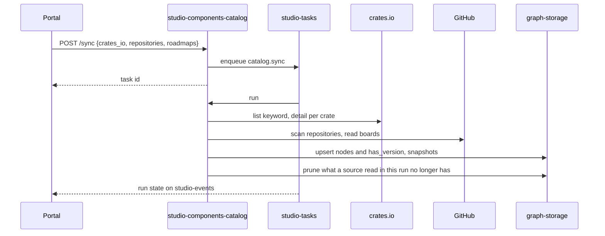

# Technical Design — studio-components-catalog

- [x] `p3` - **ID**: `cpt-studio-design-components-catalog`

The gear-level design of `cpt-studio-component-components-catalog`. The
product-level view, and how this gear sits among the others, is in
[Constructor Studio's design](constructor-studio.md). The code is
[`studio-backend/src/components_catalog/`](../../studio-backend/src/components_catalog/).

## Table of Contents

- [1. Architecture Overview](#1-architecture-overview)
- [2. Principles & Constraints](#2-principles--constraints)
- [3. Technical Architecture](#3-technical-architecture)
- [4. Additional context](#4-additional-context)
- [5. Traceability](#5-traceability)

## 1. Architecture Overview

### 1.1 Architectural Vision

Catalogues our own gears — every crate published under the `constructorfabric`
keyword on crates.io, and the gears, FrontX packages and kits its repository
scans find — in the knowledge graph, says how ready each one is and how good,
scaffolds new ones into a project's repository, and composes products out of
them with the Gearbox engine.

The platform is a set of gears, and "what gears are there, at what versions"
had no answer inside Studio: it lived on crates.io and in people's heads. This
gear makes it data. It lists every crate under the keyword, pulls each crate's
detail and version history from the public crates.io API, reads the gears'
repositories for what each gear actually is, reads the roadmap board for what
is planned, and stores the result as typed graph nodes the portal reads back.
Cataloguing led to the second half: once Studio knows what a gear looks like,
it can create one, and once it knows the gears, it can put a product together
from them.

Most of the rules here used to run in the portal, per row, on every render —
the precedence of a field's sources, the kind of a component, the join with
the engine's catalogue, the activity per gear. They moved here because they are
rules, not rendering, and a second portal would have grown its own copy.

### 1.2 Architecture Drivers

#### Functional Drivers

| Requirement | Design Response |
|-------------|------------------|
| `cpt-studio-fr-gear-catalogue` | A `catalog.sync` run reads crates.io, repository sources and roadmap boards into `gear`, `crate_version`, `gear_profile`, `frontx`, `kit` and `roadmap_item` nodes; the read routes serve components, versions, values, history, the reference and activity. |
| `cpt-studio-fr-gear-scaffold` | A `project_gear_repo` node per project; repository creation and a generated skeleton written on a branch through the project's connection, optionally as a pull request. |
| `cpt-studio-fr-gearbox-product` | A `project_product` node per project; a preview writes `product.gdl` and runs the Gearbox CLI over the backend's corpus checkout, optionally committing the file. |
| `cpt-studio-fr-spec-gear-mapping` | `compose.rs` matches a capability first through the contracts the vocabulary names against what the engine reports per gear, then by the vocabulary's terms in the catalogue's text with a cited passage, then reports a gap. The catalogue sync writes the engine's report into the profile as `gdl_contracts`: provided contracts, hosted extension points and implemented ones. Searching gear documentation is planned. See `cpt-studio-principle-catalog-contract-first`. |
| `cpt-studio-fr-mapping-decisions` | Planned: a decision is a graph edge from the specification section through the capability to the gear, carrying who, which step, the gear version and the document revision. |

#### NFR Allocation

| NFR ID | NFR Summary | Allocated To | Design Response | Verification Approach |
|--------|-------------|--------------|-----------------|----------------------|
| `cpt-studio-nfr-durable-work` | Runs survive a restart | `cpt-studio-component-components-catalog` | A sync is a `catalog.sync` run on `studio-tasks`, not an in-memory task map | `components_catalog::sync_task` tests |
| `cpt-studio-nfr-credential-isolation` | No secret in a session, a browser or a response | `cpt-studio-component-components-catalog-gearbox` | Repository tokens are borrowed from studio-connector per call; the corpus token is held in memory, attached upstream by the Git relay and never returned | `components_catalog::gearbox` tests |

#### Key ADRs

| ADR ID | Decision Summary |
|--------|------------------|
| `cpt-studio-adr-types-registry-catalogs-meaning-graph-storage-contracts-storage` | Catalogue types are free-form in the types-registry; a field schema is data about a type and lives in graph-storage. |
| `cpt-studio-adr-document-types-are-components` | A catalogue key is an instance within one kind; a gear and a kit are different kinds, so different node types. |
| `cpt-studio-adr-a-desktop-session-keeps-the-secrets-on-the-server` | A laptop clones a private gear corpus through the backend, which attaches the token. |
| `cpt-studio-adr-a-report-is-a-definition-over-a-source` | Reports moved to `studio-reports`; this gear keeps reading the board and answers it through `port::RoadmapCatalog`. |

### 1.3 Architecture Layers

| Layer | Responsibility | Technology |
|-------|---------------|------------|
| REST | Sync, catalogue reads, profiles, types and field schemas, project repository and product, Gearbox | `OperationBuilder` routes in `rest.rs` |
| Read model | Values, grade, taxonomy, reference, activity, history, compose, conformance | `values.rs`, `quality.rs`, `taxonomy.rs`, `reference.rs`, `activity.rs`, `history.rs`, `compose.rs` |
| Sync | crates.io, repository scans, roadmap boards, upsert and prune | `cratesio.rs`, `repo_enrich.rs`, `repo_facts.rs`, `roadmap.rs`, `service.rs`, `sync_task.rs` |
| Writing | Repository creation and gear scaffolding | `scaffold.rs`, `skeleton.rs` |
| Engine | Gearbox CLI over a corpus checkout | `gearbox.rs` |
| Storage | Catalogue nodes and one edge type | graph-storage through `GraphSink`; `MemorySink` without the `graph` feature |

## 2. Principles & Constraints

### 2.1 Design Principles

#### Later wins

- [x] `p2` - **ID**: `cpt-studio-principle-catalog-later-wins`

A component has three sources, and they disagree on purpose: crates.io (what
the registry published), the repository scan (`profile.auto`, refreshed on
every sync) and the profile (`profile.values`, what a person set — the only one
that is a decision rather than an observation). Later wins: a person's
correction survives the next sync, and a sync still fills in what nobody has
corrected. A field a person cleared comes back present and null, because
falling back to the scan would undo the decision. Flat keys from the old editor
fill only what is still unanswered. Numbers come back as digits with the number
in `n`; formatting is the portal's.

#### Unknown is null, never zero

- [x] `p2` - **ID**: `cpt-studio-principle-catalog-unknown-is-null`

A fact nobody answered is null — a category nothing names, an engine gear no
component matches, a gear no pull request touched. An invented
`Uncategorised` or a zero reads as a fact about the component.

#### One vocabulary, decided from evidence

- [x] `p2` - **ID**: `cpt-studio-principle-catalog-taxonomy`

`taxonomy.rs` decides each component's kind and category in one place and says
which evidence decided (`kind_reason`, `category_reason`). Kinds: `gear` (a
`gear.gdl` service or a `gear.toml`), `plugin`, `sdk`, `library` (toolkit and
every other crate), `micro-frontend` (module federation), `frontend-library`,
`tool` (a `bin` or CLI), `kit` (a `.cf-studio-kit.toml`). Not components, left
out of the default list with a reason: `config`, `test-support`, `docs`,
`template`, `example`. Older copies of a component (a second node for one
name, a scan node under a guessed crate name) are `superseded`; the read drops
them before any re-sync, and the next sync deletes them. The answers are served
by `/reference` and laid onto `/components` nodes as `component_kind`,
`component_category` and `component_excluded`.
Categories are the engine's set (`api-ingress`, `bss`, `core-functionality`,
`core-platform-integration`, `gen-ai`, `oss`, `serverless`), taken from
`gear.gdl`, then `gear.toml`, then the gear a plugin or SDK belongs to, then an
unambiguous crates.io category; otherwise null, with the raw registry
categories and npm tags kept in `source_categories`.

#### The grade is read, not stored

- [x] `p2` - **ID**: `cpt-studio-principle-catalog-grade-on-read`

The grade is the gear schema's `quality` block — 24 criteria in six areas,
`A` ≥ 90% … `E`, no better than B until in production — read against the
resolved values on every read, so a correction moves it at once. Every
criterion is absolute, so a grade cannot move because somebody else shipped
something. An unknown value fails, with the fix that would answer it.

#### Built first

- [x] `p2` - **ID**: `cpt-studio-principle-catalog-built-first`

`/compose` answers "what can we build this from?" the same way for the App
Spec's Compose button and a project's Components tab. A well-written stub is
mostly prose and prose is what keywords match, so candidates are sorted
built-first and the shortlist is cut after that sort. Components never built
are labelled rather than dropped, because a design may name a component that is
still only a design; `why` names the matched terms.

#### Contract first, evidence second, gap last

- [ ] `p1` - **ID**: `cpt-studio-principle-catalog-contract-first`

A gear that *declares* a capability's contract is a different kind of answer
from a gear whose documentation *mentions* the capability, and the mapping
never mixes the two in one ranking.
- **Contract matches** come from data the engine checks: the vocabulary's
  contracts for the capability against what the engine reports each gear
  doing for others. That is a contract it provides (`<gear>/<Trait>@v<N>`,
  from `#[toolkit::provides]`), the GTS spec of an extension point it hosts,
  or the spec of the point it implements. A vocabulary entry without a version
  takes any version, and a GTS segment matches a chain that ends with it. The
  same request gives the same answer every time.
- **Evidence matches** come from search: today the vocabulary's terms in the
  catalogue's text about the gear, with gear documentation planned. Each one
  cites its passage, and all of them rank below every contract match. They are
  how a capability nobody has given a contract yet still gets a candidate.
- **A gap** is reported as a gap, never filled by the nearest keyword. It is
  the input of a new gear.

Built-first (`cpt-studio-principle-catalog-built-first`) still orders the
candidates within each kind.

#### The portal and the IDE resolve with one engine

- [x] `p2` - **ID**: `cpt-studio-principle-catalog-one-engine`

The backend image, the session image and the desktop's engine extension build
the Gearbox engine at the same commit (`STUDIO_GEARBOX_REF`), and the preview
reads the CLI's JSON (`catalogue`, `validate`, `resolve` with `--format json`),
its stable contract for tooling. The gear holds no composition rule of its own
beyond one: a plugin is written under the host whose extension point it fills,
because that is how `product.gdl` spells it.

### 2.2 Constraints

#### Gearbox is off unless configured

- [x] `p2` - **ID**: `cpt-studio-constraint-catalog-gearbox-optional`

Previews, the engine catalogue, extension points, completion, repository facts
and the corpus relay need `STUDIO_GEARBOX_WORKDIR` (the chart's
`backend.gearbox`). The default corpus ref is `feature/gearbox`, because
`gear.gdl` descriptors exist only on that branch until
constructorfabric/gears-rust#4793 merges. Once a sync finds `gear.gdl`
descriptors in the catalogue's own gears repository, the engine adopts that
repository as its corpus, so the catalogue, the previews and the IDE read one
checkout.

#### Be gentle with crates.io

- [x] `p2` - **ID**: `cpt-studio-constraint-catalog-crates-io`

crates.io's API is public and unauthenticated but requires a descriptive
`User-Agent` and asks for about one request a second. The listing is paged at
100 crates (crates.io's cap) and stops after 20 pages, so a bad loop cannot
hammer the API. A sync is therefore minutes, not seconds, which is why it is a
run.

#### Repository reads are best-effort

- [x] `p2` - **ID**: `cpt-studio-constraint-catalog-best-effort-sources`

Repository scans and boards are read through a studio-connector GitHub
connection. No connection, no access or a truncated tree degrades to
"crates.io only", never a failed sync. A board that could not be read keeps
what it said last. Reading a board needs a connection that can read
organization projects.

## 3. Technical Architecture

### 3.1 Domain Model

- [x] `p2` - **ID**: `cpt-studio-entity-catalog-node`

Everything is a graph-storage owned node with a deterministic instance id
(uuid5 of a stable key in the catalogue's own namespace), so a re-sync upserts
rather than duplicates.

| Type | What it is |
|------|-----------|
| `gts.cf.studio.catalog.gear.v1~` | A published crate, or a gear a repository scan found |
| `gts.cf.studio.catalog.crate_version.v1~` | One published version, joined to its gear by `gts.cf.studio.catalog.has_version.v1~` |
| `gts.cf.studio.catalog.gear_profile.v1~` | Studio-managed metadata for one gear: `auto` (the scan's), `values` (a person's), `uml`; stored apart from crates.io data so a sync cannot erase it |
| `gts.cf.studio.catalog.frontx.v1~` | A FrontX micro-frontend package; the gear payload shape and profile, its own type |
| `gts.cf.studio.catalog.kit.v1~` | A kit a repository scan found: a repository, a manifest path and a git ref |
| `gts.cf.studio.catalog.roadmap_item.v1~` | A gear on a roadmap board, keyed on board and issue, whether or not its code exists |
| `gts.cf.studio.catalog.field_schema.v1~` | What the organization says about one GTS type: its field schema (with the `quality` block) and whether it counts as a component; built-ins overlaid by the tenant's own |
| `gts.cf.studio.catalog.project_gear_repo.v1~` | The repository a project's gears live in, keyed on the project id |
| `gts.cf.studio.catalog.project_product.v1~` | The gears picked for a project's product, its deployment profile and the engine's last answer, keyed on the project id |
| `gts.cf.studio.catalog.component_snapshot.v1~` | One component's fields on one day: the number `n`, the grade `s` and the badge `b` (cut to 80 characters); kept out of the enumerated catalogue types |

A field value has the shape `{ v, b, n, s, l, u }`. Field schemas and the
component mark are tenant-scoped because graph-storage is; reverting is
deleting the node.

### 3.2 Component Model

#### Catalogue sync

- [x] `p2` - **ID**: `cpt-studio-component-components-catalog-sync`

##### Why this component exists

A sync lists about seventy crates and pulls each one's history, then scans
repositories and boards — minutes of work that must survive a restart.

##### Responsibility scope

`sync_task.rs`, task type `catalog.sync`; `service.rs` `run_sync`, in phases
reported as progress: crates.io (`cratesio.rs`); repository sources, each a
tenant, connection, `owner/repo`, ref and mode (`gears` by default), written
into each component's profile with `auto` and `uml` refreshed and `values`
kept (`repo_enrich.rs`, `repo_facts.rs`: version, releases, lifecycle, spec
progress, dependents, sizes); what the Gearbox engine knows, when a
repository was rebuilt; what the roadmap boards plan (`roadmap.rs`); then the
upsert, a daily snapshot per component, and the prune — a gear gone from a
board this run read, or a component gone from a repository this run read (by
its `synced_from`), is deleted; a crates.io-only run deletes nothing. A body
naming no source syncs crates.io with the configured keyword. A failed run is
retried, since nearly every cause is transient.

##### Responsibility boundaries

Reads a board's meaning off the board, not from code: the single-select
`Status` is the stage and its option order the pipeline; a single-select of
percentages is a progress axis; a field whose name ends in dotted letters,
like `Prio (A.C.V)`, is per-consumer priority; the milestone due date is the
ETA; a field with `effort` in its name is the effort. With root issues named,
a gear is a direct sub-issue of a root. Items are matched to gears by title
words, strictly, by directory before crate name; a tie is left to a person, who
pins the item in the gear's `roadmap_item` field. The board a plan came from is
recorded as `auto.roadmap_board`. Where plan meets demand, the profile says so:
an overdue milestone, top-priority demand without a dated or committed plan, a
status that contradicts progress, a board that says shipped where the
repository has no release.

##### Related components (by ID)

- `cpt-studio-component-tasks` — is run by
- `cpt-studio-component-connector` — reads repositories and boards through
- `cpt-studio-component-graph-storage` — owns data in

#### Components reference

- [x] `p2` - **ID**: `cpt-studio-component-components-catalog-reference`

##### Why this component exists

The same gear was shown twice: the portal listed what crates.io and the scans
said, the IDE's Gearbox catalogue what the `gear.gdl` descriptors declare. A
person building a product needs both halves in one place.

##### Responsibility scope

`reference.rs`, `GET /reference`: one entry per component, joined with the
engine's gears by crate name (`package.crate_name` equals the component name),
falling back to the deepest directory for a component catalogued before the
scan read crate names. One crate can be several engine gears, so `engine` is a
list; an engine gear no component matches is listed on its own with
`type_id: null`. `related` names a gear's SDK and plugin crates from its
manifests and descriptor. Answers are cached per catalogue generation (moved by
every sync, profile and field-schema write), corpus commit and activity window,
and the engine's catalogue is kept on disk beside the corpus so a restart does
not wait for a fetch.

##### Responsibility boundaries

Gearbox and Insight are best-effort: without them the catalogue is still served
and `sources.gearbox_problem` / `sources.activity_problem` say why a half is
missing.

##### Related components (by ID)

- `cpt-studio-component-components-catalog-gearbox` — reads the engine catalogue from
- `cpt-studio-component-insight` — reads activity from

#### Gear activity

- [x] `p2` - **ID**: `cpt-studio-component-components-catalog-activity`

##### Why this component exists

Insight keys its git metrics by repository; a gear is a directory inside one.

##### Responsibility scope

`activity.rs`, `GET /activity`: groups the catalogue by repository, names the
directory each crate publishes from, asks `port::ComponentDelivery` for the
busiest repositories up to a small limit, and joins commits, churn, authors and
pull requests back per gear, weekly with the gaps filled. `compare=previous`
adds the same window just before. A pull-request failure loses only the pull
requests.

##### Responsibility boundaries

Draws nothing. CI is absent and cannot be added: a pipeline run names a commit,
not a file.

##### Related components (by ID)

- `cpt-studio-component-insight-delivery` — calls

#### Scaffolding

- [x] `p2` - **ID**: `cpt-studio-component-components-catalog-scaffold`

##### Why this component exists

The skeleton lived in the prototype's `scaffold.ts`, so only a browser knew
what a gear looks like. An agent asked to create a gear without an IDE needs the
same bytes.

##### Responsibility scope

`skeleton.rs` generates the canonical starter gear (the request's `files` are
optional; a plugin names its `plugin_host` from `/gearbox/extension-points`);
`scaffold.rs` creates a branch off the connected base branch named after the
slug, commits the files through the git-data API as one tree and one commit,
and optionally opens a pull request. `create-repo` creates the repository
through the connector and records it as the project's gear repository in one
step.

##### Responsibility boundaries

The one place in this gear that writes to a repository besides the preview's
optional commit. The token is borrowed from studio-connector per call and never
stored here.

##### Related components (by ID)

- `cpt-studio-component-connector` — creates repositories and writes through

#### Gearbox engine

- [x] `p2` - **ID**: `cpt-studio-component-components-catalog-gearbox`

##### Why this component exists

A product is resolved by the engine, not by the portal: which gears a selection
pulls in, which applications they land in, and what cannot work, as `GBX…`
diagnostics.

##### Responsibility scope

`gearbox.rs`: a shallow checkout of the gear corpus under the workdir,
refreshed every `STUDIO_GEARBOX_REFRESH_SECS`; the engine catalogue; the
extension points a plugin can fill; completion (`/gearbox/complete` drops what
the catalogue proves cannot run and adds a plugin for a bare host and a REST
host for REST gears, saying why, writing nothing); the preview, which writes a
`product.gdl` declaring every deployment profile, validates and resolves it for
the one asked, and with `write` commits it to the project's gear repository on
a new branch; and the corpus over Git smart HTTP, fetch only, authenticated as
a member (`authenticate_member`, Basic or Bearer) and relayed with the corpus's
own token.

##### Responsibility boundaries

Does not run the IDE's Gearbox views; `cpt-studio-component-theia-gearbox-studio`
does, on the same engine commit. A push to the corpus relay is refused whatever
the token upstream would allow.

##### Related components (by ID)

- `cpt-studio-component-theia-gearbox-studio` — shares the engine commit with

#### Roadmap port

- [x] `p2` - **ID**: `cpt-studio-component-components-catalog-roadmap-port`

##### Why this component exists

Reports draw the board, but reading a board stays here, because a board is a
source of component facts too.

##### Responsibility scope

`port.rs`, `RoadmapCatalog` on the ClientHub: the planned gears (`roadmap_item`
payloads as each board's last sync stored them), every catalogued component
with its values reconciled, and `sync_board`, which queues a `catalog.sync`
reading one board and nothing else.

##### Responsibility boundaries

Knows nothing about plans, definitions or workbooks.

##### Related components (by ID)

- `cpt-studio-component-reports` — is called by

### 3.3 API Contracts

- [x] `p2` - **ID**: `cpt-studio-interface-components-catalog-rest`

- **Contracts**: `cpt-studio-interface-rest-api`
- **Technology**: REST/OpenAPI through `api_gateway`
- **Location**: [`studio-backend/docs/api-contract.json`](../../studio-backend/docs/api-contract.json)

**Endpoints Overview** (all under `/studio-components-catalog/v1`):

| Method | Path | Description | Stability |
|--------|------|-------------|-----------|
| `POST` | `/sync` | Queue a `catalog.sync` run over `crates_io`, `repositories` and `roadmaps`; poll `GET /studio-tasks/v1/runs/{id}` | unstable |
| `GET` | `/components` | Every node of every type this organization marks as a component | unstable |
| `GET` | `/versions` | Ingested crate versions; `crate` narrows to one | unstable |
| `GET` | `/reference` | The catalogue joined with the engine's gears; `days` (default 90, `0` skips the warehouse), `include=all` | unstable |
| `GET` | `/component-values` | Each component's fields with its three sources reconciled, and its grade | unstable |
| `GET` | `/component-history` | Snapshots: each component's earliest in the window, or one `component`'s every one; `days` default 30, at most 366 | unstable |
| `GET` | `/activity` | Commits, churn, authors and pull requests per gear; `days` (default 30), `compare=previous` | unstable |
| `GET` | `/profiles` | The Studio-managed profiles | unstable |
| `POST` | `/components/{name}/profile` | Create or replace one gear's profile; a body that does not fit the profile schema is refused | unstable |
| `GET` | `/types` | Every node type the graph holds, its component mark and schema owner | unstable |
| `GET` | `/types/counts` | Nodes per type, exact up to a cap | unstable |
| `PUT` | `/types/{type_id}/component` | Mark or unmark a type as a component | unstable |
| `GET` | `/field-schemas` | The field schema per component type, built-ins overlaid by the tenant's own | unstable |
| `PUT` | `/field-schemas/{describes}` | Replace the tenant's schema for one type | unstable |
| `DELETE` | `/field-schemas/{describes}` | Revert to the built-in; reverting an unoverridden type is not an error | unstable |
| `POST` | `/compose` | Match capabilities against the components that exist, built first | unstable |
| `POST` | `/conformance` | For a project's declared capabilities, which components its code depends on, what is unaccounted for, and what the engine says | unstable |
| `GET` | `/projects/{project_id}/gear-repo` | The project's gear repository, 0 or 1 node | unstable |
| `POST` | `/projects/{project_id}/gear-repo` | Connect or replace it; the branch defaults to `main` | unstable |
| `POST` | `/projects/{project_id}/create-repo` | Create a repository through the connector and record it | unstable |
| `POST` | `/projects/{project_id}/scaffold` | Write a gear skeleton on a branch, optionally as a pull request | unstable |
| `GET` | `/projects/{project_id}/product` | The product being composed | unstable |
| `PUT` | `/projects/{project_id}/product` | Merge fields into it | unstable |
| `POST` | `/projects/{project_id}/product/preview` | Compose `product.gdl`, resolve it, optionally commit it | unstable |
| `GET` | `/gearbox` | Engine version and the corpus previews resolve against | unstable |
| `GET` | `/gearbox/catalogue` | The engine catalogue over the backend's corpus, for an IDE whose workspace has none | unstable |
| `GET` | `/gearbox/extension-points` | The hosts a new plugin gear can fill | unstable |
| `POST` | `/gearbox/complete` | Complete picked gears into a resolvable set; writes nothing | unstable |
| `GET` | `/gearbox/corpus/info/refs` | Git smart-HTTP ref advertisement for the corpus | unstable |
| `POST` | `/gearbox/corpus/git-upload-pack` | Git smart-HTTP upload-pack, fetch only | unstable |

The two corpus routes are `.anonymous().exposed()`, because `git` sends Basic
credentials that the gateway's Bearer-only layer would refuse before they
arrive; `authenticate_member` is the check. `conformance` reads the project's
code as the run-time dependencies of every `Cargo.toml` in its gear repository,
or, without one, in the repositories its project config names.

### 3.4 Internal Dependencies

| Dependency Gear | Interface Used | Purpose |
|-------------------|----------------|----------|
| `types_registry` | `types-registry-sdk` | Register the catalogue types at init |
| `account_management` | `account-management-sdk` | Read a project's configured sources |
| `credstore` | `credstore-sdk` | Through `ConnectorService`, the connection tokens |
| `cpt-studio-component-connector` | `ConnectorService` over the source drivers on the ClientHub | Read repositories and boards, create repositories, write scaffolds |
| `cpt-studio-component-graph-storage` | `GraphStorageClientV1` (`graph` feature) | The catalogue |
| `cpt-studio-component-tasks` | `registry::register`, `TaskQueue` | Run `catalog.sync` |
| `cpt-studio-component-insight` | `port::ComponentDelivery` from the ClientHub | Activity per gear |
| `authn_resolver` | `AuthNResolverClient` | Authenticate a member on the corpus relay |

`port::RoadmapCatalog` is published for `cpt-studio-component-reports`.

### 3.5 External Dependencies

#### crates.io

Contract `cpt-studio-contract-crates-io`, defined in
[Constructor Studio's design](constructor-studio.md#cratesio).

| Dependency Gear | Interface Used | Purpose |
|-------------------|---------------|---------|
| `cpt-studio-component-components-catalog-sync` | `https://crates.io/api/v1` (`STUDIO_CRATES_IO_BASE`) | Crates under the keyword, each with its detail and versions |

#### Gearbox engine

Contract `cpt-studio-contract-gearbox-engine`, defined in
[Constructor Studio's design](constructor-studio.md#gearbox-engine).

| Dependency Gear | Interface Used | Purpose |
|-------------------|---------------|---------|
| `cpt-studio-component-components-catalog-gearbox` | The `gearbox` CLI (`STUDIO_GEARBOX_BIN`) with `--format json`; Git for the corpus | Catalogue, validation, resolution |

#### GitHub

Contract `cpt-studio-contract-provider-apis`, defined in
[Constructor Studio's design](constructor-studio.md#source-hosts-model-providers-and-chat-platforms).

| Dependency Gear | Interface Used | Purpose |
|-------------------|---------------|---------|
| `cpt-studio-component-components-catalog` | REST and GraphQL through a studio-connector connection | Repository trees, Projects v2 boards, branches, commits, pull requests, repository creation |

### 3.6 Interactions & Sequences

Composing a product is `cpt-studio-seq-compose-product` in
[Constructor Studio's design](constructor-studio.md#compose-a-product), for
`cpt-studio-usecase-compose-product`.

#### Sync the catalogue

**ID**: `cpt-studio-seq-catalog-sync`

**Actors**: `cpt-studio-actor-member`

**Description**: Each phase reports progress on the run. The catalogue
generation moves at the end of the write, which invalidates the cached
reference.

### 3.7 Database schemas & tables

This gear has no database: the catalogue is the graph (§3.1). Without the
`graph` feature it is held in memory. With Gearbox configured, the workdir
holds the corpus checkout and the engine's last catalogue, so a restart does
not wait for a fetch.

### 3.8 Deployment Topology

In-process in the one `studio-backend` binary: gear
`studio-components-catalog`, capabilities `[rest]`, deps `types_registry`,
`account_management`, `credstore`. The gear reads no configuration section;
it is configured by environment.

| Variable | Default | Meaning |
|---|---|---|
| `STUDIO_COMPONENTS_CATALOG_KEYWORD` | `constructorfabric` | The crates.io keyword |
| `STUDIO_CRATES_IO_BASE` | `https://crates.io/api/v1` | API root, for tests and mirrors |
| `STUDIO_GEARBOX_WORKDIR` | unset: Gearbox is off | Where the corpus is checked out |
| `STUDIO_GEARBOX_BIN` | `gearbox` | The engine CLI |
| `STUDIO_GEARBOX_CORPUS_URL` | `https://github.com/MikeFalcon77/gears-rust.git` | The corpus |
| `STUDIO_GEARBOX_CORPUS_REF` | `feature/gearbox` | Its ref |
| `STUDIO_GEARBOX_REFRESH_SECS` | `600` | How often the checkout is refreshed |

On start, with Gearbox configured, the corpus is checked out and the engine run
once, so the first reference does not pay for a clone.

## 4. Additional context

Repository access is a connection from `cpt-studio-component-connector`; the
graph is the one `cpt-studio-component-artifact-ingest` writes to. The kits
this gear catalogues from repository scans are not `cpt-studio-component-kits`'
catalogue, which is compiled into that gear.

## 5. Traceability

- **PRD**: [Constructor Studio](../prd/constructor-studio.md)
- **Design**: [Constructor Studio](constructor-studio.md)
- **ADRs**: [ADR index](../adr/README.md)
- **Code**: [`studio-backend/src/components_catalog/`](../../studio-backend/src/components_catalog/)
