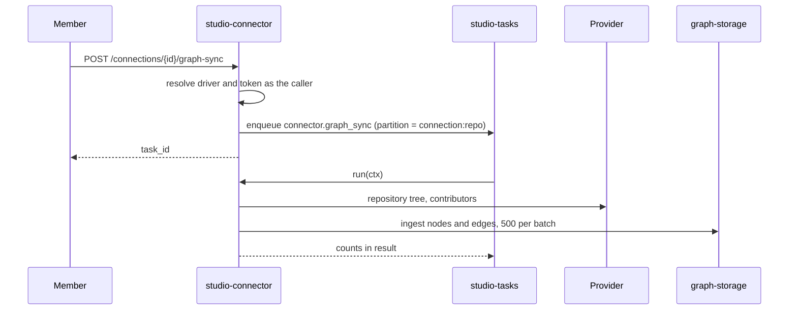

# Technical Design — studio-connector

- [x] `p3` - **ID**: `cpt-studio-design-connector`

The gear-level design of `cpt-studio-component-connector` and its eleven
provider plugin gears. The product-level view, and how this gear sits among
the others, is in [Constructor Studio's design](constructor-studio.md). The
code is [`studio-backend/src/connectors/`](../../studio-backend/src/connectors/).

## Table of Contents

- [1. Architecture Overview](#1-architecture-overview)
- [2. Principles & Constraints](#2-principles--constraints)
- [3. Technical Architecture](#3-technical-architecture)
- [4. Additional context](#4-additional-context)
- [5. Traceability](#5-traceability)

## 1. Architecture Overview

### 1.1 Architectural Vision

The providers Studio talks to, and the credentials it talks with. A connection
is configured once per tenant; everything else — repositories, model keys,
chat channels — is picked from a list.

The portal used to ask for a clone URL, a branch and a `token_ref` for every
repository, in every workspace. That put a secret in the browser's hands on
every launch and made "which repositories do we have" a question nobody could
answer. A connection replaces all of it, and because the API returns the
credstore reference rather than the token, launching a session with private
repositories needs no secret handling in the browser.

There are three kinds of provider and one contract. **Source hosts** (GitHub,
GitLab, Bitbucket) bring repositories in; **model providers** (Anthropic,
OpenAI) hold the key the IDE agents authenticate with; **chat platforms**
(Slack, Zulip, Discord, each with a bot-token and an incoming-webhook variant)
are where notifications are delivered. The difference between them is only
which capabilities of the driver contract a driver implements.

### 1.2 Architecture Drivers

#### Functional Drivers

| Requirement | Design Response |
|-------------|------------------|
| `cpt-studio-fr-connections` | A catalogue of connections in tenant metadata, the token in credstore, one plugin gear per provider, and routes for repositories, targets, messages and files through a connection. |
| `cpt-studio-fr-chat-notifications` | `NotificationSender` gives `cpt-studio-component-notify` `preflight` and `deliver` and nothing else. |

#### NFR Allocation

| NFR ID | NFR Summary | Allocated To | Design Response | Verification Approach |
|--------|-------------|--------------|-----------------|----------------------|
| `cpt-studio-nfr-credential-isolation` | No token in a response | `cpt-studio-component-connector-catalogue` | Tokens are write-only: they arrive on create or patch, go to credstore, and only the reference is kept; a webhook URL is treated as a credential too | `service.rs` and `rest.rs` unit tests; `test-backend` in `studio-delivery.yml` |
| `cpt-studio-nfr-tenant-isolation` | A connection is seen only where it belongs | `cpt-studio-component-connector-catalogue` | The catalogue is tenant metadata read through account-management's inheritance, which stops at self-managed barriers; visibility of the token is credstore's sharing mode | `service.rs` unit tests |

#### Key ADRs

| ADR ID | Decision Summary |
|--------|------------------|
| `cpt-studio-adr-self-service-identity-resolution` | A `personal` connection that passed the provider's test is a proof that its creator controls `account`, which is why it records `created_by` and only its creator may edit it (ADR-0012). |
| `cpt-studio-adr-the-person-is-the-key-not-the-login` | The edit guard compares people, not sign-in subjects (ADR-0025). |

### 1.3 Architecture Layers

| Layer | Responsibility | Technology |
|-------|---------------|------------|
| REST | Catalogue, probe, and each provider capability through a connection | `OperationBuilder` routes in `rest.rs` |
| Service | The catalogue, credstore, driver dispatch, the write composition | `service.rs` |
| Drivers | One provider's API each | `ConnectorDriver` in `driver.rs`; `github.rs`, `gitlab.rs`, `bitbucket.rs`, `ai_providers.rs`, `slack.rs`, `zulip.rs`, `discord.rs` |
| Plugins | Make a driver present in the assembly | `plugin.rs`, one gear per provider |
| Background | Repository import into the knowledge graph | `graph_sync.rs`, `graph_sync_task.rs` (`graph` feature) |
| Storage | None of its own: account-management tenant metadata and credstore | `account-management-sdk`, `credstore-sdk` |

## 2. Principles & Constraints

### 2.1 Design Principles

`cpt-studio-principle-credentials-by-reference` is this gear's first rule.

#### A provider is a plugin

- [x] `p2` - **ID**: `cpt-studio-principle-connector-provider-is-plugin`

Adding a provider means adding a plugin gear, not editing this one. A driver
registers a `PluginV1` instance under `cf.studio.connector.plugin.v1~` and
publishes itself as a ClientHub client scoped to the same GTS instance id; the
connector gear looks up each id it knows, and a provider is present exactly
when its plugin gear is linked. This mirrors the IdP, authn and authz plugin
families.

#### A driver implements only what its provider can do

- [x] `p2` - **ID**: `cpt-studio-principle-connector-refuse-in-own-words`

Every capability past `test()` is a defaulted method that refuses in the
provider's own words. A Slack driver never learns what a repository is, and a
route asked of the wrong kind of connection answers with that refusal as a 4xx
("Slack has no repositories"), not an empty list. Everything tenant-shaped —
which connections exist, who may see them, where the token is kept — belongs
to the service, so adding a provider stays a small, local job.

#### Verify before writing

- [x] `p2` - **ID**: `cpt-studio-principle-connector-verify-first`

A create calls the provider with the credential before anything is stored, so
a typo leaves no dead entry. A patch is verified too, with the new token or
the stored one, so relocating an installation cannot leave a connection that
has never been proven to work; the verified `account` is re-stamped, since a
rotated token may belong to someone else. `POST /probe` verifies without
writing anything.

#### Scope is credstore's sharing mode

- [x] `p2` - **ID**: `cpt-studio-principle-connector-scope-is-sharing`

`personal` maps to credstore `Private`, `workspace` to `Tenant`,
`organization` to `Shared`. Scope needs no enforcement of its own here, and
for the same reason it is not editable: changing who may read a secret is a
delete and a recreate.

#### Moving a connection needs its token

- [x] `p2` - **ID**: `cpt-studio-principle-connector-address-needs-token`

The token is never returned, but it is used: a sync clones from
`{base_url}/{repo}.git`, and git hands the credential to whatever host that
names. A patch that changes `base_url` is refused unless the token comes with
it, so a tenant member cannot point an organization's connection at a host of
their own and read the token out of their access log. Whoever supplies the
credential already holds it, so the move discloses nothing.

### 2.2 Constraints

#### A URL from configuration is checked, not resolved

- [x] `p2` - **ID**: `cpt-studio-constraint-connector-url-guard`

A connection stores an address a person typed, and the backend then calls it
with the connection's credential: a request-forgery primitive. Every address
passes `url_guard::check_url` before use: HTTPS only, no loopback or
private-range literal, no obviously internal name, and for a provider with no
self-hosted form, only that provider's hosts (`HostRule::OneOf`). It is a host
check, not a network policy: a public name that resolves to a private address
still passes, because resolution happens later in `reqwest`. Closing that is an
egress policy on the deployment.

#### Only GitHub reads and writes more than a repository list

- [x] `p2` - **ID**: `cpt-studio-constraint-connector-github-depth`

The GitLab and Bitbucket drivers implement `test` and `list_repositories`
only. Issues, pull requests, commits, files, the repository tree,
contributors, file writes, branches and pull-request creation are GitHub's
alone today, so a repository import or a file publish through any other
source host answers with that driver's refusal.

## 3. Technical Architecture

### 3.1 Domain Model

- [x] `p2` - **ID**: `cpt-studio-entity-connection`

A **connection** is configuration: `id`, `owner_tenant_id`, `provider` (the
driver key), `label`, `account` (whom the credential resolved to at
verification), `base_url`, `secret_ref` (`studio-connection-<id>`, never
returned), `scope` (`personal` | `workspace` | `organization`), `created_by`
and `created_at_epoch_secs`. A tenant's connections are one row of tenant
metadata of type `gts.cf.core.am.tenant_metadata.v1~cf.studio.connector.catalogue.v1~`,
whose schema declares `inheritance_policy: inherit`. Per account-management's
contract the nearest row wins whole: a workspace with a catalogue of its own
shadows its organization's rather than merging with it, and `locate` walks the
levels when a project needs a connection held higher up. `owner_tenant_id` is
recorded because an inherited row does not say whose it was, and both the UI
and `delete` need to know.

A **provider** is a linked driver: key, display name, default base URL,
category (`source_code` | `ai` | `notification`), credential label and hint,
and for a chat provider whether the credential fixes the channel (an incoming
webhook).

### 3.2 Component Model

#### Connection catalogue

- [x] `p2` - **ID**: `cpt-studio-component-connector-catalogue`

##### Why this component exists

One place owns which connections exist, where their tokens are, and how a
driver call is assembled from them.

##### Responsibility scope

`service.rs` (`ConnectorService`): create, list, locate, patch, test, delete;
read a token from credstore per call and hand the driver a `ConnectionAuth`,
never cached; list repositories and targets; send a message; publish a file
(default branch, branch head, create branch, put file, open or reuse a pull
request, composed here so the order is provider-independent);
`delivery_preflight`; and `delete_personal_of`, which `cpt-studio-component-user`
calls to remove a leaver's personal connections. A `personal` connection is
edited only by the person who created it, resolved through studio-user's
`PersonResolver`; without that gear the guard falls back to comparing subjects,
which can refuse an edit that should be allowed, never allow one that should
not. A delete removes the token too, best-effort.

##### Responsibility boundaries

Returns credstore references, never tokens. Does not queue notifications
(`cpt-studio-component-notify` does). Does not decide reach beyond credstore's
sharing mode and account-management's inheritance.

##### Related components (by ID)

- `cpt-studio-component-platform-feature-gears` — stores tokens in credstore
- `cpt-studio-component-account-management` — stores the catalogue as tenant metadata
- `cpt-studio-component-user` — resolves people through

#### Driver plugins

- [x] `p2` - **ID**: `cpt-studio-component-connector-drivers`

##### Why this component exists

Each provider's API is its own small job, and a deployment should carry only
the providers it links.

##### Responsibility scope

`plugin.rs`, one gear per provider, each in a child module because two gears
in one module that both depend on `types_registry` emit the same alias and
fail to compile: `github-connector-plugin`, `gitlab-connector-plugin`,
`bitbucket-connector-plugin`, `anthropic-connector-plugin`,
`openai-connector-plugin`, `slack-connector-plugin`,
`slack-webhook-connector-plugin`, `zulip-connector-plugin`,
`zulip-webhook-connector-plugin`, `discord-connector-plugin`,
`discord-webhook-connector-plugin`. Each registers its instance (vendor
`constructorfabric`, priority 100 by default) and publishes its
`ConnectorDriver`. A profile that does not declare the connector contract
skips the scoped registration instead of failing the boot. Model providers
have no account endpoint, so their `test()` lists models and reports what the
key can reach. The three chat drivers share rendering in `notify.rs`.

##### Responsibility boundaries

Never see the catalogue and never cache a credential.

##### Related components (by ID)

- `cpt-studio-component-connector-catalogue` — is dispatched to by

#### Repository import

- [x] `p2` - **ID**: `cpt-studio-component-connector-graph-sync`

##### Why this component exists

Walking a repository is provider work: the tree and the contributor list come
through the same driver and credential as every other call. The knowledge
graph is only where the result is written.

##### Responsibility scope

`graph_sync.rs` and `graph_sync_task.rs`, task type `connector.graph_sync`,
built only with the `graph` feature. Writes `project ─includes→ repository
─contains→ directory ─contains→ file` and `person ─contributed_to→
repository`, in batches of 500, through `GraphStorageClientV1` in the caller's
tenant. Node keys are derived and carry the repository's full path, so a
re-run converges and two repositories' `src/main.rs` stay two nodes. Progress
crosses from the walk's synchronous callback into the run's phase through a
reporter task. The import used to keep its state in a
`Mutex<HashMap<String, TaskRecord>>` that died with the process; it is a run
now, durable, retried, cancellable.

##### Responsibility boundaries

Truncates rather than refuses a large repository (`max_entries`,
`max_contributors`) and says so in the outcome. The route checks the
connection before enqueuing, so an unusable one is a 400 at once.

##### Related components (by ID)

- `cpt-studio-component-tasks` — runs as a run in
- `cpt-studio-component-graph-storage` — writes to
- `cpt-studio-component-user` — resolves contributor aliases through

### 3.3 API Contracts

- [x] `p2` - **ID**: `cpt-studio-interface-connector-rest`

- **Contracts**: `cpt-studio-interface-rest-api`
- **Technology**: REST/OpenAPI through `api_gateway`
- **Location**: [`studio-backend/docs/api-contract.json`](../../studio-backend/docs/api-contract.json)

**Endpoints Overview**:

| Method | Path | Description | Stability |
|--------|------|-------------|-----------|
| `GET` | `/studio-connector/v1/providers` | The drivers linked into this deployment | unstable |
| `GET` | `/studio-connector/v1/connections` | The caller's tenant catalogue, or the nearest ancestor's | unstable |
| `POST` | `/studio-connector/v1/connections` | Verify, store the token, add; 201 with the account the credential belongs to | unstable |
| `PATCH` | `/studio-connector/v1/connections/{id}` | Relabel, move or rotate; verified before written; id and reference preserved | unstable |
| `DELETE` | `/studio-connector/v1/connections/{id}` | Remove the connection and its token; 204 | unstable |
| `POST` | `/studio-connector/v1/probe` | Verify a credential without storing it | unstable |
| `POST` | `/studio-connector/v1/connections/{id}/test` | Re-verify the stored credential | unstable |
| `GET` | `/studio-connector/v1/connections/{id}/repositories` | Repositories reachable through a source host | unstable |
| `GET` | `/studio-connector/v1/connections/{id}/targets` | Channels a bot-token chat connection can post to | unstable |
| `POST` | `/studio-connector/v1/connections/{id}/messages` | Post once, now, and answer with what the platform said | unstable |
| `POST` | `/studio-connector/v1/connections/{id}/files` | Publish one file as one commit, optionally opening or reusing a pull request | unstable |
| `POST` | `/studio-connector/v1/connections/{id}/graph-sync` | Enqueue a repository import and return the run id; `wait: true` runs it inline (`graph` feature only) | unstable |

Without any driver plugin every route stays mounted and answers 503 with the
reason; `graph-sync` also answers 503 without graph-storage or the task queue.

- [x] `p2` - **ID**: `cpt-studio-interface-connector-notification-sender`

- **Contracts**: none external
- **Technology**: `dyn NotificationSender` in the ClientHub, scope `cf.studio._.notification_sender.v1~` (a hub key, not a types-registry instance)
- **Location**: [`connectors/mod.rs`](../../studio-backend/src/connectors/mod.rs)

Two methods: `preflight` (can this connection deliver, what is its scope, is
its channel fixed) and `deliver`. A consumer may not enumerate connections,
read credentials or reach a driver.

### 3.4 Internal Dependencies

| Dependency Gear | Interface Used | Purpose |
|-------------------|----------------|----------|
| `types_registry` | `TypesRegistryClient` | Catalog the knowledge-graph types; each plugin registers its instance |
| `account_management` | `AccountManagementClient` | The catalogue as tenant metadata, with inheritance |
| `credstore` | `CredStoreClientV1` | Store, read and delete tokens under the scope's sharing mode |
| `cpt-studio-component-tasks` | `TaskQueue`, `registry::register` | The `connector.graph_sync` run |
| `graph_storage` | `GraphStorageClientV1`, resolved in the REST phase | The import's destination |
| `cpt-studio-component-user` | `PersonResolver`, `AliasResolver` (scope `IDENTITY_INSTANCE_ID`) | The personal-connection edit guard; contributor aliases |

Several in-crate gears build their own `ConnectorService` over the drivers
they resolve rather than calling this gear: `cpt-studio-component-components-catalog`,
`cpt-studio-component-user`, the reports gear, and `git_proxy`, which reads
the catalogue only. `cpt-studio-component-artifact-ingest` resolves source
drivers through `source_driver_ids()`, and project sources resolve a
connection with `service::connection_by_id`.

### 3.5 External Dependencies

#### Source hosts, model providers and chat platforms

The contract is `cpt-studio-contract-provider-apis`, defined in the product design.

| Dependency Gear | Interface Used | Purpose |
|-------------------|---------------|---------|
| the eleven driver plugins | Each provider's REST API (GitHub also GraphQL), HTTPS only | Credential tests, repositories, files, pull requests, channels, messages |

### 3.6 Interactions & Sequences

Adding a connection is `cpt-studio-seq-connect-source`.

#### Import a repository into the graph

**ID**: `cpt-studio-seq-connector-graph-sync`

**Actors**: `cpt-studio-actor-member`, `cpt-studio-actor-provider`

**Description**: The run's lifecycle is `cpt-studio-seq-tasks-run`. The caller
polls `GET /studio-tasks/v1/runs/{task_id}` or follows it on `studio-events`.

### 3.7 Database schemas & tables

None. The catalogue is account-management tenant metadata
(`cpt-studio-entity-connection`) and the tokens are credstore secrets, so the
gear has no database and no `database:` block.

### 3.8 Deployment Topology

In-process in the one `studio-backend` binary: gear `studio-connector`,
capabilities `[rest]`, deps `types_registry`, `account_management`,
`credstore`, config section `gears.studio-connector` (empty). Each plugin gear
has deps `types_registry` and config section
`gears.<provider>-connector-plugin` (`vendor`, `priority`). The plugins are
not named anywhere: compiling the module submits them to the link-time
`inventory` registry.

## 4. Additional context

[`docs/notification-connectors.md`](../../docs/notification-connectors.md)
covers the chat drivers: the two credentials per platform and how to choose,
getting each one, sending, and what the drivers do not do.

## 5. Traceability

- **PRD**: [Constructor Studio](../prd/constructor-studio.md)
- **Design**: [Constructor Studio](constructor-studio.md)
- **ADRs**: [ADR-0012](../adr/0012-self-service-identity-resolution.md), [ADR-0025](../adr/0025-the-person-is-the-key-not-the-login.md)
- **Code**: [`studio-backend/src/connectors/`](../../studio-backend/src/connectors/)
