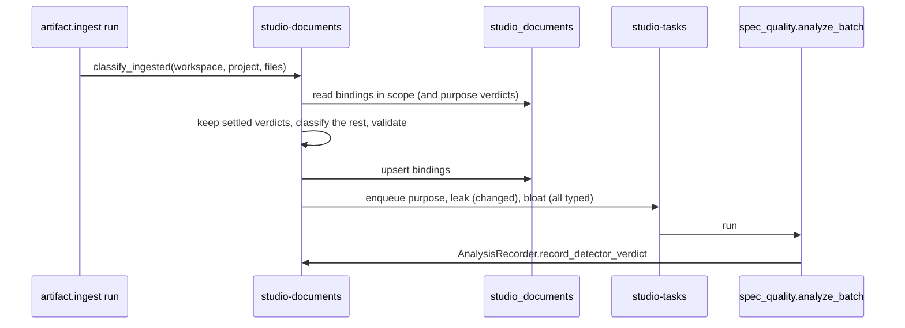

# Technical Design — studio-documents

- [x] `p3` - **ID**: `cpt-studio-design-documents`

The gear-level design of `cpt-studio-component-documents`. The product-level
view, and how this gear sits among the others, is in
[Constructor Studio's design](constructor-studio.md). The code is
[`studio-backend/src/documents/`](../../studio-backend/src/documents/).

## Table of Contents

- [1. Architecture Overview](#1-architecture-overview)
- [2. Principles & Constraints](#2-principles--constraints)
- [3. Technical Architecture](#3-technical-architecture)
- [4. Additional context](#4-additional-context)
- [5. Traceability](#5-traceability)

## 1. Architecture Overview

### 1.1 Architectural Vision

A specification is not free text. An organization has opinions about what a
PRD contains, what stage a project is at, and whether a document is finished.
This gear makes those opinions data: a document **type** carries a markdown
template, a section checklist and structural conformance rules, so "is this
document complete" has an answer that is not a person reading it.

Documents reach a project two ways. Somebody writes one in Studio, and its
content is a column here; or the repository already had one, and a sync binds
the file to a type. The binding records a verdict and a path, never the text:
the text is read from the checkout when it is needed. Both kinds are folded
into one list of specs per project, and both are judged by the same template
check and the same Spec Quality detectors.

Storage scope is always the **workspace** tenant. A document's or binding's
`project_id` distinguishes project-owned from inherited (`NULL` is
workspace-level, visible to every project in it), so inheritance is a column
filter rather than a cross-tenant read, and a project's document list is one
query.

### 1.2 Architecture Drivers

#### Functional Drivers

| Requirement | Design Response |
|-------------|------------------|
| `cpt-studio-fr-document-catalogue` | Types, stages and capabilities are rows keyed `(tenant_id, key)` at organization or workspace level, overlaid on built-ins in that order; a `hidden` row is a tombstone. |
| `cpt-studio-fr-documents` | Workspace- and project-level documents with create-from-template, questionnaire composition (`intake.rs`), structural validation (`validate.rs`) and per-project stage status. |
| `cpt-studio-fr-repository-documents` | `classify.rs` decides a file's type from its front matter, then from four scored signals; the verdict is a row in `studio_document_bindings` keyed on the file's graph node. |
| `cpt-studio-fr-spec-quality` | Detector verdicts are recorded per document in `studio_document_analyses`; a stage can gate on them. Analysis of a project's documents is queued as a `spec_quality.analyze_batch` run. |

#### NFR Allocation

| NFR ID | NFR Summary | Allocated To | Design Response | Verification Approach |
|--------|-------------|--------------|-----------------|----------------------|
| `cpt-studio-nfr-tenant-isolation` | Every allow stays in the caller's tenant subtree | `DocumentsService::authorize` | Every route resolves the workspace or project tenant through account-management under the caller's `SecurityContext` before touching a row; reads use the secure ORM scoped to that tenant | `repo_tests.rs` against the shared test PostgreSQL (`test_pg.rs`) |
| `cpt-studio-nfr-list-pagination` | One paging contract | REST layer | Document, binding and analysis lists take `PageQuery` (`offset`/`limit`) | `api_contract` drift test |

#### Key ADRs

| ADR ID | Decision Summary |
|--------|------------------|
| `cpt-studio-adr-document-types-are-components` | A catalogue key is an instance of one document-type GTS type, not a type of its own; organization and workspace overrides sit on the built-ins; stages move to the backend. |
| `cpt-studio-adr-types-registry-catalogs-meaning-graph-storage-contracts-storage` | The document GTS types are cataloged in the types-registry; the rows are this gear's. |

### 1.3 Architecture Layers

| Layer | Responsibility | Technology |
|-------|---------------|------------|
| REST | Catalogue, documents, bindings, analyses, spec rows, review criteria | `OperationBuilder` routes in `rest.rs` |
| Service | Catalogue overlay, authorization, classification, sync analysis | `service.rs` |
| Domain | Types, templates, stages, capabilities; classification, validation, intake, review guides | `model.rs`, `classify.rs`, `validate.rs`, `intake.rs`, `review_guide.rs`, `spec_rows.rs` |
| Ports | What other gears may ask of this one | `port.rs`, published on the ClientHub |
| Storage | Six tables | PostgreSQL database `studio_documents`, SeaORM entities in `entity.rs` |

## 2. Principles & Constraints

### 2.1 Design Principles

#### Workspaces own documents; projects inherit them

- [x] `p2` - **ID**: `cpt-studio-principle-documents-workspace-scope`

Every document and binding is stored against the workspace tenant. A project
reads its own rows plus the workspace's (`project_id IS NULL OR project_id =
?`). A route given a project resolves the workspace it hangs from, and a
project that hangs from nothing is refused rather than read against the wrong
rows.

#### Inheriting a catalogue needs no permission on the level that published it

- [x] `p2` - **ID**: `cpt-studio-principle-documents-catalogue-overlay`

A workspace's effective catalogue is the built-ins, overlaid by its
organization's rows, overlaid by its own, read in one query with
`AccessScope::for_tenants([organization, workspace])`. The organization is taken
from the workspace's own `parent_id`, never from a second `get_tenant`:
account-management answers `NotFound` outside the caller's subtree, and an
ordinary workspace member has no scope on the organization. A level hides an
inherited entry with a tombstone (`hidden`) rather than deleting what is not
its own; deleting its own row reverts to what it inherits.

**ADRs**: `cpt-studio-adr-document-types-are-components`

#### A verdict that cost something is never re-guessed

- [x] `p2` - **ID**: `cpt-studio-principle-documents-keep-verdicts`

Classifying again after a re-sync updates the same rows (the binding id is a
uuid5 of workspace, project and node). A binding a person ruled on keeps its
type, and so does one Spec Quality typed: that answer cost an LLM round trip,
and the offline scoring already had its turn and did not settle it. Only the
conformance is refreshed against the current text. A file whose front matter
declares its type and whose text passes that type's template is bound as
`confirmed` without a person; either one missing, it stays a proposal.

#### The server joins the specs and their text

- [x] `p2` - **ID**: `cpt-studio-principle-documents-server-joins`

Which files are specs is this gear's; their text is whoever holds the
checkout's (`artifact_ingest::port::RepoFileReader`). The browser used to join
the two, reading every file out through REST and posting it back to be
analysed, and folding bindings, authored documents and every ingested file into
the Specs list. Both joins happen here now (`quality.rs`, `spec_rows.rs`), so a
second portal cannot fold them differently. Which documents deserve a detector
stays the caller's decision; only the reading moved.

### 2.2 Constraints

#### The gear stands down without a database

- [x] `p2` - **ID**: `cpt-studio-constraint-documents-optional-database`

With no `database:` block the gear logs it, registers no routes and publishes
no ports, rather than failing the boot. Every consumer treats an absent port
as "do not classify" or "no names", never as an error. Registration of the
document GTS types is best-effort for the same reason: the gear has its own
storage and does not need the registry to work.

#### Classification is offline and bounded

- [x] `p2` - **ID**: `cpt-studio-constraint-documents-offline-classify`

`classify.rs` uses nothing but the file and the type definitions: a winner
needs a score of at least `0.45` and a lead of `0.08` over the runner-up, and
anything else comes back undetermined with its candidates. Only prose paths
(`md`, `markdown`, `txt`, `rst`, `adoc`, `asciidoc`, outside `.cf-studio`,
`.claude` and `.github`, and not `CLAUDE.md` or `AGENTS.md`) can be
documents; any other path is recorded as `not_a_document`. Asking the
`purpose` detector about the leftover set is the caller's step, recorded with
source `spec_quality`.

## 3. Technical Architecture

### 3.1 Domain Model

- [x] `p2` - **ID**: `cpt-studio-entity-documents-catalogue`

A **document type** couples a key to a template specification: a markdown
skeleton, an ordered section checklist, structural rules, an optional
questionnaire and an optional review guide. The built-ins are the five types
Spec Quality analyses (`prd`, `adr`, `design`, `decomposition`, `feature`),
with templates in [`templates/`](../../studio-backend/src/documents/templates/)
and review criteria vendored under
[`review/`](../../studio-backend/src/documents/review/README.md). A **stage**
is a step of the journey (built-ins `intent` through `testing`, spaced by ten)
that may require document types and detector gates. A **capability** is a
word a document may declare, with the terms that find components providing it.

A **document** is authored in Studio, with a status ladder `draft` → `review`
→ `approved` that never moves back. A **binding** is a repository file bound to
a type, in state `detected`, `confirmed`, `manual`, `unknown` or
`not_a_document`. An **analysis** is one detector's gate verdict (`pending`,
`passed`, `failed`) on exactly one document or binding.

The four GTS types registered for discovery are
`gts.cf.studio.doc.document_type.v1~`, `gts.cf.studio.doc.document.v1~`,
`gts.cf.studio.process.stage.v1~` and `gts.cf.studio.process.capability.v1~`.

### 3.2 Component Model

#### Classifier

- [x] `p2` - **ID**: `cpt-studio-component-documents-classifier`

##### Why this component exists

A file pulled from an existing repository names no type, and it cannot be
validated until something decides which template applies.

##### Responsibility scope

`classify.rs` and `DocumentsService::classify_ingested`: the declared type
from front matter (`type`, `doc_type`, `document_type` or `kind`), else a
score from the required sections the file contains, its path, its title and
the front-matter keys it fills. Scores derive from each type's own definition,
so a workspace's type is detected on the same terms as a built-in. Writes the
bindings in one upsert, with the validation report, the declared capabilities
and a `content_sha` per file. `forget_ingested` deletes the bindings of files
a repository no longer has, in the same `(tenant, project)` scope.

##### Responsibility boundaries

Does not read the repository; the caller hands it paths and text. Does not
call a detector to classify.

##### Related components (by ID)

- `cpt-studio-component-artifact-ingest` — called by, through `port::DocumentClassifier`

#### Sync analysis

- [x] `p2` - **ID**: `cpt-studio-component-documents-sync-analysis`

##### Why this component exists

A sync already reads every file and compares each binding's `content_sha`, so
it is the one place that knows for free which documents are new or changed.
Analysing those then is what makes findings exist without anybody pressing a
button; analysing only those is what makes a re-sync of an unchanged
repository cost nothing.

##### Responsibility scope

`DocumentsService::analyze_synced`: queues `spec_quality.analyze_batch` runs,
`purpose` and `leak` over the changed typed documents (then those never given
a `purpose` verdict) and `bloat` over every typed document the sync read when
there are at least two, each capped at `analyze_on_sync_max_documents`. Each
run carries a `record` block so it records its own results.

##### Responsibility boundaries

Never fails the sync, and does nothing while Spec Quality has no key or
studio-tasks has no queue.

##### Related components (by ID)

- `cpt-studio-component-tasks` — enqueues runs on
- `cpt-studio-component-spec-quality` — runs the batch handler of

#### Spec fold

- [x] `p2` - **ID**: `cpt-studio-component-documents-spec-fold`

##### Why this component exists

A reader wants one answer to "what specs do we have, and are they any good",
not two lists merged by eye.

##### Responsibility scope

`spec_rows.rs`: `/spec-rows` folds bindings, authored documents and the
ingested files (`artifact_ingest::port::ArtifactFiles`) into rows with an
`origin` (`repository` or `authored`) and the queues each row is in
(`not-scanned`, `needs-review`, `bound`, `not-documents`); `/spec-pipeline`
answers what a project has of each type it declares; `/specs-per-source`
counts per repository. `port::DocumentCounter` gives the portfolio rollup the
same counts.

##### Responsibility boundaries

The ingested-file list is optional: without the ingest gear the rows still
carry authored documents and bindings, and say so through `files_known`.

##### Related components (by ID)

- `cpt-studio-component-artifact-ingest` — reads files from

### 3.3 API Contracts

- [x] `p2` - **ID**: `cpt-studio-interface-documents-rest`

- **Contracts**: `cpt-studio-interface-rest-api`
- **Technology**: REST/OpenAPI through `api_gateway`
- **Location**: [`studio-backend/docs/api-contract.json`](../../studio-backend/docs/api-contract.json)

**Endpoints Overview** (prefix `/studio-documents/v1`; `{level}` is
`organizations/{organization_id}` or `workspaces/{workspace_id}`):

| Method | Path | Description | Stability |
|--------|------|-------------|-----------|
| `GET` `POST` | `/{level}/types`, `/{level}/stages`, `/{level}/capabilities` | The effective catalogue; define, replace or hide an entry at that level | unstable |
| `DELETE` | `/{level}/types/{key}`, `/{level}/stages/{key}`, `/{level}/capabilities/{key}` | Revert the level's own entry to what it inherits | unstable |
| `GET` `POST` | `/workspaces/{workspace_id}/documents`, `/workspaces/{workspace_id}/projects/{project_id}/documents` | List (a project's own plus inherited) and create from a type | unstable |
| `GET` `PUT` `DELETE` | `/workspaces/{workspace_id}/documents/{id}` | One document | unstable |
| `POST` | `/workspaces/{workspace_id}/documents/{id}/validate` | Re-run the structural check | unstable |
| `PUT` | `/workspaces/{workspace_id}/documents/{id}/analyses/{detector}`, `/workspaces/{workspace_id}/document-bindings/{id}/analyses/{detector}` | Record a detector's verdict | unstable |
| `GET` | `/workspaces/{workspace_id}/projects/{project_id}/analyses` | Every verdict for a project's documents | unstable |
| `GET` | `/workspaces/{workspace_id}/projects/{project_id}/stage-status` | Where a project stands against its stages | unstable |
| `POST` | `/workspaces/{workspace_id}/document-bindings/classify`, `/workspaces/{workspace_id}/projects/{project_id}/document-bindings/classify` | Classify the files given in the body | unstable |
| `GET` | `/workspaces/{workspace_id}/document-bindings`, `/workspaces/{workspace_id}/projects/{project_id}/document-bindings` | List bindings | unstable |
| `PUT` `DELETE` | `/workspaces/{workspace_id}/document-bindings/{id}` | Confirm, correct, reject or reset; forget | unstable |
| `GET` | `/document-bindings/{id}/text?project_id=` | A bound file's text, from the checkout | unstable |
| `POST` | `/workspaces/{workspace_id}/projects/{project_id}/quality/{detector}` | Queue a detector over named bindings, documents and inline texts | unstable |
| `GET` | `/spec-rows`, `/spec-pipeline`, `/specs-per-source` | The folded spec views | unstable |
| `GET` | `/review-criteria?type_key=&project_id=` | The semantic criteria a type is judged by, with ids a verdict can cite | unstable |

A quality request may carry at most 20 inline documents of 256 KiB each and
1 MiB in total (`quality.rs`).

In process the gear publishes four ports on the ClientHub (`port.rs`):
`DocumentClassifier` and `BindingNames` for the ingest gear,
`DocumentCounter` for the portfolio rollup, and `AnalysisRecorder` for a Spec
Quality run recording its own verdicts.

### 3.4 Internal Dependencies

| Dependency Gear | Interface Used | Purpose |
|-------------------|----------------|----------|
| `account_management` | SDK client | Authorize the workspace or project tenant; read the workspace's parent |
| `types_registry` | SDK client | Register the four document GTS types, best-effort |
| `cpt-studio-component-artifact-ingest` | `RepoFileReader`, `ArtifactFiles` from the ClientHub, resolved per request | A bound file's text; the ingested file list |
| `cpt-studio-component-tasks` | `TaskQueue` from the ClientHub | Queue Spec Quality batch runs |
| `cpt-studio-component-spec-quality` | `spec_quality::sdk` | Queue and read analyses |

It publishes `port::SpecNeeds` for `cpt-studio-component-spec-mapping`: a
project's workspace, the vocabulary, and what its documents need. What a
document needs is computed here when it is written or synced, with the rules of
`spec_mapping::sdk`, and stored beside it.

### 3.5 External Dependencies

#### PostgreSQL

| Dependency Gear | Interface Used | Purpose |
|-------------------|---------------|---------|
| `cpt-studio-component-documents` | `toolkit-db` (SeaORM, raw-SQL migrations) | The six tables of §3.7 |

### 3.6 Interactions & Sequences

`cpt-studio-seq-classify-documents` is the product-level view of a member
classifying a project's documents.

#### A sync classifies and analyses what changed

**ID**: `cpt-studio-seq-documents-sync-classify`

**Use cases**: `cpt-studio-usecase-classify-documents`

**Actors**: `cpt-studio-actor-member`

**Description**: The sync hands the text it already read; the documents gear
decides and records, and the runs it queues record their own verdicts, so a
stage gate is answered for an analysis nobody watched.

### 3.7 Database schemas & tables

- [x] `p3` - **ID**: `cpt-studio-db-documents`

Database `studio_documents`. PostgreSQL only: the migrations are raw SQL so
the `CHECK` and `UNIQUE` constraints are kept verbatim.

#### Table: studio_document_bindings

**ID**: `cpt-studio-dbtable-document-bindings`

**Schema**:

| Column | Type | Description |
|--------|------|-------------|
| `id` | UUID | uuid5 of tenant, project and node; re-classifying is an upsert |
| `tenant_id` | UUID | the workspace tenant |
| `project_id` | UUID | the project, or `NULL` at workspace level |
| `node_id` | TEXT | the `artifact.file` graph node of the file |
| `path` | TEXT | repository path |
| `type_key` | TEXT | the bound type, `NULL` while undetermined |
| `state` | TEXT | `detected`, `confirmed`, `manual`, `unknown` or `not_a_document` |
| `confidence` | REAL | 0.0–1.0 |
| `source` | TEXT | `front_matter`, `heuristic`, `spec_quality` or `manual` |
| `candidates` | TEXT | other types it might be, with reasons |
| `conforms` | BOOLEAN | the validation verdict |
| `validation` | TEXT | the full validation report |
| `capabilities` | TEXT | JSON list the file's front matter declares, re-derived on every classification |
| `requirements` | TEXT | JSON list of the file's non-functional statements (`m0013`) |
| `inferred_capabilities` | TEXT | JSON list of what its functional requirements imply, with the requirements behind each, when its front matter declares none (`m0014`) |
| `content_sha` | TEXT | digest, so a stale verdict is distinguishable |
| `created_at`, `updated_at` | TIMESTAMPTZ | |

**PK**: `id`

**Constraints**: `CHECK` on `state` and on `source`.

**Additional info**: Indexes on `(tenant_id, project_id)` and `(tenant_id,
state)`. The primary key is the uniqueness constraint, since a `UNIQUE` over
the nullable `project_id` would treat every `NULL` as distinct. See
[`docs/documents-from-a-repository.md`](../documents-from-a-repository.md).

**Example**:

| path | state | source |
|--------|--------|--------|
| `docs/prd/constructor-studio.md` | `detected` | `front_matter` |

#### Table: studio_document_types

**ID**: `cpt-studio-dbtable-document-types`

**Schema**:

| Column | Type | Description |
|--------|------|-------------|
| `id` | UUID | uuid5 of owner tenant and key |
| `tenant_id` | UUID | organization or workspace that defines it |
| `key`, `name`, `description` | TEXT | `key` is 1–80 characters |
| `gts_type_id` | TEXT | |
| `template` | TEXT | the template specification |
| `hidden` | BOOLEAN | a tombstone hiding the inherited entry of this key |
| `created_at`, `updated_at` | TIMESTAMPTZ | |

**PK**: `id`

**Constraints**: `UNIQUE (tenant_id, key)`.

**Additional info**: A row shadows the built-in or inherited entry of its key
rather than sitting beside it. `m0009` narrowed the catalogue to five types,
moving `app_spec` and `upstream_reqs` documents, bindings and stage
requirements to `prd`; `m0010` deletes the rows `m0009` re-keyed.

**Example**:

| key | name |
|--------|--------|
| `prd` | Product Requirements (PRD) |

#### Table: studio_process_stages

**ID**: `cpt-studio-dbtable-process-stages`

**Schema**:

| Column | Type | Description |
|--------|------|-------------|
| `id` | UUID | uuid5 of owner tenant and key |
| `tenant_id` | UUID | organization or workspace that defines it |
| `key`, `label` | TEXT | `key` is 1–80 characters |
| `required` | BOOLEAN | cannot be dropped from a project's selection |
| `ordinal` | INTEGER | position in the sequence |
| `requires` | TEXT | JSON list of document-type keys |
| `gates` | TEXT | JSON list of detectors every required document must pass |
| `hidden` | BOOLEAN | tombstone |
| `created_at`, `updated_at` | TIMESTAMPTZ | |

**PK**: `id`

**Constraints**: `UNIQUE (tenant_id, key)`.

**Additional info**: A table of its own rather than a discriminator on the
type table: the two catalogues share resolution rules, not columns.

**Example**:

| key | label | required |
|--------|--------|--------|
| `intent` | Intent | `true` |

#### Table: studio_process_capabilities

**ID**: `cpt-studio-dbtable-process-capabilities`

**Schema**:

| Column | Type | Description |
|--------|------|-------------|
| `id` | UUID | uuid5 of owner tenant and key |
| `tenant_id` | UUID | organization or workspace that defines it |
| `key`, `label` | TEXT | `key` is 1–80 characters |
| `terms` | TEXT | JSON list of words that make a component a candidate |
| `contracts` | TEXT | JSON list of contracts the Gearbox engine can report a gear providing (`m0012`) |
| `nonfunctional` | BOOLEAN | answered by the deployment profile, never by a gear (`m0013`) |
| `hidden` | BOOLEAN | tombstone |
| `created_at`, `updated_at` | TIMESTAMPTZ | |

**PK**: `id`

**Constraints**: `UNIQUE (tenant_id, key)`.

**Additional info**: An empty `terms` matches the key itself.

**Example**:

| key | terms |
|--------|--------|
| `auth` | `["auth","oidc","keycloak",…]` |

#### Table: studio_documents

**ID**: `cpt-studio-dbtable-documents`

**Schema**:

| Column | Type | Description |
|--------|------|-------------|
| `id` | UUID | |
| `tenant_id` | UUID | the workspace tenant |
| `project_id` | UUID | the project, or `NULL` at workspace level |
| `type_key`, `title`, `content` | TEXT | |
| `status` | SMALLINT | `0` draft, `1` review, `2` approved |
| `conforms` | BOOLEAN | the structural verdict |
| `validation` | TEXT | the full validation report |
| `capabilities` | TEXT | JSON list the front matter declares, re-derived on every write |
| `requirements` | TEXT | JSON list of its non-functional statements (`m0013`) |
| `inferred_capabilities` | TEXT | as for a binding (`m0014`) |
| `created_by` | TEXT | |
| `created_at`, `updated_at` | TIMESTAMPTZ | |

**PK**: `id`

**Constraints**: none beyond the key.

**Additional info**: Index on `(tenant_id, project_id)`. `capabilities` is an
index over the document's own front matter, not a second place to store them,
so a hand edit cannot drift from it. `requirements` and `inferred_capabilities` are
indexes the same way, computed by `spec_mapping::sdk` on every write; they
are read through `port::SpecNeeds` by `cpt-studio-component-spec-mapping`.

**Example**:

| type_key | status |
|--------|--------|
| `prd` | `0` |

#### Table: studio_document_analyses

**ID**: `cpt-studio-dbtable-document-analyses`

**Schema**:

| Column | Type | Description |
|--------|------|-------------|
| `id` | UUID | |
| `tenant_id` | UUID | the workspace tenant |
| `document_id` | UUID | `studio_documents.id`, `ON DELETE CASCADE` |
| `binding_id` | UUID | `studio_document_bindings.id`, `ON DELETE CASCADE` |
| `detector` | TEXT | 1–80 characters |
| `state` | TEXT | `pending`, `passed` or `failed` |
| `task_id` | TEXT | the upstream task the verdict was read from |
| `summary` | TEXT | |
| `created_at`, `updated_at` | TIMESTAMPTZ | |

**PK**: `id`

**Constraints**: `CHECK` that exactly one of `document_id` and `binding_id` is
set; `UNIQUE (document_id, detector)`; unique index on `(binding_id, detector)`
where `binding_id` is set.

**Additional info**: Index on `(tenant_id, document_id)`. The cascade is in the
schema so a verdict about a deleted document goes with it on every path that
deletes one.

**Example**:

| detector | state |
|--------|--------|
| `purpose` | `passed` |

### 3.8 Deployment Topology

In-process in the one `studio-backend` binary: gear `studio-documents`,
capabilities `[db, rest]`, config section `gears.studio-documents`.

## 4. Additional context

[`docs/documents-from-a-repository.md`](../documents-from-a-repository.md)
explains why a binding is kept instead of a copy of the file, and
[`docs/spec-findings.md`](../spec-findings.md) how the findings a sync records
reach the editor.

## 5. Traceability

- **PRD**: [Constructor Studio](../prd/constructor-studio.md)
- **Design**: [Constructor Studio](constructor-studio.md)
- **ADRs**: [ADR index](../adr/README.md)
- **Code**: [`studio-backend/src/documents/`](../../studio-backend/src/documents/)
