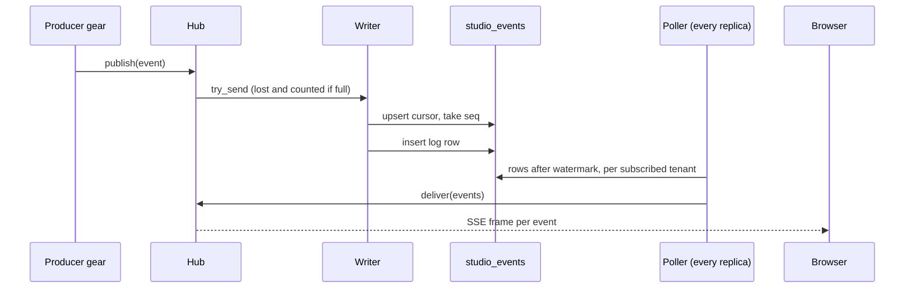
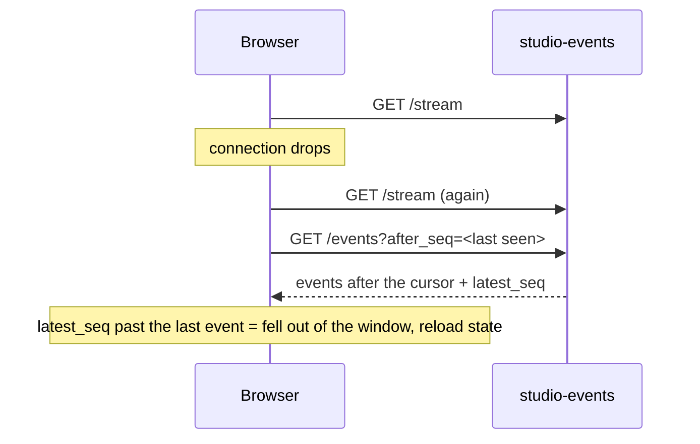

# Technical Design — studio-events

- [x] `p3` - **ID**: `cpt-studio-design-events`

The gear-level design of `cpt-studio-component-events`. The product-level view,
and how this gear sits among the others, is in
[Constructor Studio's design](constructor-studio.md). The code is
[`studio-backend/src/studio_events/`](../../studio-backend/src/studio_events/).

## Table of Contents

- [1. Architecture Overview](#1-architecture-overview)
- [2. Principles & Constraints](#2-principles--constraints)
- [3. Technical Architecture](#3-technical-architecture)
- [4. Additional context](#4-additional-context)
- [5. Traceability](#5-traceability)

## 1. Architecture Overview

### 1.1 Architectural Vision

One place where any gear says "this happened", and one place the portal
subscribes. A producer states `kind` and `subject` and puts its own vocabulary
in `payload`; the channel assigns `seq` and `at_ms`, keeps a short replay
window, and pushes each event to the subscribers of its tenant over SSE.

The channel used to be per process: a broadcaster per tenant, a `VecDeque` of
recent events and a counter handing out `seq`. Two replicas then meant two
independent sequences for one tenant. An event published on one never reached
a subscriber on the other, and a reconnect that landed on the other replayed a
different window under the same cursor, without an error. The sequence and
the window are now rows in PostgreSQL. What stays per process is only the set
of SSE connections a replica holds open.

The contract is the one a broker-backed implementation would serve, so the
producers and the portal do not change when `event-broker` replaces the
storage underneath.

### 1.2 Architecture Drivers

#### Functional Drivers

| Requirement | Design Response |
|-------------|------------------|
| `cpt-studio-fr-push-channel` | One tenant-scoped SSE stream, a replay route by cursor, and one in-process publisher every producer resolves from the ClientHub. |

#### NFR Allocation

| NFR ID | NFR Summary | Allocated To | Design Response | Verification Approach |
|--------|-------------|--------------|-----------------|----------------------|
| `cpt-studio-nfr-durable-work` | The event sequence survives a restart | `cpt-studio-component-events` | The per-tenant sequence is a row in `studio_events_cursor`, and the replay window is `studio_events_log`; neither is process memory | `studio_events/store_tests.rs` against the shared test PostgreSQL (`test_pg.rs`) |
| `cpt-studio-nfr-tenant-isolation` | Nothing leaves the caller's tenant | `cpt-studio-component-events-hub` | The tenant comes from the security context, never from a parameter; fan-out is one broadcaster per tenant, and every store query is scoped to one tenant | `hub.rs` unit tests (`one_tenants_events_do_not_reach_another`) |

#### Key ADRs

| ADR ID | Decision Summary |
|--------|------------------|
| `cpt-studio-adr-studio-events-push-channel` | One domain-neutral push channel; producers publish through the ClientHub; Theia is a producer, not the contract; delivery is at-least-once with replay by cursor. |

### 1.3 Architecture Layers

| Layer | Responsibility | Technology |
|-------|---------------|------------|
| REST | The live stream and the replay page | `OperationBuilder` routes in `rest.rs`, `toolkit::SseBroadcaster` |
| Publisher seam | Accept an event from a producer without blocking or failing it | `api.rs`, `hub.rs`, a bounded `tokio::sync::mpsc` queue |
| Pump | Write queued events to the log; read the log for local subscribers; prune | `pump.rs`, two background tasks |
| Storage | The sequence and the replay window | `store.rs`, PostgreSQL database `studio_events` |

## 2. Principles & Constraints

### 2.1 Design Principles

The channel is domain-neutral: `cpt-studio-principle-one-push-channel` in the
product design is this gear's first rule. The ones below are its own.

#### Publishing never fails the producer

- [x] `p2` - **ID**: `cpt-studio-principle-events-publish-infallible`

`StudioEventPublisher::publish` is synchronous and returns nothing. Producers
call it from inside locks and from cleanup paths, and an event that cannot be
delivered must never fail the operation that produced it. `publish` stamps
`at_ms` and hands the event to the writer with `try_send`. When the queue is
full the event is lost and counted, and the warning is logged for the first
loss and then at every power of ten, so the reason is not buried under its own
symptom.

**ADRs**: `cpt-studio-adr-studio-events-push-channel`

#### Every replica reads the log, including the one that published

- [x] `p2` - **ID**: `cpt-studio-principle-events-one-delivery-path`

There is no local shortcut from `publish` to the local subscribers. A shortcut
would give them a different ordering and a different latency from the
subscribers on other replicas, and that difference would only show under load,
in production, on one replica.

#### The tenant comes from the security context

- [x] `p2` - **ID**: `cpt-studio-principle-events-tenant-from-context`

Both routes take the tenant from `SecurityContext::subject_tenant_id()`, never
from a query parameter, so a client cannot ask for another tenant's events.
The sequence is per tenant rather than global for the same reason: a client's
cursor stays dense, and no tenant can infer another's volume from the gaps in
its own.

#### Off is better than half on

- [x] `p2` - **ID**: `cpt-studio-principle-events-stand-down`

Without a `database:` block the gear registers no publisher, so producers
publish nothing, and both routes answer 503 with the reason. A channel that
looks connected and delivers to one replica's worth of users is worse than one
that says it is off. `cpt-studio-component-tasks` takes the same shape.

### 2.2 Constraints

#### A window, not a ledger

- [x] `p2` - **ID**: `cpt-studio-constraint-events-window`

The log keeps the last `backlog` events per tenant (500 by default) and is
pruned to that depth. It is sized for a reconnect, not for history. A client
that falls further behind sees `latest_seq` run past the last event it holds,
and reloads its state the ordinary way. A pruned `seq` is never reissued,
because the cursor row is never touched by pruning.

**ADRs**: `cpt-studio-adr-studio-events-push-channel`

#### The delivery delay is the poll interval

- [x] `p2` - **ID**: `cpt-studio-constraint-events-poll`

Each replica reads the log every `poll_ms` (500 ms by default) for the tenants
it has a subscriber for. An event reaches a browser between zero and that long
after it was written. `LISTEN`/`NOTIFY` would be faster, but it needs a
connection held outside the pool for the life of the process, one per replica,
out of a connection budget that is already tight. Swapping the poll for
`LISTEN` later changes `pump.rs` and nothing else.

#### Sequence and log are two statements

- [x] `p2` - **ID**: `cpt-studio-constraint-events-seq-gaps`

`append` takes the tenant's next number with an upsert on
`studio_events_cursor` (`ON CONFLICT DO UPDATE` takes the row lock, so two
publishers on two replicas leave with 7 and 8, not both with 7), then inserts
the log row. The two are not one transaction: wrapping them would hold the
cursor lock across the log write and serialize a tenant's publishers on it. If
the insert fails after the number was taken, that `seq` is never written.
Clients need `seq` to be monotonic, not dense, so the gap is harmless. Its only
visible effect is a client that sees `latest_seq` one ahead and re-fetches.

PostgreSQL only: the sequence relies on row-level locking under the upsert.

## 3. Technical Architecture

### 3.1 Domain Model

- [x] `p2` - **ID**: `cpt-studio-entity-studio-event`

An **event** is `{ seq, at_ms, kind, subject_type, subject_id, source,
payload }`. The producer states `kind` (dotted, past tense, e.g.
`task.succeeded`; clients filter on the first segment), `subject_type` and
`subject_id` (what it happened to), `source` (the gear that observed it) and
`payload` (passed through verbatim). The channel assigns `seq`, per tenant and
monotonic, and `at_ms`, epoch milliseconds at publish. A producer cannot forge
the order or backdate an event.

The same DTO (`StudioEventDto`) is an SSE frame and an element of the replay
page, so a client parses one shape whether it arrived live or was replayed.
The vocabulary in use is [`docs/events-catalog.md`](../events-catalog.md).

### 3.2 Component Model

#### Hub

- [x] `p2` - **ID**: `cpt-studio-component-events-hub`

##### Why this component exists

Producers need a seam that never blocks them, and each replica needs to know
which of its SSE connections belong to which tenant.

##### Responsibility scope

`hub.rs`: implements `StudioEventPublisher`; keeps, per tenant, a
`SseBroadcaster` with a buffer of `buffer` frames (256 by default) and a
watermark, the highest `seq` already pushed into it. A new channel starts
unaligned and is aligned to the tenant's current mark without delivering
anything: a subscriber that just connected wants what happens next, and the
gap before it is what the replay route is for.

##### Responsibility boundaries

Holds no sequence and no history. A subscriber that falls more than `buffer`
frames behind drops frames (tokio broadcast semantics) and recovers by cursor.

##### Related components (by ID)

- `cpt-studio-component-events-pump` — hands events to, and is fed by

#### Pump

- [x] `p2` - **ID**: `cpt-studio-component-events-pump`

##### Why this component exists

Something has to move events from the publish queue into the log, and from
the log to this replica's subscribers.

##### Responsibility scope

`pump.rs`, two tasks. The **writer** drains the queue (`queue` events deep,
1024 by default) and appends each event; it is the only thing that writes. A
failed append is logged and not retried, since a retry loop would hold the
queue against a database that is already struggling. The **poller** wakes every
`poll_ms`, aligns unaligned channels, reads up to 500 events per tenant after
each watermark, and delivers them. Every 600 polls (about five minutes at the
default interval) it prunes each subscribed tenant's log to `backlog`. Every
replica prunes; the delete is bounded by the tenant's own mark, so two doing it
at once remove the same rows.

##### Responsibility boundaries

Stops on shutdown without draining: events still queued are lost, the same
best-effort promise `publish` makes, rather than holding a shutdown open for a
database that may be the reason for it.

##### Related components (by ID)

- `cpt-studio-component-events-hub` — delivers into

### 3.3 API Contracts

- [x] `p2` - **ID**: `cpt-studio-interface-events-rest`

- **Contracts**: `cpt-studio-interface-push-channel`
- **Technology**: Server-sent events and REST/OpenAPI through `api_gateway`
- **Location**: [`studio-backend/docs/api-contract.json`](../../studio-backend/docs/api-contract.json)

**Endpoints Overview**:

| Method | Path | Description | Stability |
|--------|------|-------------|-----------|
| `GET` | `/studio-events/v1/stream` | The live stream for the caller's tenant. Frames are unnamed (`data:` only) and the type is the JSON's `kind`; keep-alive comments every 15 s | stable |
| `GET` | `/studio-events/v1/events` | The retained window, oldest first: `after_seq` (default 0) returns only what is newer, `limit` defaults to 200 and is clamped to 500; the page carries `latest_seq`, the tenant's high-water mark | stable |

Frames are unnamed because the frontx `SseProtocol` binds only `onmessage`,
which never fires for a named frame. How the portal consumes the stream is
[`studio-frontend/docs/studio-events.md`](../../studio-frontend/docs/studio-events.md).

- [x] `p2` - **ID**: `cpt-studio-interface-events-publisher`

- **Contracts**: none external
- **Technology**: `dyn StudioEventPublisher` registered in the ClientHub in `init`
- **Location**: [`studio_events/api.rs`](../../studio-backend/src/studio_events/api.rs)

A producer resolves the publisher lazily, per event, because gear init order is
not guaranteed; a producer that cannot find it publishes nothing. Today's
producers are `cpt-studio-component-tasks` (the dispatcher, `subject_type`
`task_run`) and `cpt-studio-component-theia-bridge` (`StudioEventsSink`,
`subject_type` `workspace`).

### 3.4 Internal Dependencies

None: the gear declares no `deps`. Producers depend on it, never the reverse.

### 3.5 External Dependencies

#### PostgreSQL

| Dependency Gear | Interface Used | Purpose |
|-------------------|---------------|---------|
| `cpt-studio-component-events` | `toolkit-db` (SeaORM, secure ORM scoped per tenant) | The sequence and the replay window |

### 3.6 Interactions & Sequences

#### Publish and deliver

**ID**: `cpt-studio-seq-events-publish-deliver`

**Actors**: `cpt-studio-actor-shell`, `cpt-studio-actor-mfe`

**Description**: The producer returns as soon as the event is queued. Every
replica, including the publishing one, learns about the event by reading the
log.

#### Reconnect without a gap

**ID**: `cpt-studio-seq-events-reconnect`

**Actors**: `cpt-studio-actor-shell`, `cpt-studio-actor-mfe`

**Description**: The live stream starts at "now"; the replay page closes the
gap. A client that starts a job reads the cursor before starting it, since a
run that finishes in 300 ms is otherwise over before the stream is open.

### 3.7 Database schemas & tables

- [x] `p3` - **ID**: `cpt-studio-db-events`

Database `studio_events`.

#### Table: studio_events_log

**ID**: `cpt-studio-dbtable-events-log`

**Schema**:

| Column | Type | Description |
|--------|------|-------------|
| `tenant_id` | UUID | |
| `seq` | BIGINT | per-tenant sequence |
| `at_ms` | BIGINT | |
| `kind`, `subject_type`, `subject_id`, `source` | TEXT | |
| `payload` | JSONB | |

**PK**: `(tenant_id, seq)`

**Constraints**: none beyond the key. Every column is `NOT NULL`; `payload`
defaults to JSON `null`.

**Additional info**: `studio_events_cursor` keeps `latest_seq` per tenant. Both
reads (`WHERE tenant_id = $1 AND seq > $2 ORDER BY seq`) are answered by the
primary key, so there is no second index on a table whose write rate is its
whole cost. Pruned to the configured `backlog` per tenant.

**Example**:

| kind | subject_type |
|--------|--------|
| see [`docs/events-catalog.md`](../events-catalog.md) | |

#### Table: studio_events_cursor

**ID**: `cpt-studio-dbtable-events-cursor`

**Schema**:

| Column | Type | Description |
|--------|------|-------------|
| `tenant_id` | UUID | |
| `latest_seq` | BIGINT | the last `seq` handed out; default 0 |

**PK**: `tenant_id`

**Constraints**: `latest_seq NOT NULL`.

**Additional info**: The only row two replicas contend on. The upsert that
advances it takes the row lock, which serializes concurrent publishers. Never
decremented and never pruned.

**Example**:

| tenant_id | latest_seq |
|--------|--------|
| `00000000-0000-0000-0000-000000000001` | `1873` |

### 3.8 Deployment Topology

In-process in the one `studio-backend` binary: gear `studio-events`,
capabilities `[rest, db, stateful]`, no deps, config section
`gears.studio-events` (`buffer` 256, `backlog` 500, `queue` 1024, `poll_ms`
500). The database pool is `max_conns: 2`: the traffic is one small insert per
event and one indexed read per subscribed tenant per poll, and every
connection counts against `pg_main`'s budget.

## 4. Additional context

ADR-0026 §4 and its consequences describe the window as per process and the
fan-out as needing a single replica. That was true when it was written; the
database described here removed both limits for this gear. The single-replica
limit that remains is the backend's, `cpt-studio-constraint-single-replica-sessions`.
The `seq` doc comment in `dto.rs` still says "per-process"; it is per tenant.

## 5. Traceability

- **PRD**: [Constructor Studio](../prd/constructor-studio.md)
- **Design**: [Constructor Studio](constructor-studio.md)
- **ADRs**: [ADR-0026](../adr/0026-studio-events-push-channel.md)
- **Vocabulary**: [events catalog](../events-catalog.md)
- **Code**: [`studio-backend/src/studio_events/`](../../studio-backend/src/studio_events/)
