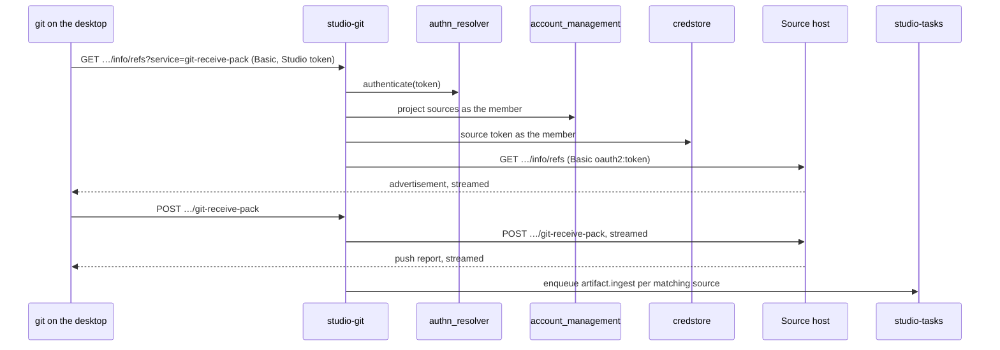

# Technical Design — studio-git

- [x] `p3` - **ID**: `cpt-studio-design-git`

The gear-level design of `cpt-studio-component-git-proxy`. The product-level
view, and how this gear sits among the others, is in
[Constructor Studio's design](constructor-studio.md). The code is
[`studio-backend/src/git_proxy/`](../../studio-backend/src/git_proxy/).

## Table of Contents

- [1. Architecture Overview](#1-architecture-overview)
- [2. Principles & Constraints](#2-principles--constraints)
- [3. Technical Architecture](#3-technical-architecture)
- [4. Additional context](#4-additional-context)
- [5. Traceability](#5-traceability)

## 1. Architecture Overview

### 1.1 Architectural Vision

The Git remote a desktop session clones from (ADR-0027 §3). A desktop must
not hold a source host's token, so its clones do not point at the source host.
They point here: a Git smart-HTTP proxy that authenticates the member's own
Studio token, finds the repository among the workspace's sources under that
member's identity, reads the repository's token from credstore and attaches it
on the way upstream. It is `studio-llm-proxy`'s pattern applied to Git: the
member holds an identity, the server holds the key.

The backend learns about the code when it is pushed, not before. A push that
goes through the proxy queues, for each project source it went to, the
`artifact.ingest` run the portal's Re-sync would queue, so the tree the graph is
built from is the pushed tree.

### 1.2 Architecture Drivers

#### Functional Drivers

| Requirement | Design Response |
|-------------|------------------|
| `cpt-studio-fr-ide-session` | A desktop session clones and pushes the workspace's sources through `/studio-git/v1/workspaces/{workspace_id}/sources/{source}/…`, with the same sources a container session clones. |
| `cpt-studio-fr-artifact-ingest` | A push through the proxy queues the source's `artifact.ingest` run. |

#### NFR Allocation

| NFR ID | NFR Summary | Allocated To | Design Response | Verification Approach |
|--------|-------------|--------------|-----------------|----------------------|
| `cpt-studio-nfr-credential-isolation` | No Git token on a member's machine or in a response | `cpt-studio-component-git-proxy` | The source host's URL and token never leave the backend: the listing returns a gateway path and whether a token is attached; the token is added upstream and the caller's `Authorization` is never forwarded | `git_proxy` unit tests (`sources.rs`, `refresh.rs`) in the `test-backend` job |
| `cpt-studio-nfr-tenant-isolation` | Every allow stays in the caller's tenant subtree | `cpt-studio-component-git-proxy` | The sources are read under the caller's `SecurityContext`; account-management answers only for a tenant the caller reaches | Same |

#### Key ADRs

| ADR ID | Decision Summary |
|--------|------------------|
| `cpt-studio-adr-a-desktop-session-keeps-the-secrets-on-the-server` | Code moves through Git, and Git goes through the backend (ADR-0027 §3). |
| `cpt-studio-adr-a-shared-session-is-many-people-each-as-themselves` | Repository access goes through the backend under the caller's token (ADR-0030, proposed). |

### 1.3 Architecture Layers

| Layer | Responsibility | Technology |
|-------|---------------|------------|
| REST | The source listing and the three smart-HTTP routes | `OperationBuilder` routes in `rest.rs` |
| Decisions | Upstream URL, the presented token, the upstream credential | `sources.rs`, plain functions |
| Refresh | Which syncs a push asks for | `refresh.rs` |
| Transport | Stream the request up and the answer back | `reqwest` with a 10-second connect timeout and no overall timeout |

## 2. Principles & Constraints

### 2.1 Design Principles

#### Reading the sources is the access decision

- [x] `p2` - **ID**: `cpt-studio-principle-git-read-is-decision`

The workspace's sources come from its config (`project_sources`), read
through account-management as the caller. A workspace the caller does not
reach has no sources to them, and is a 404 like one that does not exist. The
proxy decides only who may reach the workspace; what a push may do is the
source host's decision, made against the stored token.

#### The gear authenticates its own protocol routes

- [x] `p2` - **ID**: `cpt-studio-principle-git-own-authentication`

`git` sends Basic credentials and the api-gateway reads only Bearer, so the
three protocol routes are `.anonymous().exposed()` and the gear authenticates
them itself through the AuthN resolver, the same one the gateway uses: a token
the portal accepts is accepted here, and one it refuses is refused here. The
token is the Basic password (the user name is ignored) or a Bearer token. A
request without one is answered 401 with a `Basic` challenge, because without
it `git` never asks its credential helper.

#### Refusals are written for the person running `git`

- [x] `p2` - **ID**: `cpt-studio-principle-git-plain-refusals`

`git` prints a failed response's body, so each refusal is plain text that says
what to do. A source host that refuses the stored token is answered 403, not
its own 401: passing that through would make `git` ask for credentials to this
host again, which cannot help.

### 2.2 Constraints

#### Only http(s) sources

- [x] `p2` - **ID**: `cpt-studio-constraint-git-http-only`

An `ssh://` or `git@host:` source cannot be proxied over HTTP, and a `file://`
one would let a workspace setting read the backend's disk. Only `http://` and
`https://` clone URLs are served, and only the services `git-upload-pack` and
`git-receive-pack`.

#### A push's sync is best-effort and after the fact

- [x] `p2` - **ID**: `cpt-studio-constraint-git-sync-after-push`

The sync is queued once the source host's push report has been streamed back,
because the report is sent after its refs have moved and a sync queued earlier
could fetch the tree from before. By then the push has succeeded, so a sync
that cannot be queued is logged, never answered. A push to a repository through
a connection the member cannot see re-syncs nothing.

## 3. Technical Architecture

### 3.1 Domain Model

A **source** is one Git source of a project as a session or a desktop clones
it: name, clone URL, branch, checkout target and the credstore reference of its
token (`git_proxy::sources::Source`, shared with `studio-session`). The clone
URL and the reference are never returned to a client. A source whose
connection is personal carries no token reference, because a session several
people share must not carry it.

### 3.2 Component Model

#### Smart-HTTP relay

- [x] `p2` - **ID**: `cpt-studio-component-git-relay`

##### Why this component exists

`git` speaks the smart-HTTP protocol, and the desktop's credential helper
answers this host with the Studio token and nothing else.

##### Responsibility scope

`rest.rs`: authenticate, find the source by name, build the upstream URL as
`git` would (`…/info/refs?service=…`, `…/git-upload-pack`,
`…/git-receive-pack`), read the token from credstore as the caller (unreadable
is 403), send it upstream as `Basic oauth2:<token>`, and stream the answer back.
Forwarded upstream: `content-type`, `content-encoding`, `accept`, `user-agent`,
`git-protocol`. Passed back: `content-type`, `content-encoding`,
`cache-control`, `expires`, `pragma`.

##### Responsibility boundaries

Holds nothing between requests. A large clone costs the backend bandwidth, not
memory.

##### Related components (by ID)

- `cpt-studio-component-account-management` — reads the project's sources through
- `cpt-studio-component-platform-feature-gears` — reads source tokens from credstore
- `cpt-studio-component-product` — reuses its authentication and relay for the gear corpus

#### Push refresh

- [x] `p2` - **ID**: `cpt-studio-component-git-push-refresh`

##### Why this component exists

Work pushed from a laptop is otherwise invisible to the server until somebody
presses Re-sync.

##### Responsibility scope

`refresh.rs` and `GitProxy::refresh_after_push`: after a 2xx
`git-receive-pack`, find every source of the project that names the pushed
repository, resolve its connection by id through the connection catalogue (read
only), and enqueue one `artifact.ingest` run per distinct partition key with the
payload the portal's Re-sync sends, coalescing with a queued one and notifying
the project's open IDE session.

##### Responsibility boundaries

Does not ingest; `cpt-studio-component-artifact-ingest` does, as a run.

##### Related components (by ID)

- `cpt-studio-component-tasks` — enqueues into
- `cpt-studio-component-artifact-ingest` — queues its run
- `cpt-studio-component-connector` — reads the connection catalogue of

### 3.3 API Contracts

- [x] `p2` - **ID**: `cpt-studio-interface-git-rest`

- **Contracts**: `cpt-studio-interface-rest-api`; the Git smart-HTTP protocol
- **Technology**: REST/OpenAPI through `api_gateway`
- **Location**: [`studio-backend/docs/api-contract.json`](../../studio-backend/docs/api-contract.json)

**Endpoints Overview**:

| Method | Path | Description | Stability |
|--------|------|-------------|-----------|
| `GET` | `/studio-git/v1/sources?project_id=` | The workspace's Git sources, each with its gateway-rooted `clone_path`, branch, target and whether a token is attached; paged | unstable |
| `GET` | `/studio-git/v1/workspaces/{workspace_id}/sources/{source}/info/refs?service=` | Ref advertisement, the first request of every clone, fetch and push | unstable |
| `POST` | `/studio-git/v1/workspaces/{workspace_id}/sources/{source}/git-upload-pack` | Clone and fetch | unstable |
| `POST` | `/studio-git/v1/workspaces/{workspace_id}/sources/{source}/git-receive-pack` | Push | unstable |

The listing is authenticated by the gateway; the protocol routes are anonymous
to the platform and authenticated by the gear.

### 3.4 Internal Dependencies

| Dependency Gear | Interface Used | Purpose |
|-------------------|----------------|----------|
| `authn_resolver` (`cpt-studio-component-platform-system`) | `AuthNResolverClient` | Authenticate the token `git` presents |
| `cpt-studio-component-account-management` | `AccountManagementClient` | The project's sources and its parent workspace |
| `credstore` (`cpt-studio-component-platform-feature-gears`) | `CredStoreClientV1` | Source tokens, as the caller |
| `cpt-studio-component-connector` | `connectors::sdk::Connectors` (the one `ConnectorService`, resolved from the ClientHub; only its catalogue is read) | The connection a pushed source syncs through |
| `cpt-studio-component-tasks` | `TaskQueue`, resolved per push | The `artifact.ingest` run |

All three gear clients are required: the gear fails the boot rather than answer
500s without them.

### 3.5 External Dependencies

#### Source hosts

- Contract: `cpt-studio-contract-provider-apis`

| Dependency Gear | Interface Used | Purpose |
|-------------------|---------------|---------|
| `cpt-studio-component-git-proxy` | Git smart-HTTP | Clone, fetch and push with the workspace's stored token |

### 3.6 Interactions & Sequences

#### Push from a desktop

**ID**: `cpt-studio-seq-git-push`

**Actors**: `cpt-studio-actor-member`

**Description**: Each request authenticates on its own; nothing is kept
between them.

### 3.7 Database schemas & tables

None.

### 3.8 Deployment Topology

In-process in the one `studio-backend` binary, in every build: gear
`studio-git`, capabilities `[rest]`, deps `account_management`, `credstore`,
`authn_resolver`. No config section.

## 4. Additional context

The desktop side is `theia/studio/src/node/desktop-git.ts` and the token
broker beside it. `product` (studio-product) serves the gear corpus over the same
relay (`authenticate_member`, `send_upstream`, `stream_back`), fetch only.

## 5. Traceability

- **PRD**: [Constructor Studio](../prd/constructor-studio.md)
- **Design**: [Constructor Studio](constructor-studio.md)
- **ADRs**: [ADR index](../adr/README.md)
- **Code**: [`studio-backend/src/git_proxy/`](../../studio-backend/src/git_proxy/)
