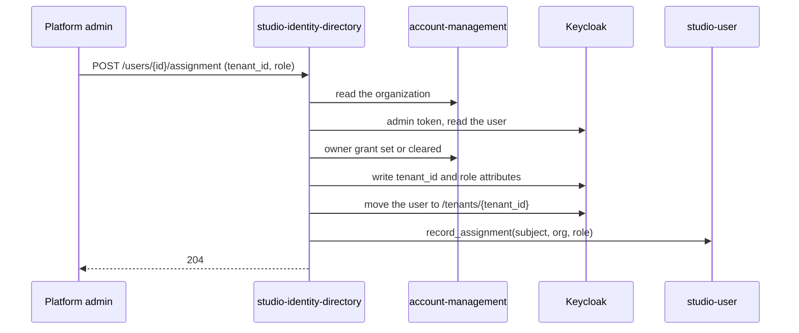

# Technical Design — studio-identity-directory

- [x] `p3` - **ID**: `cpt-studio-design-identity-directory`

The gear-level design of `cpt-studio-component-identity-directory`. The
product-level view, and how this gear sits among the others, is in
[Constructor Studio's design](constructor-studio.md). The code is
[`studio-backend/src/identity_directory/`](../../studio-backend/src/identity_directory/).

## Table of Contents

- [1. Architecture Overview](#1-architecture-overview)
- [2. Principles & Constraints](#2-principles--constraints)
- [3. Technical Architecture](#3-technical-architecture)
- [4. Additional context](#4-additional-context)
- [5. Traceability](#5-traceability)

## 1. Architecture Overview

### 1.1 Architectural Vision

A platform administrator's view of every identity in Studio's Keycloak realm,
including the ones that belong to no organization yet.

Account-management lists users only inside one tenant. That is the right answer
for almost everything and the wrong one for onboarding: somebody who signed in
but was never assigned is, by construction, in no tenant, so no tenant-scoped
list can show them, and the administrator who should place them cannot see that
they are waiting. Authentication does not grant membership, so the gap is
deliberate; this gear is the view it needs.

The Keycloak Admin API and its credential stay on the server. The portal never
talks to Keycloak; it gets a root-scoped projection, and the canonical person
record stays `cpt-studio-component-user`'s. The same connection also serves
`cpt-studio-component-user` two narrow reads: the accounts brokered onto a
subject, and the address the realm has verified for it.

### 1.2 Architecture Drivers

#### Functional Drivers

| Requirement | Design Response |
|-------------|------------------|
| `cpt-studio-fr-identity-directory` | `GET /users` reads the realm and marks each identity `unassigned`, `assigned` or `platform_admin`; `POST /users/{id}/assignment` places one. |
| `cpt-studio-fr-invitations-membership` | Assignment records the Studio membership through `AssignmentRecorder`; `verified_email` is the only address an invitation is matched against. |
| `cpt-studio-fr-canonical-user` | `federated_accounts` is the IdP proof channel the confirmation ceremony reads. |

#### Key ADRs

| ADR ID | Decision Summary |
|--------|------------------|
| `cpt-studio-adr-authentication-does-not-grant-organization-membership` | A signed-in person may belong to no organization; the directory is where an administrator sees and places them. |
| `cpt-studio-adr-membership-is-recorded-where-assignment-happens` | Assignment writes the Studio membership, not only the IdP attribute; the backfill writes it for earlier assignments. |
| `cpt-studio-adr-a-brokered-login-is-a-proof-of-control` | Keycloak names the account a brokered login resolved to, and only from the per-user federated-identity endpoint. |
| `cpt-studio-adr-an-identity-proves-it-is-you-and-decides-nothing-else` | The administrator gate is a membership of the platform root, not the token's tenant. |

### 1.3 Architecture Layers

| Layer | Responsibility | Technology |
|-------|---------------|------------|
| REST | List, assign, backfill, behind the platform-admin gate | `OperationBuilder` routes in `rest.rs` |
| Interface | `IdpDirectoryReader` for `cpt-studio-component-user` | Trait in `mod.rs`, published on the ClientHub |
| Service | Realm reads, projection, assignment | `service.rs` over `reqwest` |
| External | Keycloak Admin API, realm `studio`, client `studio-admin` | client-credentials token per call |

## 2. Principles & Constraints

### 2.1 Design Principles

#### An attribute is a request, not an assignment

- [x] `p2` - **ID**: `cpt-studio-principle-identity-directory-attribute-not-assignment`

The `tenant_id` attribute on a realm user is written by whoever provisioned it
and proves nothing. The directory resolves it through account-management as the
caller; an attribute naming a tenant that does not resolve is dropped, and the
identity reads as `unassigned`. A stale or forged attribute must not make
somebody look placed. Service accounts are not listed: they never sign in.

#### One subject at a time

- [x] `p2` - **ID**: `cpt-studio-principle-identity-directory-one-subject`

`IdpDirectoryReader` answers about one subject, read-only, and
`cpt-studio-component-user` asks it only about the person signed in. A bulk or
arbitrary-subject read would be an account-enumeration surface.
`verified_email` returns an address only when the realm marks it verified,
lowercased; an unverified address is a claim by whoever typed it.

#### Every write of an assignment, or a failure that says so

- [x] `p2` - **ID**: `cpt-studio-principle-identity-directory-assignment-complete`

Assignment writes four things in order: the owner grant in the organization's
access config (set for `owner`, cleared for `member`), the realm user's
`tenant_id` and `studio_organization_role` attributes, the user's group under
`/tenants/{tenant_id}` (removing the other tenant groups), and the Studio
membership. There is no transaction across Keycloak and PostgreSQL, so the last
write is not optional: a failure there names the identity and tells the
administrator to re-run the assignment, which is idempotent. The attribute and
the group are both kept because tokens read the attribute while
account-management lists a tenant's users from the group.

**ADRs**: `cpt-studio-adr-membership-is-recorded-where-assignment-happens`

### 2.2 Constraints

#### A read of the whole realm, with a ceiling

- [x] `p2` - **ID**: `cpt-studio-constraint-identity-directory-page-ceiling`

The listing reads the realm in pages of 200, at most ten pages, and sorts
afterwards — newest first, ties by username. Past the ceiling the answer carries
`truncated: true`: the list is then part of the directory, not its first page,
and the people waiting may be among those missing. The identity provider of each
listed user needs one more request per user (Keycloak ships no federated
identities on a user representation); those run eight at a time, and a failure
leaves that label empty rather than failing the list.

#### No Keycloak admin, no directory

- [x] `p2` - **ID**: `cpt-studio-constraint-identity-directory-unconfigured`

Without `STUDIO_IDP_ADMIN_BASE_URL` and `STUDIO_IDP_ADMIN_SECRET` the gear
publishes no reader and its routes answer 503. `cpt-studio-component-user` then
has no IdP proof channel and no verified addresses, so brokered logins confirm
nothing and invitations cannot be accepted.

## 3. Technical Architecture

### 3.1 Domain Model

- [x] `p2` - **ID**: `cpt-studio-entity-identity-directory-identity`

A **directory identity** is one realm user as the directory reports it: id,
username, e-mail, display name, identity provider, first-seen time, status
(`unassigned`, `assigned`, `platform_admin`), home tenant and its name, and the
organization role attribute. A **federated account** is one external account
brokered onto a realm user: provider alias, the provider's user id and handle.
Nothing is stored; every answer is read from Keycloak.

### 3.2 Component Model

#### Directory service

- [x] `p2` - **ID**: `cpt-studio-component-identity-directory-service`

##### Why this component exists

The Keycloak Admin API is a credential the browser must never hold.

##### Responsibility scope

`service.rs`: fetch an admin token, list and project the realm, read one user's
verified address and federated accounts, assign, and backfill — every identity
whose attribute names an existing organization gets a membership recorded with
its role attribute or `member`, and one failure is counted and logged rather
than abandoning the rest.

##### Responsibility boundaries

A read-only projection plus one write path; not a second user store.

##### Related components (by ID)

- `cpt-studio-component-keycloak` — reads from and writes assignments to
- `cpt-studio-component-account-management` — resolves tenants through
- `cpt-studio-component-access-config` — writes the owner grant through
- `cpt-studio-component-user` — records memberships through, and serves the proof channel to

### 3.3 API Contracts

- [x] `p2` - **ID**: `cpt-studio-interface-identity-directory-rest`

- **Contracts**: `cpt-studio-interface-rest-api`
- **Technology**: REST/OpenAPI through `api_gateway`
- **Location**: [`studio-backend/docs/api-contract.json`](../../studio-backend/docs/api-contract.json)

**Endpoints Overview**:

| Method | Path | Description | Stability |
|--------|------|-------------|-----------|
| `GET` | `/studio-identity/v1/users` | Every identity in the realm, with whether it is assigned, and `truncated` | stable |
| `POST` | `/studio-identity/v1/users/{identity_id}/assignment` | Place an identity into an organization as `owner` or `member` | stable |
| `POST` | `/studio-identity/v1/memberships/backfill` | Record memberships for identities the IdP already calls assigned | stable |

Every route is platform-admin only (`PLATFORM_ADMIN_REQUIRED`): a membership of
the platform root, read through `OrganizationReader`. Without
`cpt-studio-component-user` the gate refuses. The backfill answers 503 when
there is nowhere to record memberships.

In process, `IdpDirectoryReader` is published under
`cf.studio._.idp_directory.v1~`.

### 3.4 Internal Dependencies

| Dependency Gear | Interface Used | Purpose |
|-------------------|----------------|----------|
| `cpt-studio-component-account-management` | SDK client | Resolve home tenants; write the owner grant |
| `cpt-studio-component-user` | `AssignmentRecorder`, `OrganizationReader` from the ClientHub, resolved in the REST phase | Record memberships; the platform-admin gate |

### 3.5 External Dependencies

#### Keycloak Admin API

| Dependency Gear | Interface Used | Purpose |
|-------------------|---------------|---------|
| `cpt-studio-component-keycloak` | `cpt-studio-contract-keycloak-oidc` token endpoint, then `/admin/realms/studio/…` | Users, federated identities, groups, attributes |

The HTTP client connects within 10 seconds and gives up on a call after 30.

### 3.6 Interactions & Sequences

#### Assign an identity

**ID**: `cpt-studio-seq-identity-directory-assign`

**Actors**: `cpt-studio-actor-platform-admin`, `cpt-studio-actor-keycloak`

**Description**: The IdP representations come first and the membership last;
each write is idempotent, so a failure is repaired by repeating the call.

### 3.7 Database schemas & tables

None. The gear stores nothing.

### 3.8 Deployment Topology

In-process in the one `studio-backend` binary: gear
`studio-identity-directory`, capabilities `[rest]`, deps `account_management`.
It reads no config section; the Keycloak admin connection comes from the
environment.

## 4. Additional context

The organization owner's view of their own people is
`/studio-user/v1/organizations/{org_id}/members`, tenant-scoped; this directory
is for the platform administrator only.

## 5. Traceability

- **PRD**: [Constructor Studio](../prd/constructor-studio.md)
- **Design**: [Constructor Studio](constructor-studio.md)
- **ADRs**: [ADR index](../adr/README.md)
- **Code**: [`studio-backend/src/identity_directory/`](../../studio-backend/src/identity_directory/)
