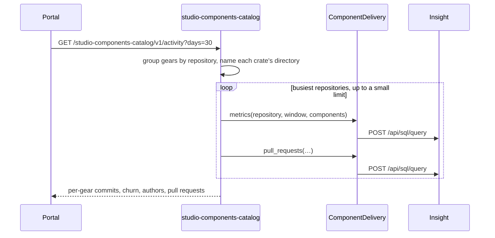

# Technical Design — studio-insight

- [x] `p3` - **ID**: `cpt-studio-design-insight`

The gear-level design of `cpt-studio-component-insight`. The product-level
view, and how this gear sits among the others, is in
[Constructor Studio's design](constructor-studio.md). The code is
[`studio-backend/src/insight/`](../../studio-backend/src/insight/).

## Table of Contents

- [1. Architecture Overview](#1-architecture-overview)
- [2. Principles & Constraints](#2-principles--constraints)
- [3. Technical Architecture](#3-technical-architecture)
- [4. Additional context](#4-additional-context)
- [5. Traceability](#5-traceability)

## 1. Architecture Overview

### 1.1 Architectural Vision

The integration seam to Constructor Insight
(`github.com/constructorfabric/insight`), a decision-intelligence platform
whose REST API is rooted at `/api`. Insight is a separate product with its own
deployment, its own credential and its own evolving contract. Rather than let
each gear that wants it grow its own HTTP client and its own copy of the base
URL, this gear is the assembly's one place of contact, so when the contract
moves, one module changes.

It moved once already. The gear was written against an assumed `/api/v1` and a
generic `pull`/`push` pair; checked against the live deployment, `/api/v1` and
every path under it answer 404, and the surface Insight actually exposes is a
single read-only SQL endpoint over its ClickHouse warehouse,
`cpt-studio-contract-insight-sql`. That endpoint is typed here as
`InsightClient::query`; `pull` and `push` stay as the generic resource-plus-JSON
escape hatch for whatever Insight publishes next.

### 1.2 Architecture Drivers

#### Functional Drivers

| Requirement | Design Response |
|-------------|------------------|
| `cpt-studio-fr-delivery-insight` | One gear holds the client and the token; REST for the portal, `InsightClient` and `ComponentDelivery` on the ClientHub for other gears; per-component metrics and pull requests built from Insight's per-file records. |

#### NFR Allocation

| NFR ID | NFR Summary | Allocated To | Design Response | Verification Approach |
|--------|-------------|--------------|-----------------|----------------------|
| `cpt-studio-nfr-credential-isolation` | No secret in a browser or a response | `cpt-studio-component-insight` | The instance token is resolved from config or the environment and attached server-side; no response carries it | `insight::config` tests |

### 1.3 Architecture Layers

| Layer | Responsibility | Technology |
|-------|---------------|------------|
| REST | Query, component metrics and pull requests, pull, push, health | `OperationBuilder` routes in `rest.rs` |
| Ports | What another gear may ask, in process | `InsightClient` (scoped `cf.studio._.insight.v1~`), `port::ComponentDelivery` (unscoped) |
| Query building | Turn a component map into validated, escaped SQL | `components.rs`, `delivery.rs` |
| Client | One HTTP client, the token, errors split by fault | `client.rs` (`HttpInsightClient`, `reqwest`, 10 s connect, 60 s total) |

## 2. Principles & Constraints

### 2.1 Design Principles

#### Errors name the culprit

- [x] `p2` - **ID**: `cpt-studio-principle-insight-errors-by-fault`

`InsightError` is split by who is at fault. Insight's own 400 or 422 means the
statement was bad, and reaches the caller as a 400 with the upstream's detail
and field violations; an unconfigured or unreachable upstream is a 503; any
other upstream answer is a 500. Otherwise every SQL typo would read as "the
platform is broken".

#### Every interpolated value is validated and escaped

- [x] `p2` - **ID**: `cpt-studio-principle-insight-safe-sql`

Insight only accepts a single read-only `SELECT`, so a broken statement cannot
write anything, but it could still read across the warehouse. Every value the
gear interpolates is validated (charset and shape), which makes a bad one a
clear 400, and escaped as a ClickHouse string literal (`sql_string`), which is
what actually holds if a new caller reaches the builder another way.

#### Components, not repositories

- [x] `p2` - **ID**: `cpt-studio-principle-insight-components`

Insight keys its git metrics by `repository` and nothing finer, but a
repository is not a component: `gears-rust` alone holds about ninety gear
crates under `gears/<area>/<name>/`. Component metrics group the per-file
commit records (`insight.git_commit_file_changes` joined to
`insight.git_authored_commits`) instead of the observations. A component is
derived (the first `depth` path segments, default 2) or declared (a key plus a
`path_prefix`, or a `path_segment` — a directory name matched as a whole path
segment, so `api-gateway` finds `gears/system/api-gateway/…` without anybody
maintaining a crate-to-directory map). The longest matcher wins, so
`credstore-sdk` is not swallowed by `credstore`. On REST the unmatched remainder
is reported as `other`; through `ComponentDelivery` it is left out, because a
catalogue joining rows to gears has nothing to join it to.

### 2.2 Constraints

#### Pull requests are attributed through files

- [x] `p2` - **ID**: `cpt-studio-constraint-insight-pr-attribution`

A pull request belongs to a repository, so there is no component dimension to
group it by; it is attributed through the files its commits changed. One that
touches three components is counted in all three, so the rows do not partition
the repository. Attribution needs the commits in the repository's history:
about 97% of merged pull requests reach their files, against about 29% of closed
and 46% of open ones. Dependable for what shipped, indicative for what did not.

#### Coverage is Insight's

- [x] `p2` - **ID**: `cpt-studio-constraint-insight-coverage`

Populated today: git (37 measures), CI (10) and task (8). The `ai_*`,
`collab_*` and `wiki_*` families exist with the same shape and zero rows. The
person-level gold views (`exec_summary`, `people`, `ic_kpis`) read empty
because only 27 of 179 git author handles are assigned to a person and no HR
source feeds `org_unit_id`. Repository- and component-level questions need
neither, which is why everything this gear exposes sits on that side.

## 3. Technical Architecture

### 3.1 Domain Model

- [x] `p2` - **ID**: `cpt-studio-entity-insight-delivery`

Nothing is stored. Three warehouse shapes per domain matter: `*_metric_observations`
(one person, one day, one measure, one set of dimensions — the repository is a
dimension, not the entity), `*_metric_evidence` (which records made a number)
and the raw tables (`git_commit_file_changes`, `git_authored_commits`,
`git_review_events`, `task_status_spans`), the only place a file path exists.

What the gear answers, in `port.rs`: a **delivery query** (repository as
`owner/name`, an inclusive `YYYY-MM-DD` window, `(key, segment)` per component,
a limit); per component **delivery totals** (commits, files changed, lines
added and removed, authors) with a weekly **series**; and **pull-request
totals** (open, merged, closed, total, mean merged cycle hours — `None` when
nothing merged, which is not zero — and authors). A page carries the window
Insight actually used and whether it truncated the ranking.

### 3.2 Component Model

#### Insight client

- [x] `p2` - **ID**: `cpt-studio-component-insight-client`

##### Why this component exists

One HTTP client, one base URL and one token for the assembly.

##### Responsibility scope

`client.rs`: `query` posts `{"sql": …}` to `{base_url}{api_path}/{sql_resource}`
with the token as a bearer; `pull` forwards a GET and `push` a POST to
`{base_url}{api_path}/{resource}`. Published on the ClientHub under
`INSIGHT_INSTANCE_ID` in `init`, before any REST phase, so a consumer resolving
it in its own REST phase cannot lose a race.

##### Responsibility boundaries

Imposes no shape on a row: rows are passed through as Insight returned them.

##### Related components (by ID)

- `cpt-studio-component-insight-delivery` — is used by

#### Component delivery

- [x] `p2` - **ID**: `cpt-studio-component-insight-delivery`

##### Why this component exists

A catalogue asks "what moved in these gears?" across several repositories, by
crate name. Joining those answers back is the catalogue's rule; reaching
Insight for each repository is this gear's.

##### Responsibility scope

`delivery.rs` implements `port::ComponentDelivery` over the same SQL the REST
surface runs: `metrics` (commits, churn and authors with a weekly trend) and
`pull_requests`, two methods so a caller can lose the second without losing the
first. Limits from `components.rs`: default 50 rows, at most 500, at most 200
components per query.

##### Responsibility boundaries

Holds no rule about what a catalogue's gears mean; that is
`components_catalog::activity`. A consumer must tolerate the port failing,
since every call answers 503 when the upstream is not configured.

##### Related components (by ID)

- `cpt-studio-component-components-catalog` — is called by, for `/activity`

### 3.3 API Contracts

- [x] `p2` - **ID**: `cpt-studio-interface-insight-rest`

- **Contracts**: `cpt-studio-interface-rest-api`, `cpt-studio-contract-insight-sql`
- **Technology**: REST/OpenAPI through `api_gateway`
- **Location**: [`studio-backend/docs/api-contract.json`](../../studio-backend/docs/api-contract.json)

**Endpoints Overview**:

| Method | Path | Description | Stability |
|--------|------|-------------|-----------|
| `POST` | `/studio-insight/v1/query` | Run one read-only statement; columns, rows, `truncated` | unstable |
| `POST` | `/studio-insight/v1/components/metrics` | Delivery metrics for one repository, by component; `bucket` (`day`/`week`/`month`) adds a `series` at the cost of a second upstream query | unstable |
| `POST` | `/studio-insight/v1/components/pull-requests` | Pull requests for one repository, by current state, by component | unstable |
| `POST` | `/studio-insight/v1/pull` | Forward a GET to an Insight resource, answer verbatim | unstable |
| `POST` | `/studio-insight/v1/push` | Forward a POST with a JSON body to an Insight resource | unstable |
| `GET` | `/studio-insight/v1/health` | Whether base URL and key are set and, if so, whether a `SELECT 1` answers | unstable |

`health` runs the `SELECT 1` so an expired or revoked instance token shows up
there rather than in the first dashboard that needs it.

### 3.4 Internal Dependencies

None. The gear declares no gear deps; other gears depend on it through the
ClientHub.

### 3.5 External Dependencies

#### Constructor Insight

The contract is `cpt-studio-contract-insight-sql`, defined in
[Constructor Studio's design](constructor-studio.md#constructor-insight).

| Dependency Gear | Interface Used | Purpose |
|-------------------|---------------|---------|
| `cpt-studio-component-insight` | `POST {base_url}/api/sql/query` with the instance token as a bearer | Every typed operation |

One statement, `SELECT` or `WITH` only; a second statement, a `SHOW` or a write
is refused with a 400 naming the violation. A token anywhere but the bearer is a
401 `INVALID_INSTANCE_TOKEN`. There is no schema endpoint and no OpenAPI
document, so discovery goes through ClickHouse's `system.tables` and
`system.columns`.

### 3.6 Interactions & Sequences

#### Activity per gear

**ID**: `cpt-studio-seq-insight-gear-activity`

**Actors**: `cpt-studio-actor-member`

**Description**: The catalogue owns the grouping and the join; this gear owns
the SQL and the upstream. A pull-request failure leaves the metrics in place.

### 3.7 Database schemas & tables

This gear has no database.

### 3.8 Deployment Topology

In-process in the one `studio-backend` binary: gear `studio-insight`,
capabilities `[rest]`, no gear deps, config section `gears.studio-insight`.

| Setting | Default | Meaning |
|---|---|---|
| `base_url` | empty | The Insight host; `base_url_env` wins when set and non-empty |
| `base_url_env` | `STUDIO_INSIGHT_BASE_URL` | |
| `api_key` | empty | A literal key; wins over `api_key_env` when non-empty |
| `api_key_env` | `STUDIO_INSIGHT_API_KEY` | |
| `api_path` | `/api` | Normalised to one leading slash, no trailing slash |
| `sql_resource` | `sql/query` | Split from `api_path` so the SQL endpoint can move without moving `pull`/`push` |

The profiles name the host and take the token from the environment; on
Kubernetes the chart wires `STUDIO_INSIGHT_API_KEY` from the app Secret. Without
a base URL or a key the gear logs a warning, every call answers 503, and
`health` reports `configured: false`; the backend still boots.

## 4. Additional context

[`studio-backend/docs/insight-quickstart.md`](../../studio-backend/docs/insight-quickstart.md)
records the whole upstream contract, the shape of the warehouse, worked queries
with their real answers, and how to check the wiring.

## 5. Traceability

- **PRD**: [Constructor Studio](../prd/constructor-studio.md)
- **Design**: [Constructor Studio](constructor-studio.md)
- **ADRs**: [ADR index](../adr/README.md)
- **Code**: [`studio-backend/src/insight/`](../../studio-backend/src/insight/)
