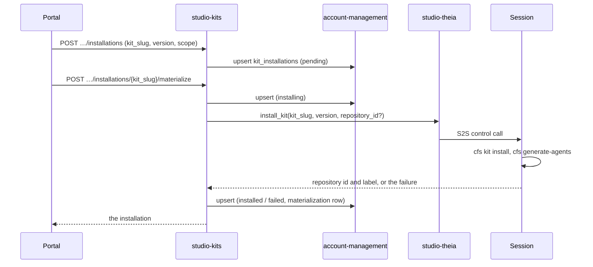

# Technical Design — studio-kits

- [x] `p3` - **ID**: `cpt-studio-design-kits`

The gear-level design of `cpt-studio-component-kits`. The product-level view,
and how this gear sits among the others, is in
[Constructor Studio's design](constructor-studio.md). The code is
[`studio-backend/src/kit_registry/`](../../studio-backend/src/kit_registry/).

## Table of Contents

- [1. Architecture Overview](#1-architecture-overview)
- [2. Principles & Constraints](#2-principles--constraints)
- [3. Technical Architecture](#3-technical-architecture)
- [4. Additional context](#4-additional-context)
- [5. Traceability](#5-traceability)

## 1. Architecture Overview

### 1.1 Architectural Vision

The catalogue of kits, and which kits a project wants installed. A kit is a
bundle of working material — templates, prompts, checklists — that a project
pulls into its checkout.

The kit's bytes stay in their canonical Git repository. A kit is already
versioned where it lives, and a second copy would be a second thing to keep
current. So this gear owns only what Git cannot answer: the catalogue metadata,
and the per-project record of which kits are desired and where they landed.
`cfs` remains the only component that materializes kit files into a checkout;
this gear says what should be there, not how it gets there.

### 1.2 Architecture Drivers

#### Functional Drivers

| Requirement | Design Response |
|-------------|------------------|
| `cpt-studio-fr-kits` | A built-in catalogue, a desired-installation document per project in account-management tenant metadata, and materialize/reconcile calls that ask the project's running session to run `cfs kit install`. |

#### NFR Allocation

| NFR ID | NFR Summary | Allocated To | Design Response | Verification Approach |
|--------|-------------|--------------|-----------------|----------------------|
| `cpt-studio-nfr-credential-isolation` | No secret in a browser | `cpt-studio-component-kits` | The install goes over the S2S-token-gated bridge; the browser never receives the bridge token and never runs kit code | `kit_registry::service` tests; `theia/studio` kit-installer tests |
| `cpt-studio-nfr-list-pagination` | One paging contract | `cpt-studio-component-kits` | Catalogue, installations and repositories take `offset`/`limit` (1..=200, default 50) and return `total` | `api_contract` drift test |

#### Key ADRs

| ADR ID | Decision Summary |
|--------|------------------|
| `cpt-studio-adr-theia-backend-bridge` | The backend reaches a session's node over the S2S bridge; materialize uses it. |
| `cpt-studio-adr-a-desktop-session-keeps-the-secrets-on-the-server` | The backend cannot call a desktop, so a desktop reports its own installs. |
| `cpt-studio-adr-the-desktop-gets-its-tools-as-extensions` | The desktop's Extensions view lists kits and reports installs to `…/materializations` (§4). |

### 1.3 Architecture Layers

| Layer | Responsibility | Technology |
|-------|---------------|------------|
| REST | Catalogue, installations, repositories, materialize, reconcile, report | `OperationBuilder` routes in `rest.rs` |
| Service | Validate, record desired state, call the session, record outcomes | `service.rs` (`KitRegistryService`) |
| Storage | One installation document per project | account-management tenant metadata |
| Runner | Run `cfs kit install` in the checkout | the session's kit installer, through `TheiaControlClientV1` |

## 2. Principles & Constraints

### 2.1 Design Principles

#### Desired state here, bytes in Git

- [x] `p2` - **ID**: `cpt-studio-principle-kits-desired-state-only`

The gear records intent (`scope`: where a kit belongs) and observation
(`materializations`: where it is, at which version). Removing an installation
deletes the desired-state entry and leaves files already in a checkout alone.

#### The runner decides what it runs

- [x] `p2` - **ID**: `cpt-studio-principle-kits-runner-validates`

Slug, version and install mode are normalized here — a slug is lowercase
letters, digits and hyphens up to 80 characters; a version is a safe Git ref up
to 120 characters with no `..`, `@{`, control characters or trailing `/` or
`.lock`; a mode is `copy` or `register`, and a GitHub kit must use `copy`. The
session's runner validates the kit and the ref again on its own allow-list and
runs `cfs` without a shell. A request cannot name an arbitrary repository URL.

#### Wider scope is asked for, never inferred

- [x] `p2` - **ID**: `cpt-studio-principle-kits-scope-opt-in`

`project` (the project repository alone) is the default; `all-repositories`
writes files into every checkout the IDE has mounted, so it has to be named.
An unknown scope read from a document narrows to the project repository rather
than widening, so a document written by a newer backend cannot make an older
one install into repositories it does not understand the intent for.

### 2.2 Constraints

#### Materializing needs a running session

- [x] `p2` - **ID**: `cpt-studio-constraint-kits-live-session`

The repository set is discovered by the IDE from the workspace on disk, so it
is only knowable while a session runs; it is not stored. `…/repositories`,
`…/materialize` and `…/reconcile` call the session and answer 503 when the
bridge is absent or no session runs, rather than an empty list that would read
as "this project has no repositories". A backend built without the
`theia-bridge` feature cannot materialize at all.

#### The catalogue is compiled in

- [x] `p2` - **ID**: `cpt-studio-constraint-kits-static-catalogue`

`official_catalogue()` holds two kits: `sdlc`
(`constructorfabric/studio-kit-sdlc`) and `compete`
(`constructorfabric/studio-kits-pm`, a multi-kit repository whose root manifest
lists one `[[kits]]` entry per kit, so the slug names the kit and not the
repository). Each pins a default commit and the manifest path
`.cf-studio-kit.toml`. Adding a kit is a code change; the gear reads no
configuration.

## 3. Technical Architecture

### 3.1 Domain Model

- [x] `p2` - **ID**: `cpt-studio-entity-kit-installation`

A **kit** (`KitDescriptor`) is a slug, name, description, publisher,
visibility, source, repository URL, default version and manifest path. An
**installation** (`KitInstallation`) is one kit a project wants: the requested
version, source, repository URL, install mode, `status` (`pending`,
`installing`, `installed` or `failed`), who requested it and when, `scope`,
`installed_at`, `failure_reason` (cut to 2,000 characters) and its
**materializations**. A materialization is one repository the kit was written
into: repository id and label, the version actually written (which can lag the
requested one after a bump), `installed` or `failed`, when, and why it failed.

Materializations are a list because a kit is installed into a project and
materialized in repositories: the project can gain a repository after the kit
was requested, and each target carries its own version and outcome. They are
keyed by repository id — re-running an install replaces that row rather than
growing a history nobody reads.

### 3.2 Component Model

#### Kit registry service

- [x] `p2` - **ID**: `cpt-studio-component-kits-service`

##### Why this component exists

Git answers what a kit contains; something has to remember which kits a
project wants and where each one landed.

##### Responsibility scope

`service.rs`: lists the catalogue; reads and writes the project's installation
document; on request, keeps the existing `materializations` and `installed_at`
so a "Reinstall / update" does not forget where the kit already is; on
materialize, marks the row `installing`, calls the session, and records the
outcome with `record_outcome`; reconciles by materializing each repository the
scope covers that does not already carry the requested version as `installed`,
one at a time, a failure recorded on that repository's row without stopping the
rest; records a desktop's own install through the same `record_outcome`.

##### Responsibility boundaries

Writes no kit files and runs no `cfs`. A materialize failure with no named
target is recorded on the installation only, never on a guessed repository. A
document written before `materializations` existed has its single
`repository_id` promoted to one materialization on read (`upgrade_installation`)
and never written back in the old shape.

##### Related components (by ID)

- `cpt-studio-component-account-management` — owns data in (tenant metadata)
- `cpt-studio-component-theia-bridge` — calls, to list repositories and install
- `cpt-studio-component-theia-studio` — its kit installer runs `cfs`

### 3.3 API Contracts

- [x] `p2` - **ID**: `cpt-studio-interface-kits-rest`

- **Contracts**: `cpt-studio-interface-rest-api`
- **Technology**: REST/OpenAPI through `api_gateway`
- **Location**: [`studio-backend/docs/api-contract.json`](../../studio-backend/docs/api-contract.json)

**Endpoints Overview**:

| Method | Path | Description | Stability |
|--------|------|-------------|-----------|
| `GET` | `/studio-kits/v1/catalog` | Every kit this deployment knows about | unstable |
| `GET` | `/studio-kits/v1/projects/{project_id}/installations` | What the project wants installed | unstable |
| `POST` | `/studio-kits/v1/projects/{project_id}/installations` | Request a kit (`kit_slug`, `version`, `install_mode`, `scope`); recorded as `pending` | unstable |
| `DELETE` | `/studio-kits/v1/projects/{project_id}/installations/{kit_slug}` | Stop wanting one; files in a checkout stay | unstable |
| `GET` | `/studio-kits/v1/projects/{project_id}/repositories` | The repositories the running IDE has mounted, project repository first | unstable |
| `POST` | `/studio-kits/v1/projects/{project_id}/installations/{kit_slug}/materialize` | Install it through the project's running session, into a named repository or the IDE's default | unstable |
| `POST` | `/studio-kits/v1/projects/{project_id}/installations/{kit_slug}/reconcile` | Materialize wherever the scope says it belongs; idempotent | unstable |
| `POST` | `/studio-kits/v1/projects/{project_id}/installations/{kit_slug}/materializations` | Record an install a desktop ran itself; 404 when the kit was never requested | unstable |

A project route first resolves the project tenant under the caller's
`SecurityContext` (`get_tenant`), which delegates hierarchy authorization to
account-management, the way `cpt-studio-component-documents` authorizes its
project routes. A reported repository id or label is 1..=200 printable
characters.

### 3.4 Internal Dependencies

| Dependency Gear | Interface Used | Purpose |
|-------------------|----------------|----------|
| `account_management` | `account-management-sdk` | Resolve the project tenant; read and upsert its kit-installation metadata |
| `cpt-studio-component-theia-bridge` | `TheiaControlClientV1` from the ClientHub (`theia-bridge` feature) | `get_repositories` and `install_kit` on the project's session |

### 3.5 External Dependencies

None at runtime. The kits' Git repositories are read by `cfs` inside the
session, not by this gear.

### 3.6 Interactions & Sequences

#### Materialize a kit

**ID**: `cpt-studio-seq-kits-materialize`

**Actors**: `cpt-studio-actor-member`, `cpt-studio-actor-session`

**Description**: The request is stored first, so the row says `installing`
while the session works. A desktop runs the same install itself and posts the
outcome to `…/materializations`, which updates the same row the same way.

### 3.7 Database schemas & tables

This gear has no database. The installations of one project are one JSON
document `{ "installations": [...] }` in account-management tenant metadata
under `gts.cf.core.am.tenant_metadata.v1~cf.studio.project.kit_installations.v1~`,
sorted by kit slug. The metadata type is declared in the backend's
`config/*.yaml` with `inheritance_policy: override_only`, so a project never
inherits another tenant's list.

### 3.8 Deployment Topology

In-process in the one `studio-backend` binary: gear `studio-kits`,
capabilities `[rest]`, deps `account_management`. Materializing needs the
`theia-bridge` feature, which the release image is built with
(`--features graph,theia-bridge`).

## 4. Additional context

[`docs/kit-registry-prototype.md`](../kit-registry-prototype.md) is the
prototype slice: the user flow in `studio-frontend-prototype`, the installation
boundary inside the session, and how the session image pins `cfs`.

## 5. Traceability

- **PRD**: [Constructor Studio](../prd/constructor-studio.md)
- **Design**: [Constructor Studio](constructor-studio.md)
- **ADRs**: [ADR index](../adr/README.md)
- **Code**: [`studio-backend/src/kit_registry/`](../../studio-backend/src/kit_registry/)
