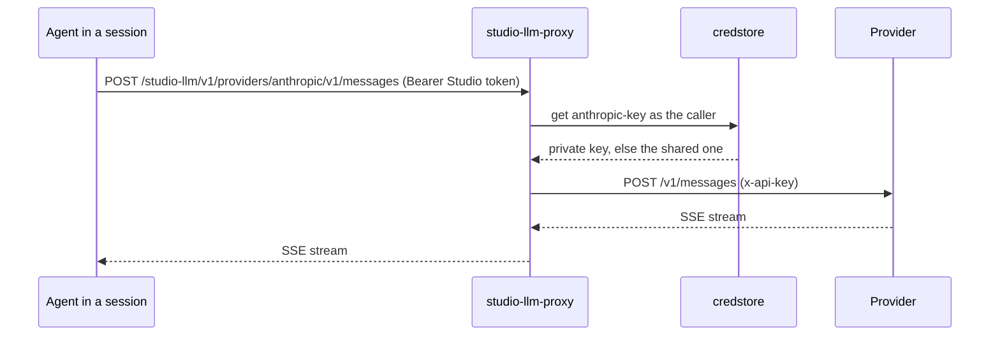

# Technical Design — studio-llm-proxy

- [x] `p3` - **ID**: `cpt-studio-design-llm-proxy`

The gear-level design of `cpt-studio-component-llm-proxy`. The product-level
view, and how this gear sits among the others, is in
[Constructor Studio's design](constructor-studio.md). The code is
[`studio-backend/src/llm_proxy/`](../../studio-backend/src/llm_proxy/).

## Table of Contents

- [1. Architecture Overview](#1-architecture-overview)
- [2. Principles & Constraints](#2-principles--constraints)
- [3. Technical Architecture](#3-technical-architecture)
- [4. Additional context](#4-additional-context)
- [5. Traceability](#5-traceability)

## 1. Architecture Overview

### 1.1 Architectural Vision

The AI inside an IDE session works without the session ever holding a
provider key. The obvious way to point Theia AI or an agent at a provider is to
put the key in the container, where anything running there can read it and
anyone who reaches the daemon is one `docker inspect` away from it. This gear
inverts that: the IDE authenticates with the member's own Studio token, and the
proxy attaches a key held on the server on the way out.

It has two halves. The OpenAI-compatible half serves Theia AI's `ai-openai`
provider: one configured upstream, one key held in the backend's environment.
The provider half serves the agents, Claude Code (Anthropic's Messages API)
and Codex (OpenAI's API), with the key credstore answers for the calling
member, so several people can run agents in one container, each on their own
key (ADR-0030).

Both are passthroughs: bytes in, bytes out, the upstream status preserved,
streaming responses streamed.

It is also Studio's one way out to a model provider (ADR-0037). No other
Studio gear calls a provider: one that needs to — the connector gear testing a
key — takes the gear's port, `ModelProviders`, from the ClientHub, and the
call goes out through the same provider table and HTTP client as an agent's.

### 1.2 Architecture Drivers

#### Functional Drivers

| Requirement | Design Response |
|-------------|------------------|
| `cpt-studio-fr-ide-llm-proxy` | `/studio-llm/v1/chat/completions`, `/models` and `/client-config` over the configured upstream; `/studio-llm/v1/providers/{provider}/…` for the agents. Every route is authenticated with the caller's Studio token. |

#### NFR Allocation

| NFR ID | NFR Summary | Allocated To | Design Response | Verification Approach |
|--------|-------------|--------------|-----------------|----------------------|
| `cpt-studio-nfr-credential-isolation` | No provider key in a session, a browser or a response | `cpt-studio-component-llm-proxy` | The key is attached server-side; `client-config` returns no secret; the caller's `Authorization` and `x-api-key` are never forwarded, and only listed headers come back | `llm_proxy` unit tests (`config.rs`, `providers.rs`) in the `test-backend` job |

#### Key ADRs

| ADR ID | Decision Summary |
|--------|------------------|
| `cpt-studio-adr-a-shared-session-is-many-people-each-as-themselves` | Agents reach their models through this proxy, each window with its own person's token and key (ADR-0030, proposed). |
| `cpt-studio-adr-a-desktop-session-keeps-the-secrets-on-the-server` | A desktop Studio configures Theia AI from `client-config` exactly as a container session does (ADR-0027 §3). |
| `cpt-studio-adr-one-way-out-to-llm-providers` | This gear is the only Studio code that calls a model provider; others use its port; it is linked into every build (ADR-0037, proposed). |

### 1.3 Architecture Layers

| Layer | Responsibility | Technology |
|-------|---------------|------------|
| REST | The two families of routes | `OperationBuilder` routes in `rest.rs` |
| Passthrough | Forward and stream back | `ProxyState::forward` in `rest.rs`, `Providers::forward` in `providers.rs`, over `reqwest` with its `stream` feature |
| Keys | The upstream key from config or environment; a member's key from credstore | `config.rs`, `providers::CredstoreKeys` |
| Port | Other gears' way to a provider, with a key they hand it | `port::ModelProviders`, implemented by `providers::Providers` |

## 2. Principles & Constraints

### 2.1 Design Principles

#### No default provider

- [x] `p2` - **ID**: `cpt-studio-principle-llm-no-default-provider`

A proxy that silently picks a provider silently bills someone. With no base
URL, model or key configured the gear boots, logs that in-IDE AI stays off,
and answers the OpenAI-compatible routes with an error naming the variables to
set. The provider half's defaults name the two public APIs, but a call there
uses only a key the member or the workspace stored.

#### The caller's credentials stop here

- [x] `p2` - **ID**: `cpt-studio-principle-llm-caller-token-stops-here`

The Studio token authenticates the caller to Studio and goes no further.
Upstream, a request carries the provider key and a fixed list of protocol
headers (`content-type`, `accept`, `accept-encoding`, `user-agent`,
`anthropic-version`, `anthropic-beta`, `openai-beta`,
`x-stainless-helper-method`). Back, the response carries its content headers,
the provider's request id and its rate-limit headers, which the CLIs read.

**ADRs**: `cpt-studio-adr-a-shared-session-is-many-people-each-as-themselves`

#### No policy

- [x] `p2` - **ID**: `cpt-studio-principle-llm-no-policy`

No request rewriting, no model policy, no stored conversations. The model the
IDE asks for is the one the server advertises in `client-config`. Policy is
the `mini_chat` and `api_egress` chain's job (`cpt-studio-component-llm-chain`).

### 2.2 Constraints

#### In every build

The gear is not behind the `llm` Cargo feature (ADR-0037): the connector gear
tests model-provider keys through it, and the agents' routes are what
`studio-session` points sessions at, so the release image links it too. `llm`
gates only the platform's `mini_chat` and `api_egress`
(`cpt-studio-constraint-llm-off-in-release`).

#### Long requests

- [x] `p2` - **ID**: `cpt-studio-constraint-llm-long-requests`

Completions stream for minutes, so the client's timeout is 600 seconds; a
10-second connect timeout keeps a dead upstream from holding the handler.
Provider calls share the same client.

## 3. Technical Architecture

### 3.1 Domain Model

- [x] `p2` - **ID**: `cpt-studio-entity-llm-provider`

A **provider** is one upstream an agent may reach: its path name, base URL,
the credstore reference of its key, and how the key is sent (`bearer` or
`x-api-key`). The defaults are `anthropic` (`https://api.anthropic.com`,
`anthropic-key`, `x-api-key`) and `openai` (`https://api.openai.com/v1`,
`openai-key`, `bearer`). For Studio's own calls a provider also names where its
model list is under the base URL (`v1/models`, `models`) and the headers those
calls carry (`anthropic-version` for Anthropic). The **upstream** of the OpenAI-compatible half is a
base URL up to `/v1`, a model name and a key.

### 3.2 Component Model

#### OpenAI-compatible passthrough

- [x] `p2` - **ID**: `cpt-studio-component-llm-openai-passthrough`

##### Why this component exists

Theia AI's `ai-openai` provider speaks the OpenAI chat-completions protocol
against any base URL.

##### Responsibility scope

Forwards `POST /chat/completions` and `GET /models` to the upstream with
`Authorization: Bearer <key>` and streams the answer back with its status and
content type, JSON or SSE alike. `client-config` returns the model and
`developer_message_settings` (`system` by default), so provider choice stays
out of the IDE image. The base URL and model come from `STUDIO_LLM_BASE_URL` and
`STUDIO_LLM_MODEL` before the YAML; the key from a literal `api_key` before
`STUDIO_LLM_API_KEY`.

##### Responsibility boundaries

One upstream per deployment; switching it is a restart.

##### Related components (by ID)

- `cpt-studio-component-theia-studio` — is called by its portal bridge configuration

#### Provider passthrough

- [x] `p2` - **ID**: `cpt-studio-component-llm-provider-passthrough`

##### Why this component exists

The agents speak their providers' own APIs, and a container several people
share must not carry one person's key.

##### Responsibility scope

`providers.rs`: `GET` and `POST /studio-llm/v1/providers/{provider}/{*rest}`
append the rest of the path and the query to the provider's base URL, read the
key from credstore as the caller — their private secret first, else the one
shared with their tenant — and stream the answer back. An unknown provider is
404; no key is 403, telling the member to add one to their profile or ask an
owner to share one; an unreadable key or an unreachable provider is 502.

##### Responsibility boundaries

Mounted only when a credstore client is available. Stores nothing.

##### Related components (by ID)

- `cpt-studio-component-session` — points a session's agents at it
- `cpt-studio-component-platform-feature-gears` — reads the caller's key from credstore

#### Provider port

- [x] `p2` - **ID**: `cpt-studio-component-llm-provider-port`

##### Why this component exists

One way out to a provider (ADR-0037): a gear that needs one should not carry
its own client and its own copy of the provider's URL conventions.

##### Responsibility scope

`port.rs`: `ModelProviders::list_models(provider, base_url, key)`, published
on the ClientHub at init whether or not credstore is there. It looks the
provider up in the table, sends the key the way the provider wants it with the
provider's `request_headers`, reads `models_path` and answers the model ids and
names; a refusal is an error carrying the provider's status and the first 200
characters of its answer. `base_url`, when given, replaces the table's for the
call; the caller has already checked it may send the key there.

##### Responsibility boundaries

Reads no key itself: the caller hands it the key it is testing. One method,
because one thing is needed in-process; a completion is added here when a gear
needs one.

##### Related components (by ID)

- `cpt-studio-component-connector` — the Anthropic and OpenAI drivers test a key through it

### 3.3 API Contracts

- [x] `p2` - **ID**: `cpt-studio-interface-llm-rest`

- **Contracts**: `cpt-studio-interface-rest-api`
- **Technology**: REST/OpenAPI through `api_gateway`; OpenAI-compatible and provider-native bodies passed through
- **Location**: [`studio-backend/docs/api-contract.json`](../../studio-backend/docs/api-contract.json)

**Endpoints Overview**:

| Method | Path | Description | Stability |
|--------|------|-------------|-----------|
| `POST` | `/studio-llm/v1/chat/completions` | Chat completions on the configured upstream; `stream: true` piped through as SSE | unstable |
| `GET` | `/studio-llm/v1/models` | The upstream's model list | unstable |
| `GET` | `/studio-llm/v1/client-config` | Model and system-prompt role for the IDE; no secret | unstable |
| `GET` `POST` | `/studio-llm/v1/providers/{provider}/{*rest}` | An agent's call to its provider, on the caller's own key | unstable |

### 3.4 Internal Dependencies

| Dependency Gear | Interface Used | Purpose |
|-------------------|----------------|----------|
| `credstore` (`cpt-studio-component-platform-feature-gears`) | `CredStoreClientV1` | The caller's provider key |

It is used in-process by `studio-connector`'s `anthropic-connector-plugin` and
`openai-connector-plugin`, through `ModelProviders`, resolved on use.

### 3.5 External Dependencies

#### Model providers

- Contract: `cpt-studio-contract-provider-apis`

| Dependency Gear | Interface Used | Purpose |
|-------------------|---------------|---------|
| `cpt-studio-component-llm-proxy` | OpenAI-compatible chat completions; Anthropic Messages API; OpenAI API | Completions for Theia AI and the agents |

### 3.6 Interactions & Sequences

The model call in `cpt-studio-seq-open-ide-session` is this gear.

#### An agent calls its provider

**ID**: `cpt-studio-seq-llm-agent-call`

**Actors**: `cpt-studio-actor-agent`

**Description**: The session points the agent here with `ANTHROPIC_BASE_URL` or
`OPENAI_BASE_URL` under its gateway URL and `STUDIO_LLM_AUTH=bearer`, which the
patched Claude Code and Codex services read to send the window's token.

### 3.7 Database schemas & tables

None.

### 3.8 Deployment Topology

In-process in the one `studio-backend` binary, every build: gear
`studio-llm-proxy`, capabilities `[rest]`, deps `credstore`, config section
`gears.studio-llm-proxy` (`base_url`, `model`, `api_key`, the `*_env` names,
`developer_message_settings`, `providers`). Publishes `ModelProviders` on the
ClientHub.

## 4. Additional context

`studio-secrets-bootstrap` seeds `openai-key` and `anthropic-key` as shared
secrets from `STUDIO_LLM_API_KEY` and `STUDIO_ANTHROPIC_API_KEY`, which is what
the provider half answers with for a member who keeps no key of their own.
`studio-spec-quality` has the same shape: an authenticated passthrough with the
credential on the server.

## 5. Traceability

- **PRD**: [Constructor Studio](../prd/constructor-studio.md)
- **Design**: [Constructor Studio](constructor-studio.md)
- **ADRs**: [ADR index](../adr/README.md)
- **Code**: [`studio-backend/src/llm_proxy/`](../../studio-backend/src/llm_proxy/)
