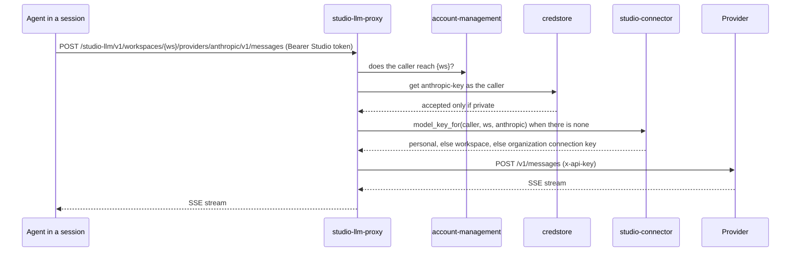

# Technical Design — studio-llm-proxy

- [x] `p3` - **ID**: `cpt-studio-design-llm-proxy`

The gear-level design of `cpt-studio-component-llm-proxy`. The product-level
view, and how this gear sits among the others, is in
[Constructor Studio's design](constructor-studio.md). The code is
[`studio-backend/src/llm_proxy/`](../../studio-backend/src/llm_proxy/).

## Table of Contents

- [1. Architecture Overview](#1-architecture-overview)
- [2. Principles & Constraints](#2-principles--constraints)
- [3. Technical Architecture](#3-technical-architecture)
- [4. Additional context](#4-additional-context)
- [5. Traceability](#5-traceability)

## 1. Architecture Overview

### 1.1 Architectural Vision

The AI inside an IDE session works without the session ever holding a
provider key, and without Studio holding one of its own. The obvious way to
point Theia AI or an agent at a provider is to put the key in the container,
where anything running there can read it and anyone who reaches the daemon is
one docker inspect away from it. This gear inverts that: the IDE authenticates
with the member's own Studio token, and the proxy attaches that member's key on
the way out, from their profile or from an AI connection they reach.

It has two halves. The provider half serves the agents, Claude Code
(Anthropic's Messages API) and Codex (OpenAI's API), so several people can run
agents in one container, each on their own key (ADR-0030). The chat half
serves Theia AI's `ai-openai` provider: an OpenAI chat completion sent to the
first provider the member has a key for, at that provider's OpenAI-compatible
endpoint.

Both are passthroughs: bytes in, bytes out, the upstream status preserved,
streaming responses streamed.

It is also Studio's one way out to a model provider (ADR-0039). No other
Studio gear calls a provider: one that needs to — the connector gear testing a
key — takes the gear's port, `ModelProviders`, from the ClientHub, and the
call goes out through the same provider table and HTTP client as an agent's.

### 1.2 Architecture Drivers

#### Functional Drivers

| Requirement | Design Response |
|-------------|------------------|
| `cpt-studio-fr-ide-llm-proxy` | `/studio-llm/v1/[workspaces/{workspace_id}/]chat/completions`, `/models` and `/client-config` for the IDE's chat; `/studio-llm/v1/[workspaces/{workspace_id}/]providers/{provider}/…` for the agents. Every route is authenticated with the caller's Studio token, and every call goes out on the caller's key. |

#### NFR Allocation

| NFR ID | NFR Summary | Allocated To | Design Response | Verification Approach |
|--------|-------------|--------------|-----------------|----------------------|
| `cpt-studio-nfr-credential-isolation` | No provider key in a session, a browser or a response | `cpt-studio-component-llm-proxy` | The key is attached server-side; `client-config` returns no secret; the caller's `Authorization` and `x-api-key` are never forwarded, and only listed headers come back; a workspace's key answers only a caller who reaches the workspace | `llm_proxy` unit tests (`keys.rs`, `providers.rs`, `config.rs`) and `connectors::service` tests in the `test-backend` job |

#### Key ADRs

| ADR ID | Decision Summary |
|--------|------------------|
| `cpt-studio-adr-a-shared-session-is-many-people-each-as-themselves` | Agents reach their models through this proxy, each window with its own person's token and key (ADR-0030, proposed). |
| `cpt-studio-adr-a-desktop-session-keeps-the-secrets-on-the-server` | A desktop Studio configures Theia AI from `client-config` exactly as a container session does (ADR-0027 §3). |
| `cpt-studio-adr-one-way-out-to-llm-providers` | This gear is the only Studio code that calls a model provider; others use its port; it is linked into every build (ADR-0039). |

### 1.3 Architecture Layers

| Layer | Responsibility | Technology |
|-------|---------------|------------|
| REST | The two families of routes, each with and without a workspace | `OperationBuilder` routes in `rest.rs` |
| Passthrough | Forward and stream back | `Providers::forward` and `Providers::chat` in `providers.rs`, over `reqwest` with its `stream` feature |
| Keys | A member's key: their profile, else their AI connections | `keys.rs` (`PeopleKeys`), `ConnectorService::model_key_for` in the connector gear |
| Port | Other gears' way to a provider, with a key they hand it | `port::ModelProviders`, implemented by `providers::Providers` |

## 2. Principles & Constraints

### 2.1 Design Principles

#### No Studio key

- [x] `p2` - **ID**: `cpt-studio-principle-llm-no-default-provider`

A key Studio holds silently bills someone, and one seeded from the
environment was what every member without a key of their own ran on. There is
none: every call goes out on the caller's key, found in this order —

1. their **profile key**: the credstore secret under the provider's reference
   (`anthropic-key`, `openai-key`), accepted only when it is *private*, the
   caller's own. Credstore answers a value shared with the tenant when the
   caller keeps none; such a value — the env-seeded key still sitting in an
   existing database — is ignored;
2. their **personal** AI connection of that provider;
3. a **workspace** AI connection, on the workspace routes only, once the
   caller is shown to reach the workspace;
4. an **organization** AI connection.

With none, the call is refused with 403 and words that say where a key goes.

#### The caller's credentials stop here

- [x] `p2` - **ID**: `cpt-studio-principle-llm-caller-token-stops-here`

The Studio token authenticates the caller to Studio and goes no further.
Upstream, a request carries the provider key and a fixed list of protocol
headers (`content-type`, `accept`, `accept-encoding`, `user-agent`,
`anthropic-version`, `anthropic-beta`, `openai-beta`,
`x-stainless-helper-method`). Back, the response carries its content headers,
the provider's request id and its rate-limit headers, which the CLIs read.

**ADRs**: `cpt-studio-adr-a-shared-session-is-many-people-each-as-themselves`

#### No policy

- [x] `p2` - **ID**: `cpt-studio-principle-llm-no-policy`

No stored conversations and no model policy beyond one rule: the chat goes to
the provider the caller's keys decide, so its `model` is set to that
provider's chat model. Policy is the `mini_chat` and `api_egress` chain's job
(`cpt-studio-component-llm-chain`).

### 2.2 Constraints

#### In every build

The gear is not behind the `llm` Cargo feature (ADR-0039): the connector gear
tests model-provider keys through it, and the agents' routes are what
`studio-session` points sessions at, so the release image links it too. `llm`
gates only the platform's `mini_chat` and `api_egress`
(`cpt-studio-constraint-llm-off-in-release`).

#### Long requests

- [x] `p2` - **ID**: `cpt-studio-constraint-llm-long-requests`

Completions stream for minutes, so the client's timeout is 600 seconds; a
10-second connect timeout keeps a dead upstream from holding the handler.
Provider calls share the same client.

## 3. Technical Architecture

### 3.1 Domain Model

- [x] `p2` - **ID**: `cpt-studio-entity-llm-provider`

A **provider** is one upstream an agent or the chat may reach: its path name
(also the connector provider id of its AI connections), base URL, the credstore
reference of a member's profile key, and how the key is sent (`bearer` or
`x-api-key`). For the chat it names a `chat_model`, the `chat_path` of its
OpenAI-compatible endpoint and the `developer_message_settings` an OpenAI
client should use. The defaults are `anthropic` (`https://api.anthropic.com`,
`anthropic-key`, `x-api-key`, chat model `claude-sonnet-5-5` at
`v1/chat/completions`) and `openai` (`https://api.openai.com/v1`, `openai-key`,
`bearer`, chat model `gpt-4.1-mini` at `chat/completions`), in that order. For
Studio's own calls a provider also names where its model list is under the base
URL (`v1/models`, `models`) and the headers those calls carry
(`anthropic-version` for Anthropic).

### 3.2 Component Model

#### OpenAI-compatible chat

- [x] `p2` - **ID**: `cpt-studio-component-llm-openai-passthrough`

##### Why this component exists

Theia AI's `ai-openai` provider speaks the OpenAI chat-completions protocol
against any base URL.

##### Responsibility scope

`POST …/chat/completions` picks the first provider, in configuration order,
that has a chat model and a key for the caller, sets the request's `model` to
that chat model, and sends it to the provider's `chat_path` with the key as a
bearer (Anthropic's OpenAI-SDK-compatible endpoint takes it that way), streaming
the answer back. `client-config` answers, for this caller, the provider and
model they would get and its `developer_message_settings` — or no model and a
`reason` that says where to add a key. `GET …/models` lists that one model, or
none.

##### Responsibility boundaries

No server upstream and no server key. A provider without a chat model is
never picked.

##### Related components (by ID)

- `cpt-studio-component-theia-studio` — is called by its portal bridge configuration

#### Provider passthrough

- [x] `p2` - **ID**: `cpt-studio-component-llm-provider-passthrough`

##### Why this component exists

The agents speak their providers' own APIs, and a container several people
share must not carry one person's key.

##### Responsibility scope

`providers.rs`: `GET` and `POST …/providers/{provider}/{*rest}` append the rest
of the path and the query to the provider's base URL, attach the caller's key
(see *No Studio key*) and stream the answer back. On the workspace routes a
caller who does not reach the workspace is 404 and no key is looked for. An
unknown provider is 404; no key is 403 — "No {provider} key for you: add one
to your Studio profile, or connect one (for yourself or this workspace) under
Connections."; an unreadable key or an unreachable provider is 502.

##### Responsibility boundaries

Stores nothing. Reads AI connections through the connector gear's `sdk`, which
reads each token as the caller.

##### Related components (by ID)

- `cpt-studio-component-session` — points a session's agents at it
- `cpt-studio-component-connector` — answers the caller's AI connection key
- `cpt-studio-component-platform-feature-gears` — reads the caller's profile key from credstore

#### Provider port

- [x] `p2` - **ID**: `cpt-studio-component-llm-provider-port`

##### Why this component exists

One way out to a provider (ADR-0039): a gear that needs one should not carry
its own client and its own copy of the provider's URL conventions.

##### Responsibility scope

`port.rs`: `ModelProviders::list_models(provider, base_url, key)`, published
on the ClientHub at init whether or not credstore is there. It looks the
provider up in the table, sends the key the way the provider wants it with the
provider's `request_headers`, reads `models_path` and answers the model ids and
names; a refusal is an error carrying the provider's status and the first 200
characters of its answer. `base_url`, when given, replaces the table's for the
call; the caller has already checked it may send the key there.

`ModelProviders::complete(ctx, {system, prompt, max_tokens})`: one answer, not
streamed, on the caller's own key -- the provider the IDE's chat would pick for
them (`chat_choice`: the first with a chat model they have a key for), at its
OpenAI-compatible chat endpoint, `temperature: 0`. It answers the provider,
the model and the first choice's text; a caller with no key gets
`CompletionError::NoKey` with the words the chat shows, and a failure carries
the provider's status and the start of its answer.

##### Responsibility boundaries

`list_models` reads no key itself: the caller hands it the key it is testing.
`complete` finds the caller's key exactly as the routes do, never a key Studio
holds. Two methods, because two things are needed in-process.

##### Related components (by ID)

- `cpt-studio-component-connector` — the Anthropic and OpenAI drivers test a key through it
- `cpt-studio-component-components-catalog` — the registry's suggestions ask `complete` (ADR-0041 P4)

### 3.3 API Contracts

- [x] `p2` - **ID**: `cpt-studio-interface-llm-rest`

- **Contracts**: `cpt-studio-interface-rest-api`
- **Technology**: REST/OpenAPI through `api_gateway`; OpenAI-compatible and provider-native bodies passed through
- **Location**: [`studio-backend/docs/api-contract.json`](../../studio-backend/docs/api-contract.json)

The workspace is a path segment on purpose (a baselined break of rule C): the
agent CLIs and the OpenAI client append their own paths to a base URL, so a
query parameter cannot carry it. The handler asks account-management, as the
caller, whether they reach the workspace; the path names it, it does not grant
it.

**Endpoints Overview**:

| Method | Path | Description | Stability |
|--------|------|-------------|-----------|
| `POST` | `/studio-llm/v1/workspaces/{workspace_id}/chat/completions` | The IDE's chat, on the caller's key, workspace connections included; `stream: true` piped through as SSE | unstable |
| `GET` | `/studio-llm/v1/workspaces/{workspace_id}/models` | The one chat model this caller gets there, or none | unstable |
| `GET` | `/studio-llm/v1/workspaces/{workspace_id}/client-config` | Provider, model and system-prompt role for this caller, or a reason; no secret | unstable |
| `GET` `POST` | `/studio-llm/v1/workspaces/{workspace_id}/providers/{provider}/{*rest}` | An agent's call to its provider, on the caller's key | unstable |
| `POST` | `/studio-llm/v1/chat/completions` | The same chat outside a workspace (no workspace connections) | unstable |
| `GET` | `/studio-llm/v1/models` | The same, outside a workspace | unstable |
| `GET` | `/studio-llm/v1/client-config` | The same, outside a workspace | unstable |
| `GET` `POST` | `/studio-llm/v1/providers/{provider}/{*rest}` | The same, outside a workspace | unstable |

### 3.4 Internal Dependencies

| Dependency Gear | Interface Used | Purpose |
|-------------------|----------------|----------|
| `credstore` (`cpt-studio-component-platform-feature-gears`) | `CredStoreClientV1` | The caller's profile key (private only) |
| `studio-connector` (`cpt-studio-component-connector`) | `connectors::sdk::Connectors` → `ConnectorService::model_key_for` | The caller's personal, the workspace's and the organization's AI connection key |
| `studio-session` (`cpt-studio-component-session`) | `studio_session::sdk::TenantMembership` | Whether the caller reaches the workspace a route names |

It is used in-process by `studio-connector`'s `anthropic-connector-plugin` and
`openai-connector-plugin`, through `ModelProviders`, resolved on use. The two
gears use each other through each other's `port`/`sdk`, each resolved from the
ClientHub when used, so neither depends on the other's start.

### 3.5 External Dependencies

#### Model providers

- Contract: `cpt-studio-contract-provider-apis`

| Dependency Gear | Interface Used | Purpose |
|-------------------|---------------|---------|
| `cpt-studio-component-llm-proxy` | Anthropic Messages API and its OpenAI-compatible chat completions; OpenAI API | Completions for the agents and Theia AI |

### 3.6 Interactions & Sequences

The model call in `cpt-studio-seq-open-ide-session` is this gear.

#### An agent calls its provider

**ID**: `cpt-studio-seq-llm-agent-call`

**Actors**: `cpt-studio-actor-agent`

**Description**: The session points the agent here with `ANTHROPIC_BASE_URL` or
`OPENAI_BASE_URL` under its gateway URL and its workspace, and
`STUDIO_LLM_AUTH=bearer`, which the patched Claude Code and Codex services read
to send the window's token. The IDE's chat follows the same order through
`…/chat/completions`.

### 3.7 Database schemas & tables

None.

### 3.8 Deployment Topology

In-process in the one `studio-backend` binary, every build: gear
`studio-llm-proxy`, capabilities `[rest]`, deps `credstore`, config section
`gears.studio-llm-proxy` (`providers` only). Publishes `ModelProviders` on the
ClientHub.

## 4. Additional context

Nothing is seeded for this gear. `studio-secrets-bootstrap` seeds only
`studio-assistant-llm-key`, mini-chat's own key, from `STUDIO_LLM_API_KEY`; an
`openai-key` or `anthropic-key` a deployment once seeded as a shared secret may
still sit in its database, and is ignored. `studio-spec-quality` has a similar
shape: an authenticated passthrough with the credential on the server.

## 5. Traceability

- **PRD**: [Constructor Studio](../prd/constructor-studio.md)
- **Design**: [Constructor Studio](constructor-studio.md)
- **ADRs**: [ADR index](../adr/README.md)
- **Code**: [`studio-backend/src/llm_proxy/`](../../studio-backend/src/llm_proxy/)
