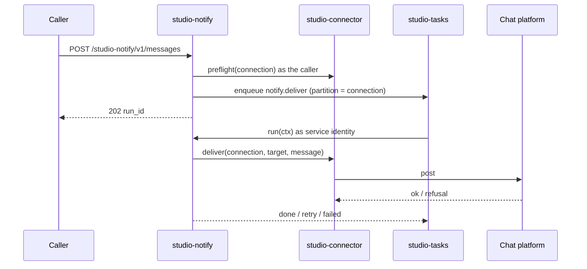

# Technical Design — studio-notify

- [x] `p3` - **ID**: `cpt-studio-design-notify`

The gear-level design of `cpt-studio-component-notify`. The product-level view,
and how this gear sits among the others, is in
[Constructor Studio's design](constructor-studio.md). The code is
[`studio-backend/src/notify/`](../../studio-backend/src/notify/).

## Table of Contents

- [1. Architecture Overview](#1-architecture-overview)
- [2. Principles & Constraints](#2-principles--constraints)
- [3. Technical Architecture](#3-technical-architecture)
- [4. Additional context](#4-additional-context)
- [5. Traceability](#5-traceability)

## 1. Architecture Overview

### 1.1 Architectural Vision

Notifications that survive the thing that was going to send them.
`cpt-studio-component-connector` can already post to Slack, Zulip or Discord
while a request waits. That is the right shape for "test this connection" and
the wrong shape for a notification: the caller is usually another part of
Studio that has just finished a job, the platform may be rate-limiting or
down, and an HTTP handler is a bad place to discover either. A message dropped
there is dropped for good.

So this gear validates a notification and queues it as a `notify.deliver` run
in `cpt-studio-component-tasks`. Delivery happens afterwards, with retries,
and what cannot be delivered is dead-lettered with its reason instead of
disappearing. There are two kinds of destination: a chat channel through a
connector connection, and the Theia IDE of whoever has a workspace open.

### 1.2 Architecture Drivers

#### Functional Drivers

| Requirement | Design Response |
|-------------|------------------|
| `cpt-studio-fr-chat-notifications` | One route validates with the caller's context and enqueues; the `notify.deliver` handler delivers, classifies a refusal as transient or permanent, and the run is dead-lettered after eight attempts. |

#### NFR Allocation

| NFR ID | NFR Summary | Allocated To | Design Response | Verification Approach |
|--------|-------------|--------------|-----------------|----------------------|
| `cpt-studio-nfr-durable-work` | An accepted notification survives a restart | `cpt-studio-component-tasks` | The message is the run's payload; the run and its queue entry commit in one transaction in `studio_tasks` | `tasks` tests against the shared test PostgreSQL; `handler.rs` unit tests for the payload round trip |

#### Key ADRs

| ADR ID | Decision Summary |
|--------|------------------|
| `cpt-studio-adr-theia-backend-bridge` | The IDE destination goes through the studio-theia control bridge (`notifyEditor`). |

### 1.3 Architecture Layers

| Layer | Responsibility | Technology |
|-------|---------------|------------|
| REST | Accept one notification, answer 202 with the run to follow | `OperationBuilder` route in `rest.rs` |
| Accept | Resolve the destination with the caller's context and refuse what a worker could not deliver | `service.rs` |
| Delivery | Run `notify.deliver`: post through a connector or the IDE bridge, decide whether a failure is worth another attempt | `handler.rs`, a `TaskHandler` |
| Storage | None of its own; the run in `studio_tasks` | `cpt-studio-component-tasks` |

## 2. Principles & Constraints

### 2.1 Design Principles

#### The run is the record

- [x] `p2` - **ID**: `cpt-studio-principle-notify-run-is-record`

The gear owns no database. The message is the payload of a `notify.deliver`
run, and that run is its whole history: state, attempts, `summary` or
`last_error`. This is what keeps accepting a notification one transaction.
The gear used to keep a `studio_notify_deliveries` table beside its own
outbox, which was safe while both were in one database. Moving the queue to
`studio-tasks` and keeping the table would have meant writing the record in
one database and the queue entry in another, and a crash between the two
writes is exactly the lost notification the queue exists to prevent.

The cost: "what happened to my notification" is
`GET /studio-tasks/v1/runs/{id}`, and what needs attention is
`GET /studio-tasks/v1/runs?task_type=notify.deliver&state=failed`, rather than
routes of this gear's own.

#### Refuse while there is still a request to answer

- [x] `p2` - **ID**: `cpt-studio-principle-notify-refuse-at-accept`

A queued delivery runs later, as `studio-tasks`' service identity, with no
caller (`cpt-studio-principle-tasks-authorize-at-enqueue`). So everything that
depends on the caller is checked at accept, with the caller's own context, and
answered with a 400: an unusable connection, a `personal` connection (credstore
keeps that credential readable only by its owner, and the worker is not its
owner), a channel missing where the bot reaches many, a channel given to an
incoming webhook whose channel is fixed in its URL, an empty message, an
unknown IDE `level`, and a workspace with no live, ready IDE session. A
notification nobody can see is not worth queuing.

#### An unclassified failure is retried

- [x] `p2` - **ID**: `cpt-studio-principle-notify-retry-by-default`

`classify` reads a verdict out of the driver's error text: credentials,
permissions and addressing (`invalid_auth`, `channel_not_found`, `not found`,
`must be an https:// url`, `not readable`, …) are permanent and fail at once;
rate limits and outages (`429`, ` 503`, `timed out`, …) are transient.
Anything else is retried, bounded by the attempt cap. Never dropped, never
retried for ever. Every failure on the IDE path is transient: a workspace with
no session now may have one in a minute.

### 2.2 Constraints

#### At-least-once delivery

- [x] `p2` - **ID**: `cpt-studio-constraint-notify-at-least-once`

The queue is leased. A lease that expires after the platform accepted the
message but before the ack committed hands it to another worker, and none of
Slack, Zulip and Discord takes an idempotency key on a post. Losing a message
is not possible; duplicating one in that window is. `idempotency_key` on the
request protects only against the caller's own retry, which returns the first
run.

#### The verdict is read from text

- [x] `p2` - **ID**: `cpt-studio-constraint-notify-untyped-errors`

The driver contract answers with `anyhow::Error`, so whether to retry is
matched on message text. The honest fix is a typed error across all eleven
drivers; until then the match lists the shapes the drivers actually produce,
and the retry default bounds the cost of a miss.

#### The IDE destination needs the bridge

- [x] `p2` - **ID**: `cpt-studio-constraint-notify-bridge-feature`

`workspace_id` works only in a backend built with the `theia-bridge` feature
and with `studio-session.theia_control_enabled` on. Without either, the accept
path says which one is missing. A run queued by a binary with the bridge and
delivered by one without it fails permanently.

## 3. Technical Architecture

### 3.1 Domain Model

- [x] `p2` - **ID**: `cpt-studio-entity-notify-delivery`

A **delivery** is the payload of a `notify.deliver` run. Its destination is
exactly one of: a **chat** destination (`connection_id`, optional `target`,
optional `topic` for Zulip) or an **editor** destination (`workspace_id`,
`level` `info` | `warn` | `error`). Both carry `title`, `text` and `link`. A
request naming both or neither is refused rather than guessed. The run's
partition key is the connection id or the workspace id, so one channel's or
one session's notifications never overtake each other.

### 3.2 Component Model

#### Accept path

- [x] `p2` - **ID**: `cpt-studio-component-notify-accept`

##### Why this component exists

The checks that need the caller have to happen before the caller is gone.

##### Responsibility scope

`service.rs`: trims and validates the message, runs the connector's
`preflight` (scope, whether the channel is fixed) or the bridge's
`get_runtime_status` (session exists and is ready), normalizes `level`, and
enqueues the run with its partition key and the caller's idempotency key.

##### Responsibility boundaries

Delivers nothing. Resolves the connector, the bridge and the queue from the
ClientHub per request, which makes the gear independent of init order.

##### Related components (by ID)

- `cpt-studio-component-connector` — calls `preflight` on
- `cpt-studio-component-theia-bridge` — asks for session status
- `cpt-studio-component-tasks` — enqueues into

#### Delivery handler

- [x] `p2` - **ID**: `cpt-studio-component-notify-delivery`

##### Why this component exists

Only this gear knows how to read a chat platform's refusal.

##### Responsibility scope

`handler.rs`, task type `notify.deliver`, `max_attempts` 8, more than the task
default (a compile-time assertion keeps it so), because a chat platform's
refusals skew transient and five backoffs would drop a message the platform
was only asking to slow down. The chat path calls the connector's `deliver`
and records `{ target, platform_message_id }`. The editor path calls
`notify_editor` with the title as the headline and the text as the detail; a
session that took the message with no browser attached is recorded as
succeeded with `shown: false` and a summary saying so, neither a failure to
retry nor a delivery to celebrate. A missing connector or bridge is a retry,
since it is a deployment state, not a property of the message.

##### Responsibility boundaries

Runs as the run's service identity, scoped to its tenant. Never reads a
caller's token.

##### Related components (by ID)

- `cpt-studio-component-connector` — delivers through
- `cpt-studio-component-theia-bridge` — delivers through
- `cpt-studio-component-tasks` — registered with, run by

### 3.3 API Contracts

- [x] `p2` - **ID**: `cpt-studio-interface-notify-rest`

- **Contracts**: `cpt-studio-interface-rest-api`
- **Technology**: REST/OpenAPI through `api_gateway`
- **Location**: [`studio-backend/docs/api-contract.json`](../../studio-backend/docs/api-contract.json)

**Endpoints Overview**:

| Method | Path | Description | Stability |
|--------|------|-------------|-----------|
| `POST` | `/studio-notify/v1/messages` | Validate and queue; 202 with `run_id` and `poll` (`/studio-tasks/v1/runs/{run_id}`). `tenant_id` omitted means the caller's own | unstable |

There is deliberately nothing else: a second set of read routes over the same
runs would only be a second thing to keep in step. The synchronous
`POST /studio-connector/v1/connections/{id}/messages` stays, for a person
pressing "send a test message" who wants the platform's answer now.

### 3.4 Internal Dependencies

| Dependency Gear | Interface Used | Purpose |
|-------------------|----------------|----------|
| `account_management` | declared gear dependency | Tenant scope of the caller |
| `cpt-studio-component-connector` | `NotificationSender` from the ClientHub, scope `cf.studio._.notification_sender.v1~` | `preflight` and `deliver` for chat destinations |
| `cpt-studio-component-tasks` | `TaskQueue` from the ClientHub; `registry::register` | Enqueue the run; register `notify.deliver` |
| `cpt-studio-component-theia-bridge` | `TheiaControlClientV1` (`theia-bridge` feature) | Session status at accept; `notify_editor` at delivery |

### 3.5 External Dependencies

#### Chat platforms

| Dependency Gear | Interface Used | Purpose |
|-------------------|---------------|---------|
| `cpt-studio-component-connector` plugins | `cpt-studio-contract-provider-apis` | Slack, Zulip and Discord are reached only through the connector drivers; this gear makes no provider call itself |

### 3.6 Interactions & Sequences

#### Queue and deliver a notification

**ID**: `cpt-studio-seq-notify-deliver`

**Actors**: `cpt-studio-actor-member`, `cpt-studio-actor-provider`

**Description**: The enqueue and the run's lifecycle are
`cpt-studio-seq-tasks-run`. A permanent refusal fails the run at once; a
transient one is retried with backoff up to eight attempts and then
dead-lettered. A failed run is put back with `POST /studio-tasks/v1/runs/{id}/retry`
once someone has rotated the token or invited the bot.

### 3.7 Database schemas & tables

None. See `cpt-studio-principle-notify-run-is-record`; the run is
`cpt-studio-dbtable-tasks-runs`.

### 3.8 Deployment Topology

In-process in the one `studio-backend` binary: gear `studio-notify`,
capabilities `[rest]`, deps `account_management`, config section
`gears.studio-notify` (empty). It has no database to stand down over; a
deployment without the task queue is reported per request instead, because
that is a property of the queue.

## 4. Additional context

[`docs/queued-notifications.md`](../../studio-backend/docs/queued-notifications.md)
has worked examples for both destinations, the table of what guarantees what,
and why the queue is PostgreSQL and not Redis: the enqueue has to be part of
the transaction that caused it, and the platforms' own rate limits (roughly one
post per second per Slack channel) are orders of magnitude below what one
PostgreSQL absorbs.

`cpt-studio-fr-notification-delivery-choice` (telling a person about comment
threads waiting on them) is planned and not built here.

## 5. Traceability

- **PRD**: [Constructor Studio](../prd/constructor-studio.md)
- **Design**: [Constructor Studio](constructor-studio.md), [studio-tasks](studio-tasks.md)
- **ADRs**: [ADR index](../adr/README.md)
- **Code**: [`studio-backend/src/notify/`](../../studio-backend/src/notify/)
