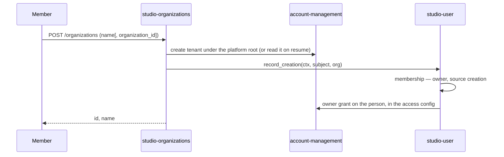

# Technical Design — studio-organizations

- [x] `p3` - **ID**: `cpt-studio-design-organizations`

The gear-level design of `cpt-studio-component-organizations`. The
product-level view, and how this gear sits among the others, is in
[Constructor Studio's design](constructor-studio.md). The code is
[`studio-backend/src/organizations/`](../../studio-backend/src/organizations/).

## Table of Contents

- [1. Architecture Overview](#1-architecture-overview)
- [2. Principles & Constraints](#2-principles--constraints)
- [3. Technical Architecture](#3-technical-architecture)
- [4. Additional context](#4-additional-context)
- [5. Traceability](#5-traceability)

## 1. Architecture Overview

### 1.1 Architectural Vision

A person creates an organization and owns it. Before this gear the browser
called account-management's `createTenant` directly, which cannot do the job: an
organization needs a tenant *and* an owner, and a client that writes only the
first produces one nobody owns and nobody sees.

The gear owns no storage. It composes: account-management holds the tenant,
`cpt-studio-component-user` holds the membership that makes somebody its owner,
and the tenant's access config holds the grant the Studio PDP reads. What it
adds is that the three are written by one operation, in an order that can be
resumed. Deletion is the same three in reverse. The membership and the grant
are facts about a person, so this gear writes neither itself: it asks
`cpt-studio-component-user`, which writes both in one call (ADR-0040).

It also serves what the portal needs about organizations and the work under
them in one request each: whether this installation lets people create one, the
privilege catalogue the access screen edits, and the rollups — what each
workspace and project contains — which the portal used to compose itself at
several requests per row.

### 1.2 Architecture Drivers

#### Functional Drivers

| Requirement | Design Response |
|-------------|------------------|
| `cpt-studio-fr-org-create` | `POST /organizations` writes tenant, owner membership and owner grant in that order; a failure names the organization so the same call can finish it. |
| `cpt-studio-fr-org-administration` | Capabilities, access catalogue and rollups served here; deletion by the owner or a platform administrator. |
| `cpt-studio-fr-workspace-project-tenants` | Rollups walk the account-management tenant tree — organization, workspace, project — by tenant type; nothing is stored here. |

#### Key ADRs

| ADR ID | Decision Summary |
|--------|------------------|
| `cpt-studio-adr-an-identity-proves-it-is-you-and-decides-nothing-else` | Anyone who signs in may create an organization and owns it; names are not unique; leaving a lone organization is deletion; self-service creation is a per-installation switch. |
| `cpt-studio-adr-authentication-does-not-grant-organization-membership` | Membership is the authority for access, so it is written before the grant and removed before the tenant. |
| `cpt-studio-adr-a-role-narrows-what-a-member-may-do` | The privilege catalogue and default role ladder are served from the side that evaluates them. |
| `cpt-studiofrontend-adr-projects-as-am-tenants` | Workspaces and projects are tenants, so a rollup is a walk of the tenant tree. |
| `cpt-studio-adr-one-owner-for-people-and-membership` | The creator's membership and owner grant are one call into studio-user, and who may delete is studio-user's answer; this gear does not touch grants. |

### 1.3 Architecture Layers

| Layer | Responsibility | Technology |
|-------|---------------|------------|
| REST | Create, delete, capabilities, access catalogue, rollups | `OperationBuilder` routes in `rest.rs` |
| Service | The ordered, resumable writes and the deletion gate | `service.rs` |
| Rollups | One row per workspace and project, every count settled on its own | `rollups.rs` |
| Port | An organization's projects for another gear (`ProjectsOf`) | `port.rs`, ClientHub |
| Sources | Tenants, memberships, documents, artifacts | account-management SDK and ClientHub interfaces of other gears |

## 2. Principles & Constraints

### 2.1 Design Principles

#### Ordered and resumable, not transactional

- [x] `p2` - **ID**: `cpt-studio-principle-organizations-resumable`

There is no transaction across PostgreSQL and account-management, so creation
writes in a fixed order — tenant, membership, grant — and each write is
idempotent. The tenant goes first because the others need its id. The membership
goes before the grant because membership is the authority: an organization the
creator can see but cannot yet administer is worse than one they cannot see at
all. A failure after the tenant answers with the organization id and the step
that failed; repeating the request with `organization_id` looks the tenant up
instead of creating it and repeats the rest.

**ADRs**: `cpt-studio-adr-an-identity-proves-it-is-you-and-decides-nothing-else`

#### Both halves, or nothing

- [x] `p2` - **ID**: `cpt-studio-principle-organizations-both-halves`

Without `cpt-studio-component-user` there is nowhere to record an owner, and
creating the tenant anyway would produce exactly the ownerless organization this
gear exists to prevent. Creation and deletion then answer 503.

#### Unknown is not zero

- [x] `p2` - **ID**: `cpt-studio-principle-organizations-unknown-not-zero`

Every rollup count is nullable, and the null means the source could not be
asked. Each count is settled independently, so one unreachable gear costs one
column, not the row; a self-managed subtree answering 404 is tenant isolation
working and leaves the other columns alone. Counts come from a source's total,
never from fetching rows to count them.

### 2.2 Constraints

#### Deletion refuses work

- [x] `p2` - **ID**: `cpt-studio-constraint-organizations-delete-refuses-work`

Deletion ends every membership and removes each member's personal connections
first, then deletes the tenant — the connection catalogue lives inside the
tenant, so the other order would strand the credentials in credstore. It refuses
a tenant that is not of the organization type, and account-management refuses a
tenant that still has a workspace or a project; that refusal is passed through
as a 400. The tenant delete is account-management's soft delete. Only the
organization's owner or a platform administrator may delete, and studio-user
answers which (`OrgAuthority::may_dispose`): this gear does not read ownership
out of the access config itself.

#### Self-service is a deployment choice

- [x] `p2` - **ID**: `cpt-studio-constraint-organizations-self-service`

`self_service` (default `true`) is the cloud: somebody arrives with no
organization and makes their own. `false` is an installation inside one company,
where people are joined on first sight (`studio-user`'s `on_first_login`) and
creation is refused with `SELF_SERVICE_DISABLED`. The domain model and every
authorization path are the same either way.

## 3. Technical Architecture

### 3.1 Domain Model

- [x] `p2` - **ID**: `cpt-studio-entity-organizations-rollup`

An **organization** is an account-management tenant of type
`gts.cf.core.am.tenant_type.v1~cf.studio.tenant.organization.v1~` under the
platform root, with a free-text name of at most 120 characters, not unique. A
**rollup** is one row per workspace or project: a workspace counts its projects;
a project carries documents, findings, open findings, repositories, kind and
brief, specs (authored, checked, failing), open comments, pull requests over the
last 7 days, its team and its last event.

### 3.2 Component Model

#### Rollups

- [x] `p2` - **ID**: `cpt-studio-component-organizations-rollups`

##### Why this component exists

The portfolio and the projects table need to say what each row contains. The
portal composed it at three requests per row, one of them an artifact listing
that walked the tenant's whole graph; the next portal would have had to write the
same composition again.

##### Responsibility scope

`rollups.rs`: workspaces under the caller's tenant and under each organization
in it, and their projects, or one workspace (`?workspace_id=`) or one project
(`?project_id=`). A workspace's projects are counted concurrently. The team is
read once per organization: every active member under the `tenant` access model,
or the active members holding a grant on the project or across the organization
under `roles`, each person once.

##### Responsibility boundaries

Reads as the caller, so it reaches only what the caller's tenant scope reaches.
Owns none of the numbers.

##### Related components (by ID)

- `cpt-studio-component-account-management` — walks tenants and project config in
- `cpt-studio-component-documents` — counts documents and specs through `DocumentCounter`
- `cpt-studio-component-artifact-ingest` — counts findings and reads pull requests and events through `ArtifactCounter` and `ProjectSignalSource`
- `cpt-studio-component-user` — reads the roster through `OrganizationRoster`

#### Projects of an organization

- [x] `p2` - **ID**: `cpt-studio-component-organizations-projects-of`

##### Why this component exists

The components registry (ADR-0041) reads every project of an organization. A
second gear walking the tenant tree would grow its own idea of where projects
sit, and the two walks would disagree on the first change to the tree.

##### Responsibility scope

`port.rs`, `ProjectsOf` on the ClientHub, published at init:
`projects_of(ctx, org)` answers every project tenant under the organization's
workspaces, with its workspace, in tree order. It is `rollups::projects_of`,
built on the same `children_of` listing the rollups walk, which follows every
page of children.

##### Responsibility boundaries

A listing that fails is an error, never an empty list: a caller that prunes by
what it was told (the registry) must not read "could not tell" as "none". The
rollups keep their own rule and settle the same failure as an empty subtree.

##### Related components (by ID)

- `cpt-studio-component-account-management` — lists tenants in
- `cpt-studio-component-components-catalog-registry` — is called by

### 3.3 API Contracts

- [x] `p2` - **ID**: `cpt-studio-interface-organizations-rest`

- **Contracts**: `cpt-studio-interface-rest-api`
- **Technology**: REST/OpenAPI through `api_gateway`
- **Location**: [`studio-backend/docs/api-contract.json`](../../studio-backend/docs/api-contract.json)

**Endpoints Overview**:

| Method | Path | Description | Stability |
|--------|------|-------------|-----------|
| `POST` | `/studio-organizations/v1/organizations` | Create one and own it, or finish one with `organization_id` | stable |
| `DELETE` | `/studio-organizations/v1/organizations/{org_id}` | Delete it, with how many people and connections went | stable |
| `GET` | `/studio-organizations/v1/capabilities` | Whether a person may create an organization here | stable |
| `GET` | `/studio-organizations/v1/access-catalogue` | Every privilege id the PDP understands, and the seeded role ladder; no labels | stable |
| `GET` | `/studio-organizations/v1/rollups` | The portfolio, or one workspace or project; every count nullable | stable |

### 3.4 Internal Dependencies

| Dependency Gear | Interface Used | Purpose |
|-------------------|----------------|----------|
| `cpt-studio-component-account-management` | SDK client | Create, read, list and delete tenants |
| `cpt-studio-component-user` | `AssignmentRecorder`, `MembershipEvictor`, `OrgAuthority`, `OrganizationRoster` | Owner membership and grant, eviction, the deletion gate, the team count |
| `cpt-studio-component-access-config` | `access_config` module | Read the access model and project grants for the team count; the privilege catalogue |
| `cpt-studio-component-documents` | `DocumentCounter` (optional) | Rollup counts |
| `cpt-studio-component-artifact-ingest` | `ArtifactCounter`, `ProjectSignalSource` (optional) | Rollup counts and activity |

The rollup sources are resolved in the REST phase and each is optional; without
account-management the rollups answer 503.

### 3.5 External Dependencies

None.

### 3.6 Interactions & Sequences

#### Create an organization

**ID**: `cpt-studio-seq-organizations-create`

**Actors**: `cpt-studio-actor-member`

**Description**: A failure after the tenant is a 500 that names the
organization and the step; repeating with that id finishes it.

### 3.7 Database schemas & tables

None. The gear stores nothing.

### 3.8 Deployment Topology

In-process in the one `studio-backend` binary: gear `studio-organizations`,
capabilities `[rest]`, deps `account_management`, config section
`gears.studio-organizations`.

## 4. Additional context

`cpt-studio-seq-create-project` is the next step down: a project is created
in a workspace by the portal, not by this gear.

## 5. Traceability

- **PRD**: [Constructor Studio](../prd/constructor-studio.md)
- **Design**: [Constructor Studio](constructor-studio.md)
- **ADRs**: [ADR index](../adr/README.md)
- **Code**: [`studio-backend/src/organizations/`](../../studio-backend/src/organizations/)
