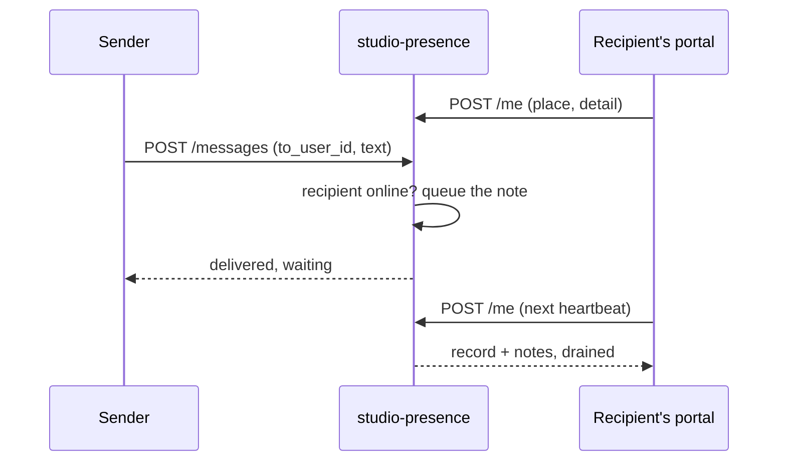

# Technical Design — studio-presence

- [x] `p3` - **ID**: `cpt-studio-design-presence`

The gear-level design of `cpt-studio-component-presence`. The product-level
view, and how this gear sits among the others, is in
[Constructor Studio's design](constructor-studio.md). The code is
[`studio-backend/src/presence/`](../../studio-backend/src/presence/).

## Table of Contents

- [1. Architecture Overview](#1-architecture-overview)
- [2. Principles & Constraints](#2-principles--constraints)
- [3. Technical Architecture](#3-technical-architecture)
- [4. Additional context](#4-additional-context)
- [5. Traceability](#5-traceability)

## 1. Architecture Overview

### 1.1 Architectural Vision

Who is in Studio right now, and a way to reach them — two things an
administrator asked for and could not get.

Presence is heartbeats. The portal says "still here, on this screen" every
30 seconds, and anybody whose last heartbeat is younger than 90 seconds is
online. Inferring presence from an open SSE subscription would be cheaper and
would answer a worse question: a tab left open overnight holds a subscription
and says nothing about whether anyone is there.

A note to a person is held in memory for them and handed over on their next
heartbeat. It is not a mailbox: a note to somebody who is not online is refused,
not queued, because a note read tomorrow arrives out of the context it was
written in.

### 1.2 Architecture Drivers

#### Functional Drivers

| Requirement | Design Response |
|-------------|------------------|
| `cpt-studio-fr-presence` | `POST /me` records a heartbeat and drains the caller's notes; `GET /online` lists who is here; `POST /messages` leaves a note for somebody online. |

### 1.3 Architecture Layers

| Layer | Responsibility | Technology |
|-------|---------------|------------|
| REST | Heartbeat, sign-out, list, send | `OperationBuilder` routes in `rest.rs` |
| Registry | The live set and the per-recipient notes | `registry.rs`, two `Mutex<HashMap>` in the gear |

## 2. Principles & Constraints

### 2.1 Design Principles

#### The caller is the token, never the body

- [x] `p2` - **ID**: `cpt-studio-principle-presence-caller-from-token`

Whose presence a heartbeat reports, and who a note is from, is the token's
subject. A client that could name whose presence it was reporting could report
anybody's. The display names a client sends are labels beside the id — trimmed
to 120 characters, like `place` and `detail` — and resolving a name per
heartbeat from `cpt-studio-component-user` would turn a 30-second poll into a
query.

#### One record per person, pruned on read

- [x] `p2` - **ID**: `cpt-studio-principle-presence-prune-on-read`

Somebody with three windows open is one person here. `since` survives a
heartbeat and resets only when the person was already counted as gone. A stale
record is dropped when the list is read rather than by a sweep: the only thing
that cares about a stale record is a read.

### 2.2 Constraints

#### Per process, lost on restart

- [x] `p2` - **ID**: `cpt-studio-constraint-presence-per-process`

The registry lives in the process. A restart makes everybody look offline for
one heartbeat interval, then the truth comes back on its own, which is a better
failure than a persisted row that outlives the process that wrote it. The same
holds per replica: a heartbeat and a list served by different replicas do not
see each other.

#### Notes are bounded and delivered once

- [x] `p2` - **ID**: `cpt-studio-constraint-presence-notes-bounded`

A note is at most 1,000 characters. At most 20 wait per recipient; past that the
oldest go, because a cap that dropped the newest would stop working exactly when
somebody needs to be reached. A heartbeat takes the notes off the queue, so a
client that drops them has lost them. Signing out drops the person's waiting
notes with their presence.

## 3. Technical Architecture

### 3.1 Domain Model

- [x] `p2` - **ID**: `cpt-studio-entity-presence-record`

A **presence record** is one person (token subject): display name, the tenant
they are looking at (the token's tenant), a `place` the portal chose
(`studio` when omitted), an optional `detail`, `since` and `last_seen` in epoch
milliseconds. A **note** is an id, the sender's subject and display name, the
text and when it was sent.

### 3.2 Component Model

The gear is one component; the registry is its state.

### 3.3 API Contracts

- [x] `p2` - **ID**: `cpt-studio-interface-presence-rest`

- **Contracts**: `cpt-studio-interface-rest-api`
- **Technology**: REST/OpenAPI through `api_gateway`
- **Location**: [`studio-backend/docs/api-contract.json`](../../studio-backend/docs/api-contract.json)

**Endpoints Overview**:

| Method | Path | Description | Stability |
|--------|------|-------------|-----------|
| `POST` | `/studio-presence/v1/me` | Heartbeat: the caller's record, the notes waiting for them, how many are online | stable |
| `DELETE` | `/studio-presence/v1/me` | Sign out now instead of lapsing; answers who is left | stable |
| `GET` | `/studio-presence/v1/online` | Everybody online, most recently seen first, with `online_ttl_ms` and `heartbeat_ms` | stable |
| `POST` | `/studio-presence/v1/messages` | Leave a note; `delivered: false` when the recipient is not online | stable |

Every route needs only an authenticated caller. The list is not paged: it is
everybody here now, and its `total` always equals the items.

### 3.4 Internal Dependencies

None. The gear declares no dependencies and reads nothing from the ClientHub.

### 3.5 External Dependencies

None.

### 3.6 Interactions & Sequences

#### Leave a note

**ID**: `cpt-studio-seq-presence-note`

**Actors**: `cpt-studio-actor-member`

**Description**: Delivery is within one heartbeat interval. A recipient who is
not online gets nothing and the sender is told so.

### 3.7 Database schemas & tables

None. The gear stores nothing.

### 3.8 Deployment Topology

In-process in the one `studio-backend` binary: gear `studio-presence`,
capabilities `[rest]`, no dependencies, no config.

## 4. Additional context

Anything that has to survive the session belongs to a notification connector
(`cpt-studio-component-notify`), not here.

## 5. Traceability

- **PRD**: [Constructor Studio](../prd/constructor-studio.md)
- **Design**: [Constructor Studio](constructor-studio.md)
- **ADRs**: [ADR index](../adr/README.md)
- **Code**: [`studio-backend/src/presence/`](../../studio-backend/src/presence/)
