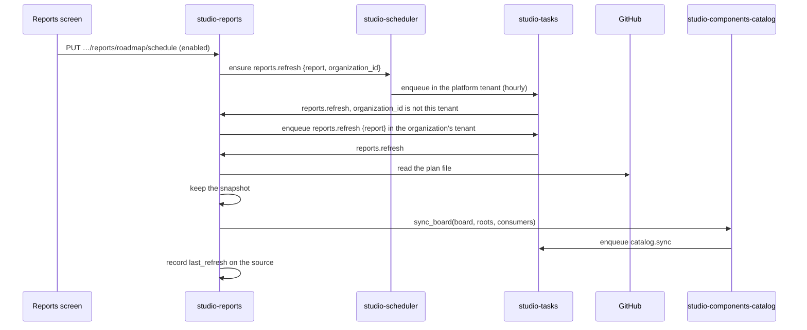

# Technical Design — studio-reports

- [x] `p3` - **ID**: `cpt-studio-design-reports`

The gear-level design of `cpt-studio-component-reports`. The product-level
view, and how this gear sits among the others, is in
[Constructor Studio's design](constructor-studio.md). The code is
[`studio-backend/src/reports/`](../../studio-backend/src/reports/). The decision
record is [ADR-0033](../adr/0033-a-report-is-a-definition-over-a-source.md).

## Table of Contents

- [1. Architecture Overview](#1-architecture-overview)
- [2. Principles & Constraints](#2-principles--constraints)
- [3. Technical Architecture](#3-technical-architecture)
- [4. Additional context](#4-additional-context)
- [5. Traceability](#5-traceability)

## 1. Architecture Overview

### 1.1 Architectural Vision

The reports a Studio draws, and where each one's data comes from in an
organization. A report is a **definition** drawn over a **data set**. The
definition says which sheets the report has and, for a table, which columns.
The data set today is the roadmap board as the catalogue reads it, with the
planning team's plan. There is one report over it, `roadmap` ("Backend
roadmap"), drawn by default with the built-in definition `back_roadmap` — the
planning team's `back_roadmap.xlsx`, ported from their `back_roadmap_to_xls.py`
and matching its output cell for cell on the same board and day.

The report used to live in `studio-components-catalog`, with the plan as a
browser upload kept in one person's `localStorage`, the board configured per
browser, and the layout as Rust. Now an organization configures a report once
— a GitHub connection and the plan file in its repository — and everyone
reads the same. The catalogue keeps reading the board, because stage, ETA and
demand are component facts a gear's card shows whether or not anyone draws a
report; the two gears meet through one narrow port.

### 1.2 Architecture Drivers

#### Functional Drivers

| Requirement | Design Response |
|-------------|------------------|
| `cpt-studio-fr-gear-catalogue` | The report is drawn from the `roadmap_item` nodes and the reconciled component values the catalogue stores, read through `RoadmapCatalog`. |
| `cpt-studio-fr-background-runs` | A refresh is a `reports.refresh` run on `studio-tasks`; it queues the board sync as a `catalog.sync` run. |
| `cpt-studio-fr-schedules` | The gear manages one `reports.refresh` schedule per organization and report on `studio-scheduler`. |

#### NFR Allocation

| NFR ID | NFR Summary | Allocated To | Design Response | Verification Approach |
|--------|-------------|--------------|-----------------|----------------------|
| `cpt-studio-nfr-durable-work` | Runs survive a restart | `cpt-studio-component-reports` | Refreshes are runs; the source and its last refresh are graph nodes, not process memory | `reports::service` tests |
| `cpt-studio-nfr-credential-isolation` | No secret in a response | `cpt-studio-component-reports` | The plan file is read through a studio-connector connection; the source names the connection, never a token | `reports::source` tests |

#### Key ADRs

| ADR ID | Decision Summary |
|--------|------------------|
| `cpt-studio-adr-a-report-is-a-definition-over-a-source` | Reports are their own gear; a report is a definition over a source configured per organization; a refresh is a task and a schedule keeps it current (ADR-0033). |
| `cpt-studio-adr-types-registry-catalogs-meaning-graph-storage-contracts-storage` | The report source type is catalogued free-form in the types-registry and stored in graph-storage. |

### 1.3 Architecture Layers

| Layer | Responsibility | Technology |
|-------|---------------|------------|
| REST | Reports, summary, workbook, source, sync, schedule | `OperationBuilder` routes in `rest.rs` |
| Service | Save a source, refresh, choose a definition, draw | `service.rs` (`ReportsService`) |
| Definitions | What a report holds, as data; validation | `definition.rs`, `presets/back_roadmap.yaml` |
| Data set | The roadmap plan, summary and workbook | `roadmap/plan.rs`, `roadmap/summary.rs`, `roadmap/workbook.rs` |
| Writer | Spreadsheet bytes | `xlsx.rs` |
| Task | `reports.refresh`, with the hand-off to an organization | `refresh_task.rs` over `studio-tasks` |
| Storage | One source node per report per organization | graph-storage (`store.rs`); in memory without the `graph` feature |

## 2. Principles & Constraints

### 2.1 Design Principles

#### A report is a definition

- [x] `p2` - **ID**: `cpt-studio-principle-reports-definition-as-data`

The code knows five sheet kinds — `summary`, `timeline`, `gantt`, `people`,
`table` — and how to draw each. A definition chooses which appear, in what
order, under what names, and lays out the table. A table column is a value by
key (`impl`, `milestone`, `card.Description`, or `field.<board column>` for any
column of the board), a formula referring to other columns as `{id}` and to the
row as `{row}`, or the plan's consumer projects, which become as many columns
as the plan has. The summary, the metrics block and the conditional formats
find their columns by what they hold (the title, the progress axes, the effort,
the column with id `remaining`), never by letter, so a column can move without
breaking anything that refers to it. A plan selects a definition with
`report: <id>` for a built-in, or carries one inline under `report:`.

#### Refuse a definition by name

- [x] `p2` - **ID**: `cpt-studio-principle-reports-validate-on-read`

Definitions are validated where they are read. Unknown values, missing columns,
self-references, two tables or duplicate sheet names are each refused with the
column or sheet named. When a plan's own definition does not read, the report
says why (`definition_error`) and is drawn with its built-in.

#### The plan is a file, kept as text

- [x] `p2` - **ID**: `cpt-studio-principle-reports-plan-is-a-file`

A plan has one home at a time. It can be a file the planning team keeps,
read through the same GitHub connection as the board, so it is never a copy
someone forgot to refresh; or an uploaded text; or Studio itself, where the
Reports screen edits it (below). It can carry everything else the report needs
(`board: owner/48`, `roots`, `consumers`, `report`); the same keys saved on the
source override the plan's, for a plan that does not carry them yet. The plan
is kept as text because its key order sets the project-column, lane and People
order and JSON keeps none; it is parsed the way PyYAML reads it — a key written
twice keeps its first position and its last value.

#### The plan is edited here, one section at a time

- [x] `p2` - **ID**: `cpt-studio-principle-reports-plan-edited-here`

The Reports screen reads the plan in the sections the planning team edits —
group lanes, units and their teams, people, consumer projects, and per gear
when each project needs it — and saves one section at a time
(`plan_edit.rs`). A save replaces that one top-level key of the document and
nothing else: every other key (`board`, `branches`, an inline `report:`)
keeps its value and its place, and an entry keeps the fields the section does
not name (a need written `{ needed: …, why: … }` keeps its `why`). The whole
plan must hold together afterwards — a person's team is a team, a need's
project is a project, a team tag is in one unit — or nothing is saved and the
400 lists every reason.

Every change bumps the snapshot's `revision`, and a save is made against the
revision it was read at: a save at another one is a 409 (`aborted`,
`PLAN_REVISION_STALE`), so one editor cannot undo another's change unseen. The
first save makes Studio the plan's home (`from: studio`): the file it was read
from is let go, and a refresh no longer reads it over the edit. The text is
written back by `serde_yaml`, which keeps the strings PyYAML would misread
(`no`, `YES`, `'20'`) quoted, so `GET …/plan/yaml` is a file the planning
script reads as before; a file's comments do not survive the first edit.

The plan names people — their emails and how much of each one's time a team
counts on. For now it is shown to whoever may edit the report's source; who
may see and edit it is a role question for later (ADR-0019).

A person in the plan is linked to a Studio person by login: the login is
matched against confirmed GitHub aliases (`user_profile::AliasResolver`), and
membership is read from `OrganizationRoster`. The match is computed on every
read and stored nowhere, so it follows a person confirming or revoking an
account; a claim or a guess links nobody.

#### A client never names a tenant

- [x] `p2` - **ID**: `cpt-studio-principle-reports-org-in-payload`

Schedules are platform-level: they live in and fire in the platform tenant,
while a source lives in its organization's. So the schedule is managed through
this gear, which writes the caller's organization into the payload
(`{"report": "roadmap", "organization_id": "…"}`), and a run that fires in
another tenant hands itself on: it queues the same refresh in the named
organization's tenant, with a payload that names no organization, so it cannot
hand itself on again.

### 2.2 Constraints

#### Only the board's reader reads the board

- [x] `p2` - **ID**: `cpt-studio-constraint-reports-narrow-port`

This gear never reads a board itself. `components_catalog::port::RoadmapCatalog`
answers exactly three things — the planned gears (`roadmap_item` payloads as
the last sync of each board stored them), every catalogued component with its
values reconciled, and "queue a sync of this board" — and a board sync reads
the board and nothing else. The catalogue and the scheduler are resolved per
call, so it does not matter which gear initialized first; a deployment without
them answers that they are not part of it.

#### The timeline and Gantt are the planning team's layout

- [x] `p2` - **ID**: `cpt-studio-constraint-reports-fixed-kinds`

The `timeline` and `gantt` kinds are parameterised building blocks (a name and
a title), not primitives. A general report designer was rejected: a Gantt or a
swimlane timeline built from primitives is a layout engine, and no report
anyone has asked for needs one.

## 3. Technical Architecture

### 3.1 Domain Model

- [x] `p2` - **ID**: `cpt-studio-entity-report-source`

A **report kind** (`REPORTS` in `service.rs`) is an id, title, description and
the definition drawn when the plan names none. A **report source** is what an
organization saved for one report: the GitHub connection (the organization's
first GitHub connection when absent), the plan file (`owner/repo:path@ref`,
`owner/repo:path`, or a `https://github.com/…/blob|tree/<ref>/<path>` link),
the board (`owner/number`), roots and consumers when they override the plan's,
the **plan snapshot** (its text, where it was read from or `upload`, the blob
sha, when), and the **last refresh** (when, the board-sync run it queued, or
why it failed). A **definition** is an id, a title and its sheets.

An uploaded plan becomes the snapshot at once and `""` takes it back; saving a
different plan file drops the snapshot until the next refresh reads that file.

### 3.2 Component Model

#### Reports service

- [x] `p2` - **ID**: `cpt-studio-component-reports-service`

##### Why this component exists

Reporting does not belong in the catalogue, and an organization needs one
configuration that everyone reads.

##### Responsibility scope

`service.rs`: the report list; save and read a source; choose the definition
(the plan's, else the built-in); refresh — read the plan file again, check that
it is YAML with a mapping at the top, keep it as the snapshot, and queue a
board sync with the effective board, roots and consumers — recording what it
did on the source either way; the JSON summary; the workbook as of a day; and
the refresh schedule (`find` and `ensure` through `scheduler::port::Schedules`,
hourly `0 * * * *` in UTC unless a `cron` is given).

##### Responsibility boundaries

A refresh of an organization that saved no source fails and writes nothing; a
refresh never makes a source up. The report keeps being drawn from the last
plan that read. The JSON summary is the roadmap data set's, not the
definition's: it is what a screen draws, and the workbook is the export.

##### Related components (by ID)

- `cpt-studio-component-components-catalog` — reads the board through
- `cpt-studio-component-tasks` — enqueues into
- `cpt-studio-component-scheduler` — manages schedules on
- `cpt-studio-component-connector` — reads the plan file through
- `cpt-studio-component-graph-storage` — owns data in

#### Refresh task

- [x] `p2` - **ID**: `cpt-studio-component-reports-refresh-task`

##### Why this component exists

What a person's Refresh queues and what a schedule targets.

##### Responsibility scope

`refresh_task.rs`, task type `reports.refresh` (a wire contract, stored on every
queued run and schedule): refuses a payload that is not a refresh or names a
report this deployment does not have; hands a run whose `organization_id` is
not its own tenant to that organization; otherwise runs the service's refresh.
`max_attempts` is 2: the usual causes — a file the token cannot see, a plan
that names no board — are a person's to fix and are recorded on the source, and
one retry covers a network blip. Runs are queued on partition `reports` with
queued duplicates coalesced.

##### Responsibility boundaries

Does not sync the board itself; it queues `catalog.sync`.

##### Related components (by ID)

- `cpt-studio-component-tasks` — is run by

#### Workbook writer

- [x] `p2` - **ID**: `cpt-studio-component-reports-xlsx`

##### Why this component exists

The workbook has to be the planning team's, shape for shape, including the bars
the Roadmap and Gantt sheets draw.

##### Responsibility scope

`xlsx.rs`: numbers, text, dates and formulas with styles; column widths, hidden
columns, row heights, merged ranges, a frozen pane, an autofilter, hyperlinks,
conditional formats (data bars and formula rules) and floating shapes — the
text boxes a bar is drawn with, because a bar spans columns and links to its
issue. Formulas are written without a cached value and the workbook asks for a
full recalculation on load.

##### Responsibility boundaries

Exactly what the roadmap workbook needs, and nothing a spreadsheet library
would add on top.

##### Related components (by ID)

- `cpt-studio-component-reports-service` — is used by

### 3.3 API Contracts

- [x] `p2` - **ID**: `cpt-studio-interface-reports-rest`

- **Contracts**: `cpt-studio-interface-rest-api`
- **Technology**: REST/OpenAPI through `api_gateway`
- **Location**: [`studio-backend/docs/api-contract.json`](../../studio-backend/docs/api-contract.json)

**Endpoints Overview**:

| Method | Path | Description | Stability |
|--------|------|-------------|-----------|
| `GET` | `/studio-reports/v1/reports` | Every report, its definition and sheets, and the organization's source; an unconfigured one with an empty source | unstable |
| `GET` | `/studio-reports/v1/reports/{report_id}` | One report, with `definition_error` when the plan's own definition does not read | unstable |
| `GET` | `/studio-reports/v1/reports/{report_id}/summary` | The report's data as typed JSON: one row per planned gear, soonest due first, and the summary per group, stage, milestone, consumer and plan state, with the overdue ones | unstable |
| `GET` | `/studio-reports/v1/reports/{report_id}/workbook` | The report as an `.xlsx`; `date` (`YYYY-MM-DD`) sets the day it is drawn as of | unstable |
| `GET` | `/studio-reports/v1/reports/{report_id}/source` | The organization's source; the plan's size, not its text | unstable |
| `PUT` | `/studio-reports/v1/reports/{report_id}/source` | Save it; a field left out keeps its value, `""` clears it; an unparsable plan file, a plan that is not a YAML mapping or a board that is not `owner/number` is a 400 | unstable |
| `POST` | `/studio-reports/v1/reports/{report_id}/sync` | Queue a `reports.refresh` run in the caller's tenant; 503 without `studio-tasks` | unstable |
| `GET` | `/studio-reports/v1/reports/{report_id}/plan` | The plan in sections — lanes, units and teams, people, projects, needs — with the `revision` a save is made against; revision 0 and empty when there is none | unstable |
| `PUT` | `/studio-reports/v1/reports/{report_id}/plan/{lanes,units,people,projects,needs}` | Save one section against `revision`: 400 lists why the plan would not hold together, 409 when it changed since; the first save makes Studio the plan's home | unstable |
| `GET` | `/studio-reports/v1/reports/{report_id}/plan/people` | Each person in the plan with the Studio person whose **confirmed** GitHub account their login is (ADR-0012) and whether they are an active member; the members with a confirmed GitHub account the plan does not list; how many members have none. Computed on read, nothing stored | unstable |
| `GET` | `/studio-reports/v1/reports/{report_id}/plan/yaml` | The plan as `gears.yaml`, for the planning script or a backup; 404 without a plan | unstable |
| `GET` | `/studio-reports/v1/reports/{report_id}/schedule` | Whether the report refreshes on its own and when next; `enabled: false` with no `cron` when there is none | unstable |
| `PUT` | `/studio-reports/v1/reports/{report_id}/schedule` | Switch it on or off, creating it the first time | unstable |

An unknown `report_id` is a 404.

### 3.4 Internal Dependencies

| Dependency Gear | Interface Used | Purpose |
|-------------------|----------------|----------|
| `types_registry` | `types-registry-sdk` | Register `gts.cf.studio.reports.report_source.v1~` at init |
| `cpt-studio-component-components-catalog` | `port::RoadmapCatalog` from the ClientHub | Planned gears, component values, queue a board sync |
| `cpt-studio-component-tasks` | `TaskQueue` (scoped `TASK_QUEUE_INSTANCE_ID`), `registry::register` | Queue refreshes; run them |
| `cpt-studio-component-scheduler` | `scheduler::port::Schedules` from the ClientHub | Find and ensure the refresh schedule |
| `cpt-studio-component-connector` | `ConnectorService` built from the GitHub drivers, `account_management` and `credstore` | Read the plan file (`GET /repos/{owner}/{repo}/contents/{path}?ref=`) |
| `cpt-studio-component-graph-storage` | `GraphStorageClientV1` (`graph` feature) | Keep the sources |

### 3.5 External Dependencies

#### GitHub

The contract is `cpt-studio-contract-provider-apis`, defined in
[Constructor Studio's design](constructor-studio.md#source-hosts-model-providers-and-chat-platforms).

| Dependency Gear | Interface Used | Purpose |
|-------------------|---------------|---------|
| `cpt-studio-component-reports` | The repository contents API, through a studio-connector connection | Read the plan file and its blob sha |

Without a GitHub connector in the deployment, plans can be uploaded and not
read from a repository.

### 3.6 Interactions & Sequences

#### Keep a report current

**ID**: `cpt-studio-seq-reports-refresh`

**Actors**: `cpt-studio-actor-member`

**Description**: A person's Refresh (`POST …/sync`) starts at the second
`reports.refresh`, in the caller's own tenant. The workbook and summary read
whatever the last board sync stored and the plan the last refresh read.

### 3.7 Database schemas & tables

This gear has no database. A source is a graph-storage owned node,
`gts.cf.core.graph.node.v1~cf.core.graph.owned_node.v1~cf.studio.reports.report_source.v1~`,
keyed by a UUIDv5 of the report id, named after the report, in the
organization's tenant — graph-storage is tenant-scoped, which is what makes a
source the organization's rather than a person's. The payload is the source
with the plan's text deflated and base64-encoded as `snapshot.text_deflate`, so
a plan many times larger than graph-storage's 64 KB payload cap still fits; a
payload written before compression reads too. A read projects the type's nodes,
one page of 200, and picks the report's key. Without the `graph` feature the
sources are kept in memory, per tenant and report.

### 3.8 Deployment Topology

In-process in the one `studio-backend` binary: gear `studio-reports`,
capabilities `[rest]`, deps `types_registry`, `account_management`,
`credstore`. No configuration section.

## 4. Additional context

The Reports screen is `studio-frontend-prototype/src/reports.tsx`; it switches
the hourly schedule on and off. The planning team's handoff
(`back_roadmap_to_xls.py` and `gears.yaml`) is internal; the workbook is
confirmed by comparing against that script's output for the same board and
day.

## 5. Traceability

- **PRD**: [Constructor Studio](../prd/constructor-studio.md)
- **Design**: [Constructor Studio](constructor-studio.md)
- **ADRs**: [ADR-0033](../adr/0033-a-report-is-a-definition-over-a-source.md), [ADR index](../adr/README.md)
- **Code**: [`studio-backend/src/reports/`](../../studio-backend/src/reports/)
