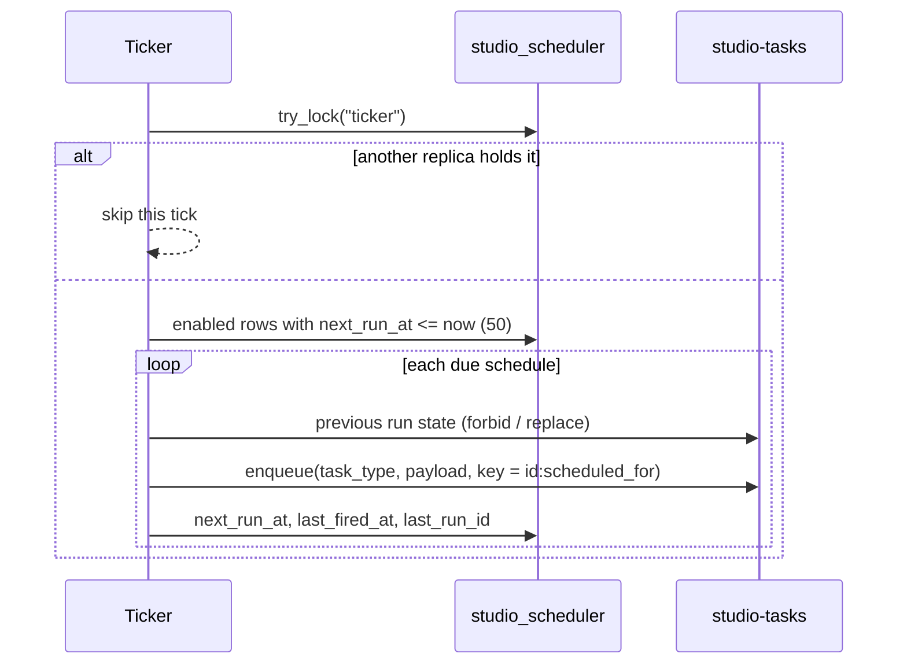

# Technical Design — studio-scheduler

- [x] `p3` - **ID**: `cpt-studio-design-scheduler`

The gear-level design of `cpt-studio-component-scheduler`. The product-level
view, and how this gear sits among the others, is in
[Constructor Studio's design](constructor-studio.md). The code is
[`studio-backend/src/scheduler/`](../../studio-backend/src/scheduler/).

## Table of Contents

- [1. Architecture Overview](#1-architecture-overview)
- [2. Principles & Constraints](#2-principles--constraints)
- [3. Technical Architecture](#3-technical-architecture)
- [4. Additional context](#4-additional-context)
- [5. Traceability](#5-traceability)

## 1. Architecture Overview

### 1.1 Architectural Vision

The thing that knows what time it is. The gear owns schedules and nothing
else: on each tick it works out which are due and enqueues runs into
`cpt-studio-component-tasks`. It executes no work, so a bug in cron arithmetic
cannot stop a repository import, and a deployment that wants background work
without automatic firing drops this gear's `database:` block. The queue keeps
working; nothing fires on its own.

Nothing in gears-rust schedules anything: 35 gears, no cron, no timer. The one
place a `Schedule` entity exists is `serverless-runtime`'s design, and that
gear ships no code, only documents; its own thin-host ADR says the host "runs
no scheduler, polling loop, or timer mechanism" and delegates timing to a
backend plugin over Temporal, EventBridge or Azure Durable. Adopting it for
cron would mean adopting Temporal. So the vocabulary is borrowed and the
mechanism is not.

### 1.2 Architecture Drivers

#### Functional Drivers

| Requirement | Design Response |
|-------------|------------------|
| `cpt-studio-fr-schedules` | Cron and interval schedules with the concurrency and missed-schedule policies, a ticker that enqueues what is due, and `run-now`. The time zone is carried but only UTC is accepted today (`cpt-studio-constraint-scheduler-utc-only`). |

#### NFR Allocation

| NFR ID | NFR Summary | Allocated To | Design Response | Verification Approach |
|--------|-------------|--------------|-----------------|----------------------|
| `cpt-studio-nfr-durable-work` | Schedules survive a restart | `cpt-studio-component-scheduler` | Schedules and their next instant are rows in `studio_scheduler_schedules`; a firing lost to a crash is re-fired, and its idempotency key makes it the same run | `cron.rs`, `policy.rs` and `service.rs` unit tests |

#### Key ADRs

| ADR ID | Decision Summary |
|--------|------------------|
| `cpt-studio-adr-a-report-is-a-definition-over-a-source` | A report is kept current by a schedule its gear keeps through this gear's in-process port (ADR-0033 §4). |

### 1.3 Architecture Layers

| Layer | Responsibility | Technology |
|-------|---------------|------------|
| REST | Schedule CRUD and `run-now` | `OperationBuilder` routes in `rest.rs` |
| Port | What another gear may do with schedules in process | `port.rs`, `dyn Schedules` in the ClientHub |
| Service | Validate, write, fire | `service.rs` |
| Ticker | Notice what is due, once per deployment | `ticker.rs`, a PostgreSQL advisory lock |
| Evaluation | Cron and interval arithmetic; the two policies | `cron.rs`, `policy.rs` |
| Storage | `studio_scheduler_schedules` | PostgreSQL database `studio_scheduler` |

## 2. Principles & Constraints

### 2.1 Design Principles

#### Only enqueue

- [x] `p2` - **ID**: `cpt-studio-principle-scheduler-only-enqueue`

A firing is a call to `TaskQueue::enqueue` and nothing more. The other half of
this split is `cpt-studio-constraint-tasks-no-time-no-steps`. The task type is
validated against the handler registry when a schedule is written, so a typo
is a 400 rather than a run that dead-letters every night.

#### Borrow the platform's vocabulary

- [x] `p2` - **ID**: `cpt-studio-principle-scheduler-sless-vocabulary`

The expression shape (`{kind: cron|interval, value}`), the IANA `timezone`,
the concurrency policy (`allow | forbid | replace`) and the missed-schedule
policy (`skip | catch_up | backfill`) are spelled exactly as
`gts.cf.core.sless.schedule.v1~` spells them, so a schedule written today
moves to that gear as data if it ever lands.

#### Firing is at-least-once, the run is exactly-once

- [x] `p2` - **ID**: `cpt-studio-principle-scheduler-idempotent-firing`

The scheduler and `studio-tasks` have separate databases, so "enqueue the run"
and "record that it fired" cannot be one transaction, and a crash between them
re-fires on the next tick. That is made harmless rather than prevented: every
firing carries the idempotency key `<schedule_id>:<scheduled_for>` (RFC 3339,
second precision), and `studio-tasks` turns a repeat into the same run. A
`run-now` gets `<schedule_id>:manual:<now>`: asking twice means two runs.

#### Writing a schedule never runs it

- [x] `p2` - **ID**: `cpt-studio-principle-scheduler-no-fire-on-write`

The first `next_run_at` is computed, never "now", and an interval without a
previous firing starts one interval from now. Creating a schedule must not be
a way to trigger a job; `POST …/run-now` is, and it runs only what a schedule
already named and validated. That is why there is no route that enqueues an
arbitrary task type (`cpt-studio-principle-tasks-no-generic-enqueue`).

### 2.2 Constraints

#### Schedules are platform-level

- [x] `p2` - **ID**: `cpt-studio-constraint-scheduler-platform-level`

`toolkit-db`'s secure ORM has no cross-tenant read, so one ticker for the whole
deployment cannot scan every tenant's schedules. Schedules therefore live
under one owning tenant, `owner_tenant_id`, which must equal
`account-management.bootstrap.root_id` (a mismatch is not an error, it is an
empty list). A schedule that acts on some tenant's data names that tenant in
its payload, and the handler carries the work into that tenant. Per-tenant
self-service schedules would need the ticker to iterate tenants; the table is
already keyed `(tenant_id, name)`, so that is an additive change to the ticker,
not to the schema.

#### UTC only, and said out loud

- [x] `p2` - **ID**: `cpt-studio-constraint-scheduler-utc-only`

A schedule carries an IANA `timezone` because it belongs in the contract, but
only `UTC` (and `Etc/UTC`) is accepted. A correct local schedule needs a tz
database to know when a wall-clock hour repeats or does not exist, and
guessing there means a daily job that runs twice or not at all on two days a
year. "09:00 in Europe/Belgrade" is refused with the reason, not quietly read
as 09:00 UTC.

#### A minute, within a tick

- [x] `p2` - **ID**: `cpt-studio-constraint-scheduler-tick-accuracy`

The finest cadence is a minute (a 5-field cron), and the ticker wakes every
`tick_seconds` (60 by default, clamped to 5–3600). A schedule fires within a
tick of its instant, not on it. A tick fires at most 50 schedules, in
`next_run_at` order; the rest are still due and drain on the next tick.

## 3. Technical Architecture

### 3.1 Domain Model

- [x] `p2` - **ID**: `cpt-studio-entity-schedule`

A **schedule** names a task type and a payload, an expression (a 5-field cron
evaluated in UTC, or an ISO-8601 duration measured from the previous firing),
a concurrency policy, a missed-schedule policy with `max_catch_up_runs`, an
enabled flag, `next_run_at`, and the last firing and the run it produced.

The **concurrency policy** is judged against the run the last firing produced,
when that run is not terminal: `allow` fires anyway; `forbid` skips this
firing; `replace` asks the previous run to cancel and fires without waiting
for it, since cancellation is cooperative
(`cpt-studio-principle-tasks-cooperative-cancel`). The **missed-schedule
policy** decides which instants a late tick enqueues: `skip` and `catch_up`
both fire once, for the most recent missed instant; `backfill` fires each
missed instant up to `max_catch_up_runs` (default 3, clamped to 1–100). The
walk over missed instants stops at 1000. Whether it fired or not, a schedule
advances, so a `forbid` that blocked does not stay due and re-block every
tick.

### 3.2 Component Model

#### Ticker

- [x] `p2` - **ID**: `cpt-studio-component-scheduler-ticker`

##### Why this component exists

Every other interval loop in the assembly fires in every process that runs it.
That is harmless for a reaper that converges and wrong for a scheduler: two
replicas would each fire the nightly import.

##### Responsibility scope

`ticker.rs`: each tick takes the PostgreSQL advisory lock `ticker` with
`Db::try_lock`, never `lock`, so a replica that cannot take it skips the tick
instead of queuing up behind another and firing a burst of stale ticks. It
reads due schedules and fires each as the platform tenant's service identity
(fixed subject `7b3f02ac-6d51-4e28-bf94-1c07a35d8e6b`). One schedule that
cannot fire (an expression that no longer parses, a task type whose gear was
unlinked) is logged and does not stop the others.

##### Responsibility boundaries

No leader election, Redis or cluster provider: the database every replica
already shares is the place for "only one of you". The lock does not survive
a process losing it mid-tick, which is why firing is idempotent as well.

##### Related components (by ID)

- `cpt-studio-component-tasks` — enqueues into

#### Platform schedules

- [x] `p2` - **ID**: `cpt-studio-component-scheduler-platform-schedules`

##### Why this component exists

Some schedules every deployment should have, without anyone creating them.

##### Responsibility scope

`register_platform_schedules` in `mod.rs`, run in `start` (after every gear's
`init`, so the handler registry is complete). It collects
`tasks::platform_schedules()` (`tasks-retention-sweep`, `17 3 * * *`) and
`studio_session::platform_schedules()` (`session-reaper`, `*/5 * * * *`), and
writes each with `ensure`: cron, UTC, `forbid`, `skip`, one catch-up run. A
schedule whose task type nothing in this process can run is not created; it
would fire every cadence and dead-letter every time.

##### Responsibility boundaries

`ensure` does not overwrite: an operator who changed the cadence or disabled a
platform schedule keeps that across restarts. A schedule that cannot be
registered is a warning, not a failed boot.

##### Related components (by ID)

- `cpt-studio-component-tasks-retention-sweep` — schedules
- `cpt-studio-component-session` — schedules the reaper of

#### Schedules port

- [x] `p2` - **ID**: `cpt-studio-component-scheduler-port`

##### Why this component exists

A gear that keeps a schedule of its own, `studio-reports` for a report kept
current, should not go through REST or hand a tenant to the API.

##### Responsibility scope

`port.rs`: `dyn Schedules` in the ClientHub with two methods. `find` returns
the schedule of a task type whose payload holds every field of a `matching`
object. `ensure` creates it, or brings the one found to the requested
expression and enabled state; the shape is fixed to a UTC cron, `forbid` and
`skip`.

##### Responsibility boundaries

Narrow on purpose: no listing, no deletion, no tenant argument. The gear that
keeps a schedule for an organization names the organization in the payload.

##### Related components (by ID)

- `cpt-studio-component-scheduler` — is the in-process face of

### 3.3 API Contracts

- [x] `p2` - **ID**: `cpt-studio-interface-scheduler-rest`

- **Contracts**: `cpt-studio-interface-rest-api`
- **Technology**: REST/OpenAPI through `api_gateway`
- **Location**: [`studio-backend/docs/api-contract.json`](../../studio-backend/docs/api-contract.json)

**Endpoints Overview**:

| Method | Path | Description | Stability |
|--------|------|-------------|-----------|
| `GET` | `/studio-scheduler/v1/schedules` | The deployment's schedules, by name, at most 500 | unstable |
| `POST` | `/studio-scheduler/v1/schedules` | Create; 201. A name already taken is a 400 | unstable |
| `GET` | `/studio-scheduler/v1/schedules/{id}` | One schedule | unstable |
| `PATCH` | `/studio-scheduler/v1/schedules/{id}` | Change expression, time zone, policies, catch-up cap, enabled or payload; a new expression moves `next_run_at`. Name and task type are fixed | unstable |
| `DELETE` | `/studio-scheduler/v1/schedules/{id}` | Remove; 204 | unstable |
| `POST` | `/studio-scheduler/v1/schedules/{id}/run-now` | Enqueue once without touching the cadence; 202 with `run_id` | unstable |

The routes are `authenticated()` and the gear adds no role check of its own.
Without a database every route answers 503.

### 3.4 Internal Dependencies

| Dependency Gear | Interface Used | Purpose |
|-------------------|----------------|----------|
| `account_management` | declared gear dependency | The platform tenant the schedules belong to |
| `cpt-studio-component-tasks` | `TaskQueue` from the ClientHub, resolved per use; `registry` | Enqueue, read a previous run's state, request its cancellation; validate task types |

### 3.5 External Dependencies

#### PostgreSQL

| Dependency Gear | Interface Used | Purpose |
|-------------------|---------------|---------|
| `cpt-studio-component-scheduler` | `toolkit-db` (SeaORM, secure ORM, `Db::try_lock`) | The schedule table and the ticker lock |

### 3.6 Interactions & Sequences

#### A tick

**ID**: `cpt-studio-seq-scheduler-tick`

**Actors**: `cpt-studio-actor-platform-admin`

**Description**: Each enqueue then follows `cpt-studio-seq-tasks-run`. A
crash between the enqueue and the update re-fires the same instant on the next
tick, and the idempotency key returns the run already created.

### 3.7 Database schemas & tables

- [x] `p3` - **ID**: `cpt-studio-db-scheduler`

Database `studio_scheduler`. There is no outbox here: the queue is
`studio-tasks`'.

#### Table: studio_scheduler_schedules

**ID**: `cpt-studio-dbtable-scheduler-schedules`

**Schema**:

| Column | Type | Description |
|--------|------|-------------|
| `id` | UUID | |
| `tenant_id` | UUID | the owning (platform) tenant |
| `name` | TEXT | 1–200 characters |
| `task_type` | TEXT | validated against the handler registry on write |
| `payload` | JSONB | default `{}`; handed to the run verbatim |
| `expression_kind` | TEXT | `cron`, `interval` |
| `expression` | TEXT | 5-field cron as typed, or a normalized ISO-8601 duration (`PT30M`) |
| `timezone` | TEXT | default `UTC`; only UTC is accepted |
| `concurrency` | TEXT | `allow`, `forbid`, `replace` |
| `missed_policy` | TEXT | `skip`, `catch_up`, `backfill` |
| `max_catch_up_runs` | SMALLINT | default 3 |
| `enabled` | BOOLEAN | default true |
| `next_run_at` | TIMESTAMPTZ | |
| `last_fired_at` | TIMESTAMPTZ | nullable |
| `last_run_id` | UUID | nullable; the run the last firing produced |
| `created_by` | UUID | |
| `created_at`, `updated_at` | TIMESTAMPTZ | |

**PK**: `id`

**Constraints**: `CHECK` on the length of `name`, on `expression_kind`, on
`concurrency` and on `missed_policy`; unique index
`uq_studio_scheduler_schedules_name` on `(tenant_id, name)`.

**Additional info**: Partial index `idx_studio_scheduler_schedules_due` on
`next_run_at WHERE enabled`, deliberately not tenant-scoped: it serves the
ticker's only query. A name is what an operator types and what a platform
schedule is looked up by on boot, so a redeploy does not create a second
nightly sweep.

**Example**:

| name | task_type | expression | concurrency | missed_policy |
|--------|--------|--------|--------|--------|
| `tasks-retention-sweep` | `tasks.retention_sweep` | `17 3 * * *` | `forbid` | `skip` |

### 3.8 Deployment Topology

In-process in the one `studio-backend` binary: gear `studio-scheduler`,
capabilities `[rest, db, stateful]`, deps `account_management`, config section
`gears.studio-scheduler` (`owner_tenant_id`, default
`00000000-0000-0000-0000-000000000001`; `tick_seconds` 60; `enabled` true).
`enabled: false` stops firing without dropping the gear or its schedules.

## 4. Additional context

[`docs/background-work.md`](../../docs/background-work.md) is
the operator's view of runs and schedules together.

## 5. Traceability

- **PRD**: [Constructor Studio](../prd/constructor-studio.md)
- **Design**: [Constructor Studio](constructor-studio.md), [studio-tasks](studio-tasks.md)
- **ADRs**: [ADR-0033](../adr/0033-a-report-is-a-definition-over-a-source.md)
- **Code**: [`studio-backend/src/scheduler/`](../../studio-backend/src/scheduler/)
