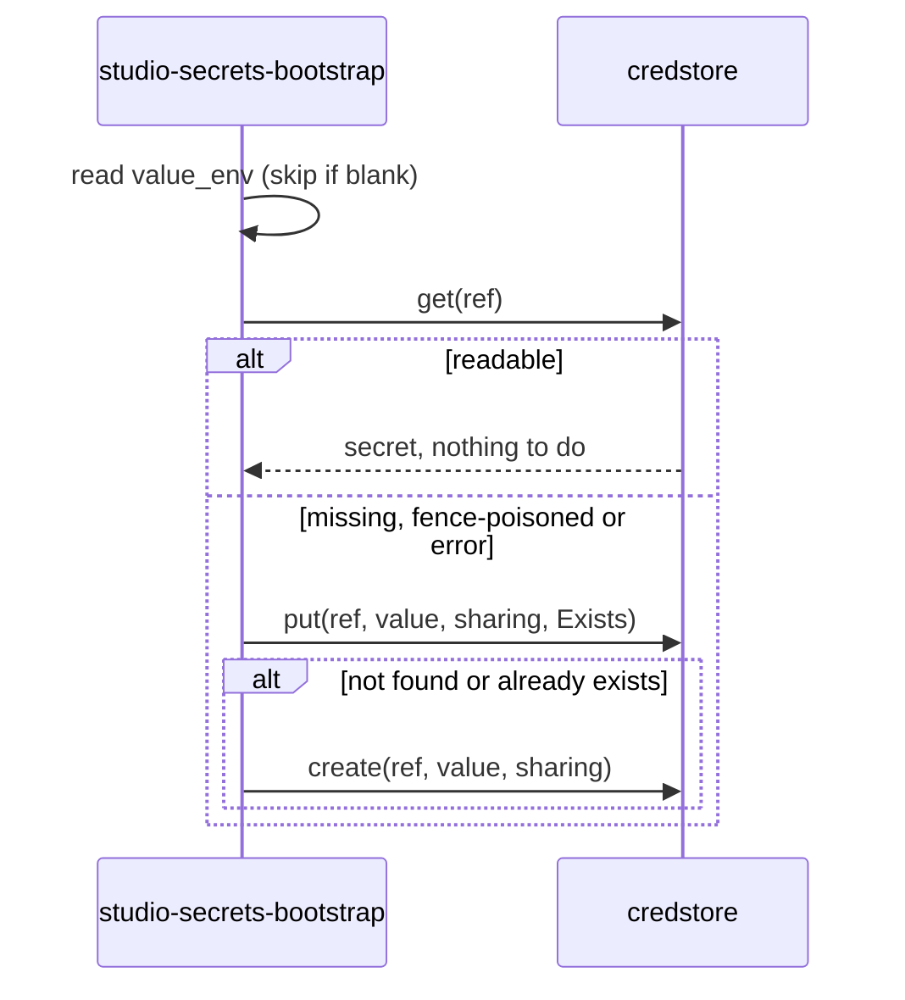

# Technical Design — studio-secrets-bootstrap

- [x] `p3` - **ID**: `cpt-studio-design-secrets-bootstrap`

The gear-level design of `cpt-studio-component-secrets-bootstrap`. The
product-level view, and how this gear sits among the others, is in
[Constructor Studio's design](constructor-studio.md). The code is
[`studio-backend/src/secrets_bootstrap/`](../../studio-backend/src/secrets_bootstrap/).

## Table of Contents

- [1. Architecture Overview](#1-architecture-overview)
- [2. Principles & Constraints](#2-principles--constraints)
- [3. Technical Architecture](#3-technical-architecture)
- [4. Additional context](#4-additional-context)
- [5. Traceability](#5-traceability)

## 1. Architecture Overview

### 1.1 Architectural Vision

Self-heal for config-seeded credstore secrets, run once at start.

The dev value store, `static-credstore-plugin`, is in memory: its values and
its fence key die with every restart, while the secret metadata lives in
PostgreSQL and survives. A restart therefore left references such as
`openai-key` fence-poisoned — `GET` fails closed — and consumers (mini-chat
provisioning its OAGW upstream) spun on `failed_precondition` until somebody
`PUT` the secret by hand with `If-Match: *`. This gear performs that heal
automatically.

`cpt-studio-component-credstore-pg` removes the cause: values in a durable
table stop dying at restart. This gear stays useful either way. It is how a key
held only in the environment (`STUDIO_LLM_API_KEY` and friends) gets into
credstore in the first place, on every boot, without anyone typing it into the
portal.

### 1.2 Architecture Drivers

#### Functional Drivers

| Requirement | Design Response |
|-------------|------------------|
| `cpt-studio-fr-credentials-durable` | At start, every configured `(reference, environment variable)` pair is checked and a missing or unreadable secret is rewritten from the environment. |

#### NFR Allocation

| NFR ID | NFR Summary | Allocated To | Design Response | Verification Approach |
|--------|-------------|--------------|-----------------|----------------------|
| `cpt-studio-nfr-durable-work` | Credentials survive a restart | `cpt-studio-component-secrets-bootstrap` | Seeded secrets are rewritten on every boot when they do not read back | Unit tests in `secrets_bootstrap/mod.rs` against a recording credstore |

### 1.3 Architecture Layers

| Layer | Responsibility | Technology |
|-------|---------------|------------|
| Runnable | Spawn the heal once all gears are initialized | `RunnableCapability::start` |
| Heal | Check, overwrite, or create one secret | `heal_seed` over `CredStoreClientV1` |

## 2. Principles & Constraints

### 2.1 Design Principles

#### Boot never fails because of a seed

- [x] `p2` - **ID**: `cpt-studio-principle-secrets-bootstrap-fails-quietly`

A problem is a warning, and consumers keep retrying. A deployment where a key
is genuinely absent should start and say so, not refuse to come up. `start`
spawns the heal and returns at once, as every `start` must.

#### An accessible secret is left alone

- [x] `p2` - **ID**: `cpt-studio-principle-secrets-bootstrap-leave-readable`

A secret that reads back is not touched, so a value someone changed in the
portal is not reverted at the next boot. One that reads as absent, or whose
read fails, is overwritten whatever generation holds the reference
(`WritePrecondition::Exists`, credstore's documented healing path for
fence-poisoned references); a reference with no metadata at all is created.

### 2.2 Constraints

#### Written as a service in the root tenant

- [x] `p2` - **ID**: `cpt-studio-constraint-secrets-bootstrap-root-tenant`

The heal has no caller. It writes as a fixed synthetic subject
(`…b007`, subject type `service`) in the platform root tenant, where shared
seeds live, so the writes show up under one name in the audit.

## 3. Technical Architecture

### 3.1 Domain Model

- [x] `p2` - **ID**: `cpt-studio-entity-secret-seed`

A **seed** is a credstore reference (`ref`), the environment variable holding
its value (`value_env`), and its sharing mode (`shared` by default, which is
what LLM egress needs; `tenant`; `private`). An unset or blank variable skips
the seed with a warning.

### 3.2 Component Model

The gear is one component, `cpt-studio-component-secrets-bootstrap`; it has no
parts worth naming apart.

### 3.3 API Contracts

None: no REST surface and no ClientHub client.

### 3.4 Internal Dependencies

| Dependency Gear | Interface Used | Purpose |
|-------------------|----------------|----------|
| `credstore` (`cpt-studio-component-platform-feature-gears`) | `CredStoreClientV1` (`get`, `put`, `create`) | Check and rewrite seeded secrets |

### 3.5 External Dependencies

None beyond the process environment.

### 3.6 Interactions & Sequences

#### Heal a seed

**ID**: `cpt-studio-seq-secrets-bootstrap-heal`

**Description**: Each seed is healed in turn, in a task spawned from `start`.

### 3.7 Database schemas & tables

None of its own; credstore and `cpt-studio-component-credstore-pg` hold the
secrets.

### 3.8 Deployment Topology

In-process in the one `studio-backend` binary: gear
`studio-secrets-bootstrap`, capabilities `[stateful]`, deps `credstore`, config
section `gears.studio-secrets-bootstrap` with its `secrets` list. `docker.yaml`
and `k8s.yaml` seed `openai-key` from `STUDIO_LLM_API_KEY` and `anthropic-key`
from `STUDIO_ANTHROPIC_API_KEY`, both shared.

## 4. Additional context

With `studio-credstore-pg` active the heal is normally a no-op that logs "secret
accessible — no heal needed". It is still the only source of `openai-key` and
`anthropic-key` on a first boot, after `STUDIO_CREDSTORE_KEY` changes (old rows
stop decrypting and read as absent), and whenever the persistent store stands
down and the in-memory fallback takes over. `studio-llm-proxy` answers an
agent's call with these shared keys for a member who keeps none of their own.

## 5. Traceability

- **PRD**: [Constructor Studio](../prd/constructor-studio.md)
- **Design**: [Constructor Studio](constructor-studio.md)
- **ADRs**: [ADR index](../adr/README.md)
- **Code**: [`studio-backend/src/secrets_bootstrap/`](../../studio-backend/src/secrets_bootstrap/)
