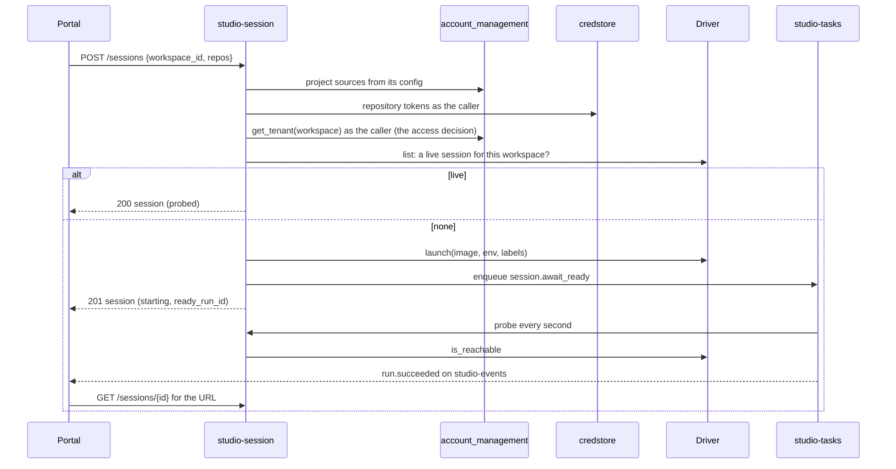

# Technical Design — studio-session

- [x] `p3` - **ID**: `cpt-studio-design-session`

The gear-level design of `cpt-studio-component-session`. The product-level
view, and how this gear sits among the others, is in
[Constructor Studio's design](constructor-studio.md). The code is
[`studio-backend/src/studio_session/`](../../studio-backend/src/studio_session/).

## Table of Contents

- [1. Architecture Overview](#1-architecture-overview)
- [2. Principles & Constraints](#2-principles--constraints)
- [3. Technical Architecture](#3-technical-architecture)
- [4. Additional context](#4-additional-context)
- [5. Traceability](#5-traceability)

## 1. Architecture Overview

### 1.1 Architectural Vision

The IDE is not a page in the portal. It is a running container with a
checkout, credentials and an agent runtime inside it, and something has to
decide when one starts, what goes into it, who may reach it and when it stops
costing money. That is this gear, Studio's first of its own.

The runtime sits behind `driver::SessionDriver`. The Docker driver runs a
container on the local daemon, published on a loopback port; the Kubernetes
driver runs a Pod and a ClusterIP Service per session, reached through the
backend's proxy. The REST contract and the portal flow do not change with the
driver.

The gear keeps no session table and no registry of its own. The Docker daemon
and the Kubernetes API know which sessions exist: they create them, they
outlive a backend restart, and they give every replica the same answer. The
gear lists them through the driver and caches the listing for a few seconds.

A second kind of session, the desktop session (ADR-0027), is a lease rather
than a container: a desktop Studio renews it with a heartbeat, and it is gone
when the heartbeats stop.

### 1.2 Architecture Drivers

#### Functional Drivers

| Requirement | Design Response |
|-------------|------------------|
| `cpt-studio-fr-ide-session` | One live session per workspace, launched through a `SessionDriver` (Docker or Kubernetes) behind one REST contract; the workspace's sources are cloned by the session's entrypoint; sessions are reaped by a scheduled run and found again by label after a restart. |

#### NFR Allocation

| NFR ID | NFR Summary | Allocated To | Design Response | Verification Approach |
|--------|-------------|--------------|-----------------|----------------------|
| `cpt-studio-nfr-session-bounds` | Four-hour lifetime, bounded ports | `cpt-studio-component-session-reaper`, `SessionService::allocate_port` | `max_session_secs` (14400 by default) and `idle_session_secs` (900) are enforced by the `session.reap` run; the Docker driver allocates from `port_range_start`–`port_range_end` (41000–41099) | `studio_session` unit tests in the `test-backend` job |
| `cpt-studio-nfr-credential-isolation` | No secret in a browser or an API response | `cpt-studio-component-session` | Repository tokens are resolved from credstore under the caller's identity and reach the container only as environment for its credential helper; provider keys are not injected (ADR-0030); no response carries a token except the session's own gate token in its URL | `test-theia-session-gate` job (`theia/docker/git-credentials.test.mjs`) |

#### Key ADRs

| ADR ID | Decision Summary |
|--------|------------------|
| `cpt-studio-adr-theia-sessions` | Per-workspace Theia IDE sessions in containers, Docker first, Kubernetes behind the same contract (ADR-0003). |
| `cpt-studio-adr-theia-backend-bridge` | The session carries a per-session S2S token for the backend bridge (ADR-0022). |
| `cpt-studio-adr-a-desktop-session-keeps-the-secrets-on-the-server` | A desktop session is a lease, keyed by workspace, member and device (ADR-0027 §4). |
| `cpt-studio-adr-a-shared-session-is-many-people-each-as-themselves` | Nothing personal in the container's environment (ADR-0030, proposed). |
| `cpt-studio-adr-a-role-narrows-what-a-member-may-do` | Access to a project is membership, not a privilege (ADR-0019). |

### 1.3 Architecture Layers

| Layer | Responsibility | Technology |
|-------|---------------|------------|
| REST | Launch, list, read and stop sessions; desktop leases; the browser's proxy into a Kubernetes session | `OperationBuilder` routes in `rest.rs`, `desktop_rest.rs`; `proxy.rs` over `hyper-util` |
| Service | Access decision, source planning, workspace manifest, tokens, readiness, reaping | `service.rs`, `access.rs`, `launch_sources.rs` |
| Runs | Wait for a session to answer; reap expired and idle sessions | `ready_task.rs`, `reap_task.rs`, registered with `studio-tasks` |
| Driver | Launch, probe, list, destroy the runtime | `docker.rs` (`bollard`), `k8s.rs` (`kube`) |
| SDK | Endpoint and token discovery for the Theia bridge | `sdk.rs`, `StudioSessionDiscoveryClientV1` on the ClientHub |

## 2. Principles & Constraints

### 2.1 Design Principles

#### The runtime is the registry

- [x] `p2` - **ID**: `cpt-studio-principle-session-runtime-is-registry`

Sessions are not kept in a map this process owns. `SessionService` lists them
from the driver and keeps the answer for `registry_ttl_secs` (3 by default),
so the IDE proxy does not make a driver call per request. Anything the runtime
does not list is gone from the cache, whoever put it there.

A session's id is derived, not drawn: `session_id_for(workspace_id)` is a
UUIDv5 over the workspace, and the runtime names the container or Pod
`cf-studio-session-<workspace>`. Every process, before or after a restart,
calls a session by the same name. Labels on the runtime
(`cf.studio.session`, `cf.studio.workspace_id`, `cf.studio.tenant_id`,
`cf.studio.port`, `cf.studio.launch_id`) carry the rest.

Whether the IDE is answering is the one thing the runtime cannot report: a Pod
is `Running` well before Theia binds. So it is probed and remembered across
listings, and the probe lives inside the read. A read is what advances a
session from `starting` to `running`; nothing does it on its own. That is why
a launch queues a `session.await_ready` run to do the reading.

#### Access is membership of the workspace

- [x] `p2` - **ID**: `cpt-studio-principle-session-access-is-membership`

Every surface asks one question, `WorkspaceAccess::may_reach`: does the
caller reach this workspace? It resolves the workspace tenant through
account-management under the caller's own `SecurityContext`, which answers
`NotFound` for a tenant outside the caller's subtree, so the read is the
decision. `documents` and `studio-kits` guard their workspace routes the same
way.

It replaced a comparison of the caller's home tenant with the launcher's.
That could not isolate anything, because two tenants asking for one workspace
are two attempts at one Pod name; it only missed the live session, and the
driver destroyed it to make room for the replacement. "Not yours" and "not
there" are the same 404, because telling them apart would tell the caller the
workspace exists. Without an account-management client the check fails
closed: an authorization question nobody can answer is not a yes.

**ADRs**: `cpt-studio-adr-a-role-narrows-what-a-member-may-do`

#### Nothing personal in the container

- [x] `p2` - **ID**: `cpt-studio-principle-session-nothing-personal`

Several people work in one session, so its environment names Studio's service
identity (`STUDIO_ACTOR_ID` is `service_actor`), not the launcher. Provider
keys are not injected: the agents reach their models through
`studio-llm-proxy` (`ANTHROPIC_BASE_URL`, `OPENAI_BASE_URL` under
`gateway_url`, with `STUDIO_LLM_AUTH=bearer`), each window with its own
person's token. The launcher's git author is not injected either; commits
carry the entrypoint's neutral author. `agent_env` and `git_identity_env` are no
longer called and are dead code (ADR-0039 follow-up: remove them with
`agent_secrets`).

What still enters the container is the repository tokens of the workspace's
sources (`STUDIO_SOURCES`, `STUDIO_ROOT_TOKEN`), resolved from credstore under
the caller's identity, for the in-container credential helper. A source whose
connection is personal carries no token reference, so its token is never
resolved into a shared container. A missing or unreadable token is a warning
and the source is cloned without it.

**ADRs**: `cpt-studio-adr-a-shared-session-is-many-people-each-as-themselves`

### 2.2 Constraints

#### A host without a runtime still boots

- [x] `p2` - **ID**: `cpt-studio-constraint-session-boots-without-runtime`

`enabled: false`, a missing Docker socket, an unreachable cluster or an
unknown `driver` never fail the backend. The gear boots with no service, the
routes stay mounted, and every session operation answers 503 with the reason;
`GET /sessions` answers an empty list. Desktop leases need no driver and keep
working.

#### A launch never pulls the image inline

- [x] `p2` - **ID**: `cpt-studio-constraint-session-no-inline-pull`

A registry pull of the session image takes minutes and the gateway deadline is
30 seconds. A background image keeper pulls at boot and again after a launch
when `always_pull` is set, so the next launch gets the refreshed mutable tag.
A launch with no local image asks the keeper and answers that the image is
still downloading.

#### One backend replica while sessions are on

The Helm chart refuses a second replica with sessions enabled
(`cpt-studio-constraint-single-replica-sessions`). The gear no longer needs
it — the runtime is the registry — but two replicas have not been run against
a real cluster.

## 3. Technical Architecture

### 3.1 Domain Model

- [x] `p2` - **ID**: `cpt-studio-entity-session`

A **session** is one running IDE for one workspace: its id, workspace, the
launcher's tenant, the driver handle (container id or Pod name), its address
(a loopback port, or a Service host and port), its state (`starting`,
`running`, `stopped`), creation time, launch id, source summaries, a 256-bit
gate token and, with the bridge on, a separate S2S control token. All of it is
read back from the runtime's labels and environment; none of it is stored.

- [x] `p2` - **ID**: `cpt-studio-entity-desktop-session`

A **desktop session** is a lease: workspace, the member's subject id and home
tenant, device id and name, started and last-seen times. Its id is a UUIDv5
over `(workspace, member, device)`, so a desktop renewing after a backend
restart gets the id it had. A lease is renewed every `HEARTBEAT_SECS` (30) and
ends after `LEASE_TTL_SECS` (90) without a renewal. Leases are per process: a
restart forgets them and each desktop's next heartbeat writes its own back.

**Relationships**:
- Session → Workspace: at most one live container session per workspace.
- Desktop session → Workspace: any number, beside a container session; a lease
  records where a workspace is open and reserves nothing.

### 3.2 Component Model

#### Session drivers

- [x] `p2` - **ID**: `cpt-studio-component-session-drivers`

##### Why this component exists

How a session runs is the only part that differs between a laptop and a
cluster.

##### Responsibility scope

`driver.rs` defines `SessionDriver`: `image_present`, `refresh_image`,
`launch`, `is_running`, `is_reachable`, `destroy`, `list_adoptable`.
`docker.rs` runs one container per workspace through `bollard`, Theia on
container port 3003 published on `bind_host` (loopback), the workspace
directory under `workspaces_root` bind-mounted at `/workspace`. `k8s.rs` runs
an unprivileged bare Pod (non-root, all capabilities dropped) and a ClusterIP
Service per session in the backend's namespace, with requests and limits from
`k8s_session_*` (250m/2 CPU, 512Mi/2Gi by default), `/workspace` on an
`emptyDir`, a per-workspace claim (`k8s_workspace_persistent`) or a claim the
backend shares (`k8s_workspace_shared_claim`, pinned to `k8s_node_name`). A
namespace quota refusal is `NoCapacity`, answered 503 with the quota named.

##### Responsibility boundaries

A Kubernetes session takes no local sources: there is no host filesystem to
bind. A bare Pod is deliberate; a session is one lifetime, replaced by a
relaunch rather than restarted by a controller.

##### Related components (by ID)

- `cpt-studio-component-session-image` — launches

#### IDE proxy

- [x] `p2` - **ID**: `cpt-studio-component-session-ide-proxy`

##### Why this component exists

A Kubernetes session Pod has no ingress of its own.

##### Responsibility scope

`proxy.rs`: the frontend's nginx forwards `/studio/{id}/…` to
`/studio-session/v1/ide/{id}/…`, and this handler proxies HTTP and the
WebSocket upgrade to the session's Service, stripping hop-by-hop headers.

##### Responsibility boundaries

Makes no access decision. The browser opens the IDE in an iframe with no
platform token, so the routes are `.anonymous().exposed()`; the session
container's own gate is the credential (`?token=` on the first navigation,
swapped for an HttpOnly cookie). A Docker session is opened directly and is a
404 here.

##### Related components (by ID)

- `cpt-studio-component-session-image` — proxies to its gate

#### Readiness run

- [x] `p2` - **ID**: `cpt-studio-component-session-ready-probe`

##### Why this component exists

The probe that promotes `starting` to `running` lives in a read. With the
portal's poll loop doing that read, closing the tab during a launch left the
session `starting` until somebody else asked, and how long a start took was
recorded nowhere.

##### Responsibility scope

`ready_task.rs`, task type `session.await_ready`: probes every second for up to
three minutes per attempt, then hands the wait back to the queue as a retry;
succeeds with the session id, workspace and state, and fails when the session
is gone or stopped. A launch that answers `starting` enqueues it with the
session id as partition key and `<session>:<launch id>` as idempotency key, and
returns its id as `ready_run_id`.

##### Responsibility boundaries

The result never carries the session URL: it embeds the gate token, and a
run's result is broadcast to every subscriber in the tenant. Queuing is
best-effort; without `studio-tasks` the caller polls `GET /sessions/{id}`.

##### Related components (by ID)

- `cpt-studio-component-tasks` — runs as a task of

#### Reaper

- [x] `p2` - **ID**: `cpt-studio-component-session-reaper`

##### Why this component exists

A session costs money for as long as it runs, and the portal starts a
project's session before anyone asks for the IDE.

##### Responsibility scope

`reap_task.rs`, task type `session.reap`, fired by the platform schedule
`session-reaper` (`*/5 * * * *`) that `platform_schedules()` asks
`studio-scheduler` for. One pass lists the runtime through the driver and stops
every session older than `max_session_secs` and, with the bridge on, every one
the session itself reports idle (`getRuntimeStatus`) for `idle_session_secs`.
The run's result counts `expired`, `idle`, `stopped` and `failed`.

##### Responsibility boundaries

A session with no reported creation time is never treated as expired, and a
session that cannot say how long it has been idle is left to its maximum age.
It replaced a 60-second timer in every replica that walked only that replica's
view and left no record.

##### Related components (by ID)

- `cpt-studio-component-scheduler` — fired by
- `cpt-studio-component-tasks` — runs as a task of

#### Desktop leases

- [x] `p2` - **ID**: `cpt-studio-component-session-desktop-leases`

##### Why this component exists

No daemon knows about the member's laptop, so the runtime cannot be the
registry for a desktop session (ADR-0027 §4).

##### Responsibility scope

`desktop.rs`, `desktop_rest.rs`: open or renew, list a workspace's live
leases oldest first, and end the caller's own. Asks `may_reach` on every
heartbeat, so a member removed from the workspace stops holding it at the next
renewal.

##### Responsibility boundaries

Limits nothing: any number of devices and members, beside a container
session. Somebody else's lease is answered as missing.

##### Related components (by ID)

- `cpt-studio-component-account-management` — asks for workspace access

### 3.3 API Contracts

- [x] `p2` - **ID**: `cpt-studio-interface-session-rest`

- **Contracts**: `cpt-studio-interface-rest-api`
- **Technology**: REST/OpenAPI through `api_gateway`
- **Location**: [`studio-backend/docs/api-contract.json`](../../studio-backend/docs/api-contract.json)

**Endpoints Overview**:

| Method | Path | Description | Stability |
|--------|------|-------------|-----------|
| `POST` | `/studio-session/v1/sessions` | Launch, or reuse the live session for this workspace (201, or 200 when it existed) | unstable |
| `GET` | `/studio-session/v1/sessions` | The sessions the caller reaches, as the runtime has them | unstable |
| `GET` | `/studio-session/v1/sessions/{id}` | One session; promotes `starting` to `running` once its port answers | unstable |
| `DELETE` | `/studio-session/v1/sessions/{id}` | Stop and remove it; the workspace's files stay | unstable |
| `GET` `POST` | `/studio-session/v1/ide/{id}/`, `/studio-session/v1/ide/{id}/{*rest}` | The browser's proxy into a Kubernetes session; anonymous to the platform | unstable |
| `POST` | `/studio-session/v1/desktop-sessions` | Open (201) or renew (200) a desktop lease | unstable |
| `GET` | `/studio-session/v1/desktop-sessions?project_id=` | A workspace's live desktop leases, paged | unstable |
| `DELETE` | `/studio-session/v1/desktop-sessions/{id}` | End one of the caller's leases | unstable |

A launch takes the workspace id, an optional `root_path` (a folder on the
backend host mounted as the workspace root) or `root_repo_url` (the workspace
repository, cloned on first launch), and `repos` beyond the project's own. The
project's repositories come from its config (`project_sources`), not from the
caller; a requested Git source that names one of them is dropped, and a
requested source whose name is taken is renamed `<name>-2`, `-3`.

- [x] `p2` - **ID**: `cpt-studio-interface-session-discovery`

In process, `StudioSessionDiscoveryClientV1` on the ClientHub resolves a
workspace to its live session's control endpoint and S2S token under the
caller's identity, and resolves an S2S token back to the session's
`(session, tenant, workspace)`. It is registered unconditionally and answers
`None` unless `theia_control_enabled`.

### 3.4 Internal Dependencies

| Dependency Gear | Interface Used | Purpose |
|-------------------|----------------|----------|
| `cpt-studio-component-account-management` | `AccountManagementClient` | Workspace access; the project's sources from its config |
| `credstore` (`cpt-studio-component-platform-feature-gears`) | `CredStoreClientV1` | Repository tokens, under the caller's identity |
| `cpt-studio-component-tasks` | `TaskQueue` (resolved per request), `sdk::register` | `session.await_ready` and `session.reap` |
| `cpt-studio-component-scheduler` | `platform_schedules()` | The `session-reaper` schedule |
| `cpt-studio-component-theia-bridge` | consumes `StudioSessionDiscoveryClientV1` | Control endpoint and token discovery |

### 3.5 External Dependencies

#### Container runtime

| Dependency Gear | Interface Used | Purpose |
|-------------------|---------------|---------|
| `cpt-studio-component-session` | Docker Engine API over the socket (`bollard`), or the Kubernetes API with the backend's ServiceAccount (`kube`) | Launch, list, probe and destroy sessions; pull the image with `STUDIO_REGISTRY_USER` / `STUDIO_REGISTRY_TOKEN` when set |

### 3.6 Interactions & Sequences

The product-level flow is `cpt-studio-seq-open-ide-session` in
[Constructor Studio's design](constructor-studio.md#36-interactions--sequences).

#### Launch and wait for readiness

**ID**: `cpt-studio-seq-session-launch`

**Use cases**: `cpt-studio-usecase-open-ide-session`

**Actors**: `cpt-studio-actor-member`, `cpt-studio-actor-session`

**Description**: Two launches racing for one workspace are two attempts at one
name; the loser asks the runtime again and hands back the session that won. A
listed session whose runtime is gone is destroyed and launched fresh.

### 3.7 Database schemas & tables

None. Container sessions are the runtime's; desktop leases are in memory.

### 3.8 Deployment Topology

In-process in the one `studio-backend` binary: gear `studio-session`,
capabilities `[rest, stateful]`, deps `account_management`, `credstore`, config
section `gears.studio-session`. Compose uses the Docker driver with the
backend's Docker socket and `/srv/cf-studio-workspaces`; the Helm chart uses the
Kubernetes driver when `backend.sessions.enabled`, with a namespaced Role over
Pods and Services.

## 4. Additional context

A managed workspace (no `root_path`, no root repository) is rewritten on every
launch: `.cf-workspace.toml` lists exactly the current sources, and top-level
directories that are Git clones of no current source are deleted. A
bring-your-own folder is only appended to, never rewritten or pruned.

The S2S control token is compared with plain `==`; a constant-time compare is
noted in the code as a cheap hardening.

[`docs/theia-bridge-contract-v1.md`](../theia-bridge-contract-v1.md) is the
wire contract of the control API whose token this gear mints.

## 5. Traceability

- **PRD**: [Constructor Studio](../prd/constructor-studio.md)
- **Design**: [Constructor Studio](constructor-studio.md)
- **ADRs**: [ADR index](../adr/README.md)
- **Code**: [`studio-backend/src/studio_session/`](../../studio-backend/src/studio_session/)
