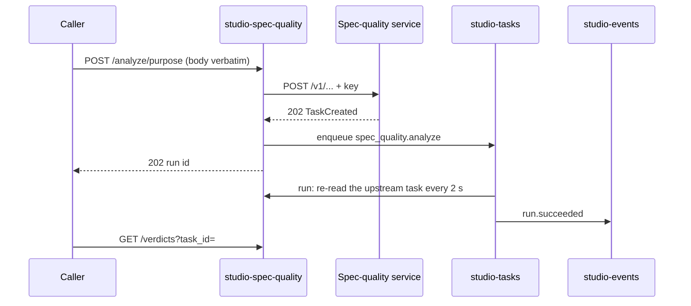

# Technical Design — studio-spec-quality

- [x] `p3` - **ID**: `cpt-studio-design-spec-quality`

The gear-level design of `cpt-studio-component-spec-quality`. The
product-level view, and how this gear sits among the others, is in
[Constructor Studio's design](constructor-studio.md). The code is
[`studio-backend/src/spec_quality/`](../../studio-backend/src/spec_quality/).

## Table of Contents

- [1. Architecture Overview](#1-architecture-overview)
- [2. Principles & Constraints](#2-principles--constraints)
- [3. Technical Architecture](#3-technical-architecture)
- [4. Additional context](#4-additional-context)
- [5. Traceability](#5-traceability)

## 1. Architecture Overview

### 1.1 Architectural Vision

A thin, authenticated wrapper over the external spec-quality service, the
detector API that judges whether a specification is any good. It analyses
documents with four asynchronous detectors:

| Detector | Asks |
|---|---|
| `bloat` | is this duplicated across documents |
| `purpose` | what role does each section play, and does the document meet its purpose gate |
| `leak` | does foreign content belong here |
| `traceability` | do the identifiers form a graph, or has the thread drifted |

The service authenticates with its own shared secret. Handing that secret to
every caller would mean handing it to the browser, so this gear exposes the
detectors under the Studio gateway and forwards a submission verbatim with the
server-held key attached: callers authenticate with their Studio token and the
key never leaves the backend.

The submit is a passthrough; the wait is a run. The upstream answers a submit
with 202 and a task id, and the result arrives only to whoever asks again.
That second half used to be the browser's, a polling loop per analysis that
the portal had to stay open for and that left no record. It is a
`studio-tasks` run now, announced on `studio-events` like every other.

A finished analysis is read once, here, as a verdict and as findings, because
reading a detector's answer is a judgement and the service documents none of
its result shapes.

### 1.2 Architecture Drivers

#### Functional Drivers

| Requirement | Design Response |
|-------------|------------------|
| `cpt-studio-fr-spec-quality` | Four submit routes forward verbatim with the key attached; `spec_quality.analyze` and `spec_quality.analyze_batch` runs wait for the result; `/verdicts` interprets it; a batch run given a `record` block records findings and gate verdicts itself. |

#### NFR Allocation

| NFR ID | NFR Summary | Allocated To | Design Response | Verification Approach |
|--------|-------------|--------------|-----------------|----------------------|
| `cpt-studio-nfr-credential-isolation` | No secret in a session, a browser or a response | `ProxyState` in `rest.rs` | The key is read from config or the environment and attached server-side; `/status` reports whether it is set, never its value | `config.rs` and `rest.rs` unit tests |
| `cpt-studio-nfr-durable-work` | Runs survive a restart | `analyze_task.rs`, `batch_task.rs` | The wait is a `studio-tasks` run; a retried `analyze` attempt re-reads the upstream task rather than submitting again | `analyze_task.rs` and `batch_task.rs` unit tests |

#### Key ADRs

| ADR ID | Decision Summary |
|--------|------------------|
| `cpt-studio-adr-studio-events-push-channel` | A caller follows an analysis as `subject_type: task_run` on `studio-events`, not by polling. |

### 1.3 Architecture Layers

| Layer | Responsibility | Technology |
|-------|---------------|------------|
| REST | Submit, batch, verdicts, health, status, capabilities | `OperationBuilder` routes in `rest.rs` |
| Runs | Watch one analysis; sweep a document set | `analyze_task.rs`, `batch_task.rs`, registered on `studio-tasks` |
| Interpretation | Verdicts, findings, the per-document fold of `bloat` | `verdict.rs`, `findings.rs`, `analysis.rs` |
| Recording | Turn a verdict into what the documents and the graph keep | `record.rs` |
| Upstream | One `reqwest` client and the key | `ProxyState`, `config.rs` |

## 2. Principles & Constraints

### 2.1 Design Principles

#### Bytes in, bytes out

- [x] `p2` - **ID**: `cpt-studio-principle-spec-quality-passthrough`

A submit forwards the caller's body untouched. What a detector accepts is
between the caller and the upstream, and a wrapper that parsed the payload
would have to be taught each detector's schema. The submit stays in the REST
handler: it is fast, its failures (a malformed payload, an unconfigured
upstream) are the caller's to see at once, and keeping it out of the run means
a retried attempt re-reads the upstream task instead of paying for a second
analysis.

#### The rules for reading a verdict are the product

- [x] `p2` - **ID**: `cpt-studio-principle-spec-quality-one-reading`

The four judgements are made once, where every portal meets them. A doc type
is reported with the share of the document recognised as specification at all
(`mixture.other` is what is not). An absent boolean stays `None`, never
`false`, so a gate with no answer keeps shut. Only duplication across
documents is bloat. `recognised` separates a shape this reader does not
understand from a document set that genuinely references nothing. A finding's
id hashes the rule, document, section and passage and never the line numbers,
so a finding marked "as intended" does not come back when a paragraph is added
above it.

#### Decide nothing about what a verdict means

- [x] `p2` - **ID**: `cpt-studio-principle-spec-quality-no-policy`

Which documents are analysed, whether a verdict clears a gate, whether a type
gets bound: all stay with the caller and with `cpt-studio-component-documents`.
A batch run records results only when its payload carries a `record` block,
and only for the subjects that block names.

### 2.2 Constraints

#### Unconfigured is a valid state

- [x] `p2` - **ID**: `cpt-studio-constraint-spec-quality-unconfigured`

Without a base URL and a key the gear still loads, logs what to set, and every
analysis call answers a 500 that says so. Both task types are registered
either way, so a deployment that gains its key on the next restart needs no
queue rebuilt. `is_configured()` lets a caller nobody is waiting on (a source
sync) skip queueing work that could only fail.

#### A batch result carries pointers, not verdicts

- [x] `p2` - **ID**: `cpt-studio-constraint-spec-quality-pointers`

A run's `result` is stored whole and broadcast to the whole tenant. Fifty
verdicts in one payload would push megabytes down a channel everyone in the
organization reads, so `analyze_batch` names each document's upstream task and
how it ended, and the caller reads the verdicts it wants through `/verdicts`.
`analyze` stores the detector's result on the run.

## 3. Technical Architecture

### 3.1 Domain Model

- [x] `p2` - **ID**: `cpt-studio-entity-spec-quality-verdict`

An **analysis** is one upstream task for one detector. Its **verdict** is the
task read as an answer: a gate state (`passed`, `failed`, or `pending` while
unknown), a summary, a score, and for `bloat` the duplicated pairs and a
per-document fold. Its **findings** are claims about places in a document:
a `purpose` gate violation by section and lines with reason and evidence, a
`leak` by section and lines, a `bloat` passage with every other copy as
`related`. `traceability` produces no findings. The gear stores none of these
itself; see §3.7.

### 3.2 Component Model

#### Analyze run

- [x] `p2` - **ID**: `cpt-studio-component-spec-quality-analyze-run`

##### Why this component exists

The wait for a detector is minutes long and must not depend on a browser tab.

##### Responsibility scope

`analyze_task.rs`, task type `spec_quality.analyze`: re-reads the upstream
task every 2 seconds until it finishes, giving one attempt 10 minutes before
it is retried; stores the detector's result on the run.

##### Responsibility boundaries

Never submits; the REST handler did.

##### Related components (by ID)

- `cpt-studio-component-tasks` — runs as

#### Batch run

- [x] `p2` - **ID**: `cpt-studio-component-spec-quality-batch-run`

##### Why this component exists

A sweep over a document set was a submit-wait loop in the browser; closing the
tab abandoned it half done.

##### Responsibility scope

`batch_task.rs`, task type `spec_quality.analyze_batch`: one detector over at
most 200 items, in turn, each with its own 5-minute deadline; progress names
the item reached. A set detector is one item whose payload is the whole set.
A document of a type the service does not judge is recorded as a `pending`
verdict that says why. With a `record` block it writes `spec_finding` nodes
and `duplicates` edges through `artifact_ingest::port::SpecFindingWriter`
and gate verdicts through `documents::port::AnalysisRecorder`, both resolved
per run. One attempt only: a retry would resubmit and pay for the whole set,
and each item already survives its own failure.

##### Responsibility boundaries

Never fails the run over a recording that could not be written; it logs it.

##### Related components (by ID)

- `cpt-studio-component-tasks` — runs as
- `cpt-studio-component-documents` — records verdicts through
- `cpt-studio-component-artifact-ingest` — records findings through

### 3.3 API Contracts

- [x] `p2` - **ID**: `cpt-studio-interface-spec-quality-rest`

- **Contracts**: `cpt-studio-interface-rest-api`, `cpt-studio-contract-spec-quality-service`
- **Technology**: REST/OpenAPI through `api_gateway`
- **Location**: [`studio-backend/docs/api-contract.json`](../../studio-backend/docs/api-contract.json)

**Endpoints Overview**:

| Method | Path | Description | Stability |
|--------|------|-------------|-----------|
| `POST` | `/studio-spec-quality/v1/analyze/{bloat,purpose,leak,traceability}` | Submit one analysis; 202 with the run watching it | unstable |
| `POST` | `/studio-spec-quality/v1/analyze-batch` | One detector over a document set, as one run | unstable |
| `GET` | `/studio-spec-quality/v1/verdicts?task_id=&detector=&path=` | One finished analysis, read as a verdict with findings | unstable |
| `GET` | `/studio-spec-quality/v1/health` | Upstream liveness (the service's `/healthz`) | unstable |
| `GET` | `/studio-spec-quality/v1/status` | Whether the wrapper is configured, without secrets | unstable |
| `GET` | `/studio-spec-quality/v1/capabilities` | Detectors and document types the upstream declares | unstable |

The prefix is the gear's own name. The raw upstream task reads (`/tasks`,
`/tasks/{task_id}`) and the old `/spec-quality/v1` prefix were removed: a run
is followed on studio-tasks, and its result is read through `/verdicts`.
Submit bodies may be up to 64 MiB, because `bloat` and `traceability` take
the whole document set in one body.

### 3.4 Internal Dependencies

| Dependency Gear | Interface Used | Purpose |
|-------------------|----------------|----------|
| `cpt-studio-component-tasks` | `registry::register`, `TaskQueue` | The two task types; enqueue the run a submit creates |
| `cpt-studio-component-documents` | `port::AnalysisRecorder` from the ClientHub, resolved per run | Gate verdicts a stage reads |
| `cpt-studio-component-artifact-ingest` | `port::SpecFindingWriter` from the ClientHub, resolved per run | `spec_finding` nodes and `duplicates` edges |

The gear declares no gear deps: every one of these is optional, and a
deployment without them records less.

### 3.5 External Dependencies

#### Spec-quality service

| Dependency Gear | Interface Used | Purpose |
|-------------------|---------------|---------|
| `cpt-studio-component-spec-quality` | `cpt-studio-contract-spec-quality-service`: `{base_url}/v1/…` and `/healthz` with the shared bearer secret; connect timeout 10 s, request timeout 60 s | The four detectors |

### 3.6 Interactions & Sequences

#### Analyse one document

**ID**: `cpt-studio-seq-spec-quality-analyze`

**Actors**: `cpt-studio-actor-member`

**Description**: The caller sees a malformed payload at once; the wait is a
run it follows on the push channel; the verdict is read rather than relayed.

### 3.7 Database schemas & tables

None. The state the gear keeps is one HTTP client and the key; a restart loses
nothing, and the runs survive it because they are `studio_tasks_runs` rows.
Recorded verdicts are `cpt-studio-component-documents`' and findings are graph
nodes of `cpt-studio-component-artifact-ingest`.

### 3.8 Deployment Topology

In-process in the one `studio-backend` binary: gear `studio-spec-quality`,
capabilities `[rest]`, config section `gears.studio-spec-quality`.

## 4. Additional context

[`docs/upstream/spec-quality-issues.md`](../../docs/upstream/spec-quality-issues.md)
records what the upstream service gets wrong, including why `traceability`
finds no pairs in `extract` mode. [`docs/spec-findings.md`](../spec-findings.md)
covers how recorded findings reach the editor.

## 5. Traceability

- **PRD**: [Constructor Studio](../prd/constructor-studio.md)
- **Design**: [Constructor Studio](constructor-studio.md)
- **ADRs**: [ADR index](../adr/README.md)
- **Code**: [`studio-backend/src/spec_quality/`](../../studio-backend/src/spec_quality/)
