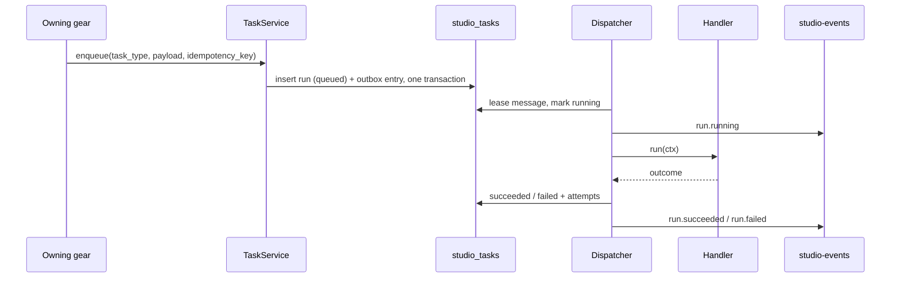

# Technical Design — studio-tasks

- [x] `p3` - **ID**: `cpt-studio-design-tasks`

The gear-level design of `cpt-studio-component-tasks`. The product-level view,
and how this gear sits among the others, is in
[Constructor Studio's design](constructor-studio.md). The code is
[`studio-backend/src/tasks/`](../../studio-backend/src/tasks/).

## Table of Contents

- [1. Architecture Overview](#1-architecture-overview)
- [2. Principles & Constraints](#2-principles--constraints)
- [3. Technical Architecture](#3-technical-architecture)
- [4. Additional context](#4-additional-context)
- [5. Traceability](#5-traceability)

## 1. Architecture Overview

### 1.1 Architectural Vision

Background work that survives the process running it. A run is a row, its
execution is a queue entry, and the two are written in one transaction.

Three gears had each invented this badly before: `connectors::graph_sync_tasks`,
`artifact_ingest::tasks` and `components_catalog::tasks` each kept a
`Mutex<HashMap<String, TaskRecord>>`, each defined its own `TaskStatus`, capped
its own retention and served its own `GET …/tasks/{id}`. All three lost
everything on restart — a poll a second after a redeploy answered "no such
task" about work that had really run — and none could be cancelled or retried.

### 1.2 Architecture Drivers

#### Functional Drivers

| Requirement | Design Response |
|-------------|------------------|
| `cpt-studio-fr-background-runs` | One run table and one queue for every task type; the gear that owns the work registers a handler and enqueues, this gear executes and records. |

#### NFR Allocation

| NFR ID | NFR Summary | Allocated To | Design Response | Verification Approach |
|--------|-------------|--------------|-----------------|----------------------|
| `cpt-studio-nfr-durable-work` | Runs survive a restart | `cpt-studio-component-tasks` | The run row and its outbox entry commit together in `studio_tasks`; a run whose process died is redelivered when its lease runs out | `tasks` tests against the shared test PostgreSQL (`test_pg.rs`) |

#### Key ADRs

| ADR ID | Decision Summary |
|--------|------------------|
| `cpt-studio-adr-studio-events-push-channel` | A run's state changes reach the portal as `studio-events`, not through a poll of its own. |

### 1.3 Architecture Layers

| Layer | Responsibility | Technology |
|-------|---------------|------------|
| REST | Read the history; cancel and retry | `OperationBuilder` routes in `rest.rs` |
| Service | Enqueue, cancel, retry | `service.rs`, one transaction per enqueue |
| Dispatch | Take a run off the queue, run its handler, record the outcome | `dispatch.rs` over the `toolkit-db` outbox |
| Registry | Which task types this process can run | `registry.rs`, filled by the owning gears at init |
| Storage | `studio_tasks_runs` and the outbox family | PostgreSQL database `studio_tasks` |

## 2. Principles & Constraints

### 2.1 Design Principles

#### Authorization happens at enqueue

- [x] `p2` - **ID**: `cpt-studio-principle-tasks-authorize-at-enqueue`

A run executes with no request behind it — minutes after the one that asked,
after a restart, or, for a scheduled run, with no request ever. Nothing
persists a caller's bearer token, so the worker acts as `studio-tasks` itself,
scoped to the run's tenant. A handler that needs a caller-specific permission
checks it before enqueuing, where there is still a request to answer with a
400.

#### No generic "run this" route

- [x] `p2` - **ID**: `cpt-studio-principle-tasks-no-generic-enqueue`

Runs are created by the gear that owns the work, or by a schedule that already
names both the type and the payload. An endpoint that enqueues an arbitrary
type with an arbitrary payload would let any caller make any handler in the
process do anything, with no validation of what it is given.

#### Cancellation is cooperative

- [x] `p2` - **ID**: `cpt-studio-principle-tasks-cooperative-cancel`

`POST /runs/{id}/cancel` sets a flag. A queued run is refused before it starts.
A running one stops where its handler looks at `TaskContext::cancelled`; the
dispatcher polls the flag every five seconds while the handler runs and flips
the handler's token when it appears.

### 2.2 Constraints

#### Not a scheduler, not a workflow engine

- [x] `p2` - **ID**: `cpt-studio-constraint-tasks-no-time-no-steps`

Nothing here knows about time: `cpt-studio-component-scheduler` owns schedules
and only enqueues, so it can be switched off without taking background work
with it. There are no steps, branching or compensation either; the platform's
`serverless-runtime` covers that ground. This gear runs one function to
completion and records what happened.

#### A lease is also the crash-detection delay

- [x] `p2` - **ID**: `cpt-studio-constraint-tasks-lease`

The queue takes a message back when its lease runs out. The lease is fifteen
minutes (with ten seconds kept back for the ack, which writes the run row too):
the default thirty seconds cut every repository import and catalog sync short
and restarted it for ever. The price is that a run whose process died is
retried at worst fifteen minutes later, and its partition — one of eight —
stays blocked until then. Work that needs longer is caught by the attempt cap
and dead-lettered with that reason.

## 3. Technical Architecture

### 3.1 Domain Model

- [x] `p2` - **ID**: `cpt-studio-entity-task-run`

A **run** is one execution request for one task type: its payload, state
(`queued`, `running`, `succeeded`, `failed`, `cancelled`), attempts, progress
phase, summary or last error, and result. A **task type** is a name a handler
was registered under (`notify.deliver`, `artifact.ingest`, `session.reap`,
`session.await_ready`, `spec_quality.analyze`, `spec_quality.analyze_batch`,
`catalog.sync`, `connector.graph_sync`, and this gear's own
`tasks.retention_sweep`).

### 3.2 Component Model

#### Dispatcher

- [x] `p2` - **ID**: `cpt-studio-component-tasks-dispatcher`

##### Why this component exists

The outbox delivers a message; somebody has to turn it back into a run, find
its handler and record what the handler said.

##### Responsibility scope

`dispatch.rs`: claims the run, refuses it if cancellation was requested, runs
the handler with a `TaskContext`, polls the cancel flag, writes the outcome and
attempts, announces each state change on `studio-events`, and dead-letters a
run that exceeds `max_attempts` rather than holding its partition.

##### Responsibility boundaries

Does not decide what a run does; the registered handler does.

##### Related components (by ID)

- `cpt-studio-component-events` — publishes run state to

#### Retention sweep

- [x] `p2` - **ID**: `cpt-studio-component-tasks-retention-sweep`

##### Why this component exists

A schedule firing nightly writes a run row every night for ever.

##### Responsibility scope

`sweep.rs`, task type `tasks.retention_sweep`: deletes finished runs older than
the payload's `keep_days` (30 by default) and their dead letters.

##### Responsibility boundaries

Prunes only the tenant its own run belongs to. `toolkit-db`'s secure ORM has no
cross-tenant write, so the platform schedule prunes the platform tenant, where
every scheduled run accumulates; runs created inside a workspace tenant are
not touched. Deliberately not worked around.

##### Related components (by ID)

- `cpt-studio-component-scheduler` — fired by

### 3.3 API Contracts

- [x] `p2` - **ID**: `cpt-studio-interface-tasks-rest`

- **Contracts**: `cpt-studio-interface-rest-api`
- **Technology**: REST/OpenAPI through `api_gateway`
- **Location**: [`studio-backend/docs/api-contract.json`](../../studio-backend/docs/api-contract.json)

**Endpoints Overview**:

| Method | Path | Description | Stability |
|--------|------|-------------|-----------|
| `GET` | `/studio-tasks/v1/runs` | The history, filterable by `task_type` and `state` | stable |
| `GET` | `/studio-tasks/v1/runs/{id}` | One run: state, attempts, phase, summary or last error | stable |
| `POST` | `/studio-tasks/v1/runs/{id}/cancel` | Ask it to stop | stable |
| `POST` | `/studio-tasks/v1/runs/{id}/retry` | Run a failed or cancelled one again | stable |
| `GET` | `/studio-tasks/v1/task-types` | Which handlers this deployment registered | stable |

In process, gears enqueue through the `TaskQueue` client on the ClientHub and
register a `sdk::TaskHandler` through `sdk::register`.

### 3.4 Internal Dependencies

| Dependency Gear | Interface Used | Purpose |
|-------------------|----------------|----------|
| `account_management` | SDK client | Tenant scope of a run |
| `cpt-studio-component-events` | `StudioEventPublisher` from the ClientHub, resolved per event | Announce run state changes |
| `cpt-studio-component-notify` | `port::Notifications` from the ClientHub, resolved per use | The completion notice to the IDE |

### 3.5 External Dependencies

#### PostgreSQL

| Dependency Gear | Interface Used | Purpose |
|-------------------|---------------|---------|
| `cpt-studio-component-tasks` | `toolkit-db` (SeaORM, outbox) | The run table and the outbox family `studio_tasks_outbox_*` |

### 3.6 Interactions & Sequences

#### Run a task

**ID**: `cpt-studio-seq-tasks-run`

**Actors**: `cpt-studio-actor-member`

**Description**: The owning gear authorizes the caller and enqueues; the
dispatcher executes as `studio-tasks` in the run's tenant. A failure is retried
with exponential backoff up to the handler's `max_attempts`, then
dead-lettered.

### 3.7 Database schemas & tables

- [x] `p3` - **ID**: `cpt-studio-db-tasks`

Database `studio_tasks`.

#### Table: studio_tasks_runs

**ID**: `cpt-studio-dbtable-tasks-runs`

**Schema**:

| Column | Type | Description |
|--------|------|-------------|
| `id` | UUID | |
| `tenant_id` | UUID | |
| `task_type`, `partition_key` | TEXT | |
| `payload`, `result` | JSONB | |
| `state` | TEXT | `queued`, `running`, `succeeded`, `failed`, `cancelled` |
| `attempts` | SMALLINT | |
| `progress`, `summary`, `last_error` | TEXT | |
| `cancel_requested` | BOOLEAN | |
| `idempotency_key` | TEXT | unique index `uq_studio_tasks_runs_idempotency` |
| `requested_by` | UUID | |
| `created_at`, `updated_at`, `started_at`, `finished_at` | TIMESTAMPTZ | |

**PK**: `id`

**Constraints**: `CHECK` on `state`.

**Additional info**: `summary` and `last_error` are cut to 500 characters;
`result` is not capped and is broadcast whole on `studio-events`, so a handler
with a large result stores a pointer to it. The outbox tables
(`studio_tasks_outbox_*`) are `toolkit-db`'s.

**Example**:

| task_type | state |
|--------|--------|
| `notify.deliver` | `succeeded` |

### 3.8 Deployment Topology

In-process in the one `studio-backend` binary: gear `studio-tasks`,
capabilities `[rest, db, stateful]`, config section `gears.studio-tasks`.

## 4. Additional context

[`docs/queued-notifications.md`](../../docs/queued-notifications.md)
explains why the queue is PostgreSQL and not Redis: the enqueue has to be part
of the transaction that caused it. `cpt-studio-component-notify` uses the same
substrate.

## 5. Traceability

- **PRD**: [Constructor Studio](../prd/constructor-studio.md)
- **Design**: [Constructor Studio](constructor-studio.md)
- **ADRs**: [ADR index](../adr/README.md)
- **Code**: [`studio-backend/src/tasks/`](../../studio-backend/src/tasks/)
