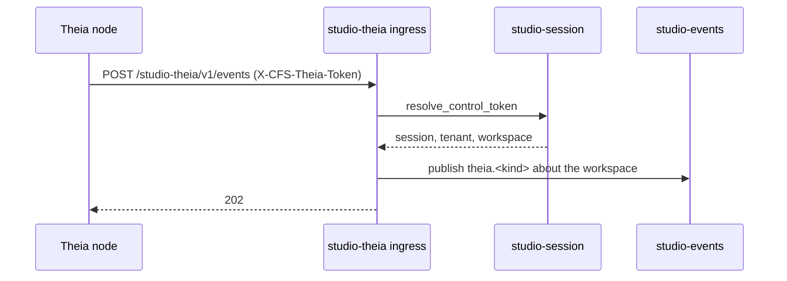

# Technical Design — studio-theia

- [x] `p3` - **ID**: `cpt-studio-design-theia`

The gear-level design of `cpt-studio-component-theia-bridge`. The
product-level view, and how this gear sits among the others, is in
[Constructor Studio's design](constructor-studio.md). The code is
[`studio-backend/src/studio_theia/`](../../studio-backend/src/studio_theia/).

## Table of Contents

- [1. Architecture Overview](#1-architecture-overview)
- [2. Principles & Constraints](#2-principles--constraints)
- [3. Technical Architecture](#3-technical-architecture)
- [4. Additional context](#4-additional-context)
- [5. Traceability](#5-traceability)

## 1. Architecture Overview

### 1.1 Architectural Vision

A session container is not just a UI. Its Theia node backend can open
workspaces, run operations and report what happened, and the portal needs
those things from outside the IDE: without a browser in the loop, and without
the browser ever holding a token that reaches the session directly.

So the bridge is backend-to-backend, in both directions. Studio to Theia,
`TheiaControlClientV1` on the ClientHub lets other gears make control calls
without a hop through the gateway. Theia to Studio, the session posts its
events to an ingress authenticated by the session's own S2S token. The Theia
node is tenant-blind; this gear and `studio-session` own the tenant boundary on
the trusted side.

### 1.2 Architecture Drivers

#### Functional Drivers

| Requirement | Design Response |
|-------------|------------------|
| `cpt-studio-fr-theia-bridge` | `TheiaControlClientV1` and the portal REST drive a session's control API with its S2S token; the ingress at `/studio-theia/v1/events` reverse-resolves the token and republishes the event. Built with the `theia-bridge` feature. |

#### NFR Allocation

| NFR ID | NFR Summary | Allocated To | Design Response | Verification Approach |
|--------|-------------|--------------|-----------------|----------------------|
| `cpt-studio-nfr-tenant-isolation` | Every allow stays in the caller's tenant subtree | `cpt-studio-component-theia-bridge` | A control call resolves its endpoint under the caller's `SecurityContext`, so the workspace check runs before anything leaves the backend; an event's tenant and workspace come from its token, never from its body | `studio_theia` unit tests in the `test-backend` job |

#### Key ADRs

| ADR ID | Decision Summary |
|--------|------------------|
| `cpt-studio-adr-theia-backend-bridge` | Backend-to-backend bridge to the Theia node (ADR-0022). |
| `cpt-studio-adr-studio-events-push-channel` | Forwarded events reach the portal on `studio-events`, in Studio's vocabulary (ADR-0026). |
| `cpt-studio-adr-a-desktop-session-keeps-the-secrets-on-the-server` | A desktop session's events and commands are meant to use the same ingress and routes (ADR-0027 §5); not built yet. |

### 1.3 Architecture Layers

| Layer | Responsibility | Technology |
|-------|---------------|------------|
| REST | Portal routes per workspace; the event ingress | `OperationBuilder` routes in `rest.rs` |
| Client | `TheiaControlClientV1`, one method per wire method | `control_client.rs`, `sdk/` |
| Service | Resolve the endpoint, make the call, map the error | `service.rs` over `reqwest` |
| Discovery | Workspace to endpoint and token; token to session | `discovery.rs` over `StudioSessionDiscoveryClientV1` |
| Sink | Where an accepted event goes | `sink.rs`: `studio-events`, or `event-broker` under its feature |

## 2. Principles & Constraints

### 2.1 Design Principles

#### The token is the identity of an event

- [x] `p2` - **ID**: `cpt-studio-principle-theia-token-is-identity`

The ingress has no user behind it: a background operation finishes when
nobody is there. It authenticates by resolving the `X-CFS-Theia-Token` header
back to the session's `(session, tenant, workspace)` through `studio-session`.
That identity, not the request body, says whom the event belongs to, so a
forged `workspaceId` in the envelope cannot move an event into another
tenant. It bypasses `SecurityContext` because it is what mints one.

#### The bridge's vocabulary stops at the sink

- [x] `p2` - **ID**: `cpt-studio-principle-theia-vocabulary-stops-at-sink`

Downstream an event is `theia.<kind>` about a workspace, with everything
Theia-specific — session id, sequence, the raw callback argument — inside the
payload. One producer's protocol does not become the contract every consumer
of `studio-events` has to live with.

**ADRs**: `cpt-studio-adr-studio-events-push-channel`

### 2.2 Constraints

#### Opt-in twice

- [x] `p2` - **ID**: `cpt-studio-constraint-theia-opt-in`

The gear is linked only with the `theia-bridge` Cargo feature (off in the
default build, on in the release image and the compose backend) and is dormant
unless `studio-theia.enabled = true`. Dormant, it still mounts every route, and
they answer 503 with the reason. A session carries a control token only when
`studio-session.theia_control_enabled` is on; without it discovery resolves
nothing.

#### The control API shares the session's port

- [x] `p2` - **ID**: `cpt-studio-constraint-theia-shared-port`

The Theia node serves its control API on the session's own port under
`/internal/theia/v1/`, gated by the S2S token; the endpoint is the session's
loopback port on `control_reach_host` (Docker) or its Service (Kubernetes). The
config's `control_port` (3031) is only logged. A dedicated internal port or
Service is the production hardening, not done.

## 3. Technical Architecture

### 3.1 Domain Model

- [x] `p2` - **ID**: `cpt-studio-entity-theia-forwarded-event`

A **forwarded event** is one `StudioRuntimeClient` callback from a session:
the trusted tenant, workspace and session, a `kind` (`operation`, `audit`,
`repositories-changed`, `workspace-snapshot-changed`, `workspace-activity`), a
`sequence` for the ordered kinds (`operation`, `audit`), and the callback
argument verbatim. A **session target** is the workspace a control call is
addressed to.

### 3.2 Component Model

#### Event ingress and sinks

- [x] `p2` - **ID**: `cpt-studio-component-theia-ingress`

##### Why this component exists

The portal learns what happens inside a session from the session itself.

##### Responsibility scope

`ingest_events` answers 401 for a missing or unknown token, 503 when the gear
is dormant or discovery is unavailable, and 202 once the sink has the event.
`StudioEventsSink`, the default, logs the event and publishes it on
`studio-events` (type `theia.<kind>`, subject type `workspace`, source
`studio-theia`). Under `theia-event-broker`, `EventBrokerEventSink` republishes
it as a typed event on `event-broker` instead, with a producer prepared once per
tenant.

##### Responsibility boundaries

Best-effort: with no publisher in the assembly the log line is the record. The
broker sink's GTS topic and type ids are placeholders, so it cannot publish
until they are registered and the broker is linked with storage.

##### Related components (by ID)

- `cpt-studio-component-events` — publishes to
- `cpt-studio-component-session` — reverse-resolves tokens through

#### Control client

- [x] `p2` - **ID**: `cpt-studio-component-theia-control-client`

##### Why this component exists

Gears that act on a session should not each speak HTTP to it.

##### Responsibility scope

`TheiaControlLocalClient` maps each method onto `POST
{base}/internal/theia/v1/{method}` with the S2S token: `getRuntimeStatus`,
`getSession`, `getRepositories`, `enqueueOperation`, `getOperationDeltas`,
`retryOperation`, `openInEditor`, `notifyEditor`, `installKit`. A call times out
after `request_timeout_secs` (15). A failure is a 503 carrying the session's
`error` message, cut to 2048 characters.

##### Responsibility boundaries

Defines no operations; the Theia node's `StudioRuntimeService` runs them, with
their journal and idempotency.

##### Related components (by ID)

- `cpt-studio-component-theia-studio` — calls its control API
- `cpt-studio-component-kits` — is called by, to list repositories and install kits
- `cpt-studio-component-notify` — is called by, to notify an open editor

### 3.3 API Contracts

- [x] `p2` - **ID**: `cpt-studio-interface-theia-rest`

- **Contracts**: `cpt-studio-interface-rest-api`, `cpt-studio-interface-session-control`
- **Technology**: REST/OpenAPI through `api_gateway`
- **Location**: [`studio-backend/docs/api-contract.json`](../../studio-backend/docs/api-contract.json)

**Endpoints Overview**:

| Method | Path | Description | Stability |
|--------|------|-------------|-----------|
| `GET` | `/studio-theia/v1/workspaces/{workspace_id}/status` | The IDE runtime status of the workspace's live session | unstable |
| `GET` | `/studio-theia/v1/workspaces/{workspace_id}/session` | Session identity and feature flags | unstable |
| `GET` | `/studio-theia/v1/workspaces/{workspace_id}/repositories` | The repositories the IDE has mounted | unstable |
| `POST` | `/studio-theia/v1/workspaces/{workspace_id}/operations` | Queue a save, commit or push through the IDE's operation journal | unstable |
| `GET` | `/studio-theia/v1/workspaces/{workspace_id}/operations?after_sequence=` | Operation events after a sequence | unstable |
| `POST` | `/studio-theia/v1/workspaces/{workspace_id}/operations/{operation_id}/retry` | Retry a failed operation | unstable |
| `POST` | `/studio-theia/v1/workspaces/{workspace_id}/open` | Reveal or open a file in the running IDE | unstable |
| `POST` | `/studio-theia/v1/events` | The Theia to Studio ingress; anonymous to the platform, S2S-token-gated | unstable |

The ingress path is configurable (`event_ingress_path`). The workspace routes
are authenticated. In process, gears use `TheiaControlClientV1`.

### 3.4 Internal Dependencies

| Dependency Gear | Interface Used | Purpose |
|-------------------|----------------|----------|
| `cpt-studio-component-session` | `StudioSessionDiscoveryClientV1`, looked up per call | Endpoint and token for a workspace; session identity for a token |
| `cpt-studio-component-events` | `StudioEventPublisher`, looked up per event | Republish forwarded events |
| `event-broker` | `event-broker-sdk` | Republish forwarded events, only with `theia-event-broker` |

Both lookups are lazy, so the gear has no opinion about init order and
declares no gear deps.

### 3.5 External Dependencies

#### Theia node backend in a session

| Dependency Gear | Interface Used | Purpose |
|-------------------|---------------|---------|
| `cpt-studio-component-theia-bridge` | `cpt-studio-interface-session-control` | Control calls into a session; events back from it |

### 3.6 Interactions & Sequences

#### Forward an event

**ID**: `cpt-studio-seq-theia-forward-event`

**Actors**: `cpt-studio-actor-session`

**Description**: The token is minted per session by `studio-session` and
injected as `STUDIO_THEIA_S2S_TOKEN`; it never reaches a browser and is
distinct from the gate token.

### 3.7 Database schemas & tables

None.

### 3.8 Deployment Topology

In-process in the one `studio-backend` binary, with the `theia-bridge` feature:
gear `studio-theia`, capabilities `[rest]`, config section `gears.studio-theia`
(`enabled`, `event_ingress_path`, `request_timeout_secs`, and the unused
`control_port` and `s2s_token_env`). `docker.yaml` and `k8s.yaml` enable it.

## 4. Additional context

The wire contract is [`docs/theia-bridge-contract-v1.md`](../theia-bridge-contract-v1.md).
[`studio-backend/docs/theia-bridge-architecture.md`](../../studio-backend/docs/theia-bridge-architecture.md)
explains the trust model and how to inspect the surface, and
[`studio-backend/docs/theia-bridge-local-docker.md`](../../studio-backend/docs/theia-bridge-local-docker.md)
how to run it locally. Code comments still call the bridge ADR-0010; it is
ADR-0022.

`s2s_token_env` names a single shared ingress token from before per-session
tokens; it is kept for config compatibility and checked nowhere.

## 5. Traceability

- **PRD**: [Constructor Studio](../prd/constructor-studio.md)
- **Design**: [Constructor Studio](constructor-studio.md)
- **ADRs**: [ADR index](../adr/README.md)
- **Code**: [`studio-backend/src/studio_theia/`](../../studio-backend/src/studio_theia/)
