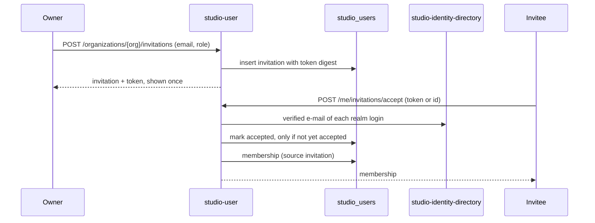

# Technical Design — studio-user

- [x] `p3` - **ID**: `cpt-studio-design-user`

The gear-level design of `cpt-studio-component-user`. The product-level view,
and how this gear sits among the others, is in
[Constructor Studio's design](constructor-studio.md). The code is
[`studio-backend/src/user_profile/`](../../studio-backend/src/user_profile/).

## Table of Contents

- [1. Architecture Overview](#1-architecture-overview)
- [2. Principles & Constraints](#2-principles--constraints)
- [3. Technical Architecture](#3-technical-architecture)
- [4. Additional context](#4-additional-context)
- [5. Traceability](#5-traceability)

## 1. Architecture Overview

### 1.1 Architectural Vision

Who a person *is*, independently of how they signed in. Keycloak authenticates.
It does not say that the person who signed in with GitHub today is the one who
signed in with e-mail last week, and neither does account-management, whose
users are scoped to one tenant. Without that answer one human becomes several
users, their work is split across the copies, and nothing can be merged later
because nothing recorded that they were the same.

So the gear owns a Studio-owned person record — the profile, deliberately
role-free — and the mapper that turns a token subject into a stable person id.
Four things bind to the person: a **login** (a sign-in method), a
**membership** (an organization and the role held there), an **alias** (an
external identifier attributed to them) and an **invitation** that becomes a
membership. Roles live on the membership because a role is a fact about a person
*in an organization*.

Other gears reach the person through narrow ClientHub interfaces rather than
through the token subject: resolve my caller, record an assignment, read whose
an external identity is, read where a subject may go. Each one does one thing,
so none of them becomes a general way to look up or write somebody else's
records.

### 1.2 Architecture Drivers

#### Functional Drivers

| Requirement | Design Response |
|-------------|------------------|
| `cpt-studio-fr-canonical-user` | `identity_user` with `identity_login` and `identity_alias` bound to it; `PersonResolver` for every gear; `POST /merge` folds one person into another. |
| `cpt-studio-fr-invitations-membership` | `identity_membership` written by every path into an organization, each with its `source`; invitations stored as a token digest and accepted only against an address the IdP has verified. |
| `cpt-studio-fr-org-administration` | Membership and invitation routes gated on authority over the organization, read from its access config; the last-owner rule held in one place. |

#### Key ADRs

| ADR ID | Decision Summary |
|--------|------------------|
| `cpt-studio-adr-canonical-user-and-identity-mapper` | A Studio-owned person, its sign-in methods and per-organization roles, kept relational. |
| `cpt-studio-adr-the-person-is-the-key-not-the-login` | Gears key records by the person behind the caller, through `PersonResolver`. |
| `cpt-studio-adr-self-service-identity-resolution` | A person attributes their own identities; only a proof of control binds. |
| `cpt-studio-adr-a-brokered-login-is-a-proof-of-control` | A login brokered from GitHub confirms that account, read from the IdP directory. |
| `cpt-studio-adr-authentication-does-not-grant-organization-membership` | Membership is an explicit row, not a consequence of signing in. |
| `cpt-studio-adr-membership-is-recorded-where-assignment-happens` | The directory's assignment and the backfill record memberships through `AssignmentRecorder`. |
| `cpt-studio-adr-an-identity-proves-it-is-you-and-decides-nothing-else` | A platform administrator is a member of the platform root; an installation may join every new person to one organization. |
| `cpt-studio-adr-a-role-narrows-what-a-member-may-do` | Administrative authority is answered in the gear from the access config, not by the PDP. |
| `cpt-studio-adr-a-shared-session-is-many-people-each-as-themselves` | Studio's service identity is seeded as a person with no membership. |

### 1.3 Architecture Layers

| Layer | Responsibility | Technology |
|-------|---------------|------------|
| REST | Self-service `/me*`, organization administration, platform-admin identity operations | `OperationBuilder` routes in `rest.rs` |
| Interfaces | What other gears may ask | Traits in `mod.rs`, published on the ClientHub |
| Service | Resolution, provisioning, memberships, aliases, invitations, merge | `service.rs` |
| Policy | The alias, invitation and last-owner rules, with no I/O | `alias_policy.rs`, `invitations.rs`, `leaving.rs` |
| Storage | The five `identity_*` tables | `store.rs` over `toolkit-db` (SeaORM), PostgreSQL database `studio_users` |

## 2. Principles & Constraints

### 2.1 Design Principles

#### Only a proof of control displaces somebody else

- [x] `p2` - **ID**: `cpt-studio-principle-user-proof-displaces`

`identity_alias` holds one row per external identity — its key is the v5 UUID
of `(kind, external_id)` — so a second person's write repoints the row rather
than adding one. That is an account-takeover primitive once attribution is
self-service. `alias_policy::decide` is the gate: an alias is `suggested` (a
machine's guess), `claimed` (the person says so) or `confirmed` (a provider
confirmed control), and only `confirmed` attributes anything. An unattributed
identity goes to the first writer; a `suggested` row yields to any human claim;
a row somebody else claimed or confirmed yields only to `confirmed`. A write
that takes an identity somebody had proven succeeds and says so
(`written_over_a_proof`). A person cannot downgrade their own proof. An
administrator writing through `POST /users/{id}/aliases` passes the same gate.

**ADRs**: `cpt-studio-adr-self-service-identity-resolution`, `cpt-studio-adr-a-brokered-login-is-a-proof-of-control`

#### An organization always has an active owner

- [x] `p2` - **ID**: `cpt-studio-principle-user-active-owner`

Leaving, being removed, being demoted and being suspended all ask one question
about the result (`leaving::may_change`): is somebody in the room afterwards
still an active owner? A suspended owner is not one. The only person in an
organization cannot leave it either; that would be deletion, which is a separate
act. Removal by an owner and leaving on one's own go through the same function
and take the same credentials with them: the leaver's personal connections in
that organization are deleted after the membership.

#### Authority is asked of the access config, not of the PDP

- [x] `p2` - **ID**: `cpt-studio-principle-user-authority-in-gear`

An administrative act on an organization needs its owner grant, a platform
administrator, or — on the `roles` model — the named privilege (`people.view`,
`people.manage`, `people.invite`). For a `tenant`-model organization the PDP
answers with the tenant clamp, which admits every member, so taking the PDP's
answer as authority would let any member change memberships. The grant is
matched against every sign-in subject the person has, so authority does not
depend on which login they used today.

**ADRs**: `cpt-studio-adr-a-role-narrows-what-a-member-may-do`

#### Resolve the caller, never an arbitrary subject

- [x] `p2` - **ID**: `cpt-studio-principle-user-resolve-own-caller`

`PersonResolver::resolve_caller` takes a `SecurityContext`, so a gear can
resolve its own caller and nobody else. It provisions a person the first time a
sign-in method is seen, because the subject came off a bearer the platform
already authenticated. `resolve_recorded_subject` and `organizations_of` never
provision: a subject read out of storage, or one knocking at the PDP, has proven
nothing, and minting people from it would create them out of stale data or
traffic.

**ADRs**: `cpt-studio-adr-the-person-is-the-key-not-the-login`

### 2.2 Constraints

#### No database, no gear

- [x] `p2` - **ID**: `cpt-studio-constraint-user-stands-down`

Without a `database:` section the gear stands down: it publishes none of its
interfaces and its routes answer 503, rather than failing the boot. Consumers
handle the absence — `studio-organizations` refuses to create an organization
nobody would own, and the PDP keeps the clamp on the token's tenant.

#### One partition, the platform root

- [x] `p2` - **ID**: `cpt-studio-constraint-user-root-partition`

A person spans organizations, so the data is global. `toolkit-db`'s secure
runner requires a tenant scope, and every row carries and is scoped to the
platform root (`00000000-0000-0000-0000-000000000001`).

## 3. Technical Architecture

### 3.1 Domain Model

- [x] `p2` - **ID**: `cpt-studio-entity-user-person`

A **person** (`identity_user`) is the profile — name, e-mail, avatar, locale,
UI preferences, when they were last seen — and a `merged_into` pointer once
merged away. A person who signed in with several logins has several addresses:
the profile's, the one the identity provider holds for each login, and any
attributed `email` alias; the API lists all of them as `emails`. A blank
profile is named from the realm when the person, or a members listing, reads
it, and the realm is asked again at most once a day. A **photo** is stored with the person and served at a URL
carrying its digest. A **login** is
a `(provider, subject)` that resolves to a person; Studio's own realm is
provider `keycloak`. A **membership** is `(person, organization)` with a role
(`owner`, `admin`, `member`), a status (`active`, `suspended`) and a source
(`creation`, `assignment`, `invitation`, `bootstrap`, `first_login`, `manual`).
It also carries how the organization describes the person — company,
department, title, manager — so each organization describes its own people
and sees no other's description (ADR-0023). A merge gives the target the source's
description and photo where it has none of its own, and points whoever
reported to the source at the target.
An **alias** is `(kind, external_id)` with a confidence. An **invitation** is
an address, a role (`member` or `admin`, never `owner`) and a token digest,
valid for 14 days.

A **platform administrator** is a person with an active membership of the
platform root. **Studio's service identity** (subject
`00000000-0000-4000-8000-00000000057d` by default) is seeded at every start as a
person with no membership, so the directory can name what a shared session does
and it can do nothing.

### 3.2 Component Model

#### Identity service

- [x] `p2` - **ID**: `cpt-studio-component-user-service`

##### Why this component exists

Every way into an organization and every reading of a person goes through one
place, so no two paths key the same human differently.

##### Responsibility scope

`service.rs`: resolve or provision a person; profile and UI preferences (at most
64 keys of 64 characters, values of 128); memberships and the owner grant that
follows an active `owner` row; aliases and the confirmation pass; invitations;
merge; the seeds. Every membership write bumps a process-wide generation counter
that `OrganizationReader::membership_generation` exposes, so a cache of a
person's organizations is dropped the moment one changes.

##### Responsibility boundaries

Holds no role on the person. Does not authenticate; does not decide row access.

##### Related components (by ID)

- `cpt-studio-component-account-management` — reads tenants and writes the owner grant in
- `cpt-studio-component-access-config` — reads and writes the grant through
- `cpt-studio-component-connector` — reads personal connections from, and deletes a leaver's

#### Confirmation ceremony

- [x] `p2` - **ID**: `cpt-studio-component-user-confirmation`

##### Why this component exists

A claim attributes nothing until a provider confirms it.

##### Responsibility scope

`POST /me/aliases/confirm` runs two proof channels and reports what each did.
Credentials: every personal connection in the caller's tenant whose creator is
the caller's person, and whose account the connector reports, becomes a
`confirmed` alias; team and bot connections, and connections of someone else or
of an unknown creator, are skipped and counted. The IdP: every account brokered
onto one of the caller's realm logins becomes a `confirmed` alias, read from
`cpt-studio-component-identity-directory`.

##### Responsibility boundaries

Writes through the same policy as a claim. Answers 400 only when neither channel
is configured.

##### Related components (by ID)

- `cpt-studio-component-connector` — the credential channel
- `cpt-studio-component-identity-directory` — the IdP channel

### 3.3 API Contracts

- [x] `p2` - **ID**: `cpt-studio-interface-user-rest`

- **Contracts**: `cpt-studio-interface-rest-api`
- **Technology**: REST/OpenAPI through `api_gateway`
- **Location**: [`studio-backend/docs/api-contract.json`](../../studio-backend/docs/api-contract.json)

**Endpoints Overview** (prefix `/studio-user/v1`):

| Method | Path | Description | Stability |
|--------|------|-------------|-----------|
| `GET` `POST` | `/me` | The caller's person, provisioned on first sight and named from the realm when blank; update the profile. Carries `emails` and `last_seen_at_epoch_ms` | stable |
| `PUT` `DELETE` | `/me/avatar` | Store the caller's photo (PNG, JPEG, WebP or GIF, at most 1 MiB, base64), or remove it | experimental |
| `GET` | `/avatars/{user_id}/{digest}` | One version of a stored photo. Anonymous: an `` sends no token, and the digest is learned only from a profile the caller may read | experimental |
| `GET` `PUT` | `/me/ui-preferences` | Remembered UI choices, replaced whole | stable |
| `GET` | `/me/logins`, `/me/memberships` | What binds to the caller | stable |
| `DELETE` | `/me/memberships/{org_id}` | Leave an organization | stable |
| `GET` `POST` | `/me/aliases` | List, or claim an identity (attributes nothing yet) | stable |
| `POST` | `/me/aliases/confirm`, `/me/aliases/revoke` | Confirm from the proof channels; withdraw one | stable |
| `GET` | `/me/invitations` | Invitations waiting for an address the IdP verified for the caller | stable |
| `POST` | `/me/invitations/accept` | Accept by `token` or by `invitation_id` from that list | stable |
| `GET` | `/me/colleagues` | Every active member of each organization the caller is active in: name, photo, role, description, last seen — no addresses or sign-ins (ADR-0036) | experimental |
| `GET` | `/organizations/{org_id}/members` | Members with profiles, every address, photo, last seen and the organization's description of them, paged (`people.view`) | stable |
| `GET` | `/organizations/{org_id}/members/{user_id}/identities` | One member's logins and aliases; 404 for a non-member (`people.view`) | experimental |
| `GET` `POST` | `/organizations/{org_id}/invitations` | List (`people.view`); invite, token returned once (`people.invite`) | stable |
| `DELETE` | `/organizations/{org_id}/invitations/{invitation_id}` | Withdraw (`people.invite`) | stable |
| `PUT` `DELETE` | `/users/{user_id}/memberships/{org_id}` | Set role, status and, optionally, the organization's description of the person; remove (`people.manage`) | stable |
| `GET` | `/users/{user_id}`, `/users/{user_id}/memberships` | Any person (platform admin) | stable |
| `POST` | `/users/{user_id}/aliases` | Attribute an identity to a person (platform admin) | stable |
| `POST` | `/resolve` | `(provider, subject)` to a person, provisioning (platform admin) | stable |
| `POST` | `/merge` | Fold one person into another (platform admin) | stable |

An organization route refuses with `ORG_OWNER_REQUIRED`, a platform route with
`PLATFORM_ADMIN_REQUIRED`. A last-owner refusal is a 400 whose message says what
to do first.

- [x] `p2` - **ID**: `cpt-studio-interface-user-clienthub`

In process, under the scope `cf.studio._.user_identity.v1~`, published in
`init` so a consumer resolving them in its REST phase cannot lose a race:

| Interface | Does | Used by |
|-----------|------|---------|
| `PersonResolver` | The caller's person; the person behind a recorded subject | `cpt-studio-component-connector` |
| `AliasResolver` | Confirmed owners of external identifiers; claims are never returned | `cpt-studio-component-connector` (graph sync) |
| `AssignmentRecorder` | Record an assignment (naming the person from the IdP's name and e-mail, filling only a profile's blanks), or a creation as owner | `cpt-studio-component-identity-directory`, `cpt-studio-component-organizations` |
| `MembershipEvictor` | End every membership of an organization being deleted | `cpt-studio-component-organizations` |
| `OrganizationReader` | A subject's active organizations, all its person's subjects, platform-admin test, membership generation | `cpt-studio-component-authz-plugin`, `cpt-studio-component-identity-directory`, `cpt-studio-component-organizations` |
| `OrganizationRoster` | An organization's active members and their subjects | `cpt-studio-component-organizations` (rollups) |
| `MemberAliases` | Which provider accounts belong to an active member of one organization, with the member's id and name; confirmed attributions only, no address or role | `cpt-studio-component-artifact-ingest` (open pull requests) |

### 3.4 Internal Dependencies

| Dependency Gear | Interface Used | Purpose |
|-------------------|----------------|----------|
| `cpt-studio-component-account-management` | SDK client | Read an organization; write its owner grant |
| `cpt-studio-component-connector` | Connector drivers, credstore and account-management from the ClientHub, attached in the REST phase | The credential proof channel; delete a leaver's personal connections |
| `cpt-studio-component-identity-directory` | `IdpDirectoryReader`, attached in the REST phase | The IdP proof channel; verified addresses for invitations |

### 3.5 External Dependencies

#### PostgreSQL

| Dependency Gear | Interface Used | Purpose |
|-------------------|---------------|---------|
| `cpt-studio-component-user` | `toolkit-db` (SeaORM) | The five `identity_*` tables in `studio_users` |

### 3.6 Interactions & Sequences

#### Accept an invitation

**ID**: `cpt-studio-seq-user-accept-invitation`

**Actors**: `cpt-studio-actor-org-owner`, `cpt-studio-actor-member`

**Description**: Existence and state are checked before identity, so a caller
learns "used" or "expired" only about an invitation they hold the token for.
The profile e-mail is self-service and never decides; without the IdP directory
there is no verified address and acceptance is refused. The membership is
written only after the database confirmed this call took the invitation, so a
race yields one member and one refusal.

### 3.7 Database schemas & tables

- [x] `p3` - **ID**: `cpt-studio-db-users`

Database `studio_users`. Every row's `tenant_id` is the platform root. The keys
of login, membership and alias are deterministic v5 UUIDs of their natural key,
so the key itself is the uniqueness constraint and an upsert targets it; a
person's id is a fresh v4.

#### Table: identity_user

**ID**: `cpt-studio-dbtable-identity-user`

**Schema**:

| Column | Type | Description |
|--------|------|-------------|
| `id` | UUID | the person |
| `tenant_id` | UUID | |
| `display_name`, `email`, `avatar_url`, `locale` | TEXT | profile |
| `merged_into` | UUID | set when merged into another user |
| `last_seen_at` | TIMESTAMPTZ | the person's last request, written at most every five minutes; added by `m0005` |
| `ui_preferences` | TEXT | JSON map of remembered UI choices; `NULL` until the person makes one |
| `created_at`, `updated_at` | TIMESTAMPTZ | |

**PK**: `id`

**Constraints**: none beyond the key.

**Additional info**: `identity_login` (provider, subject, `user_id`, verified), `identity_membership` (`user_id`, `org_id`, role, source), `identity_alias` (kind, `external_id`, `user_id`, confidence) and `identity_invitation` (`org_id`, email, role, `token_digest` with a unique index) bind to it. Reads follow `merged_into`, at most eight hops.

**Example**:

| display_name | merged_into |
|--------|--------|
| demo | `NULL` |

#### Table: identity_login

**ID**: `cpt-studio-dbtable-identity-login`

**Schema**:

| Column | Type | Description |
|--------|------|-------------|
| `id` | UUID | v5 of `(provider, subject)` |
| `tenant_id` | UUID | |
| `provider`, `subject` | TEXT | `keycloak` and the token subject |
| `user_id` | UUID | the person |
| `verified` | BOOLEAN | default `FALSE` |
| `linked_at` | TIMESTAMPTZ | |
| `email`, `email_verified` | TEXT, BOOLEAN | the address the identity provider holds for this login, as last read, and whether it vouches for it; added by `m0005` |

**PK**: `id`

**Constraints**: `NOT NULL` on every column.

**Additional info**: index `idx_identity_login_user` on `user_id`.

#### Table: identity_membership

**ID**: `cpt-studio-dbtable-identity-membership`

**Schema**:

| Column | Type | Description |
|--------|------|-------------|
| `id` | UUID | v5 of `(user_id, org_id)` |
| `tenant_id` | UUID | |
| `user_id`, `org_id` | UUID | |
| `role` | TEXT | `owner`, `admin` or `member` |
| `source` | TEXT | how it arose |
| `status` | TEXT | `active` (default) or `suspended` |
| `affiliation`, `department`, `title` | TEXT | how the organization describes the person; at most 120 characters each; added by `m0005` |
| `reports_to` | UUID | a member of the same organization |
| `created_at`, `updated_at` | TIMESTAMPTZ | |

**PK**: `id`

**Constraints**: `NOT NULL` on every column; role and status are checked by the service, not by the database.

**Additional info**: indexes on `user_id` and on `org_id`. `status` was added by
`m0003` with `DEFAULT 'active'`, because every earlier row was written when
active was the only state.

#### Table: identity_alias

**ID**: `cpt-studio-dbtable-identity-alias`

**Schema**:

| Column | Type | Description |
|--------|------|-------------|
| `id` | UUID | v5 of `(kind, external_id)` |
| `tenant_id` | UUID | |
| `kind`, `external_id` | TEXT | lowercased and trimmed; 1–40 and 1–320 characters, checked by the service |
| `user_id` | UUID | |
| `confidence` | TEXT | `suggested`, `claimed` or `confirmed` |
| `added_at` | TIMESTAMPTZ | |

**PK**: `id`

**Constraints**: `NOT NULL` on every column.

**Additional info**: index on `user_id`. One row per external identity, whoever holds it.

#### Table: identity_avatar

**ID**: `cpt-studio-dbtable-identity-avatar`

**Schema**:

| Column | Type | Description |
|--------|------|-------------|
| `user_id` | UUID | the person |
| `tenant_id` | UUID | |
| `content_type` | TEXT | what the bytes are, sniffed rather than declared |
| `bytes` | BYTEA | at most 1 MiB |
| `digest` | TEXT | SHA-256 of `bytes`, hex; the version a URL names |
| `updated_at` | TIMESTAMPTZ | |

**PK**: `user_id`

**Constraints**: `NOT NULL` on every column.

**Additional info**: added by `m0005`. `avatar_url` on the person points at
`/cf/studio-user/v1/avatars/{user_id}/{digest}`; a new photo changes the
digest, so the old URL stops answering and a cached copy is never stale.

#### Table: identity_invitation

**ID**: `cpt-studio-dbtable-identity-invitation`

**Schema**:

| Column | Type | Description |
|--------|------|-------------|
| `id` | UUID | |
| `tenant_id` | UUID | |
| `org_id` | UUID | |
| `email` | TEXT | lowercased |
| `role` | TEXT | `member` or `admin` |
| `token_digest` | TEXT | SHA-256 of the token; the token itself is never stored |
| `invited_by` | UUID | the inviting person |
| `created_at`, `expires_at` | TIMESTAMPTZ | 14 days apart |
| `accepted_at` | TIMESTAMPTZ | |
| `accepted_by` | UUID | |

**PK**: `id`

**Constraints**: unique index `idx_identity_invitation_token` on `token_digest`.

**Additional info**: indexes on `org_id` and `email`. A withdrawn invitation is deleted, not marked.

### 3.8 Deployment Topology

In-process in the one `studio-backend` binary: gear `studio-user`, capabilities
`[rest, db]`, deps `account_management`, config section `gears.studio-user`.

## 4. Additional context

The relational store is deliberate: these records are looked up and
constrained — unique logins, one membership per `(user, org)` — not traversed.
A graph projection for visualization is a later, derived concern.
`cpt-studio-component-identity-directory` is the view of identities that belong
to no organization yet.

## 5. Traceability

- **PRD**: [Constructor Studio](../prd/constructor-studio.md)
- **Design**: [Constructor Studio](constructor-studio.md)
- **ADRs**: [ADR index](../adr/README.md)
- **Code**: [`studio-backend/src/user_profile/`](../../studio-backend/src/user_profile/)
