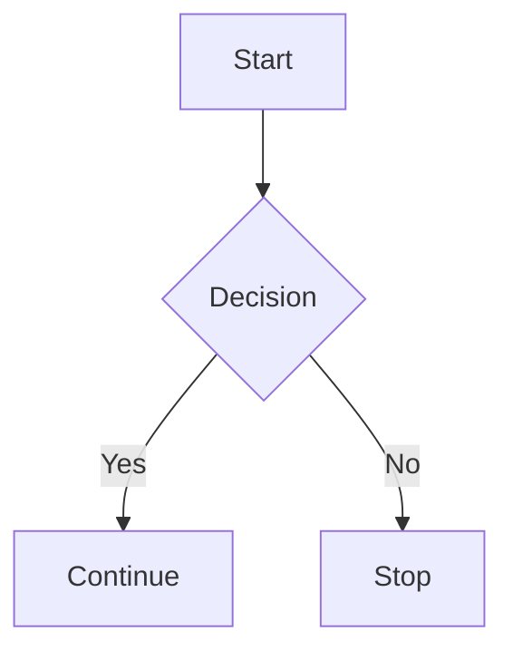

# Rendered content


```mermaid
graph TD;
    A[Start] --> B{Decision};
    B -->|Yes| C[Continue];
    B -->|No| D[Stop];
```

```figure
const { state } = Studio.createApp({ title: "Example" });
```
